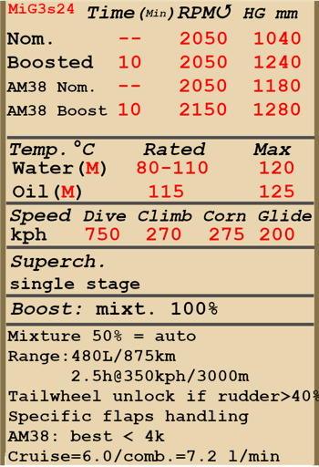
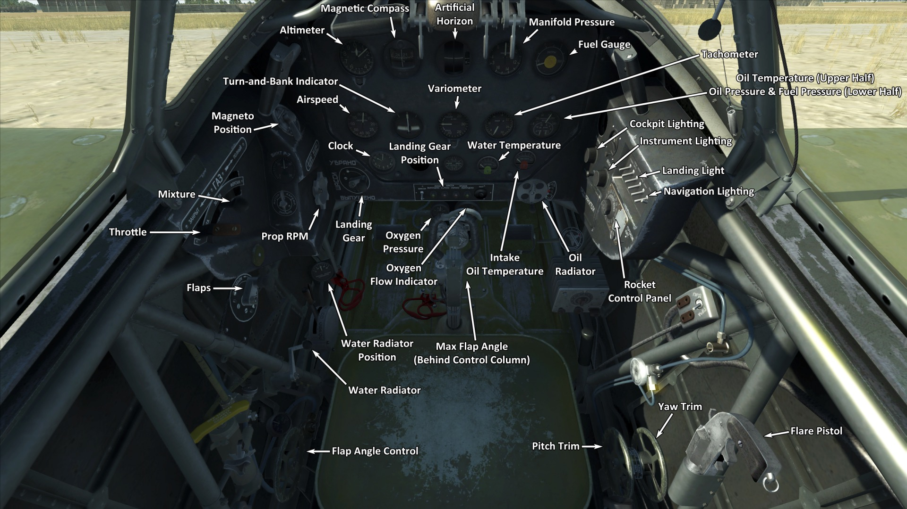

# MiG-3 type 24  

<table><tbody><tr><td style="text-align: center"></td><td style="text-align: center"></td></tr><tr><td style="text-align: center" colspan="2"></td></tr></tbody></table>  

Vitesse de décrochage indiquée en configuration de vol : 159..175 km/h  
Vitesse de décrochage indiquée en configuration de décollage/atterrissage : 134..147 km/h  
Vitesse limite de piqué : 750 km/h  
Facteur de charge maximum : 12,8 g  
Angle d\attaque de décrochage en configuration de vol : 17,3 °  
Angle d\attaque de décrochage indiquée en configuration d\atterrissage : 15,1 °  
  
Vitesse sol au niveau de la mer, régime moteur - Surpuissance : 525 km/h  
Vitesse sol au niveau de la mer, régime moteur - Nominal : 493 km/h  
Vitesse sol maximale à 7600 m, régime moteur - Nominal : 626 km/h  
  
Plafond opérationnel : 11800 m  
Taux de montée au niveau de la mer : 15,9 m/s  
Taux de montée à 3000 m : 14,0 m/s  
Taux de montée à 6000 m : 10,2 m/s  
  
Virage à 360° au niveau de la mer en : 22,4 s, à 270 km/h vitesse indiquée (IAS).  
Virage à 360° à 3000 m : 28,7 s, à 270 km/h vitesse indiquée (IAS).  
  
Endurance à 3000 m : 2,5 h, à 350 km/h vitesse indiquée (IAS).  
  
Vitesse de décollage : 180..200 km/h  
Vitesse d\approche : 195..205 km/h  
Vitesse d\atterrissage : 135..145 km/h  
Angle d\atterrissage : 15 °  
  
Note 1 : les données sont indiquées à l\atmosphère standard international (ISA).  
Note 2 : les performances d\endurance sont données pour plusieurs masses possibles.  
Note 3 : la vitesse maximale, le taux de montée et le temps de virage sont donnés pour une masse standard.  
Note 4 : le taux de montée et le temps de virage vaut en surpuissance.  
  
Moteur :  
Modèle : AM-35a  
Puissance maximale en surpuissance au niveau de la mer : 1350 cv  
Puissance maximale au régime continu au niveau de la mer : 1120 cv  
Puissance maximale au régime continu à 6000 m : 1200 cv  
  
Performance du moteur :  
Continu (durée illimitée) : 2050 tr/min, 1040 mmHg  
Surpuissance (jusqu\à 10 minutes) : 2050 tr/min, 1240 mmHg  
  
Modèle : AM-38  
Puissance maximale en surpuissance au niveau de la mer : 1600 cv  
Puissance maximale au régime continu au niveau de la mer : 1500 cv  
Puissance maximale au régime continu à 1650 m : 1500 cv  
  
Performance du moteur :  
Continu (durée illimitée) : 2050 tr/min, 1180 mmHg  
Surpuissance (jusqu\à 10 minutes) : 2150 tr/min, 1280 mmHg  
  
Température de fonctionnement d\eau en sortie du moteur : 80..110 °C  
Température maximale d\eau en sortie du moteur : 120 °C  
Température de fonctionnement d\huile à l\admission du moteur : 40..80 °C  
Température maximale d\huile à l\admission du moteur : 85 °C  
Température de fonctionnement d\huile en sortie du moteur : 115 °C  
Température maximale d\huile en sortie du moteur : 120 °C  
  
Altitude de changement d\étage du compresseur : étage simple  
  
Masse à vide : 2650 kg  
Masse minimale (sans munitions, 10% de carburant) : 2831 kg  
Masse standard : 3244 kg  
Masse maximale au décollage : 3476 kg  
Masse de carburant : 352 kg / 480 l  
Charge utile : 826 kg  
  
Armement offensif :  
2 mitrailleuses ShKAS de 7,62 mm, 750 coups, 1800 coups par minute, synchronisées  
1 mitrailleuse UB de 12,7 mm, 300 coups, 1000 coups par minute, synchronisée  
2 mitrailleuses UB de 12,7 mm, 145 coups, 1000 coups par minute, dans l\aile (modification)  
2 mitrailleuses UB de 12,7 mm, 350 coups, 1000 coups par minute, synchronisées (modification)  
2 canons ShVAK de 20 mm, 150 coups, 800 coups par minute, synchronisées (modification)  
  
Bombes :  
2 bombes d\emploi général FAB-50sv de 50 kg  
2 bombes d\emploi général FAB-100M de 104 kg  
  
Roquettes:  
6 roquettes ROS-82 de 7 kg, charge militaire HE (explosif) de 2,5 kg  
  
Longueur : 8,255 m  
Envergure : 10,2 m  
Surface alaire : 17,44 m²  
  
Premier engagement : juillet 1941  
  
Caractéristiques  
- Le moteur possède un mode de surpuissance (boost) qui est activé lorsque le levier de commande du mélange est placé en position maximale.  
- Le moteur est pourvu d\un compresseur mécanique à un étage qui ne nécessite pas de commande manuelle.  
- Le mélange en carburant est automatique lorsque la manette est placée dans une position intermédiaire (50%) Il est possible d\agir manuellement lorsque la manette est positionnée sur une graduation inférieure à 50%. Il permet aussi de réduire la consommation durant le vol.  
- Il y a un régulateur de tours moteur, les RPM sont ainsi maintenus à la bonne valeur en fonction de la position du levier du régulateur. Le régulateur contrôle automatiquement le pas d\hélice afin de maintenir les RPM demandés.  
- Les volets de radiateurs d\eau et d\huile sont commandés manuellement.  
- L\avion n\a q\un trim de tangage et de lacet.  
- L\appareil possède des becs d\aile automatiques. Ils se déploient lorsque le fort angle d\attaque augmente risquant de déclencher une perte de vitesse   
- Les volets d\atterrissage ont un limiteur pour l\angle maximal. Les volets ont une plage de sortie de 0 ° à 50 °. Les volets d\atterrissage ont un actionneur pneumatique. Les volets ne peuvent sortir qu\à l\angle fixé par le limiteur et instantanément, la sortie progressive est impossible. En raison de la faible force de l\actionneur, les volets d\atterrissage sortis peuvent se rétracter vers le haut à cause du flux d\air lorsque la vitesse est supérieure à 220 km/h. Pour cette raison, il est nécessaire de se rappeler que les volets ne sortent pas complètement en cas de vitesse élevée. Dans le cas d\un atterrissage à grande vitesse, les volets peuvent sortir juste un peu avant d\atterrir.  
- L\avion a un système de contrôle de la roulette de queue qui est déverrouillé et rendu utilisable par le gouvernail de direction si la pédale de gouvernail est pressée au dela de 40% de sa course. La roulette de queue est verrouillée tant que le palonnier est utilisé à moins de 40% de sa course. De ce fait, il est nécessaire d\éviter de donner des grands coups de palonnier lorsque vous vous déplacez à grande vitesse, ou être prêt à commander l\avion avec une roue arrière déverrouillée.  
- L\avion a des freins pneumatiques différentiels de roue avec un levier de commande partagé. Cela signifie que si le levier de frein est maintenu, et que la pédale de gouvernail qui freine la roue opposé est progressivement libérée, cela fera tourner d\un côté ou de l\autre.  
- L\avion a une jauge de carburant qui indique le carburant restant.  
- Il est impossible d\ouvrir ou de fermer la verrière à grande vitesse en raison d\un fort flux d\air La verrière n\a pas de systême d\éjection d\urgence, il faut donc réduire la vitesse pour évacuer l\avion.  
- Quand des bombes sont installées, il y a un sélecteur de mode largage, qui permet de choisir un largage unitaire ou par deux.  
- Quand des roquettes sont installées, il y a un sélecteur de mode tir, qui permet de choisir un tir unitaire, par deux ou par quatre.  
- The AM-38 engine modification has the supercharger tuned for lower altitudes and provides more power than the AM-35A model below 4 km altitude. However, these settings exceed the capability of the existing cooling system and may result in water and oil overheating, especially when the air temperature exceeds 15 degrees Celsius.  
  
Basic data and recommended positions of the aircraft controls:  
1. Starting the engine:  
	- recommended position of the mixture control lever: auto mixture control  
	- recommended position of the radiator/cowl flap control handle: close  
	- recommended position of the prop pitch control handle:auto prop pitch control  
	- recommended position of the throttle lever: 10%  
  
2. Recommended mixture control lever positions for various flight modes: auto mixture control  
  
3.1 Recommended positions of the oil radiator control handle for various flight modes:  
	- takeoff: open 100%  
	- climb: open 100% (winter: 50%)  
	- cruise flight: open 50% (winter: 20%)  
	- combat: close  
  
3.2 Recommended positions of the water radiator control handle for various flight modes:  
	- takeoff: open 100% (winter: 25%)  
	- climb: open 100% (winter: 25%)  
	- cruise flight: open 40% (winter: 20%)  
	- combat: open 100%  
  
4. Approximate fuel consumption at 2000 m altitude:  
	- Cruise engine mode: 6.0 l/min  
	- Combat engine mode: 7.2 l/min  

## Modifications  
### AM-38 Engine  

The AM-38 engine modification provides more power than the AM-35A model below 4 km altitude, but exceeds the capability of the existing cooling system and may result in water and oil overheating, especially when the air temperature exceeds 15 degrees Celsius.  
Estimated speed gain: 60 km/h.  
Estimated climb rate gain: 3 m/s.  
  

### 2 BK de 12,7 mm en nacelles  

2 mitrailleuses BK de 12,7 mm montées dans des nacelles sous les ailes avec 145 cartouches chaque  
Masse supplémentaire : 155 kg  
Masse des munitions : 54 kg  
Masse des mitrailleuses : 101 kg  
Perte estimée de vitesse : 13 km/h  
  

### 2 BS 12,7 mm (700 cartouches)  

2 mitrailleuses BS de 12,7 mm montées dans le nez avec 350 cartouches chaque à la place des mitrailleuses ShKAS d’origine  
Masse supplémentaire : 34 kg  
Masse des munitions : 131 kg  
Masse des mitrailleuses : 62 kg  
Perte estimée de vitesse : 0 km/h  
  

### 2 bombes FAB-50sv / FAB-100M   

2 bombes d’emploi général FAB-50sv de 50 kg ou FAB-100M de 104 kg  
  
FAB-50sv:  
Masse supplémentaire : 120 kg  
Masse des munitions : 104 kg  
Masse des pylones : 20 kg  
Perte estimée de vitesse avant le largage : 20 km/h  
Perte estimée de vitesse après le largage : 12 km/h  
  
FAB-100M:  
Masse supplémentaire : 228 kg  
Masse des munitions : 208 kg  
Masse des pylones : 20 kg  
Perte estimée de vitesse avant le largage : 27 km/h  
Perte estimée de vitesse après le largage : 12 km/h  
  

### 6 roquettes ROS-82   

6 roquettes Explosives Brisantes non guidées ROS-82 de 82 mm  
Masse supplémentaire : 60 kg  
Masse des munitions : 42 kg  
Masse des rails : 18 kg  
Perte estimée de vitesse avant le lancement : 23 km/h  
Perte estimée de vitesse après le lancement : 17 km/h  
  

### 2 ShVAK de 20 mm (300 obus)  

2 canons ShVAK de 20 mm montés dans le nez avec 150 obus chaque à la place des mitrailleuses ShKAS ou BS  
Masse supplémentaire : 4 kg  
Masse des munitions : 69 kg  
Masse des armes : 94 kg  
Perte estimée de vitesse : 0 km/h  
