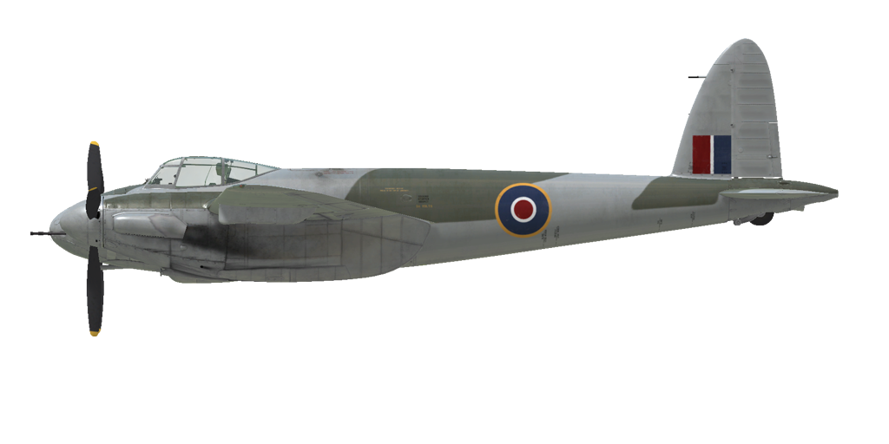

# Mosquito F.B. Mk.VI ser.2

## 描述

飞行构型时的失速表速：179...208 km/h
着陆构型时的失速表速：157...183 km/h

俯冲极速限制：690 km/h
最大过载系数：8.0 G
飞行构型时的失速攻角：18.3 °
降落构型时的失速攻角：15.3 °

3000 RPM，boost +25时于海平面最大速度：598 km/h（改装）
3000 RPM，boost +18时于海平面最大速度：548 km/h
3000 RPM，boost +18时于2000 m最大速度：577 km/h
3000 RPM，boost +18时于3900 m最大速度：603 km/h

升限：8700 m
海平面爬升率：9.4 m/s
3000 m时爬升率：9.8 m/s
6000 m时爬升率：6.7 m/s

海平面时最佳盘旋时间：于270 km/h表速时26.4 s。
3000 m时最佳盘旋时间：于270 km/h表速时35.5 s。

3000 m时续航：于300 km/h表速时5.3 h。

起飞速度：200...230 km/h
进近速度：200...240 km/h
着陆速度：150...175 km/h
着陆迎角：13.0 °

注1：所提供的数据适用于国际标准大气（ISA）。
注2：飞行性能范围基于可能的飞机重量范围。
注3：极速、爬升率和盘旋时间基于标准飞机重量。
注4：爬升率基于2850 RPM和boost +9动力，盘旋时间基于3000 RPM和boost +18动力。

发动机：
型号：Merlin 25
起飞模式（3000 RPM，boost +18，低挡）时于海平面最大输出：1620 HP
爬升模式（2850 RPM，boost +9，低挡）时于9250 feet最大输出：1210 HP
爬升模式（2850 RPM，boost +9，高档）时于16000 feet最大输出：1135 HP
战斗模式（3000 RPM，boost +18，低档）时于2000 feet最大输出：1640 HP
战斗模式（3000 RPM，boost +18，高档）时于9500 feet最大输出：1500 HP
战斗模式（3000 RPM，boost +25，低档） 时于海平面最大输出：1950 HP（改装）
战斗模式（3000 RPM，boost +25，高档） 时于4000 feet最大输出：1800 HP（改装）

发动机模式：
最大巡航动力（无时间限制）：2650 RPM，boost +7
爬升动力（最大1小时）：2850 RPM，boost +9
战斗动力（最大5分钟）：3000 RPM，boost +18
战斗动力（最大5分钟）：3000 RPM，boost +25（改装）

发动机额定出口水温：60..125 °C
发动机最大出口水温：135 °C
发动机额定进口油温：15..90 °C
发动机最大进口油温：105 °C

增压器换挡高度：自动，可手动切换至低挡

空重：6676 kg
最低重量（无弹药，10%25 燃油）：7463 kg
标准重量：9026 kg
最大起飞重量：10194 kg
燃油载荷：1479.1 kg / 2060 L / 453 gallons
最大有效载荷：3518 kg

前射武器：
4 x 7.7mm "Browning .303"机枪，每门备弹500发，射速1150发/分，安装于机鼻
4 x 7.7mm "Browning .303"机枪，每门备弹780发，射速1150发/分，安装于机鼻（改装）
4 x 20mm "Hispano Mk.II"机炮，每门备弹150发，射速650发/分，安装于机鼻
4 x 20mm "Hispano Mk.II"机炮，每门备弹175发，射速650发/分，安装于机鼻（改装）
2 x 7.7mm "Browning .303"机枪，每门可选备弹500发或780发，射速1150发/分，安装于机鼻（改装）
57mm "Molins Class M"炮，备弹25发，射速55发/分，安装于机鼻（改装）

炸弹：
2 x 250 lb 通用炸弹 "250 lb. M.C."
2 x 500 lb 通用炸弹 "500 lb. M.C."

火箭弹：
8 x 25 lb 穿甲火箭弹 "RP-3 A.P. 25 lb. mk.II"（改装）
8 x 60 lb 半穿甲火箭弹 "RP-3 S.A.P. 60 lb. mk.II"（改装）

长：12.55 m
翼展：16.51 m
翼面积：41.81 m²

投入战斗：1943春

操作特性：
- 发动机配备有无需手动操控的一级两速机械增压器。可以手动切换至抵挡。
- 发动机配备有自动混合比控制器，可自动保持最佳混合比。
- 发动机配备自动RPM控制器，可自动调整桨距以保持设定的RPM。
- 螺旋桨配备有顺桨系统，在发动机损坏的情况下应启动该系统以降低螺旋桨阻力。
- 水温和油温通过手动条件散热器出风口叶片控制。
- 该机配备有所有控制舵面的配平：俯仰、横滚和偏航
- 着陆襟翼由液压致动器驱动，可放下至最大45°内的任何角度。襟翼放下时的最大速度限制为150 mph。
- 该机的尾轮可自由旋转，无锁定功能。
- 该机配备有由操纵杆上的制动杆控制的气动差速刹车，这意味着如果你握住制动杆并向一侧蹬方向舵踏板，反方向的刹车将会被逐渐松开，使得飞机可以向一侧转向。
- 该机配备有报警器，如果油门设置为低（小于1/4）并且起落架处于收起状态时该报警器会警告飞行员。
- 由于冲压空气的缘故无法在高速时打开舱门，但是可使用紧急抛离手柄将其弹出。
- 该机在机鼻和机身配备有编队灯和识别灯。
- 瞄准具可调：目标距离和目标基线均可手动设置。
- 在安装火箭弹时会改装Mk.IIL瞄准具。该瞄具为便于火箭弹瞄准，可将目标基线向下移动5度（默认按键为右Shift + 分号 / 右Shift + 句号）。
- 该机配备有炸弹投放控制器，可选择三种投弹模式：单发、两枚和全部。
- 该机配备有火箭弹投放控制器，可选两种发射模式：两发或全部。但是在安装Mk.III多层挂架并选择"两发"时将同时发射四枚火箭弹（首先发射下层火箭）。

## 修改

### 150号燃油

允许使用+25 lb boost增压
自动增压被禁用，应在3500 feet高度手动切换增压。
预计海平面速度增加：27 km/h

### 2 x 勃朗宁.303机枪和57mm莫林斯炮 

于机鼻安装两挺"勃朗宁.303"7.7mm机枪，每门500发或780发备弹，以及一门备弹25发的57mm莫林斯炮
增加重量：589 kg
弹药重量：159 kg
装甲重量：386 kg
预计速度降低：5 km/h

### 4 x 勃朗宁.303机枪和57mm莫林斯炮

于机鼻安装四挺"勃朗宁.303"7.7mm机枪，可选择500发或780发备弹，以及一门备弹25发的57mm莫林斯炮
增加重量：644 kg
弹药重量：159 kg
装甲重量：386 kg
预计速度降低：7 km/h

### 8 х RP-3 HE/AP火箭于Mk.I挂架

安装于Mk.I挂架上的8发RP3 3英寸半穿甲高爆(SAP/HE)或穿甲(AP)无制导火箭弹。

RP-3 SAP/HE:
重量增加：411 kg
弹药重量：304 kg
挂架重量：107 kg
投弹前预计速度降低：39 km/h
投弹后预计速度降低：21 km/h

RP-3 AP:
重量增加：277 kg
弹药重量：170 kg
挂架重量：107 kg
投弹前预计速度降低：39 km/h
投弹后预计速度降低：21 km/h

### 8 х RP-3 HE/AP火箭于Mk.III挂架

安装于Mk.III挂架上的8发RP3 3英寸半穿甲高爆(SAP/HE)或穿甲(AP)无制导火箭弹。

RP-3 SAP/HE:
重量增加：376 kg
弹药重量：304 kg
挂架重量：72 kg
投弹前预计速度降低：34 km/h
投弹后预计速度降低：14 km/h

RP-3 AP:
重量增加：242 kg
弹药重量：170 kg
挂架重量：72 kg
投弹前预计速度降低：33 km/h
投弹后预计速度降低：14 km/h

### 8 х RP-3 HE/AP火箭于Mk.III多层挂架

安装于Mk.III多层挂架上的8发RP3 3英寸半穿甲高爆(SAP/HE)或穿甲(AP)无制导火箭弹。

RP-3 SAP/HE:
重量增加：364 kg
弹药重量：304 kg
挂架重量：60 kg
投弹前预计速度降低：33 km/h
投弹后预计速度降低：14 km/h

RP-3 AP:
重量增加：230 kg
弹药重量：170 kg
挂架重量：60 kg
投弹前预计速度降低：33 km/h
投弹后预计速度降低：14 km/h

### Mk.IIL瞄准具

Mk.IIL瞄准具允许将瞄准基线线向下移动最多5度（默认按键为右Shift + 分号/右Shift + 句号）
重量增加：2 kg

### 开放式排气

打开多支管排气口
预计海平面速度增加：22 km/h