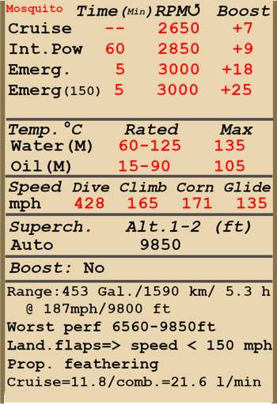

# Mosquito F.B. Mk.VI ser.2  

  
  

## Descripción  

Velocidad indicada de pérdida en configuración de vuelo: 179...208 km/h  
Velocidad indicada de pérdida en configuración de despegue/aterrizaje: 157...183 km/h  
Velocidad de picado límite: 690 km/h  
Carga de rotura máxima (en fuerzas <i>g</i>): 8,0 <i>g</i>  
Ángulo de ataque crítico en configuración de vuelo: 18,3°  
Ángulo de ataque crítico en configuración de aterrizaje: 15,3°  
  
Velocidad respecto al suelo al nivel del mar, 3000 rpm, impulso +25: 598 km/h (modificación)  
Velocidad respecto al suelo al nivel del mar, 3000 rpm, impulso +18: 548 km/h  
Velocidad máxima respecto al suelo a 2000 m, 3000 rpm, impulso +18: 577 km/h  
Velocidad máxima respecto al suelo a 3900 m, 3000 rpm, impulso +18: 603 km/h  
  
Techo de servicio: 8700 m  
Tasa de ascenso al nivel del mar: 9,4 m/s  
Tasa de ascenso a 3000 m: 9,8 m/s  
Tasa de ascenso a 6000 m: 6,7 m/s  
  
Viraje de máximo rendimiento al nivel del mar: 26,4 s, a 270 km/h velocidad indicada (IAS).  
Viraje de máximo rendimiento a 3000 m: 35,5 s, a 270 km/h velocidad indicada (IAS).  
  
Autonomía de vuelo a 3000 m: 5,3 h, a 300 km/h velocidad indicada (IAS).  
  
Velocidad de despegue: 200...230 km/h  
Velocidad senda de planeo: 200...240 km/h  
Velocidad de aterrizaje: 150...175 km/h  
Ángulo de aterrizaje: 13,0°  
  
Nota 1: los datos están basados en la atmósfera estándar internacional (ISA).  
Nota 2: diferentes rendimientos de vuelo dados para los diferentes pesos posibles del avión.  
Nota 3: velocidades máximas, tasas de ascenso y tiempos de giro dados para el peso estándar del avión.  
Nota 4: tasas de ascenso dadas a 2850 rpm e impulso +9, tiempos de giro dados a 3000 rpm e impulso +18.  
  
Motor:  
Modelo: Merlin 25  
Potencia máxima en modo Despegue (3000 rpm, impulso +18, etapa baja) al nivel del mar: 1620 HP  
Potencia máxima en modo Ascenso (2850 rpm, impulso +9, etapa baja) a 9250 ft: 1210 HP  
Potencia máxima en modo Ascenso (2850 rpm, impulso +9, etapa alta) a 16000 ft: 1135 HP  
Potencia máxima en modo Combate (3000 rpm, impulso +18, etapa baja) a 2000 ft: 1640 HP  
Potencia máxima en modo Combate (3000 rpm, impulso +18, etapa alta) a 9500 ft: 1500 HP  
Potencia máxima en modo Combate (3000 rpm, impulso +25, etapa baja) al nivel mar: 1950 HP (modificación)  
Potencia máxima en modo Combate (3000 rpm, impulso +25, etapa alta) a 4000 ft: 1800 HP (modificación)  
  
Modos de funcionamiento motor:  
Continuo (sin límite de tiempo): 2650 rpm, impulso +7  
Ascenso (hasta 1 hora): 2850 rpm, impulso +9  
Combate (hasta 5 minutos): 3000 rpm, impulso +18  
Combate (hasta 5 minutos): 3000 rpm, impulso +25 (modificación)  
  
Temperatura nominal del agua en la salida del motor: 60..125 °C  
Temperatura máxima del agua en la salida del motor: 135 °C  
Temperatura nominal del aceite en la admisión del motor: 15..90 °C  
Temperatura máxima del aceite en la admisión del motor: 105 °C  
  
Altitud de cambio de etapa del compresor: automático con posibilidad de cambiar manualmente a etapa baja  
  
Peso vacío: 6676 kg  
Peso mínimo (sin munición, 10% de combustible): 7463 kg  
Peso estándar: 9026 kg  
Peso máximo al despegue: 10194 kg  
Carga de combustible: 1479,1 kg / 2060 l / 453 galones  
Carga útil: 3518 kg  
  
Armamento delantero:  
4 ametralladoras de 7,7 mm «Browning .303», 500 balas por arma, 1150 balas por minuto, montadas en morro  
4 ametralladoras de 7,7 mm «Browning .303», 780 balas por arma, 1150 balas por minuto, montadas en morro (modificación)  
4 cañones de 20 mm «Hispano Mk.II», 150 balas por arma, 650 balas por minuto, montados en morro  
4 cañones de 20 mm «Hispano Mk.II», 175 balas por arma, 650 balas por minuto, montados en morro (modificación)  
2 ametralladoras de 7,7 mm «Browning .303», 500 o 780 balas por arma, 1150 balas por minuto, montadas en morro (modificación)  
1 cañón de 57 mm «Molins Class M», 25 proyectiles, 55 proyectiles por minuto, montado en morro (modificación)  
  
Bombas:  
Hasta 4 bombas de capacidad media (M.C., <i>Medium Capacity</i>) de 250 lb  
Hasta 4 bombas de capacidad media (M.C., <i>Medium Capacity</i>) de 500 lb  
  
Cohetes:  
8 cohetes perforantes de 25 lb (11 kg) «RP-3 AP» (modificación)  
8 cohetes semiperforantes con carga explosiva de 60 lb (27 kg) «RP-3 SAP/HE» (modificación)  
  
Longitud: 12,55 m  
Envergadura alar: 16.51 m  
Superficie de ala: 41,81 m²  
  
Debut en combate: Primavera de 1943  
  
Características operativas:  
- El motor tiene un compresor mecánico de dos etapas que no requiere control manual. Sin embargo, permite el cambio manual a la etapa baja.  
- El motor está equipado con un sistema de control automático de la mezcla que la mantiene en su grado óptimo.  
- El motor tiene un regulador automático de las rpm que controla el paso de la hélice para mantener las rpm requeridas.  
- Las hélices disponen de un sistema de puesta «en bandera» que debe activarse en caso de avería o daños en el motor para reducir la resistencia de la hélice en autorotación con el aire.  
- Las temperaturas del agua y aceite se controlan manualmente ajustando las persianas de los radiadores.  
- El avión cuenta con compensadores para los controles de vuelo de cabeceo, alabeo y guiñada.  
- Los flaps tienen un accionador hidraúlico y pueden bajarse gradualmente hasta formar un ángulo de 45°. La velocidad con los flaps bajados está limitada a 150 mph.  
- La rueda de cola del avión girar libremente y no se puede bloquear.  
- Los frenos neumáticos son diferenciales: cuando se mueven los pedales con la palanca de los frenos presionada se va soltando el freno de la rueda opuesta al pedal movido.  
- El avión está equipado con una sirena que avisa al piloto cuando la palanca de potencia están en una posición baja (menos de 1/4) y el tren de aterrizaje está subido.  
- Es imposible abrir la puerta de la cabina debido a la presión del flujo de aire, pero el avión cuenta con una palanca de ejección de emergencia de la puerta para poder saltar.  
- El avión cuenta con luces de formación frontal e inferiores y luces de intensidad restringida (RESIN, <i>REStricted INtensity</i>).  
- La mira regular es ajustable: tanto la distancia al objetivo como la envergadura del mismo son configurables.  
- Cuando se monten cohetes, es recomendable instalar una modificación de la mira Mk.II, la Mk.IIL: para que apuntar los cohetes sea más fácil, es posible desplazar la línea del objetivo hasta 5 grados hacia abajo (teclas «Mayús_Dcha + Ñ» / «Mayús_Dcha + Punto» por defecto).  
- El avion tiene varios interruptores para seleccionar las bombas que se lanzan, con tres posibles modos: lanzar una, lanzar dos al mismo tiempo o lanzar todas a la vez.  
- Cuando hay cohetes instalados existe un mando de lanzamiento con dos modos disponibles: disparar dos al mismo tiempo o todos a la vez. Si los cohetes están apilados de dos en dos, montados sólamente sobre 4 lanzadores Mk.III, cuando el mando se ajusta a «RP PAIRS» (dos a la vez) se lanzarán dos cohetes de cada una de las alas (4 cohetes en total, en lugar de dos).  
  
Datos básicos y configuraciones recomendadas de los controles del avión:  
1. Arranque del motor:  
	- palanca de control de la mezcla: (control de mezcla automático)  
	- radiadores de agua: cerrados  
	- palancas de control rpm de las hélices: 0%  
	- palanca de potencia: 15%  
  
2. Posición de la palanca de control de mezcla según momento de vuelo: (control de mezcla automático)  
  
3. Posición de las aletas/persianas de los radiadores de agua según momento de vuelo:  
	- despegue: abiertas  
	- ascenso: abiertas  
	- crucero: cerradas  
	- combate: abiertas  
  
4. Consumo aproximado de combustible a 2000 m de altitud:  
	- Modo motor - Crucero: 11,8 l/min  
	- Modo motor - Combate: 21,6 l/min  

## Modificaciones  
### Combustible de 150 octanos  

Permite un impulso de +25 lb  
El cambio de etapa automático del compresor se deshabilita. El cambio de etapa debe realizarse de forma manual a 3500 ft de altitud.  
Incremento estimado de velocidad a nivel del mar: 27 km/h (17 mph)  

### 2 Browning .303 y 1 cañón de 57mm  

Instalación en el morro de 2 ametralladoras de 7,7 mm «Browning .303» con 500 o 780 balas cada una, y 1 cañón de 57 mm «Molins» con 25 proyectiles  
Peso adicional: 589 kg  
Peso de munición de 57 mm: 159 kg  
Peso del armamento: 386 kg  
Pérdida de velocidad estimada: 5 km/h  

### 4 Browning .303 y 1 cañón de 57mm  

Instalación en el morro de 4 ametralladoras de 7,7 mm «Browning .303» con 500 o 780 balas cada una, y 1 cañón de 57 mm «Molins» con 25 proyectiles  
Peso adicional: 644 kg  
Peso de munición de 57 mm: 159 kg  
Peso del armamento: 386 kg  
Pérdida de velocidad estimada: 7 km/h  
  
### 8 cohetes RP-3 en lanzadores Mk.I  

8 cohetes no guiados de 3 pulgadas (76 mm) RP-3 semiperforante con carga explosiva (SAP/HE) o perforante (AP) en carriles de lanzamiento Mk.I  
  
8 cohetes RP-3 SAP/HE:  
Peso adicional: 411 kg (906 lb)  
Peso de munición: 304 kg (670 lb)  
Peso de los soportes: 107 kg (236 lb)  
Pérdida de velocidad estimada antes de lanzarlos: 39 km/h (24 mph)  
Pérdida de velocidad estimada tras lanzarlos: 21 km/h (13 mph)  
  
8 cohetes RP-3 AP:  
Peso adicional: 277 kg (611 lb)  
Peso de munición: 170 kg (375 lb)  
Peso de los soportes: 107 kg (236 lb)  
Pérdida de velocidad estimada antes de lanzarlos: 39 km/h (24 mph)  
Pérdida de velocidad estimada tras lanzarlos: 21 km/h (13 mph)  
  
### 8 cohetes RP-3 en lanzadores Mk.III  

8 cohetes no guiados de 3 pulgadas (76 mm) RP-3 semiperforante con carga explosiva (SAP/HE) o perforante (AP) en carriles de lanzamiento Mk.III  
  
8 cohetes RP-3 SAP/HE:  
Peso adicional: 376 kg (829 lb)  
Peso de munición: 304 kg (670 lb)  
Peso de los soportes: 72 kg (159 lb)  
Pérdida de velocidad estimada antes de lanzarlos: 34 km/h (21 mph)  
Pérdida de velocidad estimada tras lanzarlos: 14 km/h (9 mph)  
  
8 cohetes RP-3 AP:   
Peso adicional: 242 kg (534 lb)  
Peso de munición: 170 kg (375 lb)  
Peso de los soportes: 72 kg (159 lb)  
Pérdida de velocidad estimada antes de lanzarlos: 33 km/h (21 mph)  
Pérdida de velocidad estimada tras lanzarlos: 14 km/h (9 mph)  
  
### 8 cohetes RP-3 apilados en lanzadores Mk.III  

8 cohetes no guiados de 3 pulgadas (76 mm) RP-3 semiperforante con carga explosiva (SAP/HE) o perforante (AP) en 4 carriles de lanzamiento Mk.III; dos cohetes escalonados por lanzador  
  
8 cohetes RP-3 SAP/HE:  
Peso adicional: 364 kg (802 lb)  
Peso de munición: 304 kg (670 lb)  
Peso de los soportes: 60 kg (132 lb)  
Pérdida de velocidad estimada antes de lanzarlos: 33 km/h (21 mph)  
Pérdida de velocidad estimada tras lanzarlos: 14 km/h (9 mph)  
  
8 cohetes RP-3 AP:  
Peso adicional: 230 kg (507 lb)  
Peso de munición: 170 kg (375 lb)  
Peso de los soportes: 60 kg (132 lb)  
Pérdida de velocidad estimada antes de lanzarlos: 33 km/h (21 mph)  
Pérdida de velocidad estimada tras lanzarlos: 14 km/h (9 mph)  

### Mira Mk.IIL  

La mira Mk.IIL permite desplazar la línea del objetivo hasta 5 grados hacia abajo (teclas «Mayús_Dcha + Ñ» / «Mayús_Dcha + Punto» por defecto)  
Peso adicional: 2 kg (4,41 lb)  
Pérdida de velocidad estimada: 0 km/h  

### Tubos de escape abiertos  

Desinstalación de la cubierta de los múltiples tubos de escape del motor  
Incremento estimado de velocidad a nivel del mar: 22 km/h (13,6 mph)  
