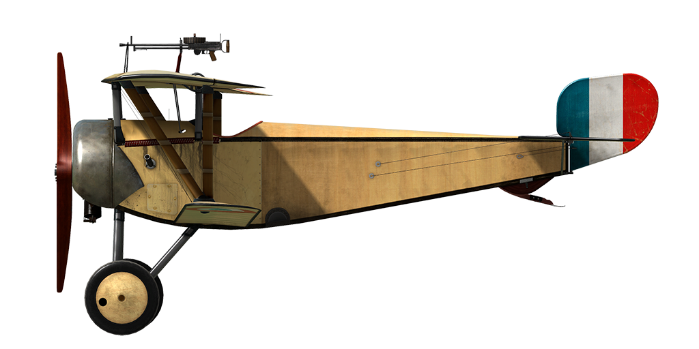

# Nieuport 11.C1  
  
  
  
## Descripción  
  
El Nieuport 11 <i>Bébé</i> (bebé, en francés) fue un desarrollo avanzado de los conceptos propuestos por Gustave Delage, diseñador del Nieuport 10. En términos generales, el <i>Bébé</i> fue diseñado como un caza monoplaza sesquiplano. El ala inferior, con un solo larguero de refuerzo y con una superficie de ala menor que el plano superior, estaba sujeto al mismo mediante refuerzos entre planos en forma de V. Una desventaja de este diseño era la baja resistencia estructural que tenía el plano inferior, que tendía a flexar y doblarse cuando se sometía a fuertes cargas alares. Problemas similares fueron comunes a otros sesquiplanos, incluyendo la familia entera de Nieuport desde el 10 al 23, el Albatros D.III y D.V, etc.  
  
Los primeros Nieuport 11 llegaron al frente francés en enero de 1916. El <i>Bébé</i> pronto se convirtió en un formidable adversario para el monoplano Fokker Eindecker, al que superaba en casi todas las características. La presencia de alerones y el uso de elevadores vinculados a un plano de cola convencional, con estabilizador vertical y timón deflector, mejoró de forma importante la maniobrabilidad y la precisión de los controles en comparación con aviones de modelos más antiguos, equipados con controles de alabeo por flexión del ala y elevadores equilibrados del tipo Morane.  
  
La llegada del Nieuport 11 al frente puso fin a la devastadora superioridad de los Fokker monoplanos, que llegó a ser conocida como «El azote de los Fokker». Durante la batalla de Verdún en febrero de 1916, los Nieuport 11 causaron un gran daño a las fuerzas aéreas enemigas y forzaron a Alto Mando alemán a revisar las tácticas de combate aéreo. Muchos famosos Ases de la Primera Guerra Mundial, incluido Georges Guynemer, obtuvieron sus primeros éxitos pilotando el <i>Bébé</i>.  
  
Algunos Nieuport 11 fueron equipados con guías especiales montadas en los travesaños de las alas para disparar cohetes Le Prieur contra aeronaves enemigas y globos de observación. El <i>Bébé</i> permaneció en servicio militar activo hasta el verano de 1917, en que fue substituido por cazas más modernos. Algunos ejemplares fueron transferidos a las escuelas de vuelo como aviones de entrenamiento. Famoso entre los de su época, sus excelentes cualidades y gran rendimiento le valieron la gran popularidad que obtuvo. El Nieuport 11 estuvo en servicio en las Fuerza Aéreas de varios países, incluyendo Bélgica, Rusia y Gran Bretaña. Varios centenares de ejemplares se fabricaron bajo licencia en Italia y Rusia.  
  
  
Motor:  
Le Rhône 9C, 9 cil. rotativo, 80 CV  
  
Dimensiones:  
Altura: 2400 mm  
Longitud: 5640 mm  
Envergadura alar: 7520 mm  
Superficie de ala: 13,3 m²  
  
Pesos:  
Vacío: 320 kg  
Al despegue: 480 kg  
Capacidad de combustible: 91 l  
Capacidad de aceite: 15 l  
  
Velocidad máxima (IAS):  
Nivel del mar – 167 km/h  
1000 m – 158 km/h  
2000 m – 146 km/h  
3000 m – 133 km/h  
4000 m – 117 km/h  
  
Tasa de ascenso:  
1000 m — 3 min 47 s  
2000 m — 8 min 19 s  
3000 m — 14 min 51 s  
4000 m — 28 min 02 s  
  
Techo de servicio: 5050 m  
  
Autonomía a 1000 m:  
potencia nominal (combate) — 2 h  
consumo mínimo (crucero) — 3 h  
  
Armamento:  
Disparo frontal: 1 Lewis Mk.I de 7,69 mm, 388 balas  
  
Referencias  
1) Nieuport Fighters in action. Aircraft n.º 167.  
2) Nieuport Fighters. JM Bruce Windsock Datafile, vol. 1 y vol. 2.  
3) Nieuport Aces of World War 1. Osprey Aircraft of the Aces n.º 33.  
  
## Modificaciones  
  
  
### Aldis  
  
Colimador reflectante Aldis (importado de Gran Bretaña)  
Peso adicional: 2 kg  
  
  
### Altímetro  
  
Altímetro de Peltret y Lafage (0..5000 m)  
Peso adicional: 1 kg  
  
  
### Reloj  
  
Reloj Mecánico  
Peso adicional: 1 kg  
  
  
### Luz de cabina  
  
Lámpara para iluminar la cabina en las salidas nocturnas  
Peso adicional: 1 kg  
  
  
### Brújula  
  
Brújula de L.Maxant  
Peso adicional: 1 kg  
  
  
### Le-Chretien  
  
Colimador reflectante Le-Chretien  
Peso adicional: 1 kg  
  
  
### Cohetes Le Prieur  
  
8 cohetes antiglobo Le Prieur montados en los soportes verticales de las alas, con una cuchilla triangular en la punta para ayudar a la penetración de la envoltura del globo o una granada altamente explosiva.  
Peso adicional: 36 kg  
Peso de munición: 16 kg  
Peso de los soportes: 20 kg  
Pérdida de velocidad estimada antes de soltar: 8 km/h  
Pérdida de velocidad estimada tras soltar: 6 km/h  
  
  
### Anemómetro  
  
Anemómetro de E.Badin (70..200 km/h a 2000 m y 80..220 km/h a 4000 m)  
Peso adicional: 1 kg  
  
  
### Doble Lewis sobre ala superior  
  
Dos ametralladoras Lewis sincronizadas adicionales de posición fija montadas sobre el ala superior.  
Munición: 582 balas de 7,69 mm (6 tambores con 97 balas cada uno)  
Peso del proyectil: 11 g  
Velocidad de salida: 745 m/s  
Tasa de disparo: 550 bpm  
Peso de las armas: 16 kg (sin cargador)  
Peso de los soportes: 6 kg  
Peso de la munición: 24 kg  
Peso total: 46 kg  
Pérdida de velocidad estimada: 7-18 km/h  