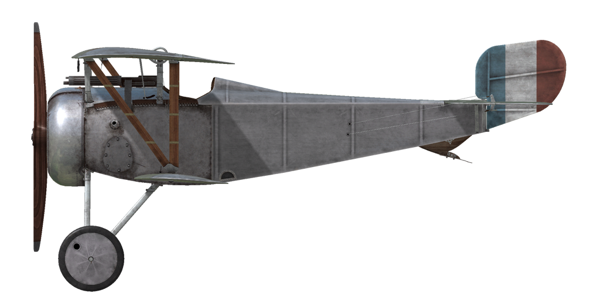

# Nieuport 17.C1  
  
  
  
## Description  
  
Lavion a été positionné comme un développement du chasseur Nieuport 11. Par rapport à son prédécesseur, il a une plus grande envergure et surface daile, il a également un moteur plus puissant qui a conduit à des modificationa au capot moteur. Certaines caractéristiques de conception sont les mitrailleuses Vickers montées en face du cockpit et des fils de contrôle des ailerons en métal. Laile basse continue à être soutenue par un longeron en haut, doù lappellation du design de  "laile et demie". Lavion a dabord été fabriqué dans plusieurs usines en France mais très rapidement la license a été vendue à dautres pays: Grande Bretagne, Russie, Itale, Finlande, Japon. Au total, 7200 avions Nieuport avec moteur Rhone ont été construits.  
Sa première apparition en combat est datée de mai 1916. Le Nieuport 17 est arrivé dans lescadron français N57. Il était utilisé contre des ballons, des bombardiers et des chasseurs. Les piots ont souligné une bonne vitesse de montée et une bonne visibilité, ainsi quune maniabilité excellente. Lintroduction de la mitrailleuse Vickers a rencontré quelques difficultés. Certains pilotes lont enlevé et ont placé à la palce une mitrailleuse Lewis sur laile. Dautres en revanche ont utilisé les deux simultanément bien que ça diminuait la maniabilité de lappareil.  
La puissance du moteur et la haute vitesse ont démontré le principal inconvénient de lavion "un et demi": voilures inférieure faible à cause dun unique longeron. Il y a eu deux cas connus où les pilotes ont réalisé avec succès un atterrissage après la perte des ailes inférieures.  
  
Moteur 9 cyl. rotary Le Rhone 9J, 110 hp  
  
Tailles  
Hauteur: 2400 mm  
Longueur: 5800 mm  
Envergure: 8160 mm  
Surface d\aile: 14.75 sq.m  
  
Poids  
Poids à vide weight: 375 kg  
Poids au décollage weight: 560 kg  
Capacité des réservoirs carburant: 78 l  
Capacité du réservoir dhuile: 20 l  
  
Tauc de montée  
1000 m:  3 min. 06 sec.  
2000 m:  6 min. 43 sec.  
3000 m: 11 min. 34 sec.  
4000 m: 19 min. 23 sec.  
5000 m: 33 min. 08 sec.  
  
Vitesse maximale (IAS)  
au Sol — 165 km/h  
1000 m — 155 km/h  
2000 m — 145 km/h  
3000 m — 132 km/h  
4000 m — 117 km/h  
5000 m —  95 km/h  
  
Plafond opérationnel 5350 m  
  
Autonomie à 1000m  
puissance nominale (en combat) — 1 h. 50 min.  
consommation minimale (en croisière) — 2 h. 40 min.  
  
Armes  
Tir avant: 1 х Vickers 7,69mm,  400 cartouches par baril.  
  
References  
1) Nieuport Fighters in action. Aircraft Number 167.  
2) Nieuport Fighters. JM Bruce Windsock Datafile, vol.1 and vol.2.  
3) Profile Publications. The Nieuport 17 Number 49.  
  
## Modifications  
  
  
### Aldis  
  
Collimateur à réfraction Aldis (importé dAngleterre)  
Masse supplémentaire : 2 kg  
  
  
### Lumière de cockpit  
  
Lumière à ampoule pour les sorties de nuit  
Masse supplémentaire : 1 kg  
  
  
### Compas  
  
Compas L.Maxant  
Masse supplémentaire : 1 kg  
  
  
### Le-Chretien  
  
Collimateur à réfraction Le-Chrétien  
Masse supplémentaire : 1 kg  
  
  
### LePrieur rockets  
  
8 x strut-mounted "Le Prieur" anti-balloon rockets of incendary action, with pointed triangular blade attached to nose cone to asssit penetration of balloon envelope or with high explosive grenade.  
Masse supplémentaire : 36 kg  
Masse des munitions : 16 kg  
Masse des pylones : 20 kg  
Perte estimée de vitesse avant le largage : 8 km/h  
Perte estimée de vitesse après le largage : 6 km/h  
  
  
### Lewis Overwing  
  
Cockpit mounted additional Lewis machinegun with changeable position.  
Ammo: 291 of 7.69mm rounds (3 drums with 97 rounds in each)  
Forward position: 25°  
Upward position: 45°  
Projectile weight: 11 g  
Muzzle velocity: 745 m/s  
Rate of fire: 550 rpm  
Guns weight: 7.5 kg (w/o ammo drum)  
Mounts weight: 0.8 kg  
Ammo weight: 12 kg  
Total weight: 20.3 kg  
Estimated speed loss: 5 km/h  
  
### Anémomètre, Altimètre, Montre  
  
Anémomètre E.Badin (70..200 km/h à 2000 m et 80..220 km/h à 4000 m)  
Masse supplémentaire : 1 kg  
  
Altimètre Peltret and Lafage (0..5000m)  
Masse supplémentaire : 1 kg  
  
Montre mécanique  
Masse supplémentaire : 1 kg  
  
  
### Twin Lewis Overwing  
  
Two overwing mounted additional fixed Lewis machineguns.  
Ammo: 582 of 7.69mm rounds (6 drums with 97 rounds in each)  
Projectile weight: 11 g  
Muzzle velocity: 745 m/s  
Rate of fire: 550 rpm  
Guns weight: 16 kg (w/o ammo drums)  
Mounts weight: 6 kg  
Ammo weight: 24 kg  
Total weight: 46 kg  
Estimated speed loss: 7-18 km/h  