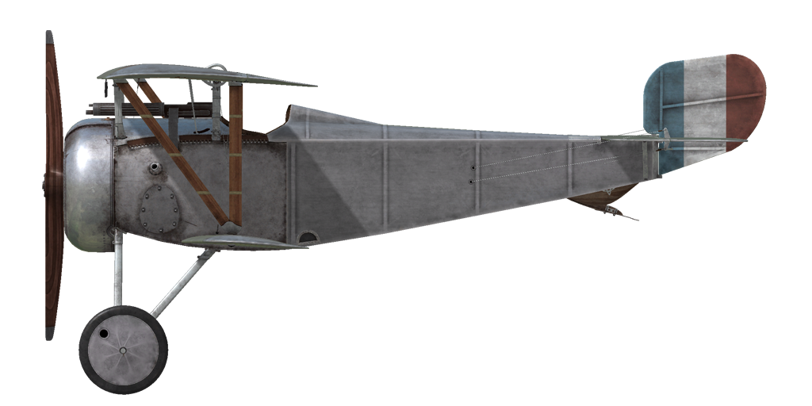
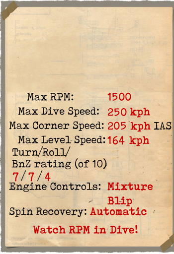

# Nieuport 17.C1  

| Image | Notes  
|:---|:---  
|  |   

## Beschreibung  

Das Flugzeug war als Weiterentwicklung der Nieuport 16 gedacht. In Vergleich zu seinem Vorgänger hatte es eine größere Spannweite und Flügelfläche. Außerdem wurde ein stärkeres Triebwerk eingebaut und die Abdeckung modifiziert. Einige Besonderheiten sind die Vickers Maschinengewehre vor dem Cockpit und die Querruder-Steuerzüge aus Stahl. Die untere Tragfläche war mit einem, die obere mit zwei Sparren versehen. Das ganze nannte man "eineinhalb Flügel-Design". Das Flugzeug wurde zunächst in in mehreren Werken in Frankreich produziert und anschließend für andere Länder lizensiert: Großbritannien, Russland, Italien, Finnland, Japan. Insgesamt wurden 7200 Nieuport Flugzeuge mit dem Le Rhone Triebwerk produziert.  
Die ersten Kampfhandlungen mit diesem Typ wurden im Mai 1916 erwähnt. Die Nieuport 17 wurde von der Squadron N57 geflogen. Sie wird gegen Ballons, Bomber und Kampfflugzeuge eingesetzt. Piloten lobten die gute Steiggeschwindigkeit, die gute Sicht und die hervorragende Manövrierfähigkeit. Die Einführung von Vickers Maschinengewehren wurde zwiespältig aufgenommen. Einige Piloten entfernten diese wieder und ersetzten sie mit Lewis Maschinengewehren. Diese brachten sie auf den oberen Tragflächen an. Einige benutzten sogar beide Fabrikate gleichzeitig, obwohl das die Manövrierfähigkeit einschränkte.  
Ein leistungsstarkes Triebwerk und hohe Sturzfluggeschwindigkeiten brachten aber den Schwachpunkt des "eineinhalb Flügel-Designs" zu Tage. Eine sehr schwache, untere Tragfläche mit nur einem Sparren. Es gibt jedoch zwei bekannte Berichte von Piloten, die ihr Flugzeug trotz verlorener unterer Tragfläche sicher landen konnten.  
  
Triebwerk 9 Zyl. luftgekühlter Rotationsmotor Le Rhone 9J 110 PS  
  
Abmessung  
Höhe: 2400 mm  
Länge: 5800 mm  
Spannweite: 8160 mm  
Flügelfläche: 14.75 qm  
  
Gewicht  
Leergewicht: 375 kg  
Startgewicht: 560 kg  
Treibstoffkapazität: 78 l  
Ölkapazität: 20 l  
  
Steigrate  
1000 m:  3 min. 06 sec.  
2000 m:  6 min. 43 sec.  
3000 m: 11 min. 34 sec.  
4000 m: 19 min. 23 sec.  
5000 m: 33 min. 08 sec.  
  
Max Geschwindigkeit (IAS)  
Meeresspiegel – 165 km/h  
 1000 m – 155 km/h  
 2000 m – 145 km/h  
 3000 m – 132 km/h  
 4000 m – 117 km/h  
 5000 m –  95 km/h  
  
Dienstgipfelhöhe 5350 m  
  
Reichweite bei 1000 m  
Nennleistung (im Kampf) — 1 Std. 50 Min.  
Minimaler Verbrauch (Rundflug) — 2 Std. 40 Min.  
  
Bewaffnung  
Starre Bewaffnung nach vorne: 1 х Vickers 7,69mm,  400 Schuss pro Magazin.  
  
Referenzen  
1) Nieuport Fighters in action. Aircraft Number 167.  
2) Nieuport Fighters. JM Bruce Windsock Datafile, vol.1 and vol.2.  
3) Profile Publications. The Nieuport 17 Number 49.  

## Änderungen  
### Aldis  

Aldis Teleskopvisier (aus England importiert)  
Zusätzliches Gewicht: 2 kg  
  
### Instrumentenlicht  

Glühlampe zum Beleuchten des Instrumentenbrettes bei Nachteinsätzen  
Zusätzliches Gewicht: 1 kg  
  
### Kompass  

L.Maxant Kompass  
Zusätzliches Gewicht: 1 kg  
  
### Le-Chretien  

Le-Chretien Teleskopvisier  
Zusätzliches Gewicht: 1 kg  
  
### LePrieur rockets  

8 x strut-mounted "Le Prieur" anti-balloon rockets of incendary action, with pointed triangular blade attached to nose cone to asssit penetration of balloon envelope or with high explosive grenade.  
Zusätzliches Gewicht: 36 kg  
Gewicht der Munition: 16 kg  
Gewicht der Abwurfwaffenroste: 20 kg  
Geschwindigkeitsverlust vor Abwurf: 8 km/h  
Geschwindigkeitsverlust nach Abwurf: 6 km/h  
  
### Lewis Überflügel-Maschinengewehr  

Cockpit montierte zusätzliche Lewis-Maschinengewehre mit wechselbarer Position.  
Munition: 291 7,69mm Patronen (3 Trommeln mit jeweils 97 Schuss)  
Vordere Position: 25°  
Obere Position: 45°  
Geschossgewicht: 11 g  
Mündungsgeschwindigkeit: 745 m/s  
Feuerrate: 550 Schuss/min  
Gewicht der Waffe: 7.5 kg (ohne Munitionstrommel)  
Gewicht der Halterung: 0.8 kg  
Gewicht der Munition: 12 kg  
Gseamtgewicht: 20.3 kg  
Geschätzter Geschwindigkeitsverlust: 5 km/h  
  
### Anemometer, Höhenmesser, Uhr  

E.Badin Anemometer (70..200 km/h at 2000 m and 80..220 km/h at 4000 m)  
Zusätzliches Gewicht: 1 kg  
  
Peltret and Lafage Höhenmesser (0..5000m)  
Zusätzliches Gewicht: 1 kg  
  
Taschenuhr  
Zusätzliches Gewicht: 1 kg  
  
### Lewis Überflügel-Zwillings-Maschinengewehr  

Zwei überflügeln montierte zusätzliche Lewis-Maschinengewehre ohne wechselbarer Position.  
Munition: 582 7,69mm Patronen (6 Trommeln mit jeweils 97 Schuss)  
Geschossgewicht: 11 g  
Mündungsgeschwindigkeit: 745 m/s  
Feuerrate: 550 Schuss/min  
Gewicht der Waffe: 16 kg (ohne Munitionstrommel)  
Gewicht der Halterung: 6 kg  
Gewicht der Munition: 24 kg  
Gseamtgewicht: 46 kg  
Geschätzter Geschwindigkeitsverlust: 7-18 km/h  
