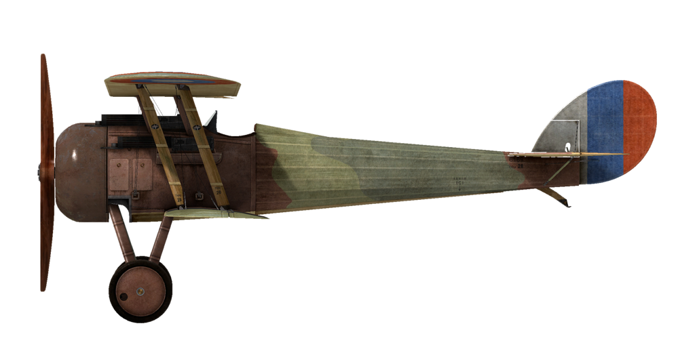

# Nieuport 28.C1  

<table><tbody><tr><td style="text-align: center"></td><td style="text-align: center"></td></tr><tr><td style="text-align: center" colspan="2"></td></tr></tbody></table>  

The next evolution in the line of fighters made by Nieuport S.A.d E. (Societe Anonyme des Etablissements) Company was the Nieuport 28. Its designers knew that their previous designs were now obsolete and did not allow for better flight characteristics. Therefore, it was decided to use structural features of the SPAD XIII in the design of the new fighter. Some of these features are as follows: larger surface area of the lower wing (a second spar was fitted to it, thus making it a true biplane); a second machine gun was placed left of the centreline behind the engine; and ailerons were fitted to the lower wing instead of the top wing. Its first trial flight occurred on June 5, 1917. Unfortunately, the new fighter could not exceed the flight characteristics of the already-employed SPAD XIII. As a result, French pilots refused to fly it. In all, 208 fighters of this type were built, after which the Nieuport S.A.d E. Company switched to manufacturing the SPAD XIII.  
  
The Nieuport 28 entered service with American squadrons in February 1918. Due to an insufficient supply of Vickers machine guns, combat use of the fighter did not begin until the following month. It was primarily used for engaging enemy fighters and balloons but rarely for bomber escort or recon missions behind enemy lines. Pilots noted good climb speed, manoeuvrability, and the sensitivity of its controls. In the course of its combat service, it was found that the plane tended to lose its top wing covering in prolonged dives. There were several incidents of this described by pilots who managed to land despite experiencing such severe damage.  
  
  
Engine  
rotary 9 cyl. Gnome 9N 160 hp  
  
Dimensions  
Height: 2500 mm  
Length: 6400 mm  
Wing span: 8160 mm  
Wing surface: 20 sq.m  
  
Weight  
Empty: 436 kg  
Takeoff: 698 kg  
Fuel capacity: 125 l  
Oil capacity: 25 l  
  
Maximum airspeed (IAS)  
sea level — 203 km/h  
1000 m — 190 km/h  
2000 m — 177 km/h  
3000 m — 165 km/h  
4000 m — 150 km/h  
5000 m — 136 km/h  
  
Climb rate  
1000 m — 2 min. 43 sec.  
2000 m — 5 min. 43 sec.  
3000 m — 9 min. 30 sec.  
4000 m — 14 min. 49 sec.  
5000 m — 23 min. 20 sec.  
  
Service ceiling 5800 m  
  
Endurance at 1000m  
nominal power (combat) — 1 h. 10 min.  
minimal consumption (cruise) — 1 h. 10 min.  
  
Armament  
Forward firing: 2хVickers Mk.I 7,69mm, 250 rounds per barrel.  
  
References  
1) The Nieuport 28 America\s first fighter. Theodore Hamady.  
2) The Nieuport 28 C.1. Profile Publications Number 79.  
3) Nieuport 28 by J Guttman. Windsock Datafile 36.  

## 修改  
### 阿尔迪斯（Alidas）瞄准具  

阿尔迪斯（Alidas）折射型直筒瞄准具 (从英国进口)  
增加质量：2 kg  

### 高度计  

佩尔特雷拉菲切型高度计(0至5000m)  
增加质量：1 kg  

### “气球”机枪  

双维克斯（Vickers）“气球”机枪  
Ammo：300发11.43mm弹药  
弹丸重量：17.5 g  
膛口速度：610 m/s  
枪炮重量：26 kg  
弹药重量：24 kg  
射速：600 rpm  
总重：50 kg  

### 时钟  

机械时钟  
增加质量：1 kg  

### 驾驶舱照明  

用于夜间飞行的驾驶舱照明灯  
增加质量：1 kg  

### 罗盘  

L.麦克森型罗盘  
增加质量：1 kg  

### 勒克雷蒂安（LeChretien）瞄准具  

勒克雷蒂安（LeChretien）折射型直筒瞄准具  
增加质量：1 kg  

### 侧滑指示器  

侧滑指示器(球型)  
增加质量：1 kg  

### 风速计  

E.巴丁型风速计(2000m时70至200km/h，4000m时80至220km/h)  
增加质量：1 kg  
