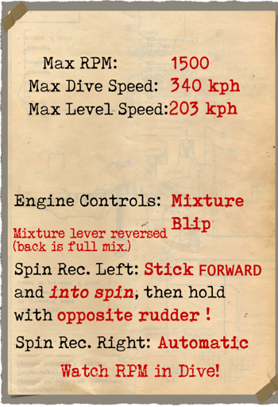
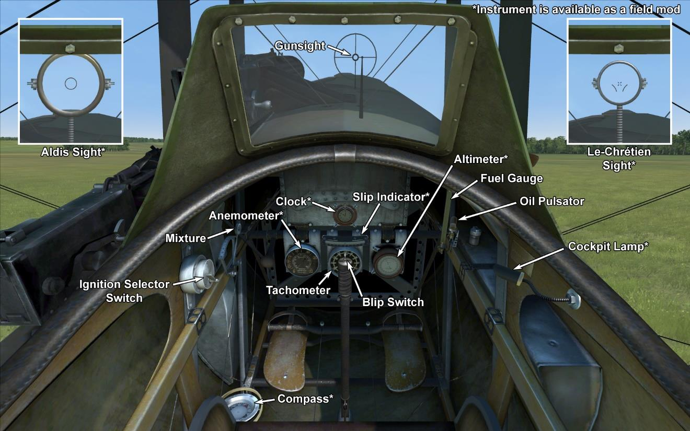

# Nieuport 28.C1  

<table><tbody><tr><td style="text-align: center"></td><td style="text-align: center"></td></tr><tr><td style="text-align: center" colspan="2"></td></tr></tbody></table>  

## Description  

L\étape suivante dans l\évolution de la ligne de chasseurs faite par la Nieuport S.A.d.E (Société Anonyme des Etablissements) a été le Nieuport 28. Les ingénieurs savaient que la conception précédente était devenue obsolète et ne permettait pas de parvenir à de meilleures caractéristiques de vol. Par conséquent, il a été décidé d\utiliser la strucutre du SPAD XIII pour concevoir le nouveau chasseur. On peut noter certaines caractéristiques: plus grande surface d\aile inférieure (un deuxième longeron a été monté sur l\avion qui est devenu un véritable biplan; une deuxième mitrailleuse a été placée ) gauche de l\axe à l\arrière du moteur; les ailerons ont été installés à la partie inférieure des ailes au lieu de la partie supérieure. Le premier vol d\essai a eu lieu le 5 juin 1917. Malheureusement, le nouveau chasseur ne pouvait pas dépasser les caractéristiques de vol du SPAD XIII déja en service. Pour cette raison, les pilotes français refusèrent de voler avec. 208 chasseurs ont été contruits. Après cela, la Nieuport S.A.d.E est passée à la fabrication du SPAD XIII.  
  
Le Nieuport 28 est entré en service avec les unités militaires américaines en février 1918. En raison de l\insuffisance de l\offre de la mitrailleuse Vickers l\utilisation du chasseur a commencé en mars 1918. Il a été principalement utilisé contre des chasseurs et des ballons, rarement pour des bombardements en escorte ou des missions de reconnaissance derrière les lignes ennemies. Les pilotes ont noté une bonne vitesse de montée, bonne maniabilité, et de la sensibilité dans les contrôles. Lors de combat, il a été constaté que l\avion perdait la partie supérieure de l\aile lors de longues plongées. Plusieurs épisodes courageux ont été décrits pour atterrir avec succès même avec de tels de dommages.  
  
  
Moteur  
rotary 9 cyl. Gnome 9N 160 hp  
  
Tailles  
Hauteur: 2500 mm  
Longueur: 6400 mm  
Envergure: 8160 mm  
Surface d\aile: 20 sq.m  
  
Poids  
Poids à vide: 436 kg  
Poids au décollage: 698 kg  
Capacité des réservoirs carburant: 125 l  
Capacité du réservoir d\huile: 25 l  
  
Vitesse maximale (IAS)  
au Sol — 203 km/h  
1000 m — 190 km/h  
2000 m — 177 km/h  
3000 m — 165 km/h  
4000 m — 150 km/h  
5000 m — 136 km/h  
  
Tauc de montée  
1000 m — 2 min. 43 sec.  
2000 m — 5 min. 43 sec.  
3000 m — 9 min. 30 sec.  
4000 m — 14 min. 49 sec.  
5000 m — 23 min. 20 sec.  
  
Plafond opérationnel 5800 m  
  
Autonomie à 1000m  
puissance nominale (en combat) — 1 h. 10 min.  
consommation minimale (en croisière) — 1 h. 10 min.  
  
Armes  
Armes fixées: 2 х Vickers 7,69mm, 250 cartouches par baril.  
  
References  
1) The Nieuport 28 America\s first fighter. Theodore Hamady.  
2) The Nieuport 28 C.1. Profile Publications Number 79.  
3) Nieuport 28 by J Guttman. Windsock Datafile 36.  

## Modifications  
### Aldis  

Collimateur à réfraction Aldis (importé dAngleterre)  
Masse supplémentaire : 2 kg  
  
### Altimetre  

Altimetre Peltret and Lafage (0..5000m)  
Masse supplémentaire : 1 kg  
  
### Balloon guns  

Twin Vickers "Balloon" guns  
Ammo: 300 of 11.43mm rounds  
Projectile weight: 17,5 g  
Muzzle velocity: 610 m/s  
Guns weight: 26 kg  
Ammo weight: 24 kg  
Rate of fire: 600 rpm  
Total additional weight of weapon modification: 50 kg  
  
### Montre de bord  

Montre mécanique  
Masse supplémentaire : 1 kg  
  
### Lumière de cockpit  

Lumière à ampoule pour les sorties de nuit  
Masse supplémentaire : 1 kg  
  
### Compas  

Compas L.Maxant  
Masse supplémentaire : 1 kg  
  
### Le-Chretien  

Collimateur à réfraction Le-Chrétien  
Masse supplémentaire : 1 kg  
  
### Indicateur de virage  

Indicateur de virage (à balle)  
Masse supplémentaire : 1 kg  
  
### Anemometre  

Anemometre E.Badin (70..200 km/h à 2000 m et 80..220 km/h à 4000 m)  
Masse supplémentaire : 1 kg  
