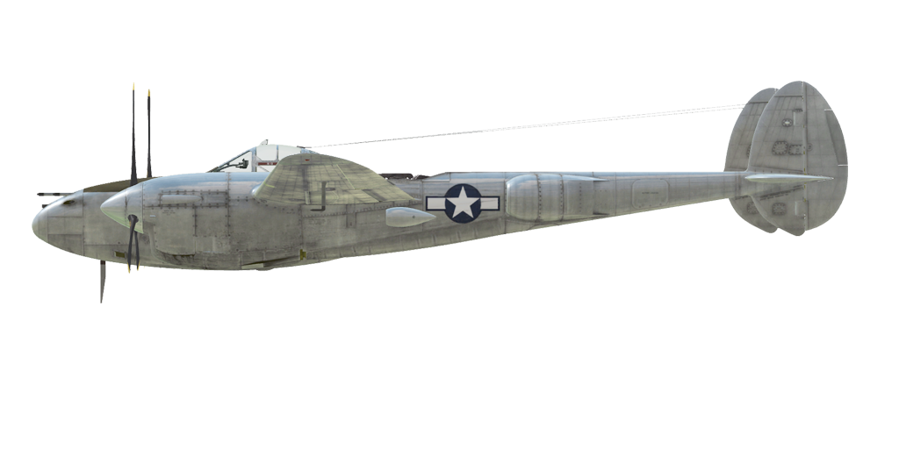

# P-38J-25

## Descripción

Velocidad de pérdida indicada en configuración de vuelo: 179..220 km/h (111...137 mph)
Velocidad de pérdida indicada en configuración de despegue/aterrizaje: 149..185 km/h (93..115 mph)
Velocidad de picado límite: 725 km/h (450 mph)
Carga de rotura máxima (en fuerzas <i>g</i>): 9 <i>g</i>
Ángulo de ataque crítico en configuración de vuelo: 14,1°
Ángulo de ataque crítico en configuración de aterrizaje: 11,5°

Velocidad respecto al suelo al nivel del mar, modo motor - WEP: 557 km/h (346 mph)
Velocidad máxima respecto al suelo a 7860 m (25800 ft), modo motor - WEP: 674 km/h (419 mph) 

Velocidad respecto al suelo al nivel del mar, modo motor - Combate: 540 km/h (336 mph)
Velocidad máxima respecto al suelo a 9000 m (27890 ft), modo motor - Combate: 670 km/h (416 mph)

Techo de servicio: 12350 m (40500 ft)

Tasa de ascenso en modo motor - WEP
Tasa de ascenso al nivel del mar: 20,4 m/s (4020 ft/min)
Tasa de ascenso a 3000 m (9843 ft): 19,1 m/s (3758 ft/min)
Tasa de ascenso a 6000 m (19685 ft): 15,0 m/s (2953 ft/min)

Tasa de ascenso en modo motor - Combate
Tasa de ascenso al nivel del mar: 12,8 m/s (2518 ft/min)
Tasa de ascenso a 3000 m (9843 ft): 11,5 m/s (2258 ft/min)
Tasa de ascenso a 6000 m (19685 ft): 9,4 m/s (1844 ft/min)

Viraje de máximo rendimiento al nivel del mar: 20,0 s, a 310 km/h (195 mph) velocidad indicada (IAS).
Viraje de máximo rendimiento a 3000 m (9843 ft): 28,3 s, a 320 km/h (200 mph) velocidad indicada (IAS).

Autonomía de vuelo a 3000 m (9843 ft): 5,8 h, a 350 km/h (217 mph) velocidad indicada (IAS).

Velocidad de despegue: 160..175 km/h (100..110 mph)
Velocidad senda de planeo: 185..210 km/h (115...130 mph)
Velocidad de aterrizaje: 150..175 km/h (95..110 mph)
Ángulo de aterrizaje: 7,0°

Nota 1: los datos están basados en la atmósfera estándar internacional (ISA).
Nota 2: diferentes rendimientos de vuelo dados para los diferentes pesos posibles del avión.
Nota 3: velocidades máximas, tasas de ascenso y tiempos de giro dados para el peso estándar del avión y 70% de combustible.
Nota 4: tiempos de giro dados para la potencia WEP.

Motor:
Modelo: Allison V-1710-89 (izquierdo) y V-1710-91 (derecho)
Potencia máxima en modo WEP al nivel del mar: 1550 CV
Potencia máxima en modo WEP a 7860 m (25800 ft): 1505 CV

Modos de funcionamiento motor:
Crucero (sin límite de tiempo): 2600 rpm, 44 inHg
Combate (hasta 15 minutos): 3000 rpm, 54 inHg
WEP (hasta 5 minutos): 3000 rpm, 60 inHg

Máximas rpm del turbocompresor de forma continua: 24000
Máximas rpm del turbocompresor hasta 15 minutos: 26400

Temperatura nominal del agua en la salida del motor: 85 °C
Temperatura máxima del agua en la salida del motor: 105 °C
Temperatura nominal del aceite a la salida del motor: 105 °C
Temperatura máxima del aceite a la salida del motor: 115 °C

Altitud de cambio de etapa del compresor: una sola etapa

Peso vacío: 6356 kg (14013 lb)
Peso mínimo (sin munición, 10% de combustible): 6662 kg (14687 lb)
Peso estándar: 7890 kg (17395 lb)
Peso máximo al despegue: 10113 kg (22295 lb)
Carga de combustible: 1132 kg (2496 lb) / 1575 l (416 gal)
Carga útil: 3757 kg (8282 lb)

Armamento delantero:
1 cañón de 20 mm «M2», 150 balas, 650 balas por minuto, en morro
4 ametralladoras de 12,7 mm «ANM2 .50», 300 balas, 850 balas por minuto, en morro
Es posible incrementar la carga de munición a 500 balas por arma.

Bombas:
Hasta 6 bombas de propósito general de 500 lb «M64»
Hasta 4 bombas de propósito general de 1000 lb «M65»
Hasta 2 bombas de propósito general de 2000 lb «M66»

Cohetes:
6 cohetes no guiados «M8» en dos lanzadores desechables «M10»

Longitud: 10,89 m (35,73 ft)
Envergadura alar: 15,85 m (52 ft)
Superficie de ala: 30,4 m² (327 ft²)

Debut en combate: 1944

Características operativas:
    - Además del compresor automático de una única etapa, cada motor está equipado con un turbocompresor automático.
    - El turbocompresor se alimenta de la presión de salida del motor y es regulado de forma automática por la palanca de potencia del piloto en la cabina empleando los obturadores de los tubos de escape.
    - Debe tenerse en cuenta que las rpm del turbocompresor cambian con relativa lentitud, no inmediatamente, después de mover la palanca de potencia. Por ejemplo, durante el despegue es necesario mantener los frenos presionados durante unos segundos después de mover la palanca a la posición de despegue y comenzar a rodar solamente cuando las rpm del turbocompresor aumentan lo suficiente para alcanzar 54 pulgadas de presión.
    - El control automático de la mezcla mantiene su grado óptimo si la palanca de control de la mezcla está en la posición «Auto Rich» (70%). Para usar el empobrecimiento automático de la mezcla y reducir el consumo de combustible durante el vuelo es necesario fijar la palanca en la posición «Auto Lean» (30%). En caso de mal funcionamiento del control automático de la mezcla la palanca debería situarse en la posición «Full Rich» (mover la palanca completamente hacia adelante). Para apagar el motor, la palanca debe situarse en la posición «Idle Cut Off» (0%).
    - El regulador automático del motor mantiene las rpm del motor establecidas ajustando el paso de hélice midiante un actuador eléctrico (es posible desconectarlo y controlar el paso de la hélice manualmente). Las hélices pueden ponerse «en bandera».
    - Para verificar el funcionamiento de las lámparas de aviso de bajo nivel de combustible, es necesario mantener pulsado el correspondiente botón («Mayús_Dcha + I», por defecto).
    - El avión tiene compensadores para el «trimado» de los controles cabeceo y guiñada.
    - Los flaps tienen un accionador hidraúlico y pueden bajarse gradualmente hasta formar un ángulo de 40°. También tienen una posición prefijada de «maniobra» que puede establecerse con una pulsación corta del botón de flaps («F», por defecto).
    - El avión está equipado con accionadores hidráulicos en los alerones, lo que hace posible su funcionamiento y un buen rendimiento de alabeo a altas velocidades. Los accionadores se conectan empleando una válvula especial en el lado izquierdo de la cabina y requieren al menos 1200 psi de presión en el sistema hidráulico, por lo que deben desconectarse si solo hay un motor en funcionamiento. En la simulación, los accionadores se conectan y desconectan automáticamente.
    - El avión posee unos controles hidráulicos independientes para el frenado de la rueda izquierda y derecha. Para frenar cada una de ellas es necesario empujar la parte superior del pedal del control de timón correspondiente.
    - El avión está equipado con un sistema de freno de estacionamiento.
    - La luces de aviso del tren de aterrizaje se encienden cuando no está extendido ni retraído. La extensión de la rueda delantera puede chequearse mediante su reflejo en los espejos ubicados en las lados interiores de los carenados de los motores y por la caída de presión en el sistema hidráulico durante la operación de bajada del tren.
    - El avión tiene lámparas que advierten sobre el bajo nivel de combustible en los tanques externos de las alas (los primeros en usarse) e indicadores de combustible independientes para el par de tanques interiores izquierdo y derecho.
    - La cubierta tiene un sistema de desbloqueo de emergencia para facilitar el salto.
    - Las ventanas a los lados de la cubierta pueden bajarse durante el vuelo, pero esto puede causar fuertes temblores en el avión.
    - El controlador eléctrico de las bombas permite lanzarlas de una en una de forma alternativa desde los racks izquierdo y derecho o por parejas.
    - Los cohetes no guiados se disparan mediante un controlador eléctrico que permite un lanzamiento de uno, dos, tres o una salva (todos los cohetes con un intervalo de 0,1 s entre cada uno de ellos). Los lanzadores son desechables.

Datos básicos y configuraciones recomendadas de los controles del avión:
1. Arranque del motor:
    - palancas de control de la mezcla: «Auto Rich» (control de mezcla automático)
    - aleta/persianas del radiador de aceite/carenado: (control radiadores automático)
    - palancas de control rpm de las hélices: 0%
    - palancas de potencia: 20%
    - antes de empezar a rodar, quitar el freno de estacionamiento

2. Posición de la palanca de control de mezcla según momento de vuelo: «Auto Rich» (control de mezcla automático)

3. Posición de las aletas/persianas de radiadores de aceite/carenados según momento de vuelo: (control radiadores automático)

4. Consumo aproximado de combustible a 2000 m de altitud:
    - Modo motor - Crucero: 15,2 l/min
    - Modo motor - Combate: 24,1 l/min

## Modificaciones
### Munición adicional ANM2 cal .50

Munición adicional para ametralladoras: 500 para cada ametralladora.

Peso adicional: 99,3 kg (218,9 lb)
Pérdida de velocidad estimada: 0 km/h

### Soportes para bombas adicionales

Soportes bajo las alas para bombas

6 bombas de propósito general de 500 lb M64:
Peso adicional: 1568 kg (3457 lb)
Peso de munición: 1524 kg (3360 lb)
Peso de los soportes: 44 kg (97 lb)
Pérdida de velocidad estimada antes de soltar: 52 km/h (32,3 mph)
Pérdida de velocidad estimada tras soltar: 19 km/h (12,0 mph) 

4 bombas de propósito general de 1000 lb M65:
Peso adicional: 2092 kg (4612 lb)
Peso de munición: 2048 kg (4515 lb)
Peso de los soportes: 44 kg (97 lb)
Pérdida de velocidad estimada antes de soltar: 60 km/h (37,0 mph)
Pérdida de velocidad estimada tras soltar: 19 km/h (12,0 mph) 

### Bombas de propósito general

Bombas de propósito general (bajo las alas)

2 bombas de propósito general de 500 lb M64:
Peso adicional: 508 kg (1120 lb)
Pérdida de velocidad estimada antes de soltar: 9 km/h (5,5 mph)
Pérdida de velocidad estimada tras soltar: 2 km/h (1,2 mph) 

2 bombas de propósito general de 1000 lb M65:
Peso adicional: 1024 kg (2324 lb)
Pérdida de velocidad estimada antes de soltar: 19 km/h (11,6 mph)
Pérdida de velocidad estimada tras soltar: 2 km/h (1,2 mph) 

2 bombas de propósito general de 2000 lb M66:
Peso adicional: 1858 kg (4096 lb)
Pérdida de velocidad estimada antes de soltar: 23 km/h (14,2 mph)
Pérdida de velocidad estimada tras soltar: 2 km/h (1,2 mph) 

### Bendix MN-26

Radiogoniómetro para navegación con radiobalizas
Peso adicional: 17,5 kg (38,6 lb)
Pérdida de velocidad estimada: 1 km/h

### 6 cohetes M8

6 cohetes M8 en lanzadores desechables M10

Peso adicional: 171,9 kg (379 lb)
Peso de munición: 115,9 kg (256 lb)
Peso de los soportes: 56 kg (123 lb)
Pérdida de velocidad estimada antes de lanzarlos: 18 km/h (11,4 mph)
Pérdida de velocidad estimada tras lanzarlos: 13 km/h (8,2 mph)
Pérdida de velocidad estimada tras soltar lanzadores: 4 km/h (2,5 mph)
