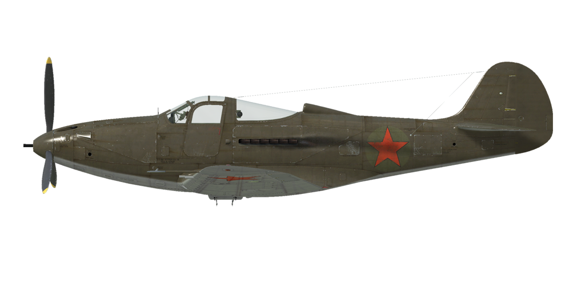

# P-39L-1
  

  

  

  
## Opis
  

  
Indicated stall speed in flight configuration: 153..176 km/h
  
Indicated stall speed in takeoff/landing configuration: 141..164 km/h
  

  
Dive speed limit: 860 km/h
  
Maximum load factor: 12.2 G
  
Stall angle of attack in flight configuration: 14 °
  
Stall angle of attack in landing configuration: 12.6 °
  

  
Maximum true air speed at sea level, engine mode - Take-off: 494 km/h
  
Maximum true air speed at 5000 m, engine mode - Take-off: 601 km/h
  

  
Service ceiling: 9200 m
  
Climb rate at sea level: 12.5 m/s
  
Climb rate at 3000 m: 10 m/s
  
Climb rate at 6000 m: 3.7 m/s
  

  
Maximum performance turn at sea level: 24.3 s, at 270 km/h IAS.
  
Maximum performance turn at 3000 m: 36.1 s, at 270 km/h IAS.
  

  
Flight endurance at 3000 m: 2.8 h, at 350 km/h IAS.
  

  
Takeoff speed: 160..190 km/h
  
Glideslope speed: 210..220 km/h
  
Landing speed: 140..145 km/h
  
Landing angle: 13.9 °
  

  
Note 1: the data provided is for international standard atmosphere (ISA).
  
Note 2: flight performance ranges are given for possible aircraft mass ranges.
  
Note 3: maximum speeds, climb rates and turn times are given for standard aircraft mass.
  
Note 4: climb rates are given for Take-off power, turn times are given for Maximum possible power.
  

  
Engine:
  
Model: V-1710-39
  
Maximum power in Maximum Possible power mode at sea level: 1470 HP
  
Maximum power in Take-off mode at sea level: 1150 HP
  
Maximum power in Nominal mode at sea level: 900 HP
  
Maximum power in Combat mode at 12000 feet: 1150 HP
  
Maximum power in Nominal mode at 10800 feet: 1000 HP
  

  
Engine modes:
  
Nominal (unlimited time): 2600 RPM, 37.2 inch Hg
  
Combat power (up to 5 minutes): 3000 RPM, 42 inch Hg
  
Take-off power (up to 2 minutes): 3000 RPM, 45.5 inch Hg
  
Maximum Possible power (prohibited by flight manual): 3000 RPM, 56.0 inch Hg
  

  
Water rated temperature in engine output: 105..115 °C
  
Water maximum temperature in engine output: 125 °C
  
Oil rated temperature in engine intake: 60..80 °C
  
Oil maximum temperature in engine intake: 95 °C
  

  
Supercharger gear shift altitude: single gear
  

  
Empty weight: 3073 kg
  
Minimum weight (no ammo, 10%25 fuel): 3264.2 kg
  
Standart weight: 3819.1 kg
  
Maximum takeoff weight: 4414 kg
  
Fuel load: 404 kg / 561 l
  
Useful load: 1341 kg
  

  
Forward-firing armament:
  
6 x 12.7mm machine gun "M2.50", 235 rounds, 850 rounds per minute, wing-mounted
  

  
Bombs:
  
254 kg general purpose bomb "FAB-250sv"
  
512 kg general purpose bomb "FAB-500M"
  

  
Rockets:
  
4 x 7 kg rockets "ROS-82", HE payload mass 2.52 kg
  

  
Length: 9.05 m
  
Wingspan: 11.4 m
  
Wing surface: 21.92 m²
  

  
Combat debut: December 1941
  

  
Operation features:
  
- There is War Emergency power mode. To engage it, move the throttle to max forward position and set the mxiture control to Full Rich (move it 90%25 forward to engage the Take-Off mode).
  
- Engine has a single stage mechanical supercharger which does not require manual control.
  
- Engine is equipped with an automatic fuel mixture control which maintains optimal mixture if mixture lever is set to Auto Rich (66%25) position. To use automatic mixture leaning to reduce fuel consumption during flight it is necessary to set mixture lever to Auto Lean (33%25) position. To stop the engine mixture lever should be set to the Cut Off (0%25) position. Full Rich positon is used during take-off, in case of emergency or automatic mixture system malfunction.
  
- Engine RPM has an automatic governor and it is maintained at the required RPM corresponding to the governor control lever position. The governor automatically controls the propeller pitch to maintain the required RPM. Also it is possible to turn off the governor and control propeller pitch manually.
  
- Water and oil temperatures are controlled manually by adjusting the outlet engine radiator shutters.
  
- Airplane has trimmers for all flight-controls: pitch, roll and yaw.
  
- Airplane has electrically-actuated landing flaps and they can be extended to any angle up to 43°.
  
- The nose gear orients by itself, doesnt have brakes and cant be controlled. Its maximum turn angle is 60° left or right.
  
- Airplane has independent left and right hydraulic wheel brake controls. To apply either brake push the upper part of the rudder pedal.
  
- Airplane is equipped with a parking brake system.
  
- Airplane has two fuel gauges which shows the level in each group of fuel tank.
  
- Although there are two cockpit doors equipped with window lifters, usually only the right one is used. They cant be opened during flight, but can be jettisoned to bail out.
  
- Airplane is equipped with mechanical releasing system for a single bomb.
  
- The gunsight has a sliding sun-filter. There is also a back-up mechanical sight which can be used if main sight is damaged.
  

  
## Modyfikacje
  

  

  
  
### Specjalna amunicja
  

  
Warianty wyposażenia: 37mm tylko naboje przeciwpancerne
  
  
### Additional M2 .30 cal MG ammo
  

  
1000 rounds per gun ammo load for 7.62 mm wing-mounted M2 .30 machine guns.
  
Additional mass: 83 kg
  
Estimated speed loss: 0 km/h
  

  
  
### bomba FAB-100M
  

  
bomba ogólnego przeznaczenia FAB-100M – 104 kg
  
Additional mass: 114 kg
  
Ammunition mass: 104 kg
  
Rack mass: 10 kg
  
Estimated speed loss before drop: 18 km/h
  
Estimated speed loss after drop: 3 km/h
  

  
  
### bomba FAB-250tsk
  

  
bomba ogólnego przeznaczenia FAB-250tsk – 254 kg
  
Additional mass: 264 kg
  
Ammunition mass: 254 kg
  
Rack mass: 10 kg
  
Estimated speed loss before drop: 19 km/h
  
Estimated speed loss after drop: 7 km/h
  

  
  
### Usunięcie M2 .50
  

  
Removal of 4 wing-mounted 7.62 mm machine guns and read armour plate to reduce total weight
  
Weight savings: 192 kg
  
Removed ammunition mass: 158 kg
  
Removed guns mass: 20 kg
  
Estimated additional speed: 3 km/h
  
  
### Bendix MN-26
  

  
Radiopółkompas służący do nawigacji z użyciem radiostacji prowadzących
  
Additional mass: 20 kg
  
Estimated speed loss: 2 km/h  