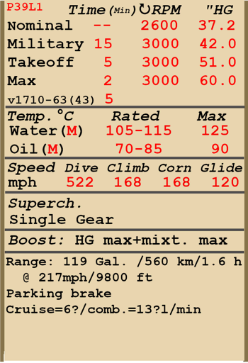

# P-39L-1  

<table><tbody><tr><td style="text-align: center"></td><td style="text-align: center"></td></tr></td></tr></tbody></table>  

Приборная скорость сваливания в полётной конфигурации: 160..172 км/ч  
Приборная скорость сваливания в посадочной конфигурации: 140..151 км/ч  
  
Предельная скорость в пикировании: 841 км/ч  
Разрушающая перегрузка: 13 единиц  
Угол атаки сваливания, в полётной конфигурации: 18,3 °  
Угол атаки сваливания, в посадочной конфигурации: 16,3 °  
  
Максимальная истинная скорость у земли, режим двигателя - взлётный: 539 км/ч  
Максимальная истинная скорость на высоте 2850 м, режим двигателя - взлётный: 600 км/ч  
Максимальная истинная скорость на высоте 4600 м, режим двигателя - боевой: 596 км/ч  
  
Практический потолок: 9300 м  
Скороподъёмность у земли: 16,7 м/с  
Скороподъёмность на высоте 3000 м: 13,5 м/с  
Скороподъёмность на высоте 6000 м: 7,2 м/с  
  
Время виража предельного по тяге у земли: 21,5 с, на скорости 270 км/ч по прибору  
Время виража предельного по тяге на высоте 3000 м: 30,3 с, на скорости 270 км/ч по прибору  
  
Продолжительность полёта на высоте 3000 м: 1,6 ч, на скорости 350 км/ч по прибору  
  
Скорость взлётная: 150..180 км/ч  
Скорость на глиссаде: 180..210 км/ч  
Скорость посадочная: 155..160 км/ч  
Посадочный угол: 17,0 °  
  
Примечание 1: данные указаны для условий международной стандартной атмосферы.  
Примечание 2: диапазоны характеристик даны для допустимого диапазона масс самолёта.  
Примечание 3: максимальные скорости, скороподъемности и время виража даны для стандартной массы самолёта.  
Примечание 4: скороподъемность и время виража даны на взлётном режиме работы двигателя.  
  
Двигатель:  
Модель: V-1710-63  
Максимальная мощность на чрезвычайном режиме у земли: 1550 л.с.  
Максимальная мощность на взлётном режиме у земли: 1325 л.с.  
Максимальная мощность на боевом режиме на высоте 12000 футов: 1150 л.с.  
Максимальная мощность на номинальном режиме на высоте 10800 футов: 1000 л.с.  
  
Режимы работы двигателя:  
Номинальный (время не ограничено): 2600 об/мин, 37,2 дюйм рт.ст.  
Боевой (до 15 минут): 3000 об/мин, 42 дюйм рт.ст.  
Взлётный (до 5 минут): 3000 об/мин, 51 дюйм рт.ст.  
Чрезвычайный (до 2 минут): 3000 об/мин, 60 дюйм рт.ст.  
  
Температура воды на выходе из двигателя номинальная: 105..115 °С  
Температура воды на выходе из двигателя предельная: 125 °С  
Температура масла на входе в двигатель номинальная: 60..80 °С  
Температура масла на входе в двигатель предельная: 95 °С  
  
Высота переключения нагнетателя: одна ступень  
  
Двигатель:  
Модель: V-1710-63 (1943)  
  
Режимы работы двигателя:  
Номинальный (время не ограничено): 2600 об/мин, 37,2 дюйм рт.ст.  
Боевой (до 30 минут): 3000 об/мин, 42 дюйм рт.ст.  
Взлётный (до 10 минут): 3000 об/мин, 51 дюйм рт.ст.  
Чрезвычайный (до 5 минут): 3000 об/мин, 60 дюйм рт.ст.  
  
Масса пустого самолёта: 2929 кг  
Минимальная масса (без БК, 10% топлива): 3331 кг  
Стандартная масса: 3508 кг  
Максимальная взлётная масса: 3868 кг  
Максимальный запас топлива: 326,9 кг / 454 л  
Максимальная полезная нагрузка: 939 кг  
  
Вооружение курсовое:  
37 мм пушка "М4", 30 снарядов, 150 выстр/мин, носовая  
2 x 12,7мм пулемёт "M2.50", 200 патронов, 850 выстр/мин, синхронизированный  
4 x 7,62мм пулемёт "M2.30", 300 или 1000 патронов, 1350 выстр/мин, крыльевой  
  
Вооружение бомбовое:  
104 кг осколочно-фугасная авиабомба "ФАБ-100М"  
254 кг осколочно-фугасная авиабомба "ФАБ-250св"  
  
Длина: 9,2 м  
Размах крыла: 10,4 м  
Площадь крыла: 19,82 кв.м  
  
Начало участия в боевых действиях: вторая половина 1942  
  
Особенности эксплуатации:  
- Двигатель самолёта имеет чрезвычайный режим. Для его использования необходимо передвинуть рычаг управления двигателем полностью "от себя" и установить рычаг управления смесью в положение Full Rich (для использования взлётного режима необходимо передвинуть РУД на 90% "от себя").  
- Двигатель оборудован одноступенчатым нагнетателем, который не требует ручного управления.  
- Самолёт оборудован автоматическим высотным корректором, который поддерживает оптимальный состав топливовоздушной смеси при нахождении рычага управления смесью в положении Auto Rich (2/3 хода рычага). Для снижения расхода топлива на маршруте можно воспользоваться режимом поддержания обедненного состава смеси, для чего необходимо установить рычаг в положение Auto Lean (1/3 хода рычага). Максимальное обогащение смеси осуществляется установкой рычага в положение Full Rich (рычаг полностью вперёд) и используется на взлётном или чрезвычайном режимах, а также при отказе автоматического регулирования состава смеси. Для остановки двигателя рычаг высотного корректора необходимо передвинуть полностью назад, в положение Cut Off.  
- Регулятор постоянных оборотов винта поддерживает заданные рычагом винта обороты мотора за счёт автоматического изменения шага винта. Также возможно отключить регулятор и управлять шагом винта вручную. Шаг винта меняется электроприводом.  
- Регулировка температуры масла и воды осуществляется вручную, путём открытия и закрытия выходных створок радиаторов двигателя.  
- Самолёт оснащён триммерами во всех трёх каналах управления.  
- Привод посадочных щитков электрический. Щитки можно выпустить на любой угол до 43°.  
- Самолёт имеет шасси с передней стойкой. Передняя стойка свободноориентируемая с максимальным углом поворота 60° в каждую сторону, управления и тормозов не имеет.  
- Самолёт имеет раздельное управление гидравлическими тормозами левого и правого колёс шасси. Торможение каждого колеса осуществляется нажатием на верхнюю часть соответствующей педали.  
- Самолёт оборудован стояночным тормозом.  
- Самолёт оснащён двумя топливомерами для двух секций баков.  
- Самолёт имеет двери для входа и выхода из кабины, обычно используется только правая дверь. Каждая дверь снабжена стеклом со стеклоподъёмником. В полёте двери не открываются. Конструкция дверей предусматривает их аварийный сброс для покидания лётчиком самолёта в полёте.  
- Самолёт оборудован ручным механизмом для сброса единственной бомбы.  
- Прицел имеет поворотный светофильтр. На капоте также установлен дублирующий механический прицел, который используется при повреждении основного прицела.  
  
Основные данные и рекомендуемые положения органов управления самолётом:  
1. Запуск двигателя:  
	- рекомендуемое положение рукояти управления смесью: Auto Rich (автоматическое управление смесью)  
	- рекомендуемое положение рукояти управления радиаторами: закрыто  
	- рекомендуемое положения рукояти управления шагом: 100%  
	- рекомендуемое положение рычага управления двигателем: 10%  
	- перед рулением необходимо снять самолёт со стояночного тормоза  
  
2. Рекомендуемые положения рукояти смеси при различных режимах полёта: Auto Rich (автоматическое управление смесью)  
  
3.1 Рекомендуемые положения рукояти управления маслорадиатором при различных режимах полёта:  
	- взлёт: открыто 50%  
	- набор высоты: открыто 100%  
	- крейсерский полёт: открыто 40%  
	- бой: открыто 100%  
  
3.2 Рекомендуемые положения рукояти управления водорадиатором при различных режимах полёта:  
	- взлёт: открыто 50%  
	- набор высоты: открыто 100%  
	- крейсерский полёт: открыто 40%  
	- бой: открыто 80%  
  
4. Ориентировочный расход топлива на различных режимах работы на высоте 2000 м:  
	- крейсерский режим работы двигателя: 15,2 л/мин  
	- боевой режим работы двигателя: 24,1 л/мин  

## Модификации  

### Специальная зарядка 37мм пушки  

Дополнительный вариант зарядки 37мм пушки M4 только бронебойными снарядами, поставки которых по ленд-лизу были ограничены  
  
### Увеличенный боезапас пулемётов  

Увеличенный до 1000 патронов на ствол боезапас крыльевых 7.62мм пулемётов M2 .30  
Дополнительная масса: 83 кг  
Ориентировочная потеря скорости: 0 км/ч  

### Двигатель V-1710-63 (1943)  

Двигатель V-1710-63 (1943)  
Двигатель с усиленными подшипниками коленвала.  
Улучшения в конструкции двигателя позволяют увеличить допустимое время работы на чрезвычайных режимах:  
До 30 минут: 3000 об/мин, 42.0 дюйм рт.ст.  
До 10 минут: 3000 об/мин, 51.0 дюйм рт.ст.  
До 5 минут: 3000 об/мин, 60.0 дюйм рт.ст.  

### ФАБ-100М  

104 кг осколочно-фугасная авиабомба ФАБ-100М  
Дополнительная масса: 114 кг  
Масса вооружения: 104 кг  
Масса держателя: 10 кг  
Ориентировочная потеря скорости до сброса: 18 км/ч  
Ориентировочная потеря скорости после сброса: 3 км/ч  

### ФАБ-250цк  

254 кг осколочно-фугасная авиабомба ФАБ-250цк  
Дополнительная масса: 264 кг  
Масса вооружения: 254 кг  
Масса держателя: 10 кг  
Ориентировочная потеря скорости до сброса: 19 км/ч  
Ориентировочная потеря скорости после сброса: 7 км/ч  
  
### Снятие пулемётов M2 .30  

Снятие четырех 7.62 мм крыльевых пулемётов и задней бронеплиты для облегчения самолёта  
Уменьшение массы: 192 кг  
Масса снимаемого боекомплекта: 158 кг  
Масса снимаемых орудий: 20 кг  
Ориентировочный выигрыш в скорости: 3 км/ч  
  
### Bendix MN-26  

Радиополукомпас для навигации по радиомаякам  
Дополнительная масса: 20 кг  
Ориентировочная потеря скорости: 2 км/ч  
