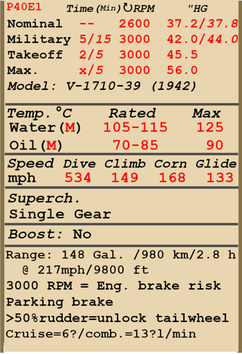

# P-40E-1  

| Image | Notes  
|:---|:---  
|  |   

## 描述  

飞行构型的失速指示空速：153~176 km/h  
起降构型的失速指示空速：141~164 km/h  
  
俯冲极速：860 km/h  
最大过载：12.2 G  
飞行构型失速迎角：14 °  
着陆构型失速迎角：12.6 °  
  
最大真空速，高度海平面，发动机模式——起飞：494 km/h  
最大真空速，高度5000m，发动机模式——起飞：601 km/h  
  
实用升限：9200 m  
海平面爬升率：12.5 m/s  
3000m时爬升率：10 m/s  
6000m时爬升率：3.7 m/s  
  
海平面最大性能盘旋时间：24.3 s，指示空速 270 km/h。  
3000m时最大性能盘旋时间：36.1 s，指示空速 270 km/h。  
  
3000m（9843 feet）时续航时间：2.8h，指示空速 350 km/h。  
  
起飞速度：160~190 km/h  
进近速度：210~220 km/h  
着陆速度：140~145 km/h  
着陆迎角：13.9 °  
  
注1：所提供的数据适用于国际标准大气（ISA）。  
注2：飞行性能范围基于可能的飞机质量范围。  
注3：极速、爬升率和盘旋时间基于标准飞机质量。  
注4：爬升率基于起飞动力，盘旋时间基于最大可能动力。  
  
发动机：  
型号：V-1710-39  
海平面最大可能动力模式下的最大功率：1470 HP  
海平面起飞模式下的最大功率 1150 HP  
海平面标称动力模式下的最大功率：900 HP  
战斗模式下的最大功率，高度12000 feet：1150 HP  
标称模式下的最大功率，高度10800 feet：1000 HP  
  
发动机模式：  
标称（无时间限制）：2600 RPM，37.2 inch Hg  
战斗（不超过5min）：3000 RPM，42 inch Hg  
起飞动力（不超过2min）：3000 RPM，45.5 inch Hg  
最大可能动力（飞行手册禁止）：3000 RPM，56.0 inch Hg  
  
发动机液冷出水口额定水温：105~115 °C  
发动机液冷出水口最高水温：125 °C  
发动机滑油进油口额定油温：70~85 °C  
发动机滑油进油口最高油温：90 °C  
  
机械增压器换挡高度：单级  
  
发动机：  
型号：V-1710-39(1942)  
  
发动机模式：  
标称（无时间限制）：2600 RPM，37.8 inch Hg  
战斗（不超过15min）：3000 RPM，44.2 inch Hg  
起飞动力（不超过5min）：3000 RPM，45.5 inch Hg  
最大可能动力（不超过5min）：3000 RPM，56.0 inch Hg  
  
空重：3073 kg  
最小重量（无弹药、10%燃油）：3264.2 kg  
标准重量：3819.1 kg  
最大起飞重量：4414 kg  
燃油载荷：404 kg/561 L  
有效载荷：1341 kg  
  
前射武器：  
6 x 12.7mm机枪"M2.50"，235发，850发/分，机翼安装  
  
炸弹：  
254kg 通用炸弹"FAB-250sv"  
512kg 通用炸弹"FAB-500M"  
  
火箭弹：  
4 x 7 kg“ROS-82”火箭弹，榴弹装载质量2.52 kg  
  
长度：9.05 m  
翼展：11.4 m  
机翼面积：21.92 m²  
  
首次投入战斗：1941年12月  
  
操作特性：  
—发动机没有进气压力自动调节器。因此进气压力不仅取决于油门位置，还取决于转速和高度。这需要额外检查进气压力，以免导致发动机受损。  
—发动机为单级机械增压，无需手动操作。  
—发动机装有自动燃油混合比控制装置，如果混合比杆设置为自动富油（66%）位置，其会保持最优混合比。要使用自动混合比贫油来降低飞行中油耗，需要把混合比杆设置到自动贫油（33%）位置。如果遇到自动混合比控制故障，混合比杆应设置到完全富油（100%）位置。如要关闭发动机，混合比杆应设置为关断（0%）位置。  
—发动机转速有自动调节器，其根据调节器控制杆位置保持对应的需用转速。调节器自动控制螺旋桨桨距来保持需用转速。也可以关闭调节器手动控制桨距。  
—水冷和滑油散热器会和发动机散热器排气风门一起联动并且由手动操作。  
—飞机的偏航稳定性很低。当侧滑角大于12°时，飞机的偏航变得不稳定，并开始自动增加侧滑角。因此，必须准确操作方向舵脚蹬并注意侧滑仪。  
—飞机的所有飞行操纵均有配平：俯仰、滚转和偏航。  
—着陆襟翼由液压机构控制，可展开至0-45°之间的任意角度。  
—飞机有尾轮控制系统，如果蹬舵超过行程一半，尾轮解锁。如果脚蹬偏转不超过一半，则尾轮保持锁定。因此，在高速移动时应避免猛踩舵。  
—飞机有独立的左右液压机轮刹车。要使用刹车，踩下方向舵脚蹬的上部。  
—飞机装有停放刹车系统。  
—飞机有三个油量表，显示各个油箱的油量。  
—由于强气流，高速时无法开闭座舱盖。座舱盖配有紧急抛弃系统，用于跳伞。  
—飞机装有单个炸弹的机械投放系统。  
—当火箭弹被安装上后会有一个齐射控制功能，它有三种发射模式：单发，双发齐射，和四发齐射。  
—射击瞄准具拥有一个滑动式的太阳滤光片。还有一个备份的机械瞄准具，可以在主瞄准具损坏时使用。  
  
Basic data and recommended positions of the aircraft controls:  
1. Starting the engine:  
	- recommended position of the mixture control lever: Auto Rich (auto mixture control)  
	- recommended position of the cowl flap control handle: close  
	- recommended position of the prop pitch control handle: 100%  
	- recommended position of the throttle lever: 20%  
	- before taxiing, the parking brake must be released  
  
2. Recommended mixture control lever positions for various flight modes: Auto Rich (auto mixture control)  
  
3 Recommended positions of cowl flaps for various flight modes:  
	- takeoff: open 50%  
	- climb: open 100%  
	- cruise flight: open 15% (in winter conditions - close if necessary)  
	- combat: open 50%  
  
4. Approximate fuel consumption at 2000 m altitude:  
	- Cruise engine mode: 15.2 l/min  
	- Combat engine mode: 24.1 l/min  

## 修改  
### 额外ANM2 .50口径机枪弹药  

机枪的外弹药：内侧312发，中间291发，外侧240发（替换原来的每挺235发）或4x机枪每挺备弹615发。  
  
6机关枪：  
增加质量：38 kg  
预期速度损失：0 km/h  
  
4机关枪：  
增加质量：207 kg  
预期速度损失：2 km/h  
  
### V-1710-39 (1942) engine  

V-1710-39 (1942) engine  
Engine with reinforced crankshaft bearings.  
Additional mass: 0 kg  
Retuned to increase boost:  
Up to 15 minutes: 3000 RPM, 44.2 inch Hg  
Up to 5 minutes: 3000 RPM, 56.0 inch Hg  
预期海平面增速：44 km/h  

### FAB-250sv炸弹  

254kg 通用炸弹FAB-250sv  
增加质量：264 kg  
弹药质量：254 kg  
挂架质量：10 kg  
投弹前预期速度损失：19 km/h  
投弹后预期速度损失：7 km/h  

### FAB-500M炸弹  

522kg 通用炸弹FAB-500M  
增加质量：522 kg  
弹药质量：512 kg  
挂架质量：10 kg  
投弹前预期速度损失：36 km/h  
投弹后预期速度损失：7 km/h  

### 4 x ANM2 .50口径机枪  

移除外侧2挺翼装机枪以降低总重  
减少质量：156 kg  
减少弹药质量：64 kg  
减少枪炮质量：92 kg  
预期速度提升：3 km/h  

### 后视镜  

后视镜  
增加质量：1 kg  
预期速度损失：2 km/h  
  
### 4 x ROS-82火箭弹  

4 x 82mm高爆无制导火箭弹ROS-82  
增加质量：40 kg  
弹药质量：28 kg  
挂架质量：12 kg  
发射前预期速度损失：13 km/h  
发射后预期速度损失：10 km/h  
