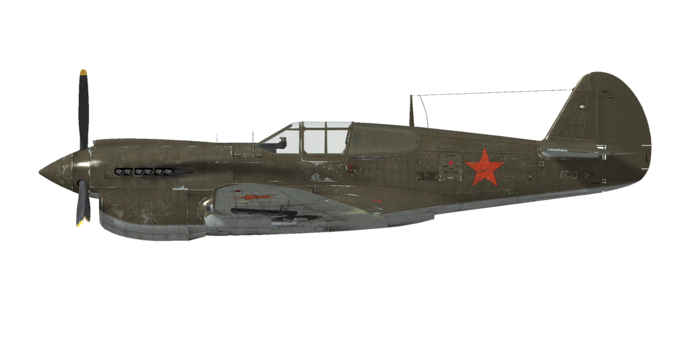

# P-40E-1  
  
  
  
## Descripción  
  
Velocidad indicada de pérdida en configuración de vuelo: 153..176 km/h  
Velocidad indicada de pérdida en configuración de despegue/aterrizaje: 141..164 km/h  
Velocidad de picado límite: 860 km/h  
Carga de rotura máxima (en fuerzas <i>g</i>): 12,2 <i>g</i>  
Ángulo de ataque crítico en configuración de vuelo: 14°  
Ángulo de ataque crítico en configuración de aterrizaje: 12,6°  
  
Velocidad respecto al suelo al nivel del mar, modo motor - Despegue: 494 km/h  
Velocidad máxima respecto al suelo a 5000 m, modo motor - Despegue: 601 km/h  
  
Techo de servicio: 9200 m  
Tasa de ascenso al nivel del mar: 12,5 m/s  
Tasa de ascenso a 3000 m: 10 m/s  
Tasa de ascenso a 6000 m: 3,7 m/s  
  
Viraje de máximo rendimiento al nivel del mar: 24,3 s, a 270 km/h velocidad indicada (IAS).  
Viraje de máximo rendimiento a 3000 m: 36,1 s, a 270 km/h velocidad indicada (IAS).  
  
Autonomía de vuelo a 3000 m: 2,8 h, a 350 km/h velocidad indicada (IAS).  
  
Velocidad de despegue: 160..190 km/h  
Velocidad senda de planeo: 210..220 km/h  
Velocidad de aterrizaje: 140..145 km/h  
Ángulo de aterrizaje: 13,9°  
  
Nota 1: los datos están basados en la atmósfera estándar internacional (ISA).  
Nota 2: diferentes rendimientos de vuelo dados para los diferentes pesos posibles del avión.  
Nota 3: velocidades máximas, tasas de ascenso y tiempos de giro dados para el peso estándar del avión.  
Nota 4: tasas de ascenso dadas para la potencia de Ascenso; tiempos de giro dados para la Máxima potencia posible.  
  
Motor:  
Modelo: V-1710-39  
Potencia máxima en modo de Máxima potencia posible al nivel del mar: 1470 CV  
Potencia máxima en modo Despegue al nivel del mar: 1150 CV  
Potencia máxima en modo Continuo al nivel del mar: 900 CV  
Potencia máxima en modo Combate a 12000 ft: 1150 CV  
Potencia máxima en modo Continuo a 10800 ft: 1000 CV  
  
Modos de funcionamiento motor:  
Continuo (sin límite de tiempo): 2600 rpm, 37,2 inHg  
Combate (hasta 5 minutos): 3000 rpm, 42 inHg  
Despegue (hasta 2 minutos): 3000 rpm, 45,5 inHg  
Máxima potencia posible (prohibida por el manual de vuelo): 3000 rpm, 56,0 inHg  
  
Temperatura nominal del agua en la salida del motor: 105..115 °C  
Temperatura máxima del agua en la salida del motor: 125 °C  
Temperatura nominal del aceite en la admisión del motor: 70..85 °C  
Temperatura máxima del aceite en la admisión del motor: 90 °C  
  
Altitud de cambio de etapa del compresor: una sola etapa  
  
Peso vacío: 3073 kg  
Peso mínimo (sin munición, 10% de combustible): 3264,2 kg  
Peso estándar: 3819,1 kg  
Peso máximo al despegue: 4414 kg  
Carga de combustible: 404 kg / 561 l  
Carga útil: 1341 kg  
  
Armamento delantero:  
6 ametralladoras de 12,7 mm «M2,50», 235 balas, 850 balas por minuto, montadas en ala  
  
Bombas:  
1 bomba de propósito general de 254 kg «FAB-250sv»  
1 bomba de propósito general de 512 kg «FAB-500M»  
  
Cohetes:  
4 cohetes de 7 kg «ROS-82», 2,52 kg de carga HE (altamente explosiva)  
  
Longitud: 9,05 m  
Envergadura alar: 11,4 m  
Superficie de ala: 21,92 m²  
  
Debut en combate: octubre de 1940  
  
Características operativas:  
- El motor no tiene regulador automático de la presión en el colector. Esta presión no depende solo de la posición de la palanca de potencia, sino también de las rpm y la altitud. Por ello, es necesario revisar a menudo la presión en el colector para no dañar el motor.  
- El motor tiene un compresor mecánico de una sola etapa, por lo que no necesita control manual.  
- El motor está equipado con un sistema de control automático de la mezcla que la mantiene en su grado óptimo cuando la palanca de control de la mezcla está en la posición «Auto Rich» (66%). Para usar el empobrecimiento automático de la mezcla y reducir el consumo de combustible durante el vuelo es necesario fijar la palanca en la posición «Auto Lean» (33%). En caso de mal funcionamiento del control automático de la mezcla la palanca debería situarse en la posición «Full Rich» (100%). Para apagar el motor, la palanca debe situarse en la posición «Cut Off» (0%).  
- El motor tiene un regulador automático de las rpm que las mantiene al valor correspondiente a la posición de la palanca de control del regulador. Este regulador controla automáticamente el paso de la hélice para mantener las rpm requeridas. Es posible apagar el regulador y controlar el paso de la hélice manualmente.  
- Las persianas de los radiadores de agua y aceite están unidas a las persianas de salida del carenado del motor y se controlan de forma manual.  
- El avión tiene un margen de estabilidad muy pequeño en la guiñada. Cuando el ángulo del derrape es mayor de 12º el avión se vuelve inestable en la guiñada y comienza a incrementar el ángulo de derrape por sí mismo. Por este motivo es necesario manejar con precisión los pedales del timón y prestar atención al indicador de derrape.  
- El avión tiene compensadores para todos los controles de vuelo: cabeceo, alabeo y guiñada.  
- Los flaps tienen un accionador hidraúlico y pueden bajarse gradualmente hasta formar un ángulo de 45°.  
- El avión  cuenta con un sistema de bloqueo de la rueda de cola mediante el timón, de tal manera que se desbloquea cuando el pedal del control del timón se mueve más de la mitad de su rango. La rueda permance bloqueada si los pedales se mueven menos de la mitad de su rango. A causa de ésto, es necesario evitar grandes movimientos de los pedales del timón a altas velocidades.  
- El avión posee unos controles hidráulicos independientes para el frenado de la rueda izquierda y derecha. Para frenar cada una de ellas es necesario empujar la parte superior del pedal del control de timón correspondiente.  
- El avión está equipado con un sistema de freno de estacionamiento.  
- El avión cuenta con tres indicadores del nivel de combustible remanente de cada uno de los depósitos.  
- Es imposible abrir o cerrar la cubierta a altas velocidades debido a la intensidad del flujo del aire. La cubierta tiene un sistema de desbloqueo de emergencia para facilitar el salto.  
- El avión está equipado con un sistema de lanzamiento mecánico para una sola bomba.  
- Cuando hay cohetes instalados existe un mando de lanzamiento con tres modos disponibles: disparar uno, disparar dos en ráfaga o disparar cuatro en ráfaga.  
- La mira tiene un filtro solar deslizante. También cuenta con una mira mecánica de respaldo que puede emplearse si la mira principal está dañada.  
  
## Modificaciones  
  
  
### Munición adicional ANM2 cal .50  
  
Munición adicional para ametralladoras: 312 para las interiores, 291 para las del medio, 240 para las exteriores (en lugar de 235 para cada una de las 6) o 615 para cada una con 4 ametralladoras.  
  
6 ametralladoras:  
Peso adicional: 38 kg  
Pérdida de velocidad estimada: 0 km/h  
  
4 ametralladoras:  
Peso adicional: 207 kg  
Pérdida de velocidad estimada: 2 km/h  
  
### 1 bomba FAB-250sv  
  
1 bomba de propósito general de 254 kg FAB-250sv  
Peso adicional: 264 kg  
Peso de munición: 254 kg  
Peso de los soportes: 10 kg  
Pérdida de velocidad estimada antes de soltar: 19 km/h  
Pérdida de velocidad estimada tras soltar: 7 km/h  
  
### 1 bomba FAB-500M  
  
1 bomba de propósito general de 512 kg FAB-500M  
Peso adicional: 522 kg  
Peso de munición: 512 kg  
Peso de los soportes: 10 kg  
Pérdida de velocidad estimada antes de soltar: 36 km/h  
Pérdida de velocidad estimada tras soltar: 7 km/h  
  
### 4 ametralladoras ANM2 cal .50   
  
Desinstalación de las 2 ametralladoras exteriores montadas en las alas para reducir el peso total  
Peso retirado: 156 kg  
Peso de munición retirada: 64 kg  
Peso del armamento retirado: 92 kg  
Ganancia de velocidad estimada: 3 km/h  
  
### Espejo  
  
Espejo para ver qué sucede detrás del avión  
Peso adicional: 1 kg  
Pérdida de velocidad estimada: 2 km/h  
  
### 4 cohetes ROS-82  
  
4 cohetes no guiados explosivos (HE) de 82 mm ROS-82  
Peso adicional: 40 kg  
Peso de munición: 28 kg  
Peso de los soportes: 12 kg  
Pérdida de velocidad estimada antes de lanzarlos: 13 km/h  
Pérdida de velocidad estimada tras lanzarlos: 10 km/h  