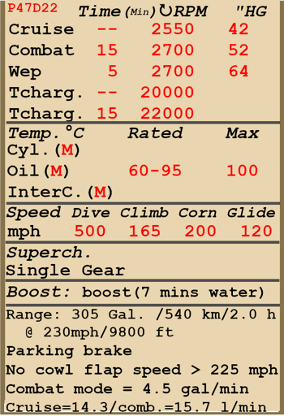

# P-47D-22  

<table><tbody><tr><td style="text-align: center"></td><td style="text-align: center"></td></tr></tbody></table>  

- Dokument 01 [ [eng](../real_manuals/p47d22.01.eng.pdf) ]   
- Dokument 02 [ [eng](../real_manuals/p47d22.02.eng.pdf) ]   

## Beschreibung  

Überziehgeschwindigkeit in Flugkonfiguration: 175..212 km/h (109..131 mph)  
Überziehgeschwindigkeit in Landekonfiguration: 143..174 km/h (89..108 mph)  
  
Höchstzulässige Geschwindigkeit im Sturzflug: 805 km/h (500 mph)  
Bruchlastvielfache: 11,0 G  
Kritischer Anstellwinkel in Flugkonfiguration: 16,2 °  
Kritischer Anstellwinkel in Landekonfiguration: 15,4 °  
  
Höchstgeschwindigkeit in Bodennähe, Sondernotleistung: 575 km/h (357 mph)  
Höchstgeschwindigkeit in 7000 m (22960 Fuß) Höhe, Sondernotleistung: 727 km/h (451 mph)  
  
Höchstgeschwindigkeit in Bodennähe, Kampfleistung: 518 km/h (322 mph)  
Höchstgeschwindigkeit in 9000 m (29530 Fuß) Höhe, Kampfleistung: 685 km/h (426 mph)  
  
Höchstgeschwindigkeit in Bodennähe, Nennleistung: 485 km/h (301 mph)  
Höchstgeschwindigkeit in 10000 m (32800 Fuß) Höhe, Nennleistung: 651 km/h (404 mph)  
  
Dienstgipfelhöhe: 11580 m (38000 Fuß)  
  
Steigleistung mit Sondernotleistung:  
Steigleistung in Bodennähe: 18,5 m/s (3642 Fuß/min)  
Steigleistung in 3000 m (9843 Fuß) Höhe: 18,1 m/s (3559 Fuß/min)  
Steigleistung in 6000 m (19685 Fuß) Höhe: 16,9 m/s (3338 Fuß/min)  
  
Steigleistung mit Kampfleistung:  
Steigleistung in Bodennähe: 12,6 m/s (2480 Fuß/min)  
Steigleistung in 3000 m (9843 Fuß) Höhe: 11,9 m/s (2342 Fuß/min)  
Steigleistung in 6000 m (19685 Fuß) Höhe: 10,7 m/s (2106 Fuß/min)  
  
Maximale Wendegeschwindigkeit in Bodennähe: 27,0 s, bei 322 km/h (200 mph) IAS.  
Maximale Wendegeschwindigkeit in 3000 m (9843 Fuß) Höhe: 30,0 s, bei 330 km/h (205 mph) IAS.  
  
Reichweite in 3000 m: (9843 Fuß): 2 h, bei 370 km/h (230 mph) IAS.  
  
Startgeschwindigkeit: 177..210 km/h (110..130 mph)  
Anfluggeschwindigkeit: 179..220 km/h (111..135 mph)  
Landegeschwindigkeit: 175..205 km/h (110..127 mph)  
Sinkflugpfad: 11,9 °  
  
Anmerkung 1: Die Werte gelten für Normatmosphäre (ISA).  
Anmerkung 2: Flugleistungen varrieren je nach Abfluggewicht.  
Anmerkung 3: Höchstgeschwindigkeiten, Steigleistungen und Wendegeschwindigkeiten gelten für Standardflugzeugmasse und 50% Treibstoff.  
Anmerkung 4: Wendegeschwindigkeiten gelten für Sondernotleistung.  
  
Triebwerk:  
Baumuster: R-2800-59  
Sondernotleistung in Bodennähe: 2600 PS  
Kampfleistung in Bodennähe: 1950 PS  
Nennleistung in Bodennähe: 1620 PS  
  
Sondernotleistung in 7000 m (22970 Fuß) Höhe: 2600 PS  
Kampfleistung in 9000 m (29530 Fuß) Höhe: 1900 PS  
Nennleistung in 10500 m (34450 Fuß) Höhe: 1600 PS  
  
Leistungsstufen:  
Nennleistung (unbegrenzt): 2550 U/min, 42,0 inch Hg  
Kampfleistung (bis zu 15 Minuten): 2700 U/min, 52 inch Hg  
Sondernotleistung (bis zu 5 Minute): 2700 U/min, 64,0 inch Hg  
  
Drehzahl des Turboladers (unbegrenzt): 20000  
Drehzahl des Turboladers (bis zu 15 Minuten): 22000  
  
Schmierstoffeintrittstemperatur (normal): 60..95 °C  
Schmierstoffeintrittstemperatur (höchstens): 100 °C  
  
Laderumschalthöhe: Einganglader  
  
Leergewicht: 4665 kg (10285 lb)  
Minimalgewicht (keine Munition, 10% Treibstoff, 4 MG entfernt): 5033 kg (11096 lb)  
Normalgewicht: 6213 kg (13697 lb)  
Höchstabfluggewicht: 7867 kg (17343 lb)  
Kraftstoffmenge: 829 kg (2551 lb) / 1155 l (305 gal)  
Nutzlast: 3202 kg (7058 lb)  
  
Starre Schusswaffenanlage:  
6 x 12,7mm .50 Browning AN/M2, 267 Schuss, 850 Schuss pro Minute, flügelmontiert  
Es ist möglich, 2 oder 4 Maschinengewehre zu entfernen und / oder den Munitionsvorrat auf 425 Schuss pro Maschinengewehr zu erhöhen.  
  
Abwurfwaffen:  
Bis zu 3 M64-Sprengbomben 500 lb  
Bis zu 2 M65-Sprengbomben 1000 lb  
  
Raketen:  
6 x Ungelenkte Raketen "M8" in zwei Werfern "M10", die abgeworfen werden können.  
  
Länge: 11,00 m (36,09 Fuß)  
Spannweite: 12,43 m (40.78 Fuß)  
Flügelfläche: 27,87 m² (300 Fuß²)  
  
Erster Fronteinsatz: 1944  
  
Eigenschaften:  
- Zusätzlich zum automatischen einstufigen Kompressor ist der Motor mit dem Turbolader ausgestattet, den der Pilot steuern kann.  
- Der Turbolader wird vom Abgasgegendruck des Motors angetrieben, der über den Hebel im Cockpit eingestellt und über die Drosselklappen an den Abgasleitungen automatisch beibehalten werden kann.  
- Die im Turbolader komprimierte Luft gelangt zum Ladeluftkühler, wo sie durch den einströmenden Luftstrom gekühlt wird. Die gekühlte und komprimierte Luft gelangt zum Vergaser und das entstehende Kraftstoff-Luft-Gemisch zum Kompressor.  
- Die Temperatur der Luft nach dem Ladeluftkühler wird auf einem separaten Instrument angezeigt. Der Pilot kann die Ladeluftkühlerklappen mit dem Kippschalter steuern und ihre Position mit Hilfe der Anzeige auf der linken Seite beobachten. Ihre Standardposition ist neutral (50%).  
- Die Drehzahl des Turboladers wird über den Hebel im Cockpit gesteuert ("Left Shift" und "+"/"-" Tasten standardmäßig). In der hinteren Hebelstellung sind die Drosselklappen vollständig geöffnet und die Abgase gehen alle in die Atmosphäre, was zu minimalen Turboladerdrehzahlen führt. In der vorderen Hebelstellung sind der Abgasgegendruck und die daraus resultierende Turboladerdrehzahl maximal. Es ist zu beachten, dass sich die Drehzahl mit der Höhe ändert, auch wenn der Hebel in der gleichen Position gehalten wird. Die Drehzahl des Turboladers wird auf der entsprechenden Anzeige angezeigt.  
- Die gesamte Motorleistung sollte nach der Methode gesteuert werden, bei der die drei Hebel - Drehzahlhebel, Gashebel und Turboladerhebel - miteinander verbunden sind. In bestimmten Fällen (z.B. bei Überschreitung der kritischen Höhe) sollte der Turboladerhebel jedoch separat eingestellt werden.  
- Es ist zu beachten, dass sich die Drehzahl des Turboladers relativ langsam und nicht unmittelbar nach der Einstellung des Steuerhebels ändert.  
- Das Flugzeug ist mit einem Wassereinspritzsystem ausgestattet, das die Leistung im Notfallmodus erhöht. Wenn dieses System aktiviert ist, erhöhen sich Abgasgegendruck und Turboladerdrehzahl automatisch, während das Gemisch magerer wird. Die Wasserversorgung reicht für ca. 7 Minuten bei Notleistung.  
- Der Motor ist mit einer automatischen Gemischregelung ausgestattet, die das optimale Gemisch beibehält, wenn sich der Gemischhebel in der Auto Rich Position (85%) befindet. Um die automatische Gemischabmagerung zur Reduzierung des Spritverbrauchs im Flug zu nutzen, muss sich der Gemischhebel in der Auto Lean Position (60%) befinden. Im Falle einer Fehlfunktion der automatischen Gemischregelung sollte der Gemischhebel in die Full Rich Position (100%) gebracht werden. Um den Motor zu stoppen, sollte der Gemischhebel in die Cut Off Position (0%) gebracht werden.  
- Der Motor besitzt eine automatische Drehzahlregelung, welche die Motordrehzahl je nach Hebelstellung festlegt. Der Regler verstellt automatisch den Anstellwinkel des Propellers um die erforderliche Drehzahl einzuhalten.  
- Wasserkühlerund Ölkühlerklappen sind mit den Auslass-Kühlklappen verbunden und werden manuell bedient.  
- Das Flugzeug verfügt über Höhen-, Seitenund Querrudertrimmung.  
- Die Landeklappen haben eine hydraulische Steuerung und können stufenlos bis auf 40°.  
- Es ist verboten, die Kühlklappen bei Geschwindigkeiten über 225 mph zu öffnen, scharfe Manöver mit den geöffneten Kühlklappen durchzuführen und mit den geöffneten Ladeluftkühlerklappen zu stürzen.  
- Das Flugzeug hat eine manuelle Spornradverriegelung. Das Spornrad sollte bei längerem Geradeausrollen, sowie beim Abflug und bei der Landung verriegelt werden.  
- Das Flugzeug hat links und rechts unabhängig gesteuerte hydraulische Bremsen. Um die Bremsen zu betätigen, muss der obere Teil der Ruderpedale nach vorne gedrückt werden.  
- Das Flugzeug ist mit einer Parkbremse ausgestattet.  
- Die Signallampe leuchtet auf, wenn das Fahrwerk eingefahren ist und sich der Schubhebel in der hinteren Position befindet, oder wenn das Fahrwerk ausgefahren ist, aber sich der Schubhebel in der vorderen Position befindet.  
- Es ist zu beachten, dass das Flugzeug eine lange Startstrecke benötigt - etwa 650 Meter bei Standardlast und 1500 Meter bei maximalem Startgewicht. Es ist erlaubt, die Klappen auf 10-20 Grad abzusenken, um die Startstrecke zu verkürzen.  
- Das Flugzeug ist mit einer Kraftstoffanzeige, aber zwei Anzeigenadeln für den vorderen und hinteren Kraftstofftank ausgestattet.  
- Der Motor verbraucht bei Kampfleistung viel Kraftstoff - etwa 4,5 Gallonen pro Minute.  
- Die Cockpithaube kann für den Notausstieg abgeworfen werden.  
- Das Flugzeug ist mit einem manuellen Bombenabwurfsystem für jeden der drei Bombenträger ausgestattet.  
- Die ungelenkten Raketen werden mit einem elektrischen Regler gestartet, der den Start der Raketen im Einzel-, Paar-, Dreier- und Salvenmodus (alle Raketen im Abstand von 0,1 Sekunden) ermöglicht.  
- Für den Fall, dass das Visier beschädigt wird, steht ein mechanisches Hilfsvisier zur Verfügung.  
  
Basic data and recommended positions of the aircraft controls:  
1. Starting the engine:  
	- recommended position of the mixture control lever:  Auto Rich (auto mixture control)  
	- recommended position of the radiator/cowl flap control handle: open 50%  
	- recommended position of the prop pitch control handle: 100%  
	- recommended position of the throttle lever: 10%  
	- before taxiing, you must unlock the tailwheel  
	- before taxiing, the parking brake must be released  
  
2. Recommended mixture control lever positions for various flight modes: Auto Rich (auto mixture control)  
  
3.1 Recommended positions of cowl flaps for various flight modes:  
	- takeoff: open 50%  
	- climb: open 100%  
	- cruise flight: close  
	- combat: open 50%  
  
3.2 Recommended positions of the oil radiator control handle for various flight modes:  
	- takeoff: open 50%  
	- climb: open 100%  
	- cruise flight: close  
	- combat: open 50%  
  
4. Approximate fuel consumption at 2000 m altitude:  
	- Cruise engine mode: 14.3 l/min  
	- Combat engine mode: 15.7 l/min  

## Änderungen  
### 150-Oktan-Kraftstoff  

150-Oktan-Kraftstoff, der einen erhöhten Ladedruck bis 70 inch erlaubt.  
  
### Zusätzliche Munition für .50 Browning  

Zusätzliche Munition für die 12,7 mm ".50 Browning AN/M2" Maschinengewehre: 425 Schuss für jedes MG.  
  
8 Maschinengewehre:  
Zusätzliches Gewicht: 178,2 kg (393 lbs)  
Geschwindigkeitsverlust: 1 km/h  
  
6 Maschinengewehre:  
Zusätzliches Gewicht: 133,6 kg (294.8 lbs)  
Geschwindigkeitsverlust: 0 km/h  
  
4 Maschinengewehre:  
Zusätzliches Gewicht: 89,1 kg (196.5 lbs)  
Geschwindigkeitsverlust: 0 km/h  
  
### Jadgbomber-Modifikation  

Flügel- und Rumpfhalterungen für Bomben und Raketen  
  
Halterungen alleine:  
  
Gewicht der Bombenhalterungen: 30 kg (66,2 lbs)  
Geschwindigkeitsverlust: 7 km/h (4,4 mph)  
  
3 x M64-Sprengbomben 500 lb:  
  
Zusätzliches Gewicht: 792 kg (1746,4 lbs)  
Gewicht der Munition: 762 kg (1680,2 lbs)  
Gewicht der Abwurfwaffenroste: 30 kg (66,2 lbs)  
Geschwindigkeitsverlust vor Abwurf: 35 km/h (21,8 mph)  
Geschwindigkeitsverlust nach Abwurf: 12 km/h (7,5 mph)   
  
2 x M65-Sprengbomben 1000 lb:  
  
Zusätzliches Gewicht: 1054 kg (2324,1 lbs)  
Gewicht der Munition: 1024 kg (2257,9 lbs)  
Gewicht der Abwurfwaffenroste: 30 kg (66,2 lbs)  
Geschwindigkeitsverlust vor Abwurf: 47 km/h (29,2 mph)  
Geschwindigkeitsverlust nach Abwurf: 10 km/h (6,2 mph)  
  
6 x M8-Raketen in abwerfbaren M10-Werfern:  
  
Zusätzliches Gewicht: 179,9 kg (396,7 lbs)  
Gewicht der Munition: 115,9 kg (255,6 lbs)  
Gewicht der Abwurfwaffenroste: 64 kg (141,1 lbs)  
Geschwindigkeitsverlust vor Abfeuern: 27 km/h (16,8 mph)  
Geschwindigkeitsverlust nach Abschuss: 21 km/h (13,1 mph)  
Geschwindigkeitsverlust nach Abwurf: 8 km/h (5,0 mph)  
  
### 4 x 12.7 mm .50 Browning AN/M2  

Entfernen von 4 externen flügelmontierten Maschinengewehren um das Gesamtgewicht zu reduzieren.  
Gewichtseinsparung: 280,6 kg (618,7 lbs)  
Entferntes Gewicht der Munition: 150,6 kg (332,1 lbs)  
Entferntes Gewicht der Schusswaffen: 130 kg (286,6 lbs)  
Geschwindigkeitsgewinn: 6 km/h (3,7 mph)  
  
### 6 x 12.7 mm .50 Browning AN/M2  

Entfernen von 6 externen flügelmontierten Maschinengewehren um das Gesamtgewicht zu reduzieren.  
  
Gewichtseinsparung: 140,3 kg (309,3 lbs)  
Entferntes Gewicht der Munition: 75,3 kg (166,0 lbs)  
Entferntes Gewicht der Schusswaffen: 65 kg (143,3 lbs)  
Geschwindigkeitsgewinn: 3 km/h (1,8 mph)  
  
### Bendix MN-26 Funkkompass  

Rahmenantennen-Funkkompass zur Navigation über Radiosignalquellen  
Zusätzliches Gewicht: 17,5 kg (38,6 lbs)  
Geschwindigkeitsverlust: 1 km/h  
