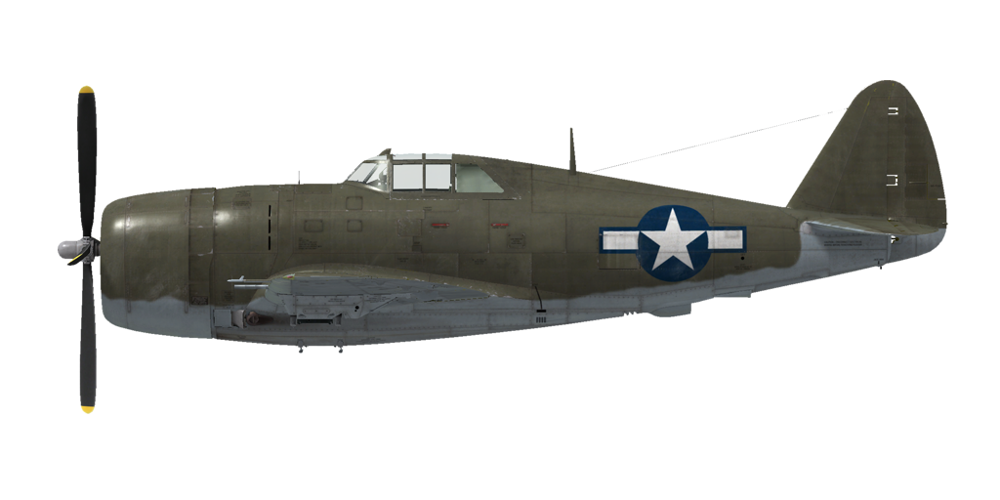

# P-47D-22

## Описание

Приборная скорость сваливания в полётной конфигурации: 175..212 км/ч (109..131 миль/ч)
Приборная скорость сваливания в посадочной конфигурации: 143..174 км/ч (89..108 миль/ч)

Предельная скорость в пикировании: 805 км/ч (500 миль/ч)
Разрушающая перегрузка: 11,0 единиц
Угол атаки сваливания, в полётной конфигурации: 16,2 °
Угол атаки сваливания, в посадочной конфигурации: 15,4 °

Максимальная истинная скорость у земли, режим двигателя - чрезвычайный: 575 км/ч (357 миль/ч)
Максимальная истинная скорость на высоте 7000 м (22960 фут), режим двигателя - чрезвычайный: 727 км/ч (451 миль/ч)

Максимальная истинная скорость у земли, режим двигателя - боевой: 518 км/ч (322 миль/ч)
Максимальная истинная скорость на высоте 9000 м (29530 фут), режим двигателя - боевой: 685 км/ч (426 миль/ч)

Максимальная истинная скорость у земли, режим двигателя - крейсерский: 485 км/ч (301 миль/ч)
Максимальная истинная скорость на высоте 10000 м (32800 фут) м, режим двигателя - крейсерский: 651 км/ч (404 миль/ч)

Практический потолок: 11580 м (38000 футов)

Скороподъёмность на чрезвычайном режиме:
Скороподъёмность у земли: 18,5 м/с (3642 фут/мин)
Скороподъёмность на высоте 3000 м (9843 фут): 18,1 м/с (3559 фут/мин)
Скороподъёмность на высоте 6000 м (19685 фут): 16,9 м/с (3338 фут/мин)

Скороподъёмность на боевом режиме:
Скороподъёмность у земли: 12,6 м/с (2480 фут/мин)
Скороподъёмность на высоте 3000 м (9843 фут): 11,9 м/с (2342 фут/мин)
Скороподъёмность на высоте 6000 м (19685 фут): 10,7 м/с (2106 фут/мин)

Время виража предельного по тяге у земли: 27,0 с, на скорости 322 км/ч (200 миль/ч) по прибору
Время виража предельного по тяге на высоте 3000 м (9843 фут): 30,0 с, на скорости 330 км/ч (205 миль/ч) по прибору

Продолжительность полёта на высоте 3000 м (9843 фут): 2 ч, на скорости 370 км/ч (230 миль/ч) по прибору

Скорость взлётная: 177..210 км/ч (110..130 миль/ч)
Скорость на глиссаде: 179..220 км/ч (111..135 миль/ч)
Скорость посадочная: 175..205 км/ч (110..127 миль/ч)
Посадочный угол: 11,9 ° 

Примечание 1: данные указаны для условий международной стандартной атмосферы.
Примечание 2: диапазоны характеристик даны для допустимого диапазона масс самолёта.
Примечание 3: максимальные скорости, скороподъемности и время виража даны для самолёта со стандартным вооружением и 50% заправкой.
Примечание 4: время виража дано на чрезвычайном режиме работы двигателя.

Двигатель:
Модель: Pratt & Whitney R-2800-59
Мощность на чрезвычайном режиме у земли: 2600 л.с.
Мощность на боевом режиме у земли: 1950 л.с.
Мощность на крейсерском режиме у земли: 1620 л.с.

Мощность на чрезвычайном режиме на высоте 7000 м (22970 фут): 2600 л.с.
Мощность на боевом режиме на высоте 9000 м (29530 фут): 1900 л.с.
Мощность на крейсерском режиме на высоте 10500 м (34450 фут): 1600 л.с.

Режимы работы двигателя:
Крейсерский (время не ограничено): 2550 об/мин, 42 дюйм рт.ст.
Боевой (до 15 минут): 2700 об/мин, 52 дюйм рт.ст.
Чрезвычайный (до 5 минут): 2700 об/мин, 64 дюйм рт.ст.

Предельные обороты турбонагнетателя без ограничения по времени: 20000 об/мин
Предельные обороты турбонагнетателя с ограничением по времени до 15 минут: 22000 об/мин

Температура масла на входе в двигатель номинальная: 60..95 °С
Температура масла на входе в двигатель предельная: 100 °С 

Высота переключения нагнетателя: одна ступень

Масса пустого самолёта: 4665 кг (10285 фунт)
Минимальная масса (без БК, 10% топлива, снято 4 пулемёта): 5033 кг (11096 фунт)
Стандартная масса: 6213 кг (13697 фунт)
Максимальная взлётная масса: 7867 кг (17343 фунт)
Максимальный запас топлива: 829 кг (2551 фунт) / 1155 л (305 гал)
Максимальная полезная нагрузка: 3202 кг (7058 фунт)

Вооружение курсовое:
8 x 12,7мм пулемёт "M2,50", 267 патронов, 850 выстр/мин, крыльевой
Возможно снятие двух или четырёх пулемётов.
Возможно увеличение боекомплекта до 425 патронов на ствол.

Вооружение бомбовое:
До трёх 500-фунтовых осколочно-фугасных авиабомб "M64"
До двух 1000-фунтовых осколочно-фугасных авиабомб  "M65"

Вооружение ракетное:
6 x неуправляемых авиационных ракет "M8" в двух сбрасываемых контейнерах "M10"

Длина: 11,00 м (36,09 фут)
Размах крыла: 12,43 м (40,78 фут)
Площадь крыла: 27,87 кв.м (300 кв. фут)

Начало участия в боевых действиях: 1944

Особенности эксплуатации:
    - Двигатель самолёта, кроме одноступенчатого приводного нагнетателя, не требующего ручного управления, также оснащён турбонагнетателем, управляемым пилотом.
    - Турбонагнетатель работает за счёт энергии давления выхлопных газов мотора (противодавления). Противодавление задаётся с помощью рычага в кабине лётчика, заданное противодавление поддерживается автоматом с помощью дроссельных заслонок на выхлопных патрубках.
    - Сжатый в турбонагнетателе воздух поступает в интеркулер, где он охлаждается набегающим потоком, затем сжатый и охлаждённый воздух поступает в карбюратор и далее топливовоздушная смесь - в приводной нагнетатель.
    - Температура воздуха после интеркулера указывается на отдельном приборе. Лётчик может управлять створками интеркулера с помощью тумблера, положение створок указывается на индикаторе на левом борту кабины. Нормальное положение створок - нейтральное - открыты на 50%.
    - Управление турбонагнетателем (его оборотами) осуществляется с помощью рычага в кабине (по умолчанию клавиши "Left Shift" и "+"/"-"). В заднем положении рычага дроссельные створки открываются полностью, выхлопные газы полностью сбрасываются в атмосферу, обороты турбонагнетателя минимальны. В переднем положении рычага заданное противодавление (и, следовательно, обороты турбонагнетателя) максимальное. Следует учитывать, что при фиксированном положении рычага управления турбонагнетателем обороты с изменением высоты будут изменяться. Обороты турбонагнетателя указаны на приборе в кабине.
    - Основной метод управления силовой установкой самолёта - совмещённое управление, когда три рычага - рычаг управления оборотами, рычаг газа и рычаг управления турбонагнетателем передвигаются совместно. Однако в некоторых случаях (например, выше границы высотности) рычагом турбонагнетателя надо работать отдельно от остальных.
    - Следует учитывать, что обороты турбонагнетателя изменяются достаточно медленно и с некоторой задержкой после перемещения рычага управления.
    - Самолёт оборудован системой впрыска воды в цилиндры для увеличения мощности на чрезвычайном режиме. При включении системы впрыска автоматически увеличивается заданное противодавление и обороты турбонагнетателя увеличиваются, а так же автоматически обедняется состав топливовоздушной смеси. Запаса воды хватает примерно на 7 минут работы мотора на чрезвычайном режиме.
    - Самолёт оборудован автоматическим высотным корректором, который поддерживает оптимальный состав топливовоздушной смеси при нахождении рычага управления смесью в положении Auto Rich (85% хода рычага). Для снижения расхода топлива на маршруте можно воспользоваться режимом поддержания обедненного состава смеси, для чего необходимо установить рычаг в положение Auto Lean (60% хода рычага). Максимальное обогащение смеси осуществляется установкой рычага в положение Full Rich (рычаг полностью вперёд) и используется только при отказе автоматического регулирования состава смеси. Для остановки двигателя рычаг высотного корректора необходимо передвинуть полностью назад, в положение Idle Cut Off.
    - Регулятор постоянных оборотов винта поддерживает заданные рычагом винта обороты мотора за счёт автоматического изменения шага винта.
    - Самолёт оснащён триммерами во всех трёх каналах управления.
    - Привод закрылков гидравлический. Закрылки можно выпустить на любой угол до 40°.
    - Створки капота запрещено открывать на скорости более 225 миль/час, также запрещено делать резкие маневры с открытыми створками капота - из-за возможной тряски оперения. По этой же причине запрещено пикировать с открытыми створками интеркулера.
    - Свободно-ориентируемое хвостовое колесо может быть застопорено в положении "по полёту" при помощи рычага в кабине лётчика. Колесо необходимо застопорить при продолжительном рулении по прямой, а также перед взлётом и посадкой. 
    - Самолёт имеет раздельное управление гидравлическими тормозами левого и правого колёс шасси. Торможение каждого колеса осуществляется нажатием на верхнюю часть соответствующей педали.
    - Самолёт оборудован стояночным тормозом.
    - Сигнальная лампа горит, если шасси не убрано и РУД в переднем положении, или же если шасси не выпущено и РУД в заднем положении.
    - Следует учитывать, что самолёт имеет достаточно большую длину разбега - порядка 650 метров при стандартной загрузке, и около полутора километров при максимальном взлётном весе. Для сокращения длины разбега допускается выпуск закрылков на 10-20 градусов. 
    - Самолёт оснащён одним топливомером с двумя стрелками для переднего и заднего баков.
    - Следует учитывать, что на боевом режиме работы мотора расход топлива высок - порядка 4,5 галлона в минуту.
    - Конструкция фонаря кабины предусматривает систему аварийного сброса фонаря для покидания лётчиком самолёта в полёте.
    - Самолёт оборудован ручным механизмом для сброса с каждой из трёх точек подвески бомб.
    - Для стрельбы подвесными ракетами используется электрощиток, который позволяет осуществлять пуск ракет по одной, по две, по три, или сразу все в серии с задержкой 0,1 секунды.
    - На капоте установлен дублирующий механический прицел, который используется при повреждении основного прицела.

Основные данные и рекомендуемые положения органов управления самолётом:
1. Запуск двигателя:
    - рекомендуемое положение рукояти управления смесью: Auto Rich (автоматическое управление смесью)
    - рекомендуемое положение рукояти управления радиаторами/створками капота: открыто 50%
    - рекомендуемое положения рукояти управления шагом винта : легкий винт (100%)
    - рекомендуемое положение рычага управления двигателем: 10%
    - перед рулением необходимо разблокировать колесо
    - перед рулением необходимо снять самолёт со стояночного тормоза

2. Рекомендуемые положения рукояти смеси при различных режимах полёта: Auto Rich (автоматическое управление смесью)

3.1 Рекомендуемые положения рукояти управления створками капота при различных режимах полёта:
    - взлёт: открыты 50%
    - набо высоты: открыты 100%
    - крейсерский полёт: закрыты
    - бой: открыто 50%

3.2 Рекомендуемые положения рукояти управления маслорадиаторами при различных режимах полёта:
    - взлёт: открыто 50%
    - набо высоты: открыто 100%
    - крейсерский полёт: закрыты
    - бой: открыто 50%

4. Ориентировочный расход топлива на различных режимах работы на высоте 2000 м:
    - крейсерский режим работы двигателя: 14,3 л/мин
    - боевой режим работы двигателя: 15,7 л/мин

## Модификации
###  150-октановое топливо

Использование 150 октанового топлива, позволяет увеличить наддув до 70 дюймов.

### Увеличенный боезапас пулемётов

Увеличенный боезапас пулемётов: по 425 на каждый.

8 пулемётов:
Дополнительная масса: 178.2 кг (393 фунта)
Ориентировочная потеря скорости: 1 км/ч

6 пулемётов:
Дополнительная масса: 133.6 кг (294.8 фунта)
Ориентировочная потеря скорости: 0 км/ч

4 пулемёта:
Дополнительная масса: 89.1 кг (196.5 фунта)
Ориентировочная потеря скорости: 0 км/ч

###  Штурмовой вариант

Подкрыльевые и подфюзеляжный держатели для бомб и ракет

Только бомбодержатели:

Масса держателей: 30 кг (66.2 фунта)
Примерная потеря скорости: 7 км/ч (4.4 миль/ч)

3*500 фунтовых осколочно-фугасных авиабомбы M64:

Дополнительная масса: 792 кг (1746.4 фунта)
Масса вооружения: 762 кг (1680.2 фунта)
Масса держателей: 30 кг (66.2 фунта)
Ориентировочная потеря скорости до сброса: 35 км/ч (21.8 миль/ч)
Ориентировочная потеря скорости после сброса: 12 км/ч (7.5 миль/ч) 

2*1000 фунтовых осколочно-фугасных авиабомбы M65:

Дополнительная масса: 1054 кг (2324.1 фунта)
Масса вооружения: 1024 кг (2257.9 фунта)
Масса держателей: 30 кг (66.2 фунта)
Ориентировочная потеря скорости до сброса: 47 км/ч (29.2 миль/ч)
Ориентировочная потеря скорости после сброса: 10 км/ч (6.2 миль/ч)

6* ракет M8 в двух сбрасываемых контейнерах M10:

Дополнительная масса: 179.9 кг (396.7 фунта)
Масса вооружения: 115.9 кг (255.6 фунта)
Масса держателей: 64 кг (141.1 фунта)
Ориентировочная потеря скорости до запуска: 27 км/ч (16.8 миль/ч)
Ориентировочная потеря скорости после запуска: 21 км/ч (13.1 миль/ч)
Ориентировочная потеря скорости после сброса: 8 км/ч (5.0 миль/ч)


### 4 x 12,7-мм пулемёта M2 .50

Снятие четырёх внешних крыльевых пулемётов для облегчения самолёта
Уменьшение массы: 280.6 кг (618.7 фунта)
Масса снимаемого боекомплекта: 150.6 кг (332.1 фунта)
Масса снимаемых орудий: 130 кг (286.6 фунта)
Ориентировочный выигрыш в скорости: 6 км/ч (3.7 миль/час)


### 6 x 12,7-мм пулемёта M2 .50

Снятие двух внешних крыльевых пулемётов для облегчения самолёта
Уменьшение массы: 140.3 кг (309.3 фунта)
Масса снимаемого боекомплекта: 75.3 кг (166.0 фунта)
Масса снимаемых орудий: 65 кг (143.3 фунта)
Ориентировочный выигрыш в скорости: 3 км/ч (1.8 миль/час)

### Bendix MN-26

Радиополукомпас для навигации по радиомаякам
Дополнительная масса: 17,5 кг (38.6 фунта)
Ориентировочная потеря скорости: 1 км/ч
