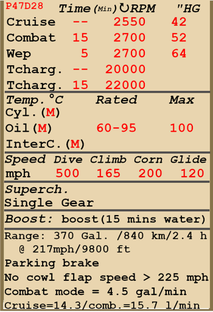

# P-47D-28  

<table><tbody><tr><td style="text-align: center"></td><td style="text-align: center"></tr></td></tr></tbody></table>  

飞行构型的失速指示空速：178~215 km/h (111~134 mph)  
起降构型的失速指示空速：146~177 km/h (91~110 mph)  
  
俯冲极速：805 km/h (500 mph)  
最大过载：11.0 G  
飞行构型失速迎角：16.2 °  
着陆构型失速迎角：15.4 °  
  
最大真空速，高度海平面，发动机模式——作战紧急功率：557 km/h (346 mph)  
最大真空速，高度7000 m (22960 feet)，发动机模式——作战紧急功率：700 km/h (435 mph)  
  
最大真空速，高度海平面，发动机模式——战斗：502 km/h (312 mph)  
最大真空速，高度9000 m (29530 feet)，发动机模式——战斗：656 km/h (407 mph)  
  
最大真空速，高度海平面，发动机模式——巡航：467 km/h (290 mph)  
最大真空速，高度10000 m (32800 feet)，发动机模式——巡航：619 km/h (388 mph)  
  
实用升限：11580 m (38000 feet)  
  
爬升，发动机模式——作战紧急功率  
海平面爬升率：18.1 m/s(3567 feet/min)  
3000m时爬升率(9843 feet)：17.6 m/s (3455 feet/min)  
6000m时爬升率(19685 feet)：16.4 m/s (3226 feet/min)  
  
以发动机模式——战斗爬升  
海平面爬升率：12.1 m/s (2378 feet/min)  
3000m时爬升率 (9843 feet)：11.5 m/s (2256 feet/min)  
6000m时爬升率 (19685 feet)：10.3 m/s (2031 feet/min)  
  
海平面最大性能盘旋时间：27.5 s，指示空速 322 km/h (200 mph)。  
3000m时最大性能盘旋时间(9843 feet)：31.0 s，指示空速 330 km/h (205 mph)。  
  
3000m（9843 feet）时续航时间（9843 feet）时：2.4h，指示空速 350 km/h (217 mph)。  
  
起飞速度：185~200 km/h (115~125 mph)  
进近速度：185~210 km/h (115~130 mph)  
着陆速度：175~195 km/h (110~120 mph)  
着陆迎角：11.9 °  
  
注1：所提供的数据适用于国际标准大气（ISA）。  
注2：飞行性能范围基于可能的飞机质量范围。  
注3：极速、爬升率和盘旋时间基于标准飞机质量和50%油量。  
注4：盘旋时间基于作战紧急功率。  
  
发动机：  
型号：R-2800-59  
作战紧急功率模式海平面最大功率：2600 HP  
战斗模式下的最大功率，高度海平面：1950 HP  
巡航模式下的最大功率，高度海平面：1620 HP  
  
战争应急动力模式7000m（22970 feet）时最大功率：2600 HP  
战斗模式下的最大功率，高度9000 m (29530 feet)：1900 HP  
巡航模式下的最大功率，高度10500 m (34450 feet)：1600 HP  
  
发动机模式：  
巡航（无时间限制）：2550 RPM，42.0 inch Hg  
战斗（不超过15min）：2700 RPM，52 inch Hg  
WEP（不超过5min）：2700 RPM，64.0 inch Hg  
  
最大持续涡轮增压器转速：20000  
最多持续15min的最大涡轮增压器转速：22000  
  
发动机滑油进油口额定油温：60~95 °C  
发动机滑油进油口最高油温：100 °C  
  
机械增压器换挡高度：单级  
  
空重：4755 kg(10483 lb)  
最小重量（无弹药，10%燃油，移除4挺机枪）：5163.9 kg(11385 lb)  
标准重量：6503 kg(14337 lb)  
最大起飞重量：8163.1 kg(17996 lb)  
燃油载荷：1006 kg(3095 lb)/1404 L (370 gal）  
有效载荷：3408.1 kg(7514 lb)  
  
前射武器：  
8 x 12.7mm机枪"M2.50"，267发，850发/分，机翼安装  
可以移除2号或4号机枪 并/或 把备弹量增加到每挺425发。  
  
炸弹：  
最多three 500 lb 通用炸弹"M64"  
最多two 1000 lb 通用炸弹"M65"  
  
火箭弹：  
6枚"M8"无制导火箭弹，位于两具可抛弃的"M10"发射管中  
  
长度：11.00 m (36.09 feet)  
翼展：12.43 m (40.78 feet)  
机翼面积：27.87 m² (300 feet²)  
  
首次投入战斗：1944  
  
操作特性：  
—除了自动单级增压器外，发动机还装有飞行员可以控制的涡轮增压器。  
—涡轮增压器由发动机排气背压提供动力，该压力可由驾驶舱中的操纵杆设置，并通过排气管上的节气门自动保持。  
—在涡轮增压器里增压了的空气进入中冷器，被进入的气流冷却。冷却后的压缩空气进入化油器并形成油气混合物进入增压器。  
—通过中冷器的空气温度有一个独立的仪表显示。飞行员可使用切换开关控制中冷器鱼鳞片并使用左侧的指示器观察其位置。默认位置是中立（50%）。  
—涡轮增压器的转速是由驾驶舱的特定控制杆操作的。（默认使用“T”和“+/-”来调节）。当控制杆在向后位置时，节气阀完全打开并且发动机排气完全排向大气，导致涡轮增压器转速最小。当控制杆在向前位置时，排气背压导致涡轮增压器转速最大。应该注意的是涡轮增压器转速会随着高度的改变而改变，即使控制杆的位置并没有发生变化。涡轮增压转速有特定的表指示，并且当转速超过最高限制的时候，信号灯会亮起发出警告。  
—发动机的全部动力应使用三杆联合控制，转速杆、油门杆和涡轮增压器杆应一起移动。不过在某些情况下（比如，当高于临界高度）涡轮增压器杆应单独移动。  
—应该注意的是，涡轮增压器转速的变化相对较慢，并且并非在调节控制杆之后立即变化。  
—该机型配备注水系统，用于将发动机动力提升至紧急模式。当注水系统开启时，混合比会下降，同时排气背压和涡轮增压器转速会自动提高。在紧急模式下，供水长达15min。  
—该发动机配备有自动燃油混合比控制装置，如果将混合杆设置在“自动富油（85％25）”位置，则可以将混合比调为最佳的浓度。要使用自动混合气贫油降低飞行过程中的燃油消耗，必须将混合气杆设置在自动贫油（60％25）位置。如果自动混合控制出现故障，则应将混合杆设置在富油（100％25）位置。关闭发动机，应将其置于截止（0％25）位置。  
—发动机转速有自动调节器，其根据调节器控制杆位置保持对应的需用转速。调节器自动控制螺旋桨桨距来保持需用转速。也可以关闭调节器手动控制桨距。  
—滑油散热器叶片为手动控制。  
—此机型的所有飞行操纵：俯仰、滚转和偏航，均带有配平装置。  
—着陆襟翼由液压机构控制，可展开至0-40°之间的任意角度。  
—禁止在超过225 mph时打开鱼鳞片，鱼鳞片打开时禁止做大机动，中冷器鱼鳞片打开时禁止俯冲。  
—该飞机有手动控制的尾轮锁。在长距离直线滑行时、起飞和着陆前应锁住尾轮。  
—该型号飞机有独立的左右液压机轮刹车控制。如要使用任一刹车，踩方向舵脚蹬的上部。  
—该型号飞机配备有停放刹车系统。  
—当起落架收起且油门处于后部位置时，或者当起落架放下且油门处于前部位置时，信号灯亮起。  
—需注意，飞机需要较长起飞滑跑距离，在标准载荷下，需要650 m跑道，最大起飞重量下，需要1500 m跑道。放下10-20°襟翼有助于缩短起飞滑跑距离。   
—该机型只配备一个油量表，但有两个指针分别指示前部油箱和后部油箱的油量。  
—战斗挡位时发动机需要消耗大量燃料，大约每分钟4.5 gal的燃料。  
—座舱盖配有紧急抛弃系统，用于跳伞。  
—该机型为三个炸弹挂架都配备了手动投弹系统。  
—该机上的无制导火箭弹是使用电子控制器发射的，该控制器有单发、双发、三发与齐射（全部火箭弹以0.1s间隔发射）四种发射模式。  
—当主瞄准具受损时，可以使用备用的机械瞄准具。  
—陀螺瞄准具会在向目标开火时自动计算所需的偏转角度。它有3种模式：固定环模式；固定环与陀螺活动环双重模式；陀螺活动环模式。只有目标距离设置得当，才能计算出正确的偏转角度。要想设置目标距离，首先使用独立控制调整目标基线（翼展），随后调整光环直至与目标大小相同即可。  
  
Basic data and recommended positions of the aircraft controls:  
1. Starting the engine:  
	- recommended position of the mixture control lever:  Auto Rich (auto mixture control)  
	- recommended position of the radiator/cowl flap control handle: open 50%  
	- recommended position of the prop pitch control handle: 100%  
	- recommended position of the throttle lever: 10%  
	- before taxiing, you must unlock the tailwheel  
	- before taxiing, the parking brake must be released  
  
2. Recommended mixture control lever positions for various flight modes: Auto Rich (auto mixture control)  
  
3.1 Recommended positions of cowl flaps for various flight modes:  
	- takeoff: open 50%  
	- climb: open 100%  
	- cruise flight: close  
	- combat: open 50%  
  
3.2 Recommended positions of the oil radiator control handle for various flight modes:  
	- takeoff: open 50%  
	- climb: open 100%  
	- cruise flight: close  
	- combat: open 50%  
  
4. Approximate fuel consumption at 2000 m altitude:  
	- Cruise engine mode: 14.3 l/min  
	- Combat engine mode: 15.7 l/min  

## 修改  
### 150号汽油  

150号汽油，可以让进气压力增大到70 inch。  

### 额外ANM2 .50口径机枪弹药  

机枪的额外弹药：每挺425发。  
  
8机关枪：  
增加质量：178.2 kg (393 lbs)  
预期速度损失：1 km/h  
  
6机关枪：  
增加质量：133.6 kg (294.8 lbs)  
预期速度损失：0 km/h  
  
4机关枪：  
增加质量：89.1 kg (196.5 lbs)  
预期速度损失：0 km/h  

### 对地攻击改装  

用于炸弹和火箭弹的翼下和机腹挂架  
  
仅挂架：  
  
挂架质量：30 kg (66.2 lbs)  
预期速度损失：7 km/h (4.4 mph)  
  
3 x 500 lb 通用炸弹M64:  
  
增加质量：792 kg (1746.4 lbs)  
弹药质量：762 kg (1680.2 lbs)  
挂架质量：30 kg (66.2 lbs)  
投弹前预期速度损失：35 km/h (21.8 mph)  
投弹后预期速度损失：12 km/h (7.5 mph)   
  
2 x 1000 lb 通用炸弹M65:  
  
增加质量：1054 kg (2324.1 lbs)  
弹药质量：1024 kg (2257.9 lbs)  
挂架质量：30 kg (66.2 lbs)  
投弹前预期速度损失：47 km/h (29.2 mph)  
投弹后预期速度损失：10 km/h (6.2 mph)  
  
6 x M8火箭弹 in M10 jettisonable launchers:  
  
增加质量：179.9 kg (396.7 lbs)  
弹药质量：115.9 kg (255.6 lbs)  
挂架质量：64 kg (141.1 lbs)  
发射前预期速度损失：27 km/h (16.8 mph)  
发射后预期速度损失：21 km/h (13.1 mph)  
投弹后预期速度损失：8 km/h (5.0 mph)  

### 陀螺瞄准具  

K-14A陀螺射击瞄准具  
增加质量：5.2 kg (11.5 lbs)  
预期速度损失：0 km/h  

### 4 x ANM2 .50口径机枪  

移除外侧4挺翼装机枪以降低总重  
减少质量：280.6 kg (618.7 lbs)  
减少弹药质量：150.6 kg (332.1 lbs)  
减少枪炮质量：130 kg (286.6 lbs)  
预期速度提升：6 km/h (3.7 mph)  

### 6 x ANM2 .50口径机枪  

移除外侧2挺翼装机枪以降低总重  
减少质量：140.3 kg (309.3 lbs)  
减少弹药质量：75.3 kg (166.0 lbs)  
减少枪炮质量：65 kg (143.3 lbs)  
预期速度提升：3 km/h (1.8 mph)  

### 后视镜  

后视镜  
增加质量：1 kg (2.2 lbs)  
预期速度损失：3 km/h (1.8 mph)  

### Bendix MN-26  

用于无线电信标导航的固定环形无线电罗盘  
增加质量：17，5 kg (38.6 lbs)  
预期速度损失：1 km/h  
