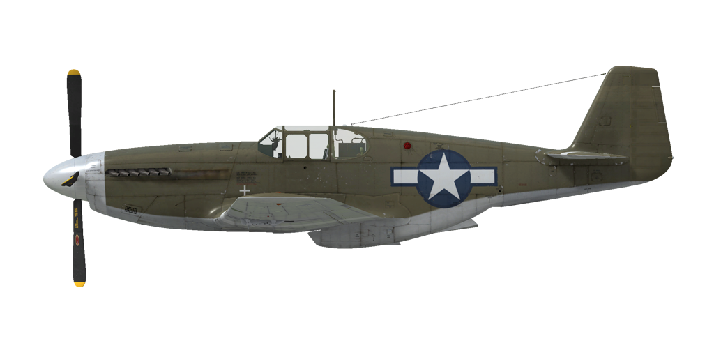

# P-51B-5

## Beschreibung

Überziehgeschwindigkeit in Flugkonfiguration:  158..192 km/h (98..119 mph)
Überziehgeschwindigkeit in Landekonfiguration: 147..177 km/h (91..110 mph)

Höchstzulässige Geschwindigkeit im Sturzflug: 812 km/h (505 mph)
Bruchlastvielfache: 10,0 G
Kritischer Anstellwinkel in Flugkonfiguration: 19,0 °
Kritischer Anstellwinkel in Landekonfiguration: 16,0 °

Packard V-1650-3:

Höchstgeschwindigkeit in Bodennähe, Sondernotleistung: 600 km/h (373 mph)
Höchstgeschwindigkeit in 9000 m (29530 Fuß) Höhe, Sondernotleistung: 700 km/h (435 mph)

Höchstgeschwindigkeit in Bodennähe, Sondernotleistung, mit 150-Oktan-Kraftstoff: 619 km/h (385 mph)
Höchstgeschwindigkeit in 7750 m (25430 Fuß) Höhe, Sondernotleistung, mit 150-Oktan-Kraftstoff: 713 km/h (443 mph)

Höchstgeschwindigkeit in Bodennähe, Kampfleistung: 582 km/h (362 mph)
Höchstgeschwindigkeit in 9500 m (31170 Fuß) Höhe, Kampfleistung: 691 km/h (429 mph)

Höchstgeschwindigkeit in Bodennähe, Nennleistung: 506 km/h (314 mph)
Höchstgeschwindigkeit in 10000 m (32810 Fuß) Höhe, Nennleistung: 662 km/h (411 mph)

Dienstgipfelhöhe: 12680 m (41600 Fuß)

Steigleistung mit Sondernotleistung:
Steigleistung in Bodennähe: 18,6 m/s (3661 Fuß/min)
Steigleistung in 3000 m (9843 Fuß) Höhe: 17,8 m/s (3504 Fuß/min)
Steigleistung in 6000 m (19685 Fuß) Höhe: 13,1 m/s (2579 Fuß/min)

Maximale Wendegeschwindigkeit in Bodennähe: 19,2 s, bei 290 km/h (180 mph) IAS.
Maximale Wendegeschwindigkeit in 3000 m (9843 Fuß) Höhe: 28,0 s, bei 295 km/h (183 mph) IAS.

Reichweite in 3000 m: (9843 Fuß): 4,3 h, bei 350 km/h (217 mph) IAS.

Packard V-1650-7:

Höchstgeschwindigkeit in Bodennähe, Sondernotleistung: 604 km/h (375 mph)
Höchstgeschwindigkeit in 7500 m (24600 Fuß) Höhe, Sondernotleistung: 717 km/h (446 mph)

Höchstgeschwindigkeit in Bodennähe, Sondernotleistung, mit 150-Oktan-Kraftstoff: 626 km/h (389 mph)
Höchstgeschwindigkeit in 6250 m (20505 Fuß) Höhe, Sondernotleistung, mit 150-Oktan-Kraftstoff: 721 km/h (448 mph)

Höchstgeschwindigkeit in Bodennähe, Kampfleistung: 588 km/h (365 mph)
Höchstgeschwindigkeit in 8500 m (27890 Fuß) Höhe, Kampfleistung: 713 km/h (443 mph)

Höchstgeschwindigkeit in Bodennähe, Nennleistung: 521 km/h (324 mph)
Höchstgeschwindigkeit in 8500 m (27890 Fuß) Höhe, Nennleistung: 665 km/h (413 mph)

Dienstgipfelhöhe: 12680 m (41600 Fuß)

Steigleistung mit Sondernotleistung:
Steigleistung in Bodennähe: 19,3 m/s (3799 Fuß/min)
Steigleistung in 3000 m (9843 Fuß) Höhe: 18,0 m/s (3543 Fuß/min)
Steigleistung in 6000 m (19685 Fuß) Höhe: 11,8 m/s (2323 Fuß/min)

Maximale Wendegeschwindigkeit in Bodennähe: 19,0 s, bei 290 km/h (180 mph) IAS.
Maximale Wendegeschwindigkeit in 3000 m (9843 Fuß) Höhe: 28,0 s, bei 295 km/h (183 mph) IAS.

Reichweite in 3000 m: (9843 Fuß): 4,3 h, bei 350 km/h (217 mph) IAS.

Startgeschwindigkeit: 185..200 km/h (115..125 mph)
Anfluggeschwindigkeit: 185..210 km/h (115..130 mph)
Landegeschwindigkeit: 175..195 km/h (110..120 mph)
Sinkflugpfad: 12.9 °

Anmerkung 1: Die Werte gelten für Normatmosphäre (ISA).
Anmerkung 2: Flugleistungen varrieren je nach Abfluggewicht.
Anmerkung 3: Höchstgeschwindigkeiten, Steigleistungen und Wendegeschwindigkeiten gelten für Standardflugzeugmasse und 68% Treibstoff.
Anmerkung 4: Wendegeschwindigkeiten gelten für Sondernotleistung.

Triebwerk:
Baumuster: Packard V-1650-3
Sondernotleistung in Bodennähe: 1550 PS
Kampfleistung in Bodennähe: 1385 PS

Sondernotleistung in 7860 m (25800 Fuß) Höhe: 1235 PS
Kampfleistung in 7100 m (23300 Fuß) Höhe: 1360 PS

Baumuster: Packard V-1650-7
Sondernotleistung in Bodennähe: 1650 PS
Kampfleistung in Bodennähe: 1490 PS

Sondernotleistung in 5800 m (19030 Fuß) Höhe: 1525 PS
Kampfleistung in 6500 m (21325 Fuß) Höhe: 1390 PS

Leistungsstufen:
Nennleistung (unbegrenzt): 2700 U/min, 46 inch Hg
Kampfleistung (bis zu 15 Minuten): 3000 U/min, 61 inch Hg
Sondernotleistung (bis zu 5 Minuten): 3000 U/min, 67 inch Hg
Sondernotleistung, 150 Oktan (bis zu 5 Minuten): 3000 U/min, 75 inch Hg

Kühlstoffaustrittstemperatur (normal): 105..115 °C
Kühlstoffaustrittstemperatur (höchstens): 135 °C
Schmierstoffeintrittstemperatur (normal): 80 °C
Schmierstoffeintrittstemperatur (höchstens): 90 °C

Laderumschalthöhe: Automatisch, mit der Möglichkeit, manuell auf den ersten Ladergang umzuschalten.

Leergewicht: 3340 kg (7363  lb)
Minimalgewicht (keine Munition, 10% Treibstoff): 3560 kg (7849 lb)
Normalgewicht: 4389 kg (9676 lb)
Höchstabfluggewicht: 5667 kg (12493 lb)
Kraftstoffmenge: 732 kg (1614 lb) / 1020 l (269 gal)
Nutzlast: 2234 kg (4925 lb)

Starre Schusswaffenanlage:
4 x 12,7mm .50 Browning AN/M2, jeweils 350 Schuss für das innere und 280 Schuss für das äußere Maschinengewehr, 850 Schuss pro Minute, flügelmontiert.

Abwurfwaffen:
2 x M64-Sprengbomben 500 lb
2 x M65 oder MC 1000 -Sprengbomben 1000 lb

Raketen:
6 x Ungelenkte Raketen "M8" in zwei Werfern "M10", die abgeworfen werden können.

Länge: 9,84 m (32 3-5/16 Fuß)
Spannweite: 11,29 m (37 5/16 Fuß)
Flügelfläche: 22,30 m² (240 Fuß²)

Erster Fronteinsatz: Winter  1943-1944

Eigenschaften:
    - LUFTKAMPF, KUNSTFLUGMANÖVER UND INSTRUMENTENFLUG SIND BEI VOLLER TREIBSTOFFRESERVE VERBOTEN! Das Flugzeug ist mit vollem hinteren Kraftstofftank. Diese Limitierung wird aufgehoben, wenn sich nicht mehr als 20 Gallonen (ca. 75% Kraftstoff übrig) im hinteren Tank befinden. Dieser Tank ist bei einem Gesamtkraftstoffstand von 68% vollständig leer.
    - Es ist möglich, im Sturzflug gefährlich hohe Mach-Zahlen zu erreichen: Das Flugzeug beginnt zu schütteln und Kontrollverlust ist möglich. Nehmen Sie den Schubhebel zurück und kehren Sie vorsichtig zum Horizontalflug zurück.
    - The engine has a emergency boost mode. To set boost mode it is necessary to pull the boost knob and set full throttle.
    - Der Motor ist mit einem automatischen Regler des Ladedrucks ausgestattet, der funktioniert, wenn der Schubhebel auf 1/3 oder höher gestellt wird.
    - Der Motor hat einen Zweiganglader, welcher nicht umgeschaltet werden muss. Der Lader kann manuell in den ersten Gang geschaltet werden.
    - Der Motor ist mit einer automatischen Gemischregelung ausgestattet, die das optimale Gemisch beibehält, wenn sich der Gemischhebel in der AUTO RICH Position (100%) befindet. Um den Motor zu stoppen, sollte der Gemischhebel in die Cut Off Position (0%) gebracht werden.
    - Der Motor verfügt über einen automatischen Drehzahlregler, der die Propellereinstellung steuert, um die erforderliche Drehzahl einzuhalten.
    - Die Verschlussklappen der Wasser- und Ölkühler werden automatisch betätigt, es gibt jedoch einen manuellen Modus.
    - Das Flugzeug verfügt über Höhen-, Seitenund Querrudertrimmung.
    - Die Landeklappen verfügen über einen hydraulischen Regler und können auf 10°, 20°, 30°, 40° oder 50° ausgefahren werden.
    - Jeder Tank hat eine eigene Kraftstoffstandsanzeige: Die Flügeltankanzeiger befinden sich am Cockpitboden und die hintere Tankanzeige befindet sich hinter dem Pilotensitz auf der linken Seite.
    - Das Spornrad dreht sich frei, aber wenn man den Steuerknüppel nach hinten bewegt, wird es verriegelt, sodass es sich durch Betätigung der Pedale steuern lässt.
    - Das Flugzeug verfügt über eine unabhängige linke und rechte hydraulische Radbremse. Um eine der beiden Bremsen zu betätigen, treten Sie den oberen Teil des Ruderpedals.
    - Das Flugzeug ist mit einer Parkbremse ausgestattet.
    - Die Signallampe leuchtet auf, wenn das Fahrwerk eingefahren ist und sich der Schubhebel in der hinteren Position befindet, oder wenn das Fahrwerk ausgefahren ist, aber sich der Schubhebel in der vorderen Position befindet.
    - Aufgrund der Stauluft ist es unmöglich, die Haube bei hohen Geschwindigkeiten zu öffnen, aber es gibt einen Griff zum Notabwurf, um abspringen zu können.
    - Das Flugzeug ist mit Formationslichtern ausgestattet.
    - Die ungelenkten Raketen werden mit einem elektrischen Regler gestartet, der den Start der Raketen im Einzel-, Paar-, Dreier- und Salvenmodus (alle Raketen im Abstand von 0,1 Sekunden) ermöglicht.
    - Das Kreiselvisier berechnet automatisch die Winkelabweichung beim Feuern auf ein Ziel. Es hat 3 Modi: Feststehendes Fadenkreuz, kreiselstabilisiertes Fadenkreuz, feststehendes und kreiselstabilisiertes Fadenkreuz. Die Winkelabweichung wird nur korrekt berrechnet, wenn die Zielentfernung passend eingestellt ist. Um die Entfernung einzustellen, wird zuerst die Zielgröße über eigene Tastenbefehle eingestellt und dann die Entfernung über die Einstellung der Größe des Fadenkreuzes, bis dieses der Größe des Ziels entspricht.

Basic data and recommended positions of the aircraft controls:
1. Starting the engine:
    - recommended position of the mixture control lever: Auto Rich (auto mixture control)
    - recommended position of the radiator control handle: auto radiators control
    - recommended position of the prop pitch control handle: 100%
    - recommended position of the throttle lever: 10%
    - before taxiing, the parking brake must be released

2. Recommended mixture control lever positions for various flight modes: auto mixture control

3. Recommended positions of the radiators control handle for various flight modes: auto radiators control

4. Approximate fuel consumption at 2000 m altitude:
    - Cruise engine mode: 6.3 l/min
    - Combat engine mode: 13.4 l/min

## Änderungen
### 150-Oktan-Kraftstoff

150-Oktan-Kraftstoff, der einen erhöhten Ladedruck bis 75 inch erlaubt.

### 150-Oktan-Kraftstoff, Ladedruck bis 81 inch.

150-Oktan-Kraftstoff, der einen erhöhten Ladedruck bis 81 inch erlaubt.

### Jadgbomber-Modifikation

Flügel- und Rumpfhalterungen für Bomben und Raketen

Halterungen alleine:

Gewicht der Bombenhalterungen: 22 kg (48 lbs)
Geschwindigkeitsverlust: 11 km/h (6 mph)

2 x M64-Sprengbomben 500 lb:

Zusätzliches Gewicht: 530 kg (1168 lbs)
Gewicht der Munition: 508 kg (1120 lbs)
Gewicht der Abwurfwaffenroste: 22 kg (48 lbs)
Geschwindigkeitsverlust vor Abwurf: 31 km/h (18 mph)
Geschwindigkeitsverlust nach Abwurf: 11 km/h (6 mph)

2 x M65-Sprengbomben 1000 lb:

Zusätzliches Gewicht: 1046 kg (2306 lbs)
Gewicht der Munition: 1024 kg (2258 lbs)
Gewicht der Abwurfwaffenroste: 22 kg (48 lbs)
Geschwindigkeitsverlust vor Abwurf: 55 km/h (34 mph)
Geschwindigkeitsverlust nach Abwurf: 11 km/h (6 mph)

2 x MC 500-Sprengbomben 500 lb:
(only for British planes)

Zusätzliches Gewicht: 486 kg (1071 lbs)
Gewicht der Munition: 466 kg (1023 lbs)
Gewicht der Abwurfwaffenroste: 22 kg (48 lbs)
Geschwindigkeitsverlust vor Abwurf: 31 km/h (18 mph)
Geschwindigkeitsverlust nach Abwurf: 11 km/h (6 mph)

2 x MC 1000-Sprengbomben 1000 lb:
(only for British planes)

Zusätzliches Gewicht: 971 kg (2141 lbs)
Gewicht der Munition: 949 kg (2093 lbs)
Gewicht der Abwurfwaffenroste: 22 kg (48 lbs)
Geschwindigkeitsverlust vor Abwurf: 54 km/h (33 mph)
Geschwindigkeitsverlust nach Abwurf: 11 km/h (6 mph)

6 x M8-Raketen in abwerfbaren M10-Werfern:

Zusätzliches Gewicht: 171,9 kg (379 lbs)
Gewicht der Munition: 115,9 kg (256 lbs)
Gewicht der Halterung: 56 kg (123 lbs)
Geschätzter Geschwindigkeitsverlust vor Abschuss: 38 km/h (23,6 mph)
Geschätzter Geschwindigkeitsverlust nach Abschuss: 28 km/h (17,4 mph)
Geschätzter Geschwindigkeitsverlust nach Abwurf: 6 km/h (3,7 mph)

### K-14A Kreiselvisier

K-14A kreiselstabilisiertes Visier
Zusätzliches Gewicht: 5,2 kg (11,5 lbs)
Geschwindigkeitsverlust: 0 km/h

### British Reflector Gunsight

Mk.II reflector Sight
Additional mass: 1.0 kg (2.2 lbs)
Estimated speed loss: 0 km/h

### K-14A Kreiselvisier

Mk.IID kreiselstabilisiertes Visier
Zusätzliches Gewicht: 5,2 kg (11,5 lbs)
Geschwindigkeitsverlust: 0 km/h

### Malcolm hood canopy

Malcolm Hood canopy
Zusätzliches Gewicht: 1 kg (2,2 lbs)
Geschwindigkeitsverlust: 2 km/h (1,2 mph)

### Rückspiegel

Rückspiegel
Zusätzliches Gewicht: 1 kg (2,2 lbs)
Geschwindigkeitsverlust: 2 km/h (1,2 mph)

### Merlin V-1650-7

Später V-1650-7 Motor.
Supercharger geared for increased power ratings at low altitudes.
