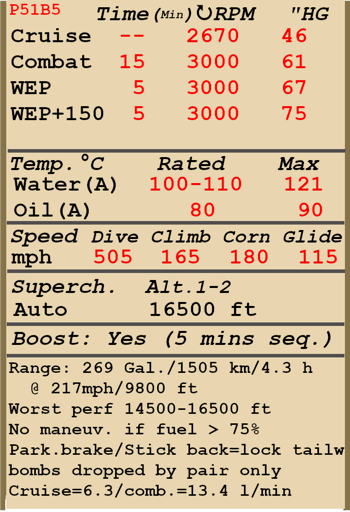

# P-51B-5  

<table><tbody><tr><td style="text-align: center"></td><td style="text-align: center"></td></tr></tbody></table>  

Приборная скорость сваливания в полётной конфигурации: 158..192 км/ч (98..119 миль/ч)  
Приборная скорость сваливания в посадочной конфигурации: 147..177 км/ч (91..110 миль/ч)  
  
Предельная скорость в пикировании: 812 км/ч (505 миль/ч)  
Разрушающая перегрузка: 10,0 единиц  
Угол атаки сваливания, в полётной конфигурации: 19,0 °  
Угол атаки сваливания, в посадочной конфигурации: 16,0 °  
  
С двигателем Packard V-1650-3:  
  
Максимальная истинная скорость у земли, режим двигателя - чрезвычайный: 600 км/ч (373 миль/ч)  
Максимальная истинная скорость на высоте 9000 м (29530 фут), режим двигателя - чрезвычайный: 700 км/ч (435 миль/ч)  
  
Максимальная истинная скорость у земли, режим двигателя - чрезвычайный, при использовании 150 октанового бензина: 619 км/ч (385 миль/ч)  
Максимальная истинная скорость на высоте 7750 м (25430 фут), режим двигателя - чрезвычайный, при использовании 150 октанового бензина: 713 км/ч (443 миль/ч)  
  
Максимальная истинная скорость у земли, режим двигателя - боевой: 582 км/ч (362 миль/ч)  
Максимальная истинная скорость на высоте 9500 м (31170 фут), режим двигателя - боевой: 691 км/ч (429 миль/ч)  
  
Максимальная истинная скорость у земли, режим двигателя - максимальный продолжительный: 506 км/ч (314 миль/ч)  
Максимальная истинная скорость на высоте 10000 м (32810 фут), режим двигателя - максимальный продолжительный: 662 км/ч (411 миль/ч)  
  
Практический потолок: 12680 м (41600 футов)  
  
Скороподъёмность на чрезвычайном режиме:  
Скороподъёмность у земли: 18,6 м/с (3661 фут/мин)  
Скороподъёмность на высоте 3000 м (9843 фут): 17,8 м/с (3504 фут/мин)  
Скороподъёмность на высоте 6000 м (19685 фут): 13,1 м/с (2579 фут/мин)  
  
Время виража предельного по тяге у земли: 19,2 с, на скорости 290 км/ч (180 миль/ч) по прибору  
Время виража предельного по тяге на высоте 3000 м (9843 фут): 28,0 с, на скорости 295 км/ч (183 миль/ч) по прибору  
  
Продолжительность полёта на высоте 3000 м (9843 фут): 4,3 ч, на скорости 350 км/ч (217 миль/ч) по прибору  
  
  
С двигателем Packard V-1650-7:  
  
Максимальная истинная скорость у земли, режим двигателя - чрезвычайный: 604 км/ч (375 миль/ч)  
Максимальная истинная скорость на высоте 7500 м (24600 фут), режим двигателя - чрезвычайный: 717 км/ч (446 миль/ч)  
  
Максимальная истинная скорость у земли, режим двигателя - чрезвычайный, при использовании 150 октанового бензина: 626 км/ч (389 миль/ч)  
Максимальная истинная скорость на высоте 6250 м (20505 фут), режим двигателя - чрезвычайный, при использовании 150 октанового бензина: 721 км/ч (448 миль/ч)  
  
Максимальная истинная скорость у земли, режим двигателя - боевой: 588 км/ч (365 миль/ч)  
Максимальная истинная скорость на высоте 8500 м (27890 фут), режим двигателя - боевой: 713 км/ч (443 миль/ч)  
  
Максимальная истинная скорость у земли, режим двигателя - максимальный продолжительный: 521 км/ч (324 миль/ч)  
Максимальная истинная скорость на высоте 8500 м (27890 фут), режим двигателя - максимальный продолжительный: 665 км/ч (413 миль/ч)  
  
Практический потолок: 12680 м (41600 футов)  
  
Скороподъёмность на чрезвычайном режиме:  
Скороподъёмность у земли: 19,3 м/с (3799 фут/мин)  
Скороподъёмность на высоте 3000 м (9843 фут): 18,0 м/с (3543 фут/мин)  
Скороподъёмность на высоте 6000 м (19685 фут): 11,8 м/с (2323 фут/мин)  
  
Время виража предельного по тяге у земли: 19,0 с, на скорости 290 км/ч (180 миль/ч) по прибору  
Время виража предельного по тяге на высоте 3000 м (9843 фут): 28,0 с, на скорости 295 км/ч (183 миль/ч) по прибору  
  
Продолжительность полёта на высоте 3000 м (9843 фут): 4,3 ч, на скорости 350 км/ч (217 миль/ч) по прибору  
  
Скорость взлётная: 185..200 км/ч (115..125 миль/ч)  
Скорость на глиссаде: 185..210 км/ч (115..130 миль/ч)  
Скорость посадочная: 175..195 км/ч (110..120 миль/ч)  
Посадочный угол: 12,9 °   
  
Примечание 1: данные указаны для условий международной стандартной атмосферы.  
Примечание 2: диапазоны характеристик даны для допустимого диапазона масс самолёта.  
Примечание 3: максимальные скорости, скороподъемности и время виража даны для самолёта со стандартным вооружением и 68% заправкой.  
Примечание 4: время виража дано на чрезвычайном режиме работы двигателя.  
  
Двигатель:  
Модель: Packard V-1650-3  
Мощность на чрезвычайном режиме у земли: 1550 л.с.  
Мощность на боевом режиме у земли: 1385 л.с.  
  
Мощность на чрезвычайном режиме на высоте 7860 м (25800 фут): 1235 л.с.  
Мощность на боевом режиме на высоте 7100 м (23300 фут): 1360 л.с.  
  
Модель: Packard V-1650-7  
Мощность на чрезвычайном режиме у земли: 1650 л.с.  
Мощность на боевом режиме у земли: 1490 л.с.  
  
Мощность на чрезвычайном режиме на высоте 5800 м (19030 фут): 1525 л.с.  
Мощность на боевом режиме на высоте 6500 м (21325 фут): 1390 л.с.  
  
Режимы работы двигателя:  
Максимальный продолжительный (время не ограничено): 2700 об/мин, 46 дюйм рт.ст.  
Боевой (до 15 минут): 3000 об/мин, 61 дюйм рт.ст.  
Чрезвычайный (до 5 минут): 3000 об/мин, 67 дюйм рт.ст.  
Чрезвычайный, при использовании 150 октанового бензина (до 5 минут): 3000 об/мин, 75 дюйм рт.ст.  
  
Температура воды на выходе из двигателя номинальная: 100..110 °С  
Температура воды на выходе из двигателя предельная: 121 °С  
Температура масла на входе в двигатель номинальная: 80 °С  
Температура масла на входе в двигатель предельная: 90 °С  
  
Высота переключения нагнетателя: автомат с возможностью принудительного включения первой скорости  
  
Масса пустого самолёта: 3340 кг (7363 фунт)  
Минимальная масса (без БК, 10% топлива): 3560 кг (7849 фунт)  
Стандартная масса: 4389 кг (9676 фунт)  
Максимальная взлётная масса: 5441 кг (11995 фунт)  
Максимальный запас топлива: 732 кг (1614 фунт) / 1020 л (269 гал)  
Максимальная полезная нагрузка: 2101 кг (4632 фунт)  
  
Вооружение курсовое:  
4 x 12,7мм пулемётов "M2 .50", по 350 патронов к внутренним, по 280 к внешним, 850 выстр/мин, крыльевые  
  
Вооружение бомбовое:  
До двух 500-фунтовых осколочно-фугасных авиабомб "M64"  
До двух 1000-фунтовых осколочно-фугасных авиабомб  "M65" или "MC 1000"  
  
Вооружение ракетное:  
6 x неуправляемых авиационных ракет "M8" в двух сбрасываемых контейнерах "M10"  
  
Длина: 9.84 м (32 3-5/16 фут)  
Размах крыла: 11.29 м (37 5/16 фут)  
Площадь крыла: 22.30 кв. м (240 кв. фут)  
  
Начало участия в боевых действиях: зима 1943-1944  
  
Особенности эксплуатации:  
- ПРИ ПОЛНОЙ ЗАПРАВКЕ ПИЛОТАЖ, ВОЗДУШНЫЙ БОЙ И ПОЛЁТ ПО ПРИБОРАМ ЗАПРЕЩЕНЫ! При полном заднем баке самолёт теряет запас устойчивости. Ограничение снимается при остатке топлива в заднем баке не более, чем 20 галлонов (около 75%) топлива. Пустому заднему баку соответствует 68% заправки.  
- При пикировании на больших скоростях возможно достичь опасных чисел Маха. При этом самолёт начинает трястись, а с ростом скорости возможна потеря управления. В этом случае следует убрать газ и плавно перевести самолёт в горизонтальный полёт.  
- Двигатель самолёта имеет форсажный режим. Для использования форсажа необходимо вытянуть включатель форсажа и дать полный газ.  
- На самолёте установлен автомат постоянного наддува. При положении РУД большем, чем 1/3 хода, автомат поддерживает наддув, заданный положением РУДа.   
- Двигатель оборудован двуступенчатым нагнетателем, который не требует ручного управления. Возможно принудительное включение первой скорости нагнетателя.  
- Самолёт оборудован автоматическим высотным корректором, который поддерживает оптимальный состав топливовоздушной смеси при нахождении рычага управления смесью в положении "AUTO RICH" (100% хода рычага). Для остановки двигателя рычаг высотного корректора необходимо передвинуть полностью назад, в положение Idle Cut Off.  
- Регулятор постоянных оборотов винта поддерживает заданные рычагом винта обороты мотора за счёт автоматического изменения шага винта.   
- Регулировка температуры воды и масла осуществляется автоматически, но имеется возможность при необходимости отключить автоматы и управлять створками вручную.  
- Самолёт оснащён триммерами во всех трёх каналах управления.  
- Привод посадочных щитков гидравлический. Закрылки можно выпустить на угол 10, 20, 30, 40 и 50 градусов.  
- Каждый бак имеет свой топливомер. Топливомеры крыльевых баков находятся на полу кабины, топливомер заднего бака - сзади, слева от сидения лётчика.  
- Хвостовая стойка свободно-ориентирована, но при взятии ручки на себя стойка фиксируется и поворачивается от педалей.  
- Самолёт имеет раздельное управление гидравлическими тормозами левого и правого колёс шасси. Торможение каждого колеса осуществляется нажатием на верхнюю часть соответствующей педали.  
- Самолёт оборудован стояночным тормозом.  
- Сигнальная лампа горит, если шасси не убрано и РУД в переднем положении, или же если шасси не выпущено и РУД в заднем положении.  
- Конструкция фонаря кабины предусматривает систему аварийного сброса фонаря для покидания лётчиком самолёта в полёте.  
- Самолёт оснащён строевыми огнями.  
- Для стрельбы подвесными ракетами используется электрощиток, который позволяет осуществлять пуск ракет по одной, по две, по три, или сразу все в серии с задержкой 0,1 секунды.  
- Гироскопический коллиматорный прицел самолёта позволяет автоматически определять необходимое угловое упреждение при стрельбе по цели. Прицел имеет 3 режима работы: неподвижная прицельная сетка, подвижная и неподвижная прицельные сетки, подвижная прицельная сетка. Корректное упреждение при стрельбе вычисляется при правильно заданном расстоянии до цели. Расстояние определяется с помощью подвижной дальномерной сетки после введения базы цели.  
  
Основные данные и рекомендуемые положения органов управления самолётом:  
1. Запуск двигателя:  
	- рекомендуемое положение рукояти управления смесью: Auto Rich (автоматическое управление смесью)  
	- рекомендуемое положение рукояти управления радиаторами: автоматическое управление радиаторами  
	- рекомендуемое положения рукояти управления шагом винта: 100%  
	- рекомендуемое положение рычага управления двигателем: 10%  
	- перед рулением необходимо снять самолёт со стояночного тормоза  
  
2. Рекомендуемые положения рукояти смеси при различных режимах полёта: Auto Rich (автоматическое управление смесью)  
  
3. Рекомендуемые положения рукояти управления радиаторами при различных режимах полёта: автоматическое управление радиаторами  
  
4. Ориентировочный расход топлива на различных режимах работы на высоте 2000 м:  
	- крейсерский режим работы двигателя: 6,3 л/мин  
	- боевой режим работы двигателя: 13,4 л/мин  

## Модификации  
###  150-октановое топливо  

Использование 150 октанового топлива, позволяет увеличить наддув до 75 дюймов.  
  
###  150-октановое топливо, наддув 81 дюйм  

Использование 150 октанового топлива, позволяет увеличить наддув до 81 дюйма.  
  
###  Штурмовой вариант  

Подкрыльевые и подфюзеляжный держатели для бомб и ракет  
  
Только бомбодержатели:  
  
Масса держателей: 22 кг (48 фунта)  
Примерная потеря скорости: 11 км/ч (6 миль/ч)  
  
2*500 фунтовых осколочно-фугасных авиабомбы M64:  
  
Дополнительная масса: 530 кг (1168 фунта)  
Масса вооружения: 508 кг (1120 фунта)  
Масса держателей: 22 кг (48 фунта)  
Ориентировочная потеря скорости до сброса: 31 км/ч (18 миль/ч)  
Ориентировочная потеря скорости после сброса: 11 км/ч (6 миль/ч)  
  
2*1000 фунтовых осколочно-фугасных авиабомбы M65:  
  
Дополнительная масса: 1046 кг (2306 фунта)  
Масса вооружения: 1024 кг (2258 фунта)  
Масса держателей: 22 кг (48 фунта)  
Ориентировочная потеря скорости до сброса: 55 км/ч (34 миль/ч)  
Ориентировочная потеря скорости после сброса: 11 км/ч (6 миль/ч)  
  
2*500 фунтовых осколочно-фугасных авиабомбы MC 500:  
(доступны только для британских самолётов)  
  
Дополнительная масса: 486 кг (1071 фунта)  
Масса вооружения: 466 кг (1023 фунта)  
Масса держателей: 22 кг (48 фунта)  
Ориентировочная потеря скорости до сброса: 30 км/ч (17 миль/ч)  
Ориентировочная потеря скорости после сброса: 11 км/ч (6 миль/ч)  
  
2*1000 фунтовых осколочно-фугасных авиабомбы MC 1000:  
(доступны только для британских самолётов)  
  
Дополнительная масса: 971 кг (2141 фунта)  
Масса вооружения: 949 кг (2093 фунта)  
Масса держателей: 22 кг (48 фунта)  
Ориентировочная потеря скорости до сброса: 54 км/ч (33 миль/ч)  
Ориентировочная потеря скорости после сброса: 11 км/ч (6 миль/ч)  
  
6* ракет M8 в двух сбрасываемых контейнерах M10:  
  
Дополнительная масса: 171.9 кг (379 фунтов)  
Масса вооружения: 115.9 кг (256 фунтов)  
Масса держателей: 56 кг (123 фунта)  
Ориентировочная потеря скорости до запуска: 38 км/ч (23.6 миль/ч)  
Ориентировочная потеря скорости после запуска: 28 км/ч (17.4 миль/ч)  
Ориентировочная потеря скорости после сброса: 6 км/ч (3.7 миль/ч)  
  
### Гироприцел  

Гироприцел K-14А  
Дополнительная масса: 5.2 кг (11.5 фунта)  
Ориентировочная потеря скорости: 0 км/ч  
  
### Британский коллиматорный прицел  

Прицел Mk.II  
Дополнительная масса: 1.0 кг (2.2 фунта)  
Ориентировочная потеря скорости: 0 км/ч  
  
### Гироприцел  

Гироприцел Mk.IID  
Дополнительная масса: 5.2 кг (11.5 фунта)  
Ориентировочная потеря скорости: 0 км/ч  
  
### Фонарь "Малькольм"  

Фонарь кабины типа "Малькольм"  
Дополнительная масса: 1 кг (2,2 фунта)  
Ориентировочная потеря скорости: 2 км/ч (1,2 миль/ч)  
  
### Внешнее зеркало  

Внешнее зеркало обзора задней полусферы  
Дополнительная масса: 1 кг (2.2 фунта)  
Ориентировочная потеря скорости: 2 км/ч (1.2 миль/ч)  
  
### Двигатель V-1650-7  

Двигатель V-1650-7   
Нагнетатель перенастроен для увеличения мощности на малых высотах.  
