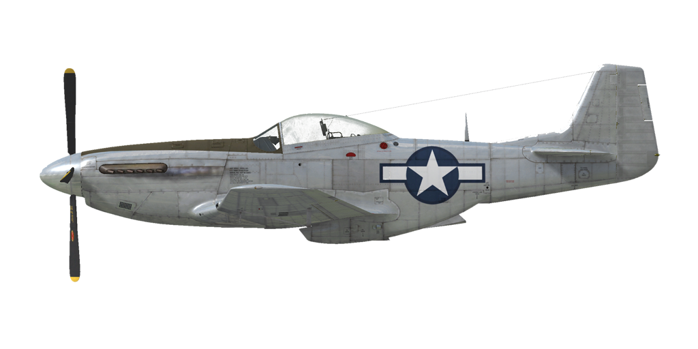

# P-51D-15  
  
  
  
## Beschreibung  
  
Überziehgeschwindigkeit in Flugkonfiguration:  159..196 km/h (99..122 mph)  
Überziehgeschwindigkeit in Landekonfiguration: 147..181 km/h (91..112 mph)  
  
Höchstzulässige Geschwindigkeit im Sturzflug: 812 km/h (505 mph)  
Bruchlastvielfache: 10,0 G  
Kritischer Anstellwinkel in Flugkonfiguration: 19,1 °  
Kritischer Anstellwinkel in Landekonfiguration: 16,3 °  
  
Höchstgeschwindigkeit in Bodennähe, Sondernotleistung: 592 km/h (368 mph)  
Höchstgeschwindigkeit in 8000 m (26250 feet) Höhe, Sondernotleistung: 717 km/h (446 mph)  
  
Höchstgeschwindigkeit in Bodennähe, Sondernotleistung, mit 150-Oktan-Kraftstoff: 607 km/h (377 mph)  
Höchstgeschwindigkeit in 7000 m (22960 Fuß) Höhe, Sondernotleistung, mit 150-Oktan-Kraftstoff: 718 km/h (446 mph)  
  
Höchstgeschwindigkeit in Bodennähe, Kampfleistung: 578 km/h (359 mph)  
Höchstgeschwindigkeit in 8500 m (28000 Fuß) Höhe, Kampfleistung: 711 km/h (442 mph)  
  
Höchstgeschwindigkeit in Bodennähe, Nennleistung: 513 km/h (319 mph)  
Höchstgeschwindigkeit in 8500 m (28000 Fuß) Höhe, Nennleistung: 646 km/h (401 mph)  
  
Dienstgipfelhöhe: 12680 m (41600 Fuß)  
  
Steigleistung mit Sondernotleistung:  
Steigleistung in Bodennähe: 18,1 m/s (3567 Fuß/min)  
Steigleistung in 3000 m (9843 Fuß) Höhe: 15,7 m/s (3083 Fuß/min)  
Steigleistung in 6000 m (19685 Fuß) Höhe: 12,4 m/s (2433 Fuß/min)  
  
Maximale Wendegeschwindigkeit in Bodennähe: 20,0 s, bei 290 km/h (180 mph) IAS.  
Maximale Wendegeschwindigkeit in 3000 m (9843 Fuß) Höhe: 29,5 s, bei 295 km/h (183 mph) IAS.  
  
Reichweite in 3000 m: (9843 Fuß): 4,3 h, bei 350 km/h (217 mph) IAS.  
  
Startgeschwindigkeit: 185..200 km/h (115..125 mph)  
Anfluggeschwindigkeit: 185..210 km/h (115..130 mph)  
Landegeschwindigkeit: 175..195 km/h (110..120 mph)  
Sinkflugpfad: 12.9 °  
  
Anmerkung 1: Die Werte gelten für Normatmosphäre (ISA).  
Anmerkung 2: Flugleistungen varrieren je nach Abfluggewicht.  
Anmerkung 3: Höchstgeschwindigkeiten, Steigleistungen und Wendegeschwindigkeiten gelten für Standardflugzeugmasse und 68% Treibstoff.  
Anmerkung 4: Wendegeschwindigkeiten gelten für Sondernotleistung.  
  
Triebwerk:  
Baumuster: Packard V-1650-7  
Sondernotleistung in Bodennähe: 1650 PS  
Kampfleistung in Bodennähe: 1490 PS  
  
Sondernotleistung in 5800 m (19030 Fuß) Höhe: 1525 PS  
Kampfleistung in 6500 m (21325 Fuß) Höhe: 1390 PS  
  
Leistungsstufen:  
Nennleistung (unbegrenzt): 2700 U/min, 46 inch Hg  
Kampfleistung (bis zu 15 Minuten): 3000 U/min, 61 inch Hg  
Sondernotleistung (bis zu 5 Minuten): 3000 U/min, 67 inch Hg  
Sondernotleistung, 150 Oktan (bis zu 5 Minuten): 3000 U/min, 75 inch Hg  
  
Kühlstoffaustrittstemperatur (normal): 105..115 °C  
Kühlstoffaustrittstemperatur (höchstens): 135 °C  
Schmierstoffeintrittstemperatur (normal): 80 °C  
Schmierstoffeintrittstemperatur (höchstens): 90 °C  
  
Laderumschalthöhe: Automatisch, mit der Möglichkeit, manuell auf den ersten Ladergang umzuschalten.  
  
Leergewicht: 3433 kg (7568 lb)  
Minimalgewicht (keine Munition, 10% Treibstoff, 2 MG entfernt): 3629,5 kg (8002 lb)  
Normalgewicht: 4578,6 kg (10093 lb)  
Höchstabfluggewicht: 5667 kg (12493 lb)  
Kraftstoffmenge: 732 kg (1614 lb) / 1020 l (269 gal)  
Nutzlast: 2234 kg (4925 lb)  
  
Starre Schusswaffenanlage:  
6 x 12,7mm .50 Browning AN/M2, jeweils 400 Schuss für das innere und 270 Schuss für das mittlere und äußere Maschinengewehr, 850 Schuss pro Minute, flügelmontiert.  
Es ist möglich, die beiden mittleren Maschinengewehre zu entfernen und die Munition der äußeren Maschinengewehre auf jeweils 500 Schuss zu erhöhen.  
Es ist möglich, die Munition der inneren Maschinengewehre auf jeweils 490 Schuss zu erhöhen.  
  
Abwurfwaffen:  
2 x M64-Sprengbomben 500 lb  
2 x M65-Sprengbomben 1000 lb  
  
Raketen:  
6 x Ungelenkte Raketen "M8" in zwei Werfern "M10", die abgeworfen werden können.  
  
Länge: 9,84 m (32 3-5/16 Fuß)  
Spannweite: 11,29 m (37 5/16 Fuß)  
Flügelfläche: 22,30 m² (240 Fuß²)  
  
Erster Fronteinsatz: 1944  
  
Eigenschaften:  
- LUFTKAMPF, KUNSTFLUGMANÖVER UND INSTRUMENTENFLUG SIND BEI VOLLER TREIBSTOFFRESERVE VERBOTEN! Das Flugzeug ist mit vollem hinteren Kraftstofftank. Diese Limitierung wird aufgehoben, wenn sich nicht mehr als 20 Gallonen (ca. 75% Kraftstoff übrig) im hinteren Tank befinden. Dieser Tank ist bei einem Gesamtkraftstoffstand von 68% vollständig leer.  
- Es ist möglich, im Sturzflug gefährlich hohe Mach-Zahlen zu erreichen: Das Flugzeug beginnt zu schütteln und Kontrollverlust ist möglich. Nehmen Sie den Schubhebel zurück und kehren Sie vorsichtig zum Horizontalflug zurück.  
- Der Motor ist mit einem automatischen Regler des Ladedrucks ausgestattet, der funktioniert, wenn der Schubhebel auf 1/3 oder höher gestellt wird.  
- Der Motor hat einen Zweiganglader, welcher nicht umgeschaltet werden muss. Der Lader kann manuell in den ersten Gang geschaltet werden.  
- Der Motor ist mit einer automatischen Gemischregelung ausgestattet, die das optimale Gemisch beibehält, wenn sich der Gemischhebel in der RUN Position (70%) befindet. Im Falle einer Fehlfunktion der automatischen Gemischregelung sollte der Gemischhebel in die Full Rich Position (100%) gebracht werden. Um den Motor zu stoppen, sollte der Gemischhebel in die Cut Off Position (0%) gebracht werden.  
- Der Motor verfügt über einen automatischen Drehzahlregler, der die Propellereinstellung steuert, um die erforderliche Drehzahl einzuhalten.  
- Die Verschlussklappen der Wasser- und Ölkühler werden automatisch betätigt, es gibt jedoch einen manuellen Modus.  
- Das Flugzeug verfügt über Höhen-, Seitenund Querrudertrimmung.  
- Die Landeklappen verfügen über einen hydraulischen Regler und können auf 10°, 20°, 30°, 40° oder 50° ausgefahren werden.  
- Jeder Tank hat eine eigene Kraftstoffstandsanzeige: Die Flügeltankanzeiger befinden sich am Cockpitboden und die hintere Tankanzeige befindet sich hinter dem Pilotensitz auf der linken Seite.  
- Das Spornrad dreht sich frei, aber wenn man den Steuerknüppel nach hinten bewegt, wird es verriegelt, sodass es sich durch Betätigung der Pedale steuern lässt.  
- Das Flugzeug verfügt über eine unabhängige linke und rechte hydraulische Radbremse. Um eine der beiden Bremsen zu betätigen, treten Sie den oberen Teil des Ruderpedals.  
- Das Flugzeug ist mit einer Parkbremse ausgestattet.  
- Die Signallampe leuchtet auf, wenn das Fahrwerk eingefahren ist und sich der Schubhebel in der hinteren Position befindet, oder wenn das Fahrwerk ausgefahren ist, aber sich der Schubhebel in der vorderen Position befindet.  
- Das Flugzeug ist mit einer Sirene ausgestattet, die den Piloten warnt, wenn der Schubhebel auf niedrige Stellung gebracht wird und gleichzeitig das Fahrgestell eingefahren ist.  
- Aufgrund der Stauluft ist es unmöglich, die Haube bei hohen Geschwindigkeiten zu öffnen, aber es gibt einen Griff zum Notabwurf, um abspringen zu können.  
- Das Flugzeug ist mit Formationslichtern ausgestattet.  
- Die ungelenkten Raketen werden mit einem elektrischen Regler gestartet, der den Start der Raketen im Einzel-, Paar-, Dreier- und Salvenmodus (alle Raketen im Abstand von 0,1 Sekunden) ermöglicht.  
- Das Kreiselvisier berechnet automatisch die Winkelabweichung beim Feuern auf ein Ziel. Es hat 3 Modi: Feststehendes Fadenkreuz, kreiselstabilisiertes Fadenkreuz, feststehendes und kreiselstabilisiertes Fadenkreuz. Die Winkelabweichung wird nur korrekt berrechnet, wenn die Zielentfernung passend eingestellt ist. Um die Entfernung einzustellen, wird zuerst die Zielgröße über eigene Tastenbefehle eingestellt und dann die Entfernung über die Einstellung der Größe des Fadenkreuzes, bis dieses der Größe des Ziels entspricht.  
  
Basic data and recommended positions of the aircraft controls:  
1. Starting the engine:  
	- recommended position of the mixture control lever: Run (auto mixture control)  
	- recommended position of the radiator control handle: auto radiators control  
	- recommended position of the prop pitch control handle: 100%  
	- recommended position of the throttle lever: 10%  
	- before taxiing, the parking brake must be released  
  
2. Recommended mixture control lever positions for various flight modes: Run (auto mixture control)  
  
3. Recommended positions of the radiators control handle for various flight modes: auto radiators control  
  
4. Approximate fuel consumption at 2000 m altitude:  
	- Cruise engine mode: 8.4 l/min  
	- Combat engine mode: 16.8 l/min  
  
## Änderungen  
  
  
### 150-Oktan-Kraftstoff  
  
150-Oktan-Kraftstoff, der einen erhöhten Ladedruck bis 75 inch erlaubt.  
  
### Zusätzliche Munition für .50 Browning  
  
Zusätzliche Munition für die 12,7 mm ".50 Browning AN/M2" Maschinengewehre: 490 Schuss für die inneren MG.  
  
Zusätzliches Gewicht: 22,4 kg (49,4 lbs)  
Geschwindigkeitsverlust: 0 km/h  
  
### K-14A Kreiselvisier  
  
K-14A kreiselstabilisiertes Visier  
Zusätzliches Gewicht: 5,2 kg (11,5 lbs)  
Geschwindigkeitsverlust: 0 km/h  
  
### 4 x 12,7 mm  .50 Browning AN/M2  
  
Entfernen von 2 flügelmontierten Maschinengewehren und zusätzliche Munition: 500 Schuss für die äußeren Maschinengewehre.  
Gewichtseinsparung: 70,9 kg (156 lbs)  
Entferntes Gewicht der Munition: 9,9 kg (22 lbs)  
Entferntes Gewicht der Schusswaffen: 61 kg (134 lbs)  
Geschwindigkeitsgewinn: 1 km/h (0,6 mph)  
  
### 2 x M64-Sprengbomben 500 lb  
  
2 x M64-Sprengbomben 500 lb  
Zusätzliches Gewicht: 530 kg (1168 lb)  
Gewicht der Munition: 508 kg (1361 lb)  
Gewicht der Abwurfwaffenroste: 22 kg (59 lb)  
Geschwindigkeitsverlust vor Abwurf: 25 km/h (15,5 mph)  
Geschwindigkeitsverlust nach Abwurf: 9 km/h (5,6 mph)  
  
### 2 x M65-Sprengbomben 1000 lb  
  
2 x M65-Sprengbomben 1000 lb  
Zusätzliches Gewicht: 1046 kg (2306 lb)  
Gewicht der Munition: 1024 kg (2258 lb)  
Gewicht der Abwurfwaffenroste: 22 kg (59 lb)  
Geschwindigkeitsverlust vor Abwurf: 51 km/h (31,7 mph)  
Geschwindigkeitsverlust nach Abwurf: 9 km/h (5,6 mph)  
  
### Rückspiegel  
  
Rückspiegel  
Zusätzliches Gewicht: 1 kg (2,2 lbs)  
Geschwindigkeitsverlust: 2 km/h (1,2 mph)  
  
### Bendix MN-26 Funkkompass   
  
Rahmenantennen-Funkkompass zur Navigation über Radiosignalquellen  
Zusätzliches Gewicht: 17,5 kg (38,6 lbs)  
Geschwindigkeitsverlust: 2 km/h (1,2 mph)  
  
### M8-Raketen  
  
M8-Raketen in abwerfbaren M10-Werfern  
  
Zusätzliches Gewicht: 171,9 kg (379 lbs)  
Gewicht der Munition: 115,9 kg (256 lbs)  
Gewicht der Halterung: 56 kg (123 lbs)  
Geschätzter Geschwindigkeitsverlust vor Abschuss: 38 km/h (23,6 mph)  
Geschätzter Geschwindigkeitsverlust nach Abschuss: 28 km/h (17,4 mph)  
Geschätzter Geschwindigkeitsverlust nach Abwurf: 6 km/h (3,7 mph)  