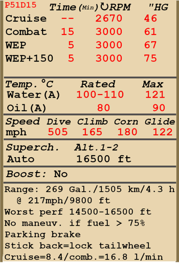

# P-51D-15  

<table><tbody><tr><td style="text-align: center"></td><td style="text-align: center"></td></tr></tbody></table>  

- Documento 01 [ [eng](../real_manuals/p51d15.01.eng.pdf) ]   
- Documento 02 [ [eng](../real_manuals/p51d15.02.eng.pdf) ]   

## Descripción  

Velocidad de pérdida indicada en configuración de vuelo: 159..196 km/h (99..122 mph)  
Velocidad de pérdida indicada en configuración de despegue/aterrizaje: 147..181 km/h (91..112 mph)  
Velocidad de picado límite: 812 km/h (505 mph)  
Carga de rotura máxima (en fuerzas <i>g</i>): 10 <i>g</i>  
Ángulo de ataque crítico en configuración de vuelo: 19,1°  
Ángulo de ataque crítico en configuración de aterrizaje: 16,3°  
  
Velocidad respecto al suelo al nivel del mar, modo motor - WEP: 592 km/h (368 mph)  
Velocidad máxima respecto al suelo a 8000 m (26250 ft), modo motor - WEP: 717 km/h (446 mph)  
  
Velocidad respecto al suelo al nivel del mar, modo motor - WEP, combustible 150 octanos: 607 km/h (377 mph)  
Velocidad máxima respecto al suelo a 7000 m (22960 ft), modo motor - WEP, combustible 150 octanos: 718 km/h (446 mph)  
  
Velocidad respecto al suelo al nivel del mar, modo motor - Combate: 578 km/h (359 mph)  
Velocidad máxima respecto al suelo a 8500 m (28000 ft), modo motor - Combate: 711 km/h (442 mph)  
  
Velocidad respecto al suelo al nivel del mar, modo motor - Crucero: 513 km/h (319 mph)  
Velocidad máxima respecto al suelo a 8500 m (28000 ft), modo motor - Crucero: 646 km/h (401 mph)  
  
Techo de servicio: 12680 m (41600 ft)  
  
Tasa de ascenso en modo motor - WEP  
Tasa de ascenso al nivel del mar: 18,1 m/s (3567 ft/min)  
Tasa de ascenso a 3000 m (9843 ft): 15,7 m/s (3083 ft/min)  
Tasa de ascenso a 6000 m (19685 ft): 12,4 m/s (2433 ft/min)  
  
Viraje de máximo rendimiento al nivel del mar: 20,0 s, a 290 km/h (180 mph) velocidad indicada (IAS).  
Viraje de máximo rendimiento a 3000 m (9843 ft): 29,5 s, a 295 km/h (183 mph) velocidad indicada (IAS).  
  
Autonomía de vuelo a 3000 m (9843 ft): 4,3 h, a 350 km/h (217 mph) velocidad indicada (IAS).  
  
Velocidad de despegue: 185..200 km/h (115...125 mph)  
Velocidad senda de planeo: 185..210 km/h (115...130 mph)  
Velocidad de aterrizaje: 175..195 km/h (110...120 mph)  
Ángulo de aterrizaje: 12,9°  
  
Nota 1: los datos están basados en la atmósfera estándar internacional (ISA).  
Nota 2: diferentes rendimientos de vuelo dados para los diferentes pesos posibles del avión.  
Nota 3: velocidades máximas, tasas de ascenso y tiempos de giro dados para el peso estándar del avión y 68% de combustible.  
Nota 4: tiempos de giro dados para la potencia WEP.  
  
Motor:  
Modelo: Packard V-1650-7  
Potencia máxima en modo WEP al nivel del mar: 1650 CV  
Potencia máxima en modo Combate al nivel del mar: 1490 CV  
  
Potencia máxima en modo WEP a 5800 m (19030 ft): 1525 CV  
Potencia máxima en modo Combate a 6500 m (21325 ft): 1390 CV  
  
Modos de funcionamiento motor:  
Crucero (sin límite de tiempo): 2700 rpm, 46 inHg  
Combate (hasta 15 minutos): 3000 rpm, 61 inHg  
WEP (hasta 5 minutos): 3000 rpm, 67 inHg  
WEP, combustible 150 octanos (hasta 5 minutos): 3000 rpm, 75 inHg  
  
Temperatura nominal del agua en la salida del motor: 100..110 °C  
Temperatura máxima del agua en la salida del motor: 121 °C  
Temperatura nominal del aceite en la admisión del motor: 80 °C  
Temperatura máxima del aceite en la admisión del motor: 90 °C  
  
Altitud de cambio de etapa del compresor: automático con posibilidad de bajar la etapa manualmente  
  
Peso vacío: 3433 kg (7568 lb)  
Peso mínimo (sin munición, 10% de combustible, 2 ametralladoras retiradas): 3629,5 kg (8002 lb)  
Peso estándar: 4578,6 kg (10093 lb)  
Peso máximo al despegue: 5667 kg (12493 lb)  
Carga de combustible: 732 kg (1614 lb) / 1020 l (269 gal)  
Carga útil: 2234 kg (4925 lb)  
  
Armamento delantero:  
6 ametralladoras de 12,7 mm «ANM2 .50» montadas en las alas, 850 balas por minuto, 400 balas para las más interiores y 270 balas para las centrales y las más exteriores  
Es posible retirar las 2 ametralladoras centrales e incrementar la cantidad de munición de las más exteriores hasta las 500 balas por arma.  
Es posible incrementar la cantidad de munición de las más interiores hasta las 490 balas por arma.  
  
Bombas:  
Hasta 2 bombas de propósito general de 500 lb «M64»  
Hasta 2 bombas de propósito general de 1000 lb «M65»  
  
Cohetes:  
6 cohetes no guiados «M8» en dos lanzadores desechables «M10»  
  
Longitud: 9,84 m (32 3-5/16 ft)  
Envergadura alar: 11,29 m (37 5/16 ft)  
Superficie de ala: 22,30 m² (240 ft²)  
  
Debut en combate: 1944  
  
Características operativas:  
- ¡EL COMBATE, LAS MANIOBRAS ACROBÁTICAS Y EL VUELO INSTRUMENTAL ESTÁN PROHIBIDOS CON LOS DEPÓSITOS DE COMBUSTIBLE LLENOS! El avión es inestable con los depósitos llenos. Esta restricción termina cuando quedan 20 galones (aproximadamente a un 75% de combustible restante) o menos en el depósito trasero. Este depósito se vacía completamente cuando el combustible restante es de un 68%.  
- Es posible alcanzar números Mach peligrosamente altos durante un picado: el avión comienza a temblar y es posible perder el control. Reduzca la potencia y vuelva suavemente a un vuelo horizontal.  
- El motor tiene un regulador automático de la presión del colector que entra en funcionamiento cuando la potencia se fija a 1/3 o más.  
- El motor cuenta con un compresor mecánico de dos etapas que no precisa de control manual, aunque se puede reducir la etapa manualmente.  
- El motor está equipado con un sistema de control automático de la mezcla que la mantiene en su grado óptimo cuando la palanca de control de la mezcla está en la posición «RUN» (70%). En caso de mal funcionamiento del control automático de la mezcla la palanca debería situarse en la posición «Full Rich» (100%). Para apagar el motor, la palanca debe situarse en la posición «Cut Off» (0%).  
- El motor tiene un regulador automático de las rpm que controla el paso de la hélice para mantener las rpm requeridas.  
- Las persianas de los radiadores de agua y aceite funcionan automáticamente, pero se también se pueden controlar manualmente.  
- El avión tiene compensadores para el «trimado» de todos los controles de vuelo: cabeceo, alabeo y guiñada.  
- Los flaps tienen un accionador hidraúlico y pueden bajarse hasta unas posiciones fijas: 10°, 20°, 30°, 40° o 50°.  
- Cada depósito de combustible tiene su indicador de nivel: los indicadores de los depósitos del ala están en el suelo de la cabina y el indicador del depósito trasero detrás del asiento del piloto, a la izquierda.  
- La rueda de cola gira líbremente, pero moviendo la palanca de control hacia atrás se bloquea de tal manera que gira según se muevan los pedales.  
- El avión posee unos controles hidráulicos independientes para el frenado de la rueda izquierda y derecha. Para frenar cada una de ellas es necesario empujar la parte superior del pedal del control de timón correspondiente.  
- El avión está equipado con un sistema de freno de estacionamiento.  
- La luz de aviso del tren de aterrizaje se enciende cuando las ruedas están subidas y la palanca de potencia está hacia atrás o cuando el tren está bajado y la palanca de potencia está hacia adelante.  
- El avión cuenta con una sirena que avisa al piloto cuando la palanca de potencia está al mínimo y el tren de aterrizaje está subido.  
- Es imposible abrir o cerrar la cubierta a altas velocidades debido a la intensidad del flujo del aire. La cubierta tiene un sistema de desbloqueo de emergencia para facilitar el salto.  
- El avión dispone de luces de formación.  
- Los cohetes no guiados se disparan mediante un controlador eléctrico que permite un lanzamiento de uno, dos, tres o una salva (todos los cohetes con un intervalo de 0,1 s entre cada uno de ellos). Los lanzadores son desechables.  
- La mira giroscópica calcula automáticamente el ángulo de deflexión necesario mientras se dispara al objetivo. Tiene 3 modos: retícula fija, retícula fija y giroscópica y retícula giroscópica. El ángulo de deflexión solo se calculará correctamente si la distancia al objetivo está configurada de forma adecuada. Para configurar la distancia primero es necesario ajustar la base del objetivo usando los controles separados y después establecer la distancia ajustando el tamaño de la retícula de telemetría al mismo tamaño que el del objetivo.  
  
Datos básicos y configuraciones recomendadas de los controles del avión:  
1. Arranque del motor:  
	- palanca de control de la mezcla: «RUN» (control de mezcla automático)  
	- radiadores de agua y aceite: (control radiadores automático)  
	- palanca de control rpm de la hélice: 100%  
	- palanca de potencia: 10%  
	- antes de empezar a rodar, quitar el freno de estacionamiento  
  
2. Posición de la palanca de control de mezcla según momento de vuelo: «RUN» (control de mezcla automático)  
  
3. Posición de las aletas/persianas de radiadores según momento de vuelo: (control radiadores automático)  
  
4. Consumo aproximado de combustible a 2000 m de altitud:  
	- Modo motor - Crucero: 8,4 l/min  
	- Modo motor - Combate: 16,8 l/min  

## Modificaciones  
### Combustible de 150 octanos  

El combustible de 150 octanos permite aumentar la presión en el colector hasta las 75 pulgadas  
  
### Munición adicional M2 cal .50  

Munición adicional para las dos ametralladoras interiores montadas en las alas: 490 balas por arma  
  
Peso adicional: 22,4 kg (49,4 lb)  
Pérdida de velocidad estimada: 0 km/h  
  
### Mira giroscópica  

Mira giroscópica K-14A  
Peso adicional: 5,2 kg  (11,5 lb)  
Pérdida de velocidad estimada: 0 km/h  
  
### 4 ametralladoras ANM2 cal .50   

Desinstalación de las 2 ametralladoras centrales montadas en las alas y munición adicional para las ametralladoras exteriores montadas en las alas: 500 balas por arma  
Peso retirado: 70,9 kg (156 lb)  
Peso de munición retirada: 9,9 kg (22 lb)  
Peso del armamento retirado: 61 kg (134 lb)  
Ganancia de velocidad estimada: 1 km/h (0,6 mph)  
  
### Racks para 2 bombas M64  

Hasta 2 bombas de propósito general de 500 lb M64 montadas en racks bajo las alas  
Peso adicional: 530 kg (1169 lb)  
Peso de munición: 508 kg (1120 lb)  
Peso de los soportes: 22 kg (49 lb)  
Pérdida de velocidad estimada antes de soltar: 25 km/h (15,5 mph)  
Pérdida de velocidad estimada tras soltar: 9 km/h (5,6 mph)  
  
### Racks para 2 bombas M65  

Hasta 2 bombas de propósito general de 1000 lb M65 montadas en racks bajo las alas  
Peso adicional: 1046 kg (2306 lb)  
Peso de munición: 1024 kg (2258 lb)  
Peso de los soportes: 22 kg (49 lb)  
Pérdida de velocidad estimada antes de soltar: 51 km/h (31,7 mph)  
Pérdida de velocidad estimada tras soltar: 9 km/h (5,6 mph)  
  
### Espejo  

Espejo para ver qué sucede detrás del avión  
Peso adicional: 1 kg (2,2 lb)  
Pérdida de velocidad estimada: 2 km/h (1,2 mph)  
  
### Bendix MN-26  

Radiogoniómetro para navegación con radiobalizas  
Peso adicional: 17,5 kg (38,6 lb)  
Pérdida de velocidad estimada: 2 km/h (1,2 mph)  
  
### 6 cohetes M8  

6 cohetes M8 en lanzadores desechables M10  
  
Peso adicional: 171,9 kg (379 lb)  
Peso de munición: 115,9 kg (256 lb)  
Peso de los soportes: 56 kg (123 lb)  
Pérdida de velocidad estimada antes de lanzarlos: 38 km/h (23,6 mph)  
Pérdida de velocidad estimada tras lanzarlos: 28 km/h (17,4 mph)  
Pérdida de velocidad estimada tras soltar lanzadores: 6 km/h (3,7 mph)  
