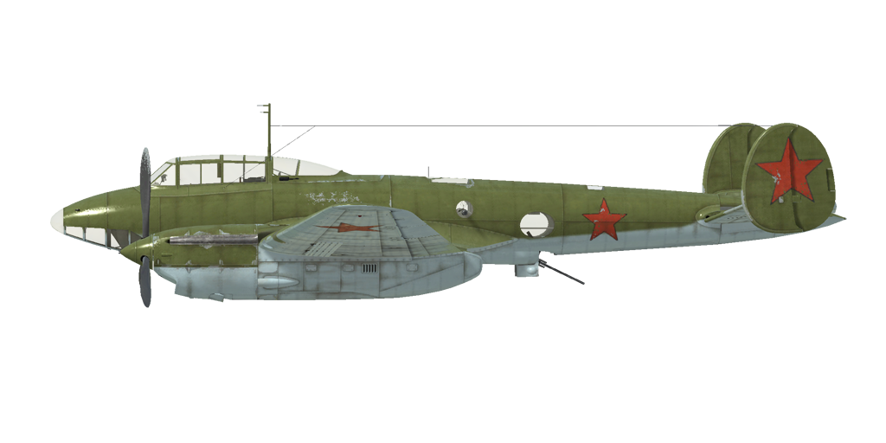

# Pe-2 ser.35  

| Image | Notes  
|:---|:---  
|  |   

## Descripción  

Velocidad indicada de pérdida en configuración de vuelo: 175..200 km/h  
Velocidad indicada de pérdida en configuración de despegue/aterrizaje: 148..169 km/h  
Velocidad de picado límite: 790 km/h  
Carga de rotura máxima (en fuerzas <i>g</i>): 11 <i>g</i>  
Ángulo de ataque crítico en configuración de vuelo: 13,9°  
Ángulo de ataque crítico en configuración de aterrizaje: 9,8°  
  
Velocidad respecto al suelo al nivel del mar, modo motor - Continuo: 434 km/h  
Velocidad máxima respecto al suelo a 2000 m, modo motor - Continuo: 476 km/h  
Velocidad máxima respecto al suelo a 5000 m, modo motor - Continuo: 521 km/h  
  
Techo de servicio: 9100 m  
Tasa de ascenso al nivel del mar: 9,3 m/s  
Tasa de ascenso a 3000 m: 8,4 m/s  
Tasa de ascenso a 6000 m: 5,6 m/s  
  
Viraje de máximo rendimiento al nivel del mar: 30,5 s, a 270 km/h velocidad indicada (IAS).  
Viraje de máximo rendimiento a 3000 m: 39,9 s, a 270 km/h velocidad indicada (IAS).  
  
Autonomía de vuelo a 3000 m: 3,7 h, a 300 km/h velocidad indicada (IAS).  
  
Velocidad de despegue: 160..200 km/h  
Velocidad senda de planeo: 220..240 km/h  
Velocidad de aterrizaje: 155..165 km/h  
Ángulo de aterrizaje: 12,5°  
  
Nota 1: los datos están basados en la atmósfera estándar internacional (ISA).  
Nota 2: diferentes rendimientos de vuelo dados para los diferentes pesos posibles del avión.  
Nota 3: velocidades máximas, tasas de ascenso y tiempos de giro dados para el peso estándar del avión.  
Nota 4: tasas de ascenso y tiempos de giro dados para la potencia nominal en modo Continuo.  
  
Motor:  
Modelo: M-105RA  
Potencia máxima en modo Continuo al nivel del mar: 1020 CV  
Potencia máxima en modo Continuo a 2000 m: 1100 CV  
Potencia máxima en modo Continuo a 4000 m: 1050 CV  
  
Modos de funcionamiento motor:  
Continuo (sin límite de tiempo): 2700 rpm, 910 mmHg  
  
Temperatura nominal del agua en la salida del motor: 70..85 °C  
Temperatura máxima del agua en la salida del motor: 100 °C  
Temperatura nominal del aceite a la salida del motor: 90..100 °C  
Temperatura máxima del aceite a la salida del motor: 110 °C  
  
Altitud conexión compresor: 2700 m  
  
Peso vacío: 6078 kg  
Peso mínimo (sin munición, 10% de combustible): 6640 kg  
Peso estándar: 7697 kg  
Peso máximo al despegue: 8712 kg  
Carga de combustible: 1129 kg / 1505 l  
Carga útil: 2634 kg  
  
Armamento delantero:  
1 ametralladora de 12,7 mm «UB», 150 balas, 1000 balas por minuto, en morro  
1 ametralladora de 7,62 mm «ShKAS», 450 balas, 1800 balas por minuto, en morro  
  
Armamento defensivo:  
Dorso: 1 ametralladora de 7,62 mm «ShKAS», 750 balas, 1800 balas por minuto  
Vientre: 1 ametralladora de 12,7 mm «UB», 200 balas, 1000 balas por minuto  
Lateral: 1 ametralladora de 7,62 mm «ShKAS», 225 balas, 1800 balas por minuto  
  
Bombas:  
Hasta 10 bombas de propósito general de 104 kg «FAB-100M»  
Hasta 4 bombas de propósito general de 254 kg «FAB-250sv»  
Hasta 2 bombas de propósito general de 512 kg «FAB-500M»  
  
Cohetes:  
10 cohetes de 23 kg «ROS-132», 9,1 kg de carga HE —altamente explosiva—  
  
Longitud: 12,69 m  
Envergadura alar: 17,12 m  
Superficie de ala: 40,8 m²  
  
Debut en combate: julio de 1941  
  
Características operativas:  
- El motor tiene un compresor mecánico de dos etapas que debe conmutarse a 2700 m de altitud.  
- El control de la mezcla del motor es manual; es necesario empobrecer la mezcla si la altitud es mayor de 3-4 km para un funcionamiento óptimo del motor. Además, al empobrecer la mezcla se reduce el consumo de combustible durante el vuelo.  
- El motor tiene un regulador automático de las rpm que las mantiene al valor correspondiente a la posición de la palanca de control del regulador. Este regulador controla automáticamente el paso de la hélice para mantener las rpm requeridas. El regulador funciona mediante electricidad y le lleva bastante tiempo alcanzar las revoluciones requeridas, hasta 45 segundos cuando se pasa del mínimo al máximo.  
- Las persianas de los radiadores de agua y aceite se controlan manualmente.  
- El avión tiene compensadores para todos los controles de vuelo: cabeceo, alabeo y guiñada.  
- El avión cuenta con unos aerofrenos de tipo valla ubicados bajo el ala y utilizados para frenar el avión durante los bombardeos en picado.  
- El avión está equipado con un sistema automático de entrada y salida de un picado (sistema de picado). Cuando el sistema de está activado, el avión entra en picado cuando los aerofrenos se extienden (pasan por la posición de 45°) y se recuperará del picado cuando se pulse el botón de arrojar bombas o el botón de recuperación del picado («Ctrl_Izq + D» por defecto). Este sistema funciona controlando la compensación («trimado») del elevador; para un correcto funcionamiento, el compensador debe estar en un rango comprendido entre -4,5° y +4,5° antes de encender el sistema de picado. Si el compensador del elevador (timón de profundidad) está fuera de ese rango, el avión es compensado manualmente o se retraen los aerofrenos mientras el sistema de picado está activado, el sistema se desconectará.  
- Los flaps tienen un accionador electro-hidraúlico y pueden bajarse gradualmente hasta formar un ángulo de 50°. Al tratar de aterrizar con los flaps completamente bajados, el máximo ángulo de ataque antes de entrar en pérdida es menor que el ángulo de cabeceo necesario para el aterrizaje. Por este motivo, está prohibido bajar los flaps más de 35º (70%) durante el aterrizaje.  
- El avión cuenta con un estabilizador horizontal automático. El sistema de control ajusta de forma automática el ángulo del estabilizador dependiendo del ángulo de extensión de los flaps.  
- La rueda de cola del avión gira libremente sin posibilidad de bloqueo. Por ello, es necesario manejar los pedales del timón con seguridad y precisión durante el despegue y aterrizaje.  
- El avión posee frenos neumáticos diferenciales en la ruedas compartidos por una palanca de freno. Cuando se tira de la palanca del freno y se pisa un pedal del control del timón el freno opuesto se libera y el avión comienza a girar en un sentido u otro.  
- El avión cuenta con tres indicadores del nivel de combustible remanente del depósito del fuselaje, depósitos del ala izquierda, y depósitos del ala derecha.  
- La cubierta tiene un sistema de desbloqueo de emergencia para facilitar el salto.  
- El avión está equipado con un selector de lanzamiento de bombas con cuatro modos: lanzar una, dos en ráfaga, cuatro en ráfaga, o lanzar todas en ráfaga. También hay otro mando para fijar el retraso del lanzamiento entre cada bomba de la ráfaga.  
- Cuando hay cohetes instalados existe un mando de lanzamiento con tres modos disponibles: disparar uno, disparar dos en ráfaga o disparar cuatro en ráfaga. El avión cuenta con un sistema de control de disparo diseñado para ocho cohetes. Sin embargo, para aumentar la potencia de disparo, era muy común instalar diez cohetes. En ese caso el noveno cohete se disparará junto al séptimo y el décimo junto al octavo.  
  
Datos básicos y configuraciones recomendadas de los controles del avión:  
1. Arranque de los motores:  
	- palancas de control de la mezcla: 100%  
	- radiadores de agua y aceite: abiertos 50%  
	- palancas de control rpm de las hélices: 100%  
	- palancas de potencia: 10%  
  
2. Posición de las palancas de control de mezcla según momento de vuelo:  
	- Cuando el motor funciona a baja potencia cerca del suelo, las palancas de control de la mezcla deben estar sobre el 50%.  
	- Cuando el motor funciona a máxima potencia cerca del suelo, las palancas de control de la mezcla deben estar entre el 75-80%.  
	- A medida que se gana altura, se debe ir empobreciendo la mezcla.  
  
3.1 Posición de los radiadores de aceite según momento de vuelo:  
	- despegue: abiertos 50%  
	- ascenso: abiertos 100%  
	- crucero: abiertos 100% (en condiciones invernales - abiertos 50%)  
	- combate: abiertos 50%  
  
3.2 Posición de los radiadores de agua según momento de vuelo:  
	- despegue: abiertos 50%  
	- ascenso: abiertos 100%  
	- crucero: abiertos 60% (en condiciones invernales - abiertos 20%)  
	- combate: abiertos 50%  
  
4. Consumo aproximado de combustible a 2000 m de altitud:  
	- Modo motor - Crucero: 13,1 l/min  

## Modificaciones  
### 10 bombas FAB-100M  

10 bombas de propósito general de 104 kg FAB-100M  
Peso adicional: 1040 kg  
Peso de munición: 1040 kg  
Pérdida de velocidad estimada antes de soltar: 23 km/h  
Pérdida de velocidad estimada tras soltar: 0 km/h  
  
### 4 bombas FAB-250sv  

4 bombas de propósito general de 254 kg FAB-250sv  
Peso adicional: 1016 kg  
Peso de munición: 1016 kg  
Pérdida de velocidad estimada antes de soltar: 33 km/h  
Pérdida de velocidad estimada tras soltar: 0 km/h  
  
### 2 bombas FAB-500M  

2 bombas de propósito general de 512 kg FAB-500M  
Peso adicional: 1024 kg  
Peso de munición: 1024 kg  
Pérdida de velocidad estimada antes de soltar: 48 km/h  
Pérdida de velocidad estimada tras soltar: 0 km/h  
  
### Tripulación femenina  

Marina Mijáilovna Raskova (28 de marzo de 1912 - 4 de enero de 1943) fue la fundadora y oficial al mando del 587.º Regimiento aéreo de bombarderos (587.º BAP). Raskova estuvo al mando de esta unidad formada por mujeres hasta su muerte en un accidente de vuelo, mientras dirigía a otros dos Petliakov hacia su primer aeródromo operativo, cerca de Stalingrado. La unidad realizó 1134 misiones, lanzando más de 980 toneladas de bombas. Cinco de sus integrantes fueron condecoradas con la distinción de Héroe de la Unión Soviética.  
  
### 10 cohetes ROS-132  

10 cohetes no guiados explosivos (HE) de 132 mm ROS-132  
Peso adicional: 280 kg  
Peso de munición: 230 kg  
Peso de los soportes: 50 kg  
Pérdida de velocidad estimada antes de lanzarlos: 31 km/h  
Pérdida de velocidad estimada tras lanzarlos: 20 km/h  
  
### RPK-2  

Radiogoniómetro para navegación con radiobalizas  
Peso adicional: 20 kg  
Pérdida de velocidad estimada: 2 km/h  
