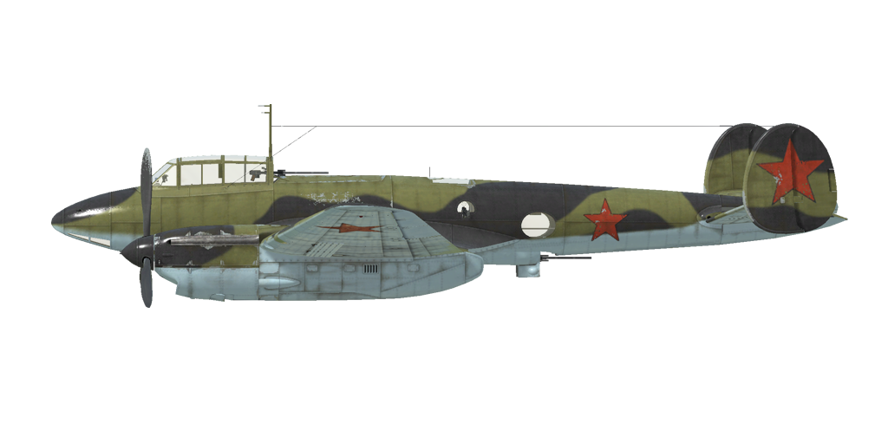

# Pe-2 Brh. 87  

<table><tbody><tr><td style="text-align: center"></td><td style="text-align: center"></td></tr><tr><td style="text-align: center" colspan="2"></td></tr></tbody></table>  

Überziehgeschwindigkeit in Flugkonfiguration: 175..200 km/h  
Überziehgeschwindigkeit in Landekonfiguration: 148..169 km/h  
Höchstzulässige Geschwindigkeit im Sturzflug: 790 km/h  
Bruchlastvielfache: 11 G  
Kritischer Anstellwinkel in Flugkonfiguration: 13.9 °  
Kritischer Anstellwinkel in Landekonfiguration: 9.8 °  
  
Höchstgeschwindigkeit in Bodennähe, Nennleistung: 446 km/h  
Höchstgeschwindigkeit in 2000 m Höhe, Nennleistung: 476 km/h  
Höchstgeschwindigkeit in 5000 m Höhe, Nennleistung: 498 km/h  
  
Dienstgipfelhöhe: 8000 m  
Steigleistung in Bodennähe: 10.4 m/s  
Steigleistung in 3000 m Höhe: 7.8 m/s  
Steigleistung in 6000 m Höhe: 3.0 m/s  
  
Maximale Wendegeschwindigkeit in Bodennähe: 29.9 s (270 km/h IAS).  
Maximale Wendegeschwindigkeit in 3000 m Höhe: 40.3 s (270 km/h IAS).  
  
Reichweite in 5000 m: 2.8 h, bei 300 km/h IAS.  
  
Startgeschwindigkeit: 160..200 km/h  
Anfluggeschwindigkeit: 220..240 km/h  
Landegeschwindigkeit: 155..165 km/h  
Sinkflugpfad: 12.5 °  
  
Anmerkung 1: Die Werte gelten für Normatmosphäre (ISA).  
Anmerkung 2: Flugleistungen varrieren je nach Abfluggewicht.  
Anmerkung 3: Höchstgeschwindigkeiten, Steigleistungen und Wendegeschwindigkeiten gelten für Standard-Fluggewicht.  
Anmerkung 4: Steigraten und Wendegeschwindigkeiten gelten für Nennleistung.  
  
Triebwerk:  
Baumuster: M-105RF  
Nennleistung in Bodennähe: 1200 PS  
Nennleistung in 800 m Höhe: 1260 PS  
Nennleistung in 2700 m Höhe: 1200 PS  
  
Leistungsstufen:  
Nennleistung (unbegrenzt): 2700 U/min, 1050 mm Hg  
  
Kühlstoffaustrittstemperatur (normal): 70..85 °C  
Kühlstoffaustrittstemperatur (höchstens): 100 °C  
Schmierstoffaustrittstemperatur (normal): 90..100 °C  
Schmierstoffaustrittstemperatur (höchstens): 115 °C  
  
Laderumschalthöhe: 2300 m  
  
Leergewicht: 6089 kg  
Minimalgewicht (keine Munition, 10% Treibstoff): 6643 kg  
Normalgewicht: 7685 kg  
Höchstabfluggewicht: 8701 kg  
Kraftstoffmenge: 1113 kg / 1484 l  
Nutzlast: 2612 kg  
  
Starre Schusswaffenanlage:  
12.7 mm UB, 150 Schuss, 1000 Schuss pro Minute, montiert in Flugzeugnase  
7.62 mm SchKAS, 450 Schuss, 1800 Schuss pro Minute, montiert in Flugzeugnase  
  
Abwehrbewaffnung:  
Oben: 12.7 mm UB, 200 Schuss, 1000 Schuss pro Minute  
Unten: 12.7 mm UB, 200 Schuss, 1000 Schuss pro Minute  
Seitwärts: 7.62 mm SchKAS, 225 Schuss, 1800 Schuss pro Minute  
Oberer Waffenturm: 12.7 mm UB, 200 Schuss, 1000 Schuss pro Minute (Rüstsatz Serie 110)  
  
Abwurfwaffen:  
Bis zu 10 x 104 kg Mehrzweck-Sprengbomben FAB-100M  
Bis zu 4 x 254 kg Mehrzweck-Sprengbomben FAB-250sv  
Bis zu 2 x 512 kg Mehrzweck-Sprengbomben FAB-500M  
  
Raketen:  
10 x 23 kg Raketen ROS-132, Sprengladung 9.1 kg  
  
Länge: 12.69 m  
Spannweite: 17.12 m  
Flügelfläche: 40.8 m²  
  
Erster Fronteinsatz: Mai 1942  
  
Eigenschaften:  
- Der Motor hat einen Zweiganglader, welcher manuell auf 2300 m Höhe umgeschaltet werden muss.  
- Die Gemischregelung erfolgt manuell. Es ist erforderlich das Gemisch ab einer Höhe von 3-4 km abzumagern. Das Abmagern des Gemisches reduziert auch den Treibstoffverbrauch während des Fluges.  
- Der Motor besitzt eine automatische Drehzahlregelung, welche die Motordrehzahl je nach Hebelstellung festlegt. Der Regler verstellt automatisch den Anstellwinkel des Propellers um die erforderliche Drehzahl einzuhalten.  
- Die Verstellung der Wasserkühlerklappen erfolgt manuell. Die Ölkühlerklappen sind in einer Position fixiert.  
- Das Flugzeug verfügt über Höhen-, Seiten- und Querrudertrimmung.  
- Das Flugzeug besitzt zaunartige Luftbremsen, welche unter jedem Flügel befestigt sind und dazu dienen, das Flugzeug bei einem Bombenangriff im Sturzflug abzubremsen.  
- The aircraft is equipped with an automatic dive system. When the dive system is engaged, the plane enters a dive when the airbrakes are extended (passing through the 45 ° position) and will recover from the dive when you either press the bomb drop button or the dive recovery button to exit the dive (LCtrl + D by default). The dive system controls the elevator trim - for correct operation, the trimmer must be in the range between -4.5 ° to +4.5 ° before turning on the dive system. If the trimmer is outside this range, the aircraft has been trimmed manually, or if the airbrakes are retracted while the dive system is engaged, the dive system will be turned off.  
- Die Landeklappen sind elektro-hydraulisch geregelt und können bis zu einem Winkel von 50° ausgefahren werden. Bei der Landung und wenn die Landeklappen vollständig ausgefahren sind, ist der Anstellwinkel kleiner als der Neigungswinkel bei der Landung. Deshalb ist es verboten, bei der Landung die Klappen auf mehr als 35° (70%) auszufahren.  
- Das Flugzeug hat ein automatisch gesteuertes Höhenleitwerk. Ein automatisches Regelsystem verstellt den Winkel je nach Stellung der Landeklappen.  
- Das Flugzeug hat ein frei bewegliches und nicht verriegelbares Spornrad. Aus diesem Grund ist es erforderlich die Ruderpedale bei Start und Landung sicher und genau zu bedienen.  
- Das Flugzeug hat differentielle pneumatische Bremsen, die mit einem gemeinsamen Bremshebel betätigt werden. Wenn der Bremshebel gezogen und das Ruderpedal betätigt wird, wird die gegenüberliegende Bremse gelöst und das Flugzeug dreht sich zu der einen oder der anderen Seite.  
- Das Flugzeug hat eine Tankanzeige, welche den gesamten Treibstoffstand anzeigt.  
Die Cockpithaube kann für den Notausstieg abgeworfen werden.  
- Das Flugzeug ist mit einer Bombensteuerung ausgerüstet. Es gibt vier Abwurfarten: Einzelabwurf, zwei in einer Salve abwerfen, vier in einer Salve abwerfen oder alle Bomben in einer Salve abwerfen. Es gibt auch eine Steuerung für den zeitlichen Versatz zwischen jeder Bombe einer Salve.   
- Wenn Raketen installiert sind, gibt es eine Steuerung für die Salven. Es gibt drei Abschussarten: einzeln, zwei in einer Salve oder vier in einer Salve. Das Flugzeug hat ein Feuerkontrollsystem, das für acht Raketen ausgelegt ist. Allerdings wurden für zusätzliche Feuerkraft typischerweise zehn Raketen geladen. In diesem Fall wird die neunte Rakete zusammen mit der siebten und die zehnte zusammen mit der achten Rakete abgefeuert.  
  
Basic data and recommended positions of the aircraft controls:  
1. Starting the engine:  
	- recommended position of the mixture control lever: 100%  
	- recommended position of the radiator control handle: open 50%  
	- recommended position of the prop pitch control handle: 100%  
	- recommended position of the throttle lever: 10%  
  
2. Recommended mixture control lever positions for various flight modes: Run (auto mixture control)  
	- When running the engine at low throttle near the ground, the mixture control lever should be in the position of about 50%.  
	- When the engine is running at full throttle near the ground, the mixture control lever should be in the 75-80% position.  
	- As you gain altitude, the altitude corrector closes.  
  
3. Recommended positions of the water radiator control handle for various flight modes:  
	- takeoff: open 50%  
	- climb: open 100%  
	- cruise flight: open 100% (in winter conditions - open 20%)  
	- combat: open 50%  
  
4. Approximate fuel consumption at 2000 m altitude:  
	- Cruise engine mode: 15.3 l/min  

## Änderungen  

### 10 x Bomben, Typ FAB-100M  

10 x 104-kg-Splitterbomben FAB-100M  
Zusätzliches Gewicht: 1040 kg  
Gewicht der Munition: 1040 kg  
Geschwindigkeitsverlust vor Abwurf: 23 km/h  
Geschwindigkeitsverlust nach Abwurf: 0 km/h  
  

### 4 x Bomben, Typ FAB-250sv  

4 x 254-kg-Splitterbomben FAB-250sv  
Zusätzliches Gewicht: 1016 kg  
Gewicht der Munition: 1016 kg  
Geschwindigkeitsverlust vor Abwurf: 33 km/h  
Geschwindigkeitsverlust nach Abwurf: 0 km/h  
  

### 2 x Bomben, Typ FAB-500M  

2 x 512-kg-Splitterbomben FAB-500M  
Zusätzliches Gewicht: 1024 kg  
Gewicht der Munition: 1024 kg  
Geschwindigkeitsverlust vor Abwurf: 48 km/h  
Geschwindigkeitsverlust nach Abwurf: 0 km/h  
  
### Female Crew  

Marina Mikhaylovna Raskova (March 28th, 1912 – January 4th, 1943) was the founding and commanding officer of the 587th Bomber Aviation Regiment. Raskova commanded this female unit until her death in a flying accident, while leading two other Petlyakovs to their first operative airfield near Stalingrad. The unit flew 1,134 missions, dropping over 980 tons of bombs. It produced five Heroes of the Soviet Union.  
  

### 10 x Raketen, Typ ROS-132  

10 x ungelenkte 132-mm-Explosivraketen ROS-132  
Zusätzliches Gewicht: 280 kg  
Gewicht der Munition: 230 kg  
Gewicht der Abwurfwaffenroste: 50 kg  
Geschwindigkeitsverlust vor dem Abfeuern: 31 km/h  
Geschwindigkeitsverlust nach dem Abfeuern: 20 km/h  
  

### Heckgeschützturm  

Rückwärtiges Weitwinkelgeschütz mit einem 12,7-mm-UBT-MG mit 200 Schuss  
Zusätzliches Gewicht: 10 kg  
Geschwindigkeitsverlust: 5 km/h  
