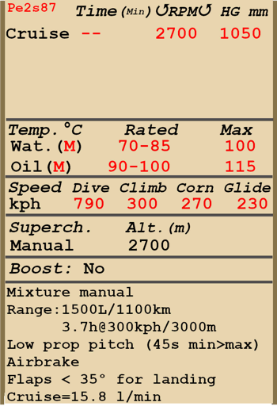
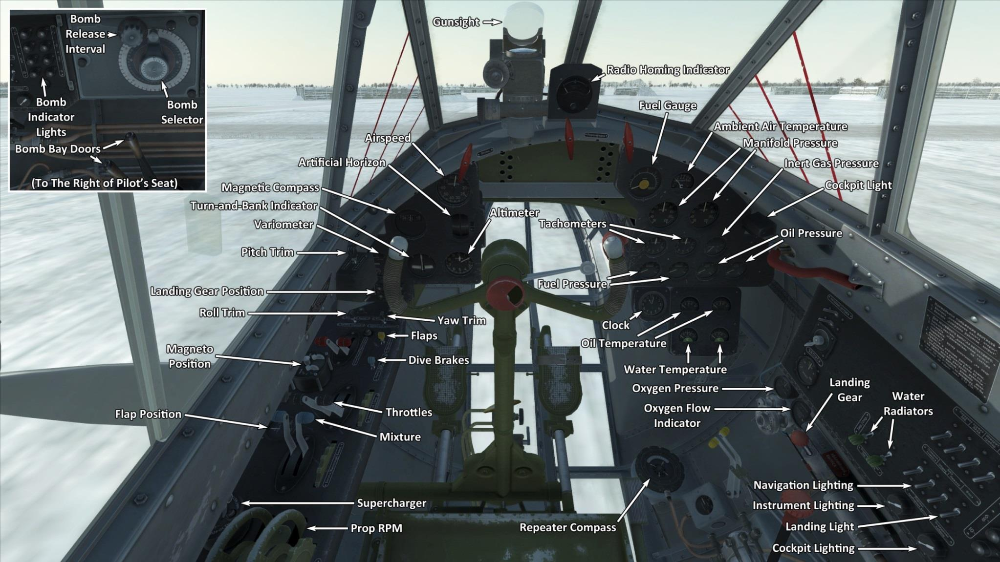

# Пе-2 87 серии  

<table><tbody><tr><td style="text-align: center"></td><td style="text-align: center"></td></tr><tr><td style="text-align: center" colspan="2"></td></tr></tbody></table>  

## Описание  

Приборная скорость сваливания в полётной конфигурации: 175..200 км/ч  
Приборная скорость сваливания в посадочной конфигурации: 148..169 км/ч  
Предельная скорость в пикировании: 790 км/ч  
Разрушающая перегрузка: 11 единиц  
Угол атаки сваливания, в полётной конфигурации: 13,9 °  
Угол атаки сваливания, в посадочной конфигурации: 9,8 °  
  
Максимальная истинная скорость у земли, режим двигателя - номинал: 446 км/ч  
Максимальная истинная скорость на высоте 2000 м, режим двигателя - номинал: 476 км/ч  
Максимальная истинная скорость на высоте 5000 м, режим двигателя - номинал: 498 км/ч  
  
Практический потолок: 8000 м  
Скороподъёмность у земли: 10,4 м/с  
Скороподъёмность на высоте 3000 м: 7,8 м/с  
Скороподъёмность на высоте 6000 м: 3,0 м/с  
  
Время виража предельного по тяге у земли: 29,9 с, на скорости 270 км/ч по прибору  
Время виража предельного по тяге на высоте 3000 м: 40,3 с, на скорости 270 км/ч по прибору  
  
Продолжительность полёта на высоте 3000 м: 2,8 ч, на скорости 300 км/ч по прибору  
  
Скорость взлётная: 160..200 км/ч  
Скорость на глиссаде: 220..240 км/ч  
Скорость посадочная: 155..165 км/ч  
Посадочный угол: 12,5 °  
  
Примечание 1: данные указаны для условий международной стандартной атмосферы.  
Примечание 2: диапазоны характеристик даны для допустимого диапазона масс самолёта.  
Примечание 3: максимальные скорости, скороподъемности и время виража даны для стандартной массы самолёта.  
Примечание 4: скороподъемность и время виража даны на номинальном режиме работы двигателя.  
  
Двигатель:  
Модель: М-105РФ  
Максимальная мощность на номинальном режиме у земли: 1200 л.с.  
Максимальная мощность на номинальном режиме на высоте 800 м: 1260 л.с.  
Максимальная мощность на номинальном режиме на высоте 2700 м: 1200 л.с.  
  
Режимы работы двигателя:  
Номинальный (время неограничено): 2700 об/мин, 1050 мм рт.ст.  
  
Температура воды на выходе из двигателя номинальная: 70..85 °С  
Температура воды на выходе из двигателя предельная: 100 °С  
Температура масла на выходе из двигателя номинальная: 90..100 °С  
Температура масла на выходе из двигателя предельная: 115 °С  
  
Высота переключения нагнетателя: 2300 м  
  
Масса пустого самолёта: 6089 кг  
Минимальная масса (без БК, 10% топлива): 6643 кг  
Стандартная масса: 7685 кг  
Максимальная взлётная масса: 8701 кг  
Максимальный запас топлива: 1113 кг / 1484 л  
Максимальная полезная нагрузка: 2612 кг  
  
Вооружение курсовое:  
12,7мм пулемёт "УБ", 150 патронов, 1000 выстр/мин, носовой  
7,62мм пулемёт "ШКАС", 450 патронов, 1800 выстр/мин, носовой  
  
Вооружение оборонительное:  
Верхнее: 12,7мм пулемёт "УБ", 200 патронов, 1000 выстр/мин  
Нижнее: 12,7мм пулемёт "УБ", 200 патронов, 1000 выстр/мин  
Боковое: 7,62мм пулемёт "ШКАС", 225 патронов, 1800 выстр/мин  
Верхнее турельное: 12,7мм пулемёт "УБ", 200 патронов, 1000 выстр/мин (модификация "серия 110")  
  
Вооружение бомбовое:  
До 10 x 104 кг осколочно-фугасных авиабомб "ФАБ-100М"  
До 4 x 254 кг осколочно-фугасных авиабомб "ФАБ-250св"  
До 2 x 512 кг осколочно-фугасных авиабомб "ФАБ-500М"  
  
Вооружение ракетное:  
10 x 23 кг неуправляемых авиационных ракет "РОС-132", масса осколочно-фугасной боевой части 9,1 кг  
  
Длина: 12,69 м  
Размах крыла: 17,12 м  
Площадь крыла: 40,8 кв.м  
  
Начало участия в боевых действиях: май 1942  
  
Особенности эксплуатации:  
- Двигатели оборудованы двухступенчатыми нагнетателями. Ступени нагнетателей следует переключать при пересечении высоты 2300 м.  
- Высотные корректоры топливовоздушной смеси имеют ручное управление. С увеличением высоты полёта более 3-4 км необходимо обеднять смесь для оптимальной работы моторов. Также ручное обеднение смеси позволяет снизить расход топлива на маршруте.  
- Регуляторы постоянных оборотов винтов поддерживают заданные обороты моторов в соответствии с положением рычагов управления винтами за счёт автоматического изменения шага винтов.  
- Водорадиаторы имеют ручное управление створками. Створки маслорадиаторов зафиксированы.  
- Самолёт оснащён триммерами во всех трёх каналах управления.  
- Самолёт имеет тормозные щитки щелевого типа, расположенные под крылом. Тормозные щитки используются для бомбометания с глубокого пикирования.  
- На самолёте установлен автомат пикирования, который работает на ввод при выпуске тормозных щитков (при проходе ими положения 45°), на вывод работает при нажатии на боевую кнопку или на кнопку вывода из пикирования (LCtrl + D по умолчанию). Автомат пикирования управляет триммером РВ, поэтому для корректной работы триммер перед включением автомата должен быть в диапазоне от -4.5° до +4.5°. Если триммер вне этого диапазона, или если во время работы автомата триммировать самолёт вручную или если убрать тормозные щитки, то автомат перестаёт работать.  
- Привод посадочных щитков электрогидравлический. Щитки можно выпустить на любой угол до 50°. При полном выпуске посадочных щитков сваливание самолёта происходит на углах атаки меньше, чем посадочный угол самолёта. Поэтому на посадке запрещается выпускать щитки более чем на 70% (35°).  
- Самолёт имеет автоматически управляемый стабилизатор, угол установки которого зависит от угла выпуска посадочных щитков.  
- Хвостовое колесо свободно ориентируемо, стопора не имеет. В связи с этим при движении по ВПП с большой скоростью на взлёте или посадке следует уверенно и аккуратно работать педалями, своевременно парируя стремление самолёта к развороту.  
- Тормоза колёс шасси пневматические, дифференциальные: отклонение педалей при зажатом тормозе приводит к растормаживанию колеса, противоположного нажатой педали.  
- Самолёт оснащён топливомером, показывающим общий остаток топлива.  
- Конструкция фонаря кабины предусматривает систему аварийного сброса фонаря для покидания экипажем самолёта в полёте.  
- На самолёте установлен электросбрасыватель бомб, который позволяет выполнять бомбометание по одной, по две, по четыре бомбы, или выполнить сброс всех бомб в одной серии. Также самолёт оборудован задатчиком интервала между сбросом бомб в серии.  
- Для стрельбы подвесными ракетами используется электросбрасыватель, который позволяет осуществлять пуск ракет по одной, по две или по четыре в серии. При зарядке 10-ю ракетами пуск каждой ракеты со внешних точек подвески всегда осуществляется залпом одновременно с пуском ракеты, расположенной на соседней точке подвески этой же консоли крыла.  
  
Основные данные и рекомендуемые положения органов управления самолётом:  
1. Запуск двигателя:  
	- рекомендуемое положение рукояти управления смесью: 100%  
	- рекомендуемое положение рукояти управления радиаторами: открыто 50%  
	- рекомендуемое положения рукояти управления шагом: 100%  
	- рекомендуемое положение рычага управления двигателем: 10%  
  
2. Рекомендуемые положения рукояти смеси при различных режимах полёта:  
	- При работе мотора на малом газу у земли ручка смеси должна быть в положении около 50%.  
	- При работе мотора на полном газу у земли ручка смеси должна быть в положении 75-80%.  
	- По мере набора высоты высотный корректор прикрывается.  
  
3. Рекомендуемые положения рукояти управления водорадиаторами при различных режимах полёта:  
	- взлёт: открыто 50%  
	- набор высоты: открыто 100%  
	- крейсерский полёт: открыто 100% (зимой: открыто 20%)  
	- бой: открыто 50%  
  
4. Ориентировочный расход топлива на различных режимах работы на высоте 2000 м:  
	- крейсерский режим работы двигателя: 15,3 л/мин  

## Модификации  
### 10 x ФАБ-100М  

10 x 104 кг осколочно-фугасных авиабомб ФАБ-100М  
Дополнительная масса: 1040 кг  
Масса вооружения: 1040 кг  
Ориентировочная потеря скорости до сброса: 23 км/ч  
Ориентировочная потеря скорости после сброса: 0 км/ч  

### 4 x ФАБ-250св  

4 x 254 кг осколочно-фугасные авиабомбы ФАБ-250св  
Дополнительная масса: 1016 кг  
Масса вооружения: 1016 кг  
Ориентировочная потеря скорости до сброса: 33 км/ч  
Ориентировочная потеря скорости после сброса: 0 км/ч  

### 2 x ФАБ-500М  

2 x 512 кг осколочно-фугасные авиабомбы ФАБ-500М  
Дополнительная масса: 1024 кг  
Масса вооружения: 1024 кг  
Ориентировочная потеря скорости до сброса: 48 км/ч  
Ориентировочная потеря скорости после сброса: 0 км/ч  
  
### Женский экипаж  

Раскова Марина Михайловна (28 марта 1912 — 4 января 1943) — советская лётчица-штурман, майор ВВС РККА, одна из первых женщин, удостоенная звания Героя Советского Союза (1938). В 1941-м году с одобрения Ставки ВГК приступила к формированию в г. Энгельс трёх женских авиаполков, один из которых, 587 БАП, вооружённый самолётами Пе-2, она в 1942-м году возглавила лично.  

### 10 х РОС-132  

10 x 132 мм реактивных осколочных снарядов РОС-132  
Дополнительная масса: 280 кг  
Масса вооружения: 230 кг  
Масса держателей: 50 кг  
Ориентировочная потеря скорости до пуска: 31 км/ч  
Ориентировочная потеря скорости после пуска: 20 км/ч  
  
### Башенная турельная установка  

Задняя турельная установка с 12,7-мм пулемётом УБТ и боезапасом в 200 патронов  
Дополнительная масса: 10 кг  
Ориентировочная потеря скорости: 5 км/ч  
