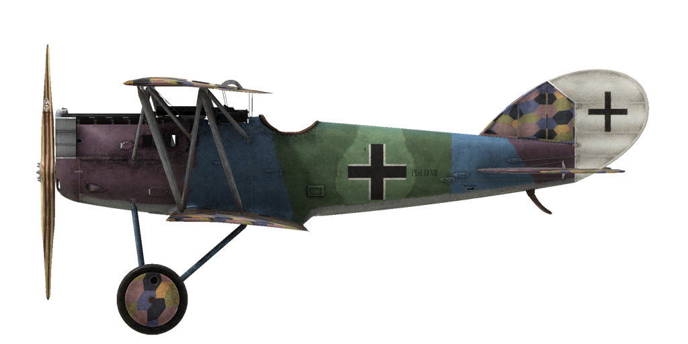

# Pfalz D.XII  
  
  
  
## Description  
  
Les ingénieurs de la compagnie ont décidé d\utiliser une aile de section mince semblale au SPAD VII lors de la conception de la modification du chasseur. Cette aile a satisfait les besoins des tactiques de combat utilisées par les pilots allemands: plongée, tirs contre l\ennemi et remontée. La conception avait également le fait d\acoir des surfaces d\aile supérieure et inférieure égales. Initialement, le radiateur a été monté à l\avant du moteur comme sur le Fokker D.VII. Les délais ne permettant pas de concevoir de nouveaux radiateurs les ingénieurs ont donc utilisé un vieux radiateur de la structure en tube qui était inférieure à la cellule du radiateur. 800 avions ont été construits au total.  
  
Le premier vol a été effectué à la fin février 1918 à Adlershof. En juin 1918 lors des copétitions de chasseurs d\Adlershof l\avion équipé d\un moteur BMW IIIa a été classé deuxième en vitesse de montée: 5 kms eb 17.6 minutes! Après cela il est passé au front pour des test de combat. Les pilotes ont noté une bonne visibilité du cockpit, en particulier en descente, en plongée l\avion était plus rapide que le Fokker D.II, mais moins maniable, ses contrôles étaient un peu lourds. Le 30 juin 1918, l\avion est entré en service avec des escadrons de combat. Il est souvent utilisé en combinaison avec le Fokker D.VII, avec le quel il volait généralement plus bas. Il a surtout été attribué aux pilotes recrue et aux escadrons de soutien.  
  
Parmi ses défauts, celui de décrocher pendant un Immelman. Il sortait de décrochage après une perte d\altitude de 1500m. Lors de virages horizontaux la perte d\altitude était de 150m. Après avoir atteint une altitude de 3 kms, son taux de montée diminuait. Nous pouvons déduire que ces caractéristiques provenaient des avions avec moteur Mercedes D.IIIa alors que la compagnie Fokker avait une préférence pour les moteurs BMW IIIa. Avec une vitesse d\atterrissage rapide, ce qui était nouveau pour la plupart des pilotes, les trains cassaient souvent. L\avion a pris part à des batailles sur le front de l\ouest.  
  
  
Moteur BMW IIIa 6 cyl. inline 232 hp  
  
Tailles  
Hauteur: 2700 mm  
Longueur: 6350 mm  
Envergure: 9000 mm  
Surface d\aile: 21,7 m²  
  
Poids  
Poids à vide: 753 kg  
Poids au décollage: 921 kg  
Capacité des réservoirs carburant : 84 l  
Capacité du réservoir d\huile : 18,5 l  
  
Vitesse maximale (IAS)  
au Sol – 197 km/h  
1000 m — 198 km/h  
2000 m — 195 km/h  
3000 m — 185 km/h  
4000 m — 174 km/h  
5000 m — 163 km/h  
  
Tauc de montée  
1000 m — 3 min 45 sec.  
2000 m — 7 min 26 sec.  
3000 m — 11 min. 16 sec.  
4000 m — 15 min. 24 sec.  
5000 m — 20 min. 02 sec.  
  
Plafond opérationnel 8850 m  
  
Autonomie à 1000m:  
puissance nominale (en combat) - 1 h. 32 min.  
consommation minimale (en croisière) - 4 h.  
  
Armes  
Armes fixées: 2 х LMG 08/15 Spandau 7,92mm, 500 cartouches par baril.  
  
References  
1) Pfalz D.XII by P M Grosz. Windsock Datafile 41.  
2) The Pfalz D.XII, Profile Publications Number 199.  
3) WW I Aero №124, May 1989.  
  
## Modifications  
### Compteur de balles  
  
 Compteur digital Wilhelm Morell pour 2 mitrailleuses  
Masse supplémentaire : 1 kg  
  
### Inclinometre  
  
Inclinometre à liquide D.R.G.M (indique inclinaison au sol et glissade sur aile en vol)  
Masse supplémentaire : 1 kg  
  
### Montre de bord  
  
Montre mécanique  
Masse supplémentaire : 1 kg  
  
### Lumière de cockpit  
  
Lumière à ampoule pour les sorties de nuit  
Masse supplémentaire : 1 kg  
  
### Compas  
  
Compas L.Maxant  
Masse supplémentaire : 1 kg  
  
### Collimateur de jour  
  
Collimateur à réfraction Oigee (gradateur de jour installé)  
Masse supplémentaire : 2 kg  
  
### Collimateur de nuit  
  
Collimateur à réfraction Oigee (gradateur de jour désinstallé)  
Masse supplémentaire : 2 kg  
  
### Anémomètre  
  
Wilhelm Morell Anémomètre (45-250 km/h)  
Masse supplémentaire : 1 kg  
  
### Thermometre  
  
Indicateur de température de liquide de refroidissement A.Schlegelmilch (0-100 °C)  
Masse supplémentaire : 1 kg  
