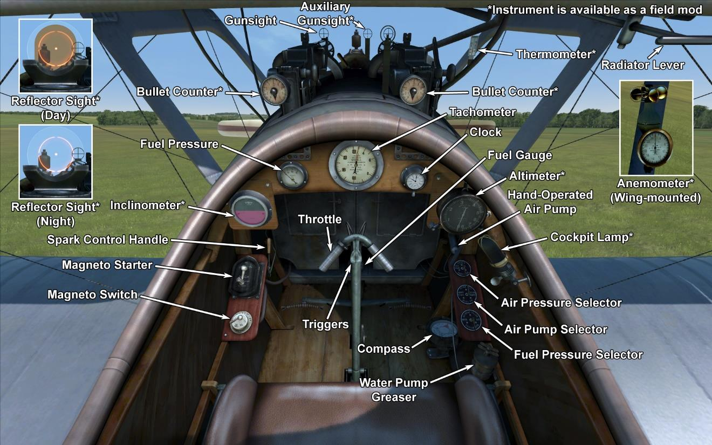

# Pfalz D.IIIa  

<table><tbody><tr><td style="text-align: center"></td><td style="text-align: center"></tr><tr><td style="text-align: center" colspan="2"></td></tr></tbody></table>  

柏法茨（Pfalz）D.III由柏法茨飞机制造公司（Pfalz Flugzeugwerke）设计。著名的法国纽波特（Nieuport）战斗机给德国工程师留下了深刻的印象，这些战斗机的设计是“一个半”的机翼。因此，柏法茨的设计是基于法国工程师的成就。1917年5月进行了首次试飞。飞机的设计特点是机枪安装在发动机的侧面，副翼操纵索位于下机翼。半年后，推出了柏法茨D.IIIa。它具有更强大的发动机、更大的垂直尾翼、改进的下翼形状以及基于飞行员视线内安装的机枪。总共制造了1010架柏法茨D.III和柏法茨D.IIIa飞机。   
  
1917年6月，第一批柏法茨D.III进入战斗中队服役。该飞机用于轰炸机的护航以及与敌方战斗机交战和攻击防空气球。飞行员们注意到它的驾驶舱能视野好，机动灵敏，机枪射击时的稳定性好，速度和爬升速度都很好。一些飞行员声称其操纵灵敏度甚至超过信天翁（Albatros）D.V。它的结构耐久性允许在战斗中进行大角度俯冲和成功的迫降。英法飞行员称，只有重伤或杀死飞行员时，才能将其击落。安装梅赛德斯（Mercedes）D.IIIa发动机后，其飞行特性略有改善。飞机参加了在西线和土耳其前线上的战斗。   
  
  
发动机： 直列6缸梅赛德斯（Mercedes）D.IIIa，180 HP  
  
尺寸  
高度：2670 mm  
长度：6950 mm  
翼展：9400 mm  
机翼面积：22.09 m²  
  
重量  
空载重量：725 kg  
最大起飞重量：905 kg  
燃油容量：94 L  
滑油容量：20 L  
  
最大空速(指示空速)  
海平面——171 km/h  
1000 m——164 km/h  
2000 m——155 km/h  
3000 m——147 km/h  
4000 m——138 km/h  
5000 m——127 km/h  
6000 m——114 km/h  
  
爬升率  
1000 m——3min 23s  
2000 m——7min 19s  
3000 m——12min 02s  
4000 m——18min 01s  
5000 m——26min 22s  
6000 m——40min 53s  
  
实用升限6100 m  
  
1000m高度的续航时间  
标称动力（战斗）— 1h 30min  
最低消耗（巡航）— 2h 50min  
  
武器  
前射：2 х LMG 08/15 史宾道（Spandau） 7.92mm，500发每弹鼓.  
  
参考  
1) Pfalz D.IIIa by PM Grosz. Windsock Datafile 21.  
2) German Aircraft of World War I. Grey and Thetford ISBN 0851778097.  
3) Pfalz scout Aces of World War I.  Greg Van Wyngarden，Osprey № 71.  
4) Flight magazine，April 1918.  
5) The Pfalz D.III ，Profile Publications Number 43.  

## 修改  
### 高空高度计  

德意志帝国（D.R.P.）高度表（0-8000m）  
增加质量：1 kg  

### 弹药计数器  

2挺机枪的威廉·莫雷尔（Wilhelm Morell）针式刻度弹药计数器  
增加质量：1 kg  

### 测斜仪  

D.R.G.M液体测斜仪（地面指示坡度，飞行中指示侧滑）  
增加质量：1 kg  

### 驾驶舱照明  

用于夜间飞行的驾驶舱照明灯  
增加质量：1 kg  

### 射击瞄准具  

带有前后准心的附加瞄准具  
增加质量：1 kg  

### 瞄准具（昼）  

奥吉（Oigee）反射型准直瞄准具（安装了昼间灯）  
增加质量：2 kg  

### 瞄准具（夜）  

奥吉（Oigee）反射型准直瞄准具（移除了昼间灯）  
增加质量：2 kg  

### 风速仪  

威廉·莫雷尔(Wilhelm Morell)风速仪(45-250 km/h)  
增加质量：1 kg  
  
### 温度计  

A·施莱格 m尔奇(A.Schlegelmilch)发动机冷却液温度指示器(0-100℃)  
增加质量：1 kg  
