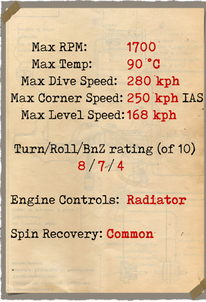

# Pfalz D.IIIa  

| Image | Notes  
|:---|:---  
|  |   

## Description  

L\avion a été conçu par Pfalz Flugzeugwerke. Les ingénieurs allemands été impressionnés par le célèbre chasseur français Neuport conçu comme un avion et demi. Leur conception était basée sur les réalisations des ingénieurs français. Le premier vol d\essai a été effectué en mai 1917. Le design comportait des mitrailleuses montées sur les cotés du moteur, le cable de controle d\aileron a été placé dans l\aile inférieure. Une moitié d\année après le Pfalz D IIIa a été fait avec a un moteur plus puissant, une queue plus fine, la forme de l\aile inférieure modifiée et les mitrailleuses dans la ligne de l\oeil du pilote. 1010 Pfalz D.III et D.IIIa ont été construits au total.  
  
En juin 1917 les premiers chasseurs sont entrés en service dans des escadrons de combat. Le Pfalz a été utilisé pour l\escorte de bombardiers et aussi engagés contre les chasseurs ennemis et les ballons. Les pilotes ont noté une visibilité du cockpit exceptionnelle, une bonne maniabilité, stabilité lors de tirs, la vitesse et le taux de montée ont été décrits comme bons. Certains pilotes ont affirmé que la sensibilité des contrôles était encore meilleure alors avec l\Albatros D.V. lors de fortes plongées en combat et les atterrissages ont prouvé sa résistance . Les pilotes anglais et français disent que vous pouvez l\abattre seulement quand le pilote est sérieusement blessé ou tué. L\installation plus tard d\un moteur Mercedes d. IIIA, a légèrement augmenté les caractéristiques de vol. L\avion a participé à des batailles sur les fronts occidentaux et turques.  
  
  
Moteur  
Inline 6 cyl. Mercedes D.IIIa, 180 hp  
  
Tailles  
Hauteur: 2670 mm  
Longueur: 6950 mm  
Envergure: 9400 mm  
Surface d\aile: 22,09 sq.m  
  
Poids  
Poids à vide: 725  
Poids au décollage: 905  
Capacité des réservoirs carburant: 94 l  
Capacité du réservoir d\huile: 20 l  
  
Vitesse maximale (IAS)  
au Sol — 171 km/h  
1000 m — 164 km/h  
2000 m — 155 km/h  
3000 m — 147 km/h  
4000 m — 138 km/h  
5000 m — 127 km/h  
6000 m — 114 km/h  
  
Tauc de montée  
1000 m —  3 min. 23 sec.  
2000 m —  7 min. 19 sec.  
3000 m — 12 min. 02 sec.  
4000 m — 18 min. 01 sec.  
5000 m — 26 min. 22 sec.  
6000 m — 40 min. 53 sec.  
  
Plafond opérationnel 6100 m  
  
Autonomie à 1000m  
puissance nominale (en combat) — 1 h. 30 min.  
consommation minimale (en croisière) — 2 h. 50 min.  
  
Armes  
Armes fixées: 2 х LMG 08/15 Spandau 7,92mm, 500 cartouches par baril.  
  
References  
1) Pfalz D.IIIa by PM Grosz. Windsock Datafile 21.  
2) German Aircraft of World War I. Grey and Thetford ISBN 0851778097.  
3) Pfalz scout Aces of World War I.  Greg Van Wyngarden, Osprey № 71.  
4) Flight magazine, Aprel 1918.  
5) The Pfalz D.III , Profile Publications Number 43.  

## Modifications  
### Haut Altimètre  

D.R.P Altimètre (0-8000 m)  
Masse supplémentaire : 1 kg  
  
### Compteur de balles  

Compteur à aiguille Wilhelm Morell pour 2 mitrailleuses  
Masse supplémentaire : 1 kg  
  
### Inclinometre  

Inclinometre à liquide D.R.G.M (indique inclinaison au sol et glissade sur aile en vol)  
Masse supplémentaire : 1 kg  
  
### Lumière de cockpit  

Lumière à ampoule pour les sorties de nuit  
Masse supplémentaire : 1 kg  
  
### Viseur  

Viseur additionnel avec guidon de mire avant-arrière  
Masse supplémentaire : 1 kg  
  
### Collimateur de jour  

Collimateur à réfraction Oigee (gradateur de jour installé)  
Masse supplémentaire : 2 kg  
  
### Collimateur de nuit  

Collimateur à réfraction Oigee (gradateur de jour désinstallé)  
Masse supplémentaire : 2 kg  
  
### Anémomètre  

Wilhelm Morell Anémomètre (45-250 km/h)  
Masse supplémentaire : 1 kg  

### Thermometre  

Indicateur de température de liquide de refroidissement A.Schlegelmilch (0-100 °C)  
Masse supplémentaire : 1 kg  
