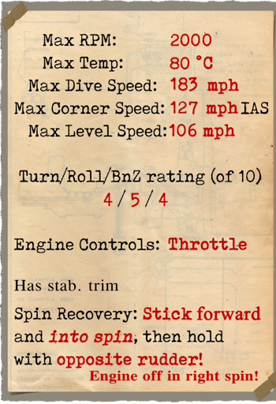
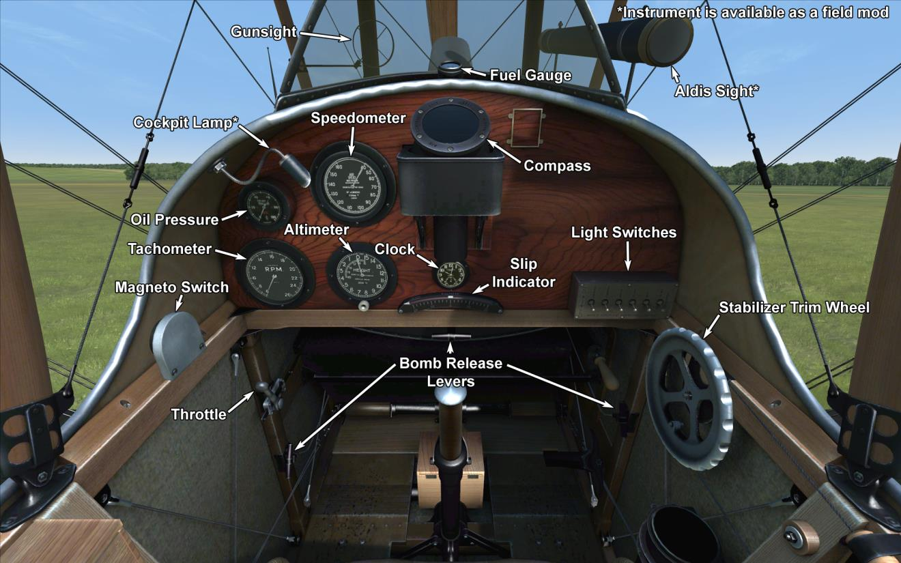

# R.E.8  

<table><tbody><tr><td style="text-align: center"></td><td style="text-align: center"></td></tr><tr><td style="text-align: center" colspan="2"></td></tr></tbody></table>  

Самолёт разрабатывался как замена морально устаревшему к тому времени B.E.2. Вооружение состояло из однорго курсового синхронизированного пулемёта, а позиция стрелка-наблюдателя была перенесена назад от пилота (на B.E.2 он сидел перед пилотом).  
Устанавливался V-образный 12-ти циллиндровый двигатель воздушного охлаждения  RAF4a. Изначально было предусмотрено место для установки радио и фото обородования, так же самолёт мог нести бомбовое вооружение на подкрыльевых бомбодержателях.  
Первый прототип совершил полёт в июне-июле 1916-го года.  
На фронт первые машины стали поступать уже в конце 1916-го года и не вызвали большого энтузиазма у пилотов. Сложный в управлении и не прощающий ошибок самолёт, очень легко срывался в штопор, так что первые фронтовые эскадрильи в одно время даже поменяли новые машини на старые но проверенные в боях B.E.2. Боевой дебют так же был не совсем удачен, зафиксирован случай, когда 13 апреля 1917 года шестёрка R.E.8, которая производила фотографирование линии фронта, была атакована шестёркой Альбатросов под руководством Манфреда фон Рихтхофена. В течение скоротечного боя - все шесть R.E.8 были сбиты без потерь со стороны немцев.  
Тем не менее, войскам срочно требовался новый самолёт, и после доработок хвостового оперения и устранения многих мелких недостатков R.E.8 поступил в массовое производство сразу на нескольких предприятиях, став самым массовым двухместным самолётом который выпускался в Британии во время Первой Мировой Войны - за полтора года войны было построено 4077 машин.  
Самолёт стал одним из самых распространненным в небе над Западным Фронтом, использовался как артиллерийский корректировщик и разведчик, а так же как бомбардировщик.  
Летчики дали ему прозвище Harry Tate (Гарри Тейт - популярный в те времена артист мюзик холла), т.н. "артист-любитель". Тем не менее под управлением опытных экипажей самолёт неплохо проявил себя в боях и оставался в строю до самого конца войны, им были вооружены 16 эскадрилий Королевского воздушного корпуса на Западном фронте а так же несколько эскадрилий на других театрах боевых действий.  
  
Двигатель: 12-ти циллиндровый RAF 4a 150 л.с.  
  
Размеры  
Высота: 3470 мм  
Длина: 8500 мм  
Размах крыла: 12980 мм  
Площадь крыла: 35.07 кв.м.  
  
Веса  
Пустой:  817 кг  
Взлётный: 1235 кг  
Объем топлива: 218 л  
Объем масла: 40 л  
  
Скорость (приборная, км/ч):  
у земли - 170.4 км/ч  
 1000 м - 158.4 км/ч  
 2000 м - 145.6 км/ч  
 3000 м - 131.4 км/ч  
  
Скороподъемность:  
1000 м -  6 мин. 03 сек.  
2000 м - 14 мин. 36 сек.  
3000 м - 27 мин. 27 сек.  
  
Практический потолок: 4000 м  
  
Продолжительность полёта: 4 ч. 15 мин.  
  
Вооружение:  
Курсовое:  1 х Vickers 7.69mm, 500 патронов.  
Верхняя-хвостовая стрелковая позиция:  1 х Lewis 7.69мм, 9 барабанов по 97 патронов каждый  
  
Варианты бомбовых загрузок:  
12 x 20lb (109 кг)  
 8 x 20lb + 2 x 112lb (177 кг)  
 2 x 112lb (101.7 кг)  
  
максимум 175 кг  
  
Использованные источники  
1) Windsock Datafile RAF RE8 by J.M. Bruce.  
2) WWI Aeroplanes by J.M. Bruce.  
3) Putnam. Paul R. Hare. The Royal Aircraft Factory  

## Модификации  
### Aldis  

Коллиматорный прицел Aldis рефракторного типа  
Дополнительная масса: 2 кг  
  
### Бомбы Купера / H.E.R.L.  

До 12 осколочно-фугасных 24-фунтовых авиабомб Купера (11 кг)  
Дополнительная масса: 167 кг  
Масса вооружения: 131 кг  
Масса держателей: 36 кг  
Ориентировочная потеря скорости до сброса: 7 км/ч  
Ориентировочная потеря скорости после сброса: 3 км/ч  
  
До 2 осколочно-фугасных 112-фунтовых авиабомб H.E.R.L. (51 кг)  
Дополнительная масса: 126 кг  
Масса вооружения: 102 кг  
Масса держателей: 24 кг  
Ориентировочная потеря скорости до сброса: 8 км/ч  
Ориентировочная потеря скорости после сброса: 4 км/ч  
  
### Освещение кабины  

Лампа ночного освещения кабины самолёта  
Дополнительная масса: 1 кг  
  
### Пулемёт Льюис над верхним крылом  

Установленный над верхним крылом пулемёт Lewis с изменяемым углом установки.  
Боезапас: 291 патронов 7.69мм (3 магазина по 97 патронов в каждом)  
Переднее положение: 25°  
Верхнее положение: 45°  
Масса пули: 11 г  
Дульная скорость: 745 м/с  
Скорострельность: 550 выстр/мин  
Масса оружия: 7.5 кг (без магазина)  
Масса установок: 0.8 кг  
Масса боезапаса: 12 кг  
Общая масса: 20.3 кг  
Примерная потеря скорости: 5 км/ч  
  
### Фотокамера  

Фотоаппарат для аэрофотосъёмки   
Дополнительная масса: 10 кг  
  
### Радио  

Радиопередатчик  
Дополнительная масса: 10 кг  
  
### Турель с пулемётами Lewis  

Кольцевая турель со спаренными пулемётами Lewis  
Боезапас: 776 патронов 7,69 мм (8 магазинов по 97 патронов в каждом)  
Масса пули: 11 г  
Дульная скорость: 745 м/с  
Скорострельность: 550 выстр/мин  
Масса оружия: 15 кг (без магазинов)  
Масса станины: 12 кг  
Масса боезапаса: 32 кг  
Общая масса: 59 кг  
Примерная потеря скорости: 2 км/ч  
