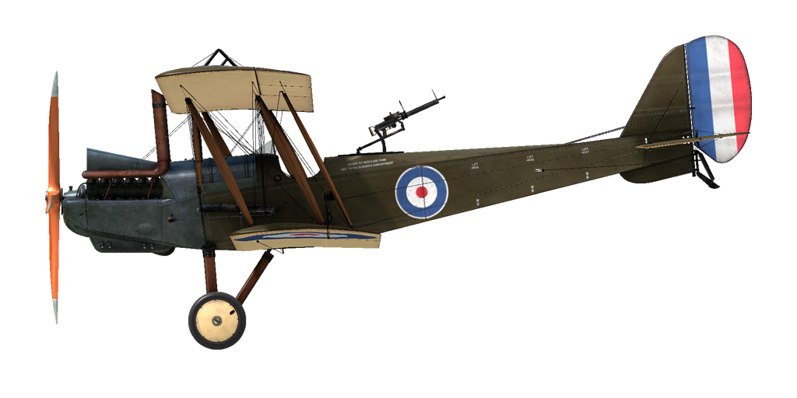

# R.E.8  
  
  
  
## Descripción  
  
El R.E.8 fue diseñado como reemplazo para el obsoleto B.E.2. Su armamento consistía en una ametralladora sincronizada apuntando hacia delante y una posición de artillero trasero detrás del piloto. Esto suponía una diferencia respecto al diseño del B.E.2, que tenía el artillero enfrente del piloto, situación que había provocado posiciones de tiro difíciles y peligrosas, especialmente hacia atrás.  
  
El R.E.8 estaba equipado con el motor RAF 4a de 12 cilindros en V y refrigerado por aire. El avión estaba diseñado para llevar radio y cámara de fotos para realizar tareas de reconocimiento y observación de artillería. También podía llevar una pequeña carga de bombas en bastidores ubicados bajo alas, haciendo de él un avión muy versátil para su tiempo.  
  
Las primeras versiones del avión comenzaron a llegar al frente a finales de 1916, pero no despertó mucho entusiasmo entre sus pilotos. El avión era difícil de volar y no era muy indulgente. Errores en el pilotaje podían provocar una entrada en barrena mortal. El primer escuadrón del frente que recibió el R.E.8, el Escuadrón n.º 52, volvió de nuevo al más viejo, pero probado en combate, B.E.2. Finalmente, el R.E.8 pudo participar en combate y su debut no fue muy alentador.  
  
En un famoso combate el 13 de abril de 1917, un grupo de seis R.E.8, en una misión de reconocimiento sobre la línea del frente, fueron atacados por seis Albatros liderados por Manfred von Richthofen. En una batalla fugaz y desigual, los seis R.E.8 fueron derribados sin pérdidas para los alemanes.  
  
Sin embargo, las tropas necesitaban urgentemente un nuevo avión y tras unas modificaciones en el ensamblaje de la cola y la eliminación de muchos defectos menores, el R.E.8 entró en producción en masa en diferentes plantas y se convirtió en el biplaza más popular desplegado por los británicos en la Primera Guerra Mundial. No menos de 4077 aviones fueron construidos después de su introducción y fue uno de los aviones más comunes en los cielos del frente Occidental. Fue usado como observador de artillería y plataforma de reconocimiento, así como bombardero.  
  
La designación militar del R.E.8 compartía una pronunciación similar con el nombre de un famoso artista de la época llamado Harry Tate, así que el avión pasó a ser conocido afectuosamente como «Harry Tate» por sus tripulaciones. El R.E.8 fue teniendo, bajo la dirección de tripulaciones experimentadas, un buen rendimiento en combate y permaneció en servicio hasta el final de la guerra. 16 escuadrones de la RAF (<i>Royal Air Force</i>) volaron el R.E.8 en el frente Occidental. Otros escuadrones también usaron el R.E.8. en otros teatros de operaciones de combate.  
  
  
Motor:  
V12 RAF 4a, 150 CV  
  
Dimensiones:  
Alto: 3470 mm  
Longitud: 8500 mm  
Envergadura alar: 12980 mm  
Superficie de ala: 35,07 m²  
  
Peso:  
Vacío: 817 kg  
Al despegue: 1235 kg  
Capacidad combustible: 218 l  
Capacidad aceite: 40 l  
  
Velocidad máxima(IAS):  
Nivel del mar - 147 km/h  
1000 m - 158,4 km/h  
2000 m - 145,6 km/h  
3000 m - 131,4 km/h  
  
Tasa de ascenso:  
1000 m -  6 min 03 s  
2000 m - 14 min 36 s  
3000 m - 27 min 27 s  
  
Techo de servicio: 4000 m  
  
Autonomía: 4 h 15 min  
  
Armamento:  
Disparo frontal:  1 Vickers Mk.I de 7,69mm, 500 balas por barril  
Artillero de cola:  1 Lewis de 7,69 mm, 9 tambores con 97 balas cada uno  
  
Variaciones en la carga de bombas:  
12 bombas de 20 lb (109 kg)  
8 bombas de 20 lb + 2 de 112 lb (175 kg)  
2 bombas de 112 lb (101,7 kg)  
  
Peso máximo en bombas: 175 kg  
  
Referencias:  
1) Windsock Datafile RAF RE8 por J.M. Bruce.  
2) WWI Aeroplanes por J.M. Bruce.  
3) Putnam. Paul R. Hare. The Royal Aircraft Factory  
  
## Modificaciones  
  
  
### Aldis  
  
Colimador reflectante Aldis  
Peso adicional: 2 kg  
  
  
### Bombas Cooper / H.E.R.L.  
  
Hasta 12 bombas de propósito general de 24 lb (11 kg) Cooper  
Peso adicional: 167 kg  
Peso de munición: 131 kg  
Peso de los soportes: 36 kg  
Pérdida de velocidad estimada antes de soltar: 7 km/h  
Pérdida de velocidad estimada tras soltar: 3 km/h  
  
Hasta 2 bombas de propósito general de 112 lb (51 kg) H.E.R.L.  
Peso adicional: 126 kg  
Peso de munición: 102 kg  
Peso de los soportes: 24 kg  
Pérdida de velocidad estimada antes de soltar: 8 km/h  
Pérdida de velocidad estimada tras soltar: 4 km/h  
  
### Luz de cabina  
  
Lámpara para iluminar la cabina en las salidas nocturnas  
Peso adicional: 1 kg  
  
  
### Lewis sobre ala superior  
  
Ametralladora adicional Lewis de posición variable montada sobre al ala superior.  
Munición: 291 balas de 7,69 mm (3 tambores con 97 balas cada uno)  
Posición hacia delante: 25º  
Posición hacia arriba: 45º  
Peso del proyectil: 11 g  
Velocidad de salida: 745 m/s  
Tasa de disparo: 550 bpm  
Peso del arma: 7,5 kg (sin cargador)  
Peso del soporte: 0,8 kg  
Peso de la munición: 12 kg  
Peso total: 20,3 kg  
Pérdida de velocidad estimada: 5 km/h  
  
### Cámara de fotos  
  
Cámara para tomar fotografías aéreas  
Peso adicional: 10 kg  
  
  
### Radio  
  
Radiotransmisor  
Peso adicional: 10 kg  
  
### Doble Lewis en artillero  
  
Dos ametralladoras Lewis sincronizadas sobre anillo Scarff en la posición del artillero.  
Munición: 776 balas de 7,69 mm (8 tambores con 97 balas cada uno)  
Peso del proyectil: 11 g  
Velocidad de salida: 745 m/s  
Tasa de disparo: 550 bpm  
Peso de las armas: 15 kg (sin cargador)  
Peso de los soportes: 12 kg  
Peso de la munición: 32 kg  
Peso total: 59 kg  
Pérdida de velocidad estimada: 2 km/h  