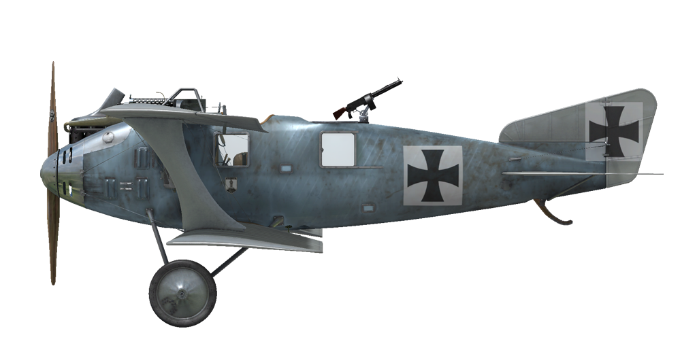

# Roland C.IIa

## 描述

One of the most original trends of thought in aircraft design during 1915 was seen in the L.F.G. Roland C.II, which had been evolved by Dipl. Ing. Tantzen, who had recently joined Luftfahrzeug Gesellschaft as a design engineer. Tantzens ambition was to present a drastically cleaned-up airframe, eliminating as much as possible of the "built-in" drag of interplane, center section strut arrangements and attendant bracing. Streamlined design of fuselage, thin wings profile resulted in great performance for its time: it was one of the fastest airplanes at front able to outrun any enemy fighter plane.

Upper wing was placed on the top edge of fuselage providing great forward and up view for the pilot. But due to its wide oval fuselage and pilot position towards the back, it was a very unforgiving airplane to land: very few pilots which flew this airplane did not crash or damage it during landing. In time, some minor modifications where added, such as forward firing gun for the pilot, internal wings structire change and ailerons controls moved into upper wing with addition of a control rod instead of cables in the lower wing on early machines. Also wing trailing edge wire was replaced with wooden stringer. New version became Roland C.IIa: first prototype powered by Mercedes D.III engine flew October 25-26 of 1915, and on December 23, 1915 the first production order for 50 machines was placed.

C.IIs began to equip the Fl. Abt. units for reconnaissance and also for escort duties by the beginning of 1916. Usually the reconnaissance machines were armed only with a Parabellum gun for the observer and had a radio transmitter, later on a forward-firing Spandau gun was added and some later machines were able to carry bombs on the external rack under the fuselage.

Because of its performance the aircraft was often used as a strategic reconnaissance airplane able to perform deep flights into an enemy territory - Allied airplanes couldn\t catch it. Later, when Allies intruduced faster fighters, Rolands where used in close support and reconnaissance roles and slowly where withdrawn from the frontline units by June of 1917 and transferred into traning units. Rolands where built by LFG Roland and Linke-Hofmann by license agreement. Assuming all orders where completed, LFG Roland built 139 C.II airplanes and 168 C.IIa variants where built by both manufacturers.

Engine:
Mercedes D. III 6-cyl. inline, 162 h.p.

Dimensions
Height: 2860 mm
Length: 7700 mm
Wing span: 10300 mm
Wing surface: 29 sq.m

Weight
Empty weight: 714 kg
Takeoff weight: 1226 kg
Fuel capacity: 259 l
Oil capacity: 35 l

Maximum airspeed (IAS, km/h):
sea level - 165 km/h
1000 m - 157 km/h
2000 m - 149 km/h
3000 m - 140 km/h
4000 m - 131 km/h
5000 m - 118 km/h

Climb rate:
1000 m -  5 min. 58 sec.
2000 m - 14 min. 45 sec.
3000 m - 29 min. 32 sec.

Service ceiling: 5250 m

Endurance: 5 h. 0 min.

Armament
Forward firing: 1 х LMG 08/15 Spandau 7.92mm, 500 rounds
Turret: 1 х LMG 14/17 Parabellum 7.92mm, 4 boxes with 250 rounds each

Bomb load variations:
4 x 12.5 kg (50 kg)
1 x 50 kg

50 kg in total

References
1) Schlachtflieger  by Rick Duiven, Dan-San Abbott.
2) Windsock Datafile 49 LFG Roland C.II by P.M. Grosz.

## 修改

### 阿尔迪斯（Aldis）瞄准具（战利品）

阿尔迪斯（Aldis）折射型直筒瞄准具
增加质量：2 kg

### 20mm贝克（Becker）炮塔

装有贝克（Becker）机炮的炮塔
弹药：60发20mm弹药（4个弹匣，每个15发）
弹药类型：HE/AP（高爆和穿甲弹）
射速：300 rpm
弹丸重量：120/130 g
膛口速度：450/490 m/s
枪炮重量：30 kg
基座重量：10 kg
弹药重量：25 kg
总重：65 kg
预期速度损失：6 km/h

### P.u.W. 炸弹

最多4 x 12.5 kg P.u.W. 通用炸弹
增加质量：62 kg
弹药质量：50 kg
挂架质量：12 kg
投弹前预期速度损失：4 km/h
投弹后预期速度损失：2 km/h

最多1 x 50 kg P.u.W. 通用炸弹
增加质量：62 kg
弹药质量：50 kg
挂架质量：12 kg
投弹前预期速度损失：4 km/h
投弹后预期速度损失：2 km/h

### 时钟

机械时钟
增加质量：1 kg

### 驾驶舱照明

用于夜间飞行的驾驶舱照明灯
增加质量：1 kg

### 附加仪表

威廉·莫雷尔(Wilhelm Morell)风速仪(45-250 km/h)

威廉·莫雷尔(Wilhelm Morell)高度表（0-5000m）

A·施莱格 m尔奇(A.Schlegelmilch)发动机冷却液温度指示器(0-100℃)

增加质量：3 kg

### 相机

可拍摄航空照片的相机
增加质量：10 kg

### 无线电

无线电发射机
增加质量：10 kg

### 双帕拉贝伦（Parabellum）机枪炮塔

带有双帕拉贝伦（Parabellum）机枪的旋转炮塔。
弹药：2000发7.92mm弹药（8个弹鼓，每个250发）
弹丸重量：10 g
膛口速度：825 m/s
射速：700 rpm
枪炮重量：19 kg（无弹鼓）
基座重量：5 kg
弹药重量：40 kg
总重：64 kg
