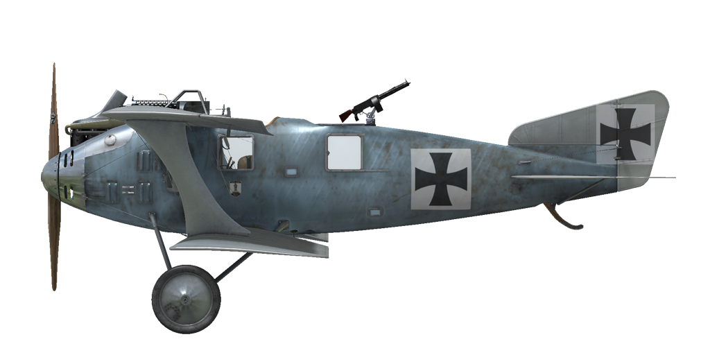

# Roland C.IIa  
  
  
  
## Beschreibung  
  
One of the most original trends of thought in aircraft design during 1915 was seen in the L.F.G. Roland C.II, which had been evolved by Dipl. Ing. Tantzen, who had recently joined Luftfahrzeug Gesellschaft as a design engineer. Tantzens ambition was to present a drastically cleaned-up airframe, eliminating as much as possible of the "built-in" drag of interplane, center section strut arrangements and attendant bracing. Streamlined design of fuselage, thin wings profile resulted in great performance for its time: it was one of the fastest airplanes at front able to outrun any enemy fighter plane.  
  
Upper wing was placed on the top edge of fuselage providing great forward and up view for the pilot. But due to its wide oval fuselage and pilot position towards the back, it was a very unforgiving airplane to land: very few pilots which flew this airplane did not crash or damage it during landing. In time, some minor modifications where added, such as forward firing gun for the pilot, internal wings structire change and ailerons controls moved into upper wing with addition of a control rod instead of cables in the lower wing on early machines. Also wing trailing edge wire was replaced with wooden stringer. New version became Roland C.IIa: first prototype powered by Mercedes D.III engine flew October 25-26 of 1915, and on December 23, 1915 the first production order for 50 machines was placed.  
  
C.IIs began to equip the Fl. Abt. units for reconnaissance and also for escort duties by the beginning of 1916. Usually the reconnaissance machines were armed only with a Parabellum gun for the observer and had a radio transmitter, later on a forward-firing Spandau gun was added and some later machines were able to carry bombs on the external rack under the fuselage.  
  
Because of its performance the aircraft was often used as a strategic reconnaissance airplane able to perform deep flights into an enemy territory - Allied airplanes couldn\t catch it. Later, when Allies intruduced faster fighters, Rolands where used in close support and reconnaissance roles and slowly where withdrawn from the frontline units by June of 1917 and transferred into traning units. Rolands where built by LFG Roland and Linke-Hofmann by license agreement. Assuming all orders where completed, LFG Roland built 139 C.II airplanes and 168 C.IIa variants where built by both manufacturers.  
  
  
Triebwerk:  
Mercedes D.III 6—Zyl. flüssigkeitsgekühler Reihenmotor, 162 hp  
  
Abmessung  
Hohe: 2860 mm  
Lange: 7700 mm  
Spannweite: 10300 mm  
Flugelflache: 29 sq.m  
  
Gewicht  
Leer: 714 kg  
Startgewicht: 1226 kg  
Treibstoffkapazität: 259 l  
Ölkapazität: 35 l  
  
Fluggeschwindigkeit (IAS, km/h):  
Meeresspiegel - 165 km/h  
1000 m - 157 km/h  
2000 m - 149 km/h  
3000 m - 140 km/h  
4000 m - 131 km/h  
5000 m - 118 km/h  
  
Steigzeit:  
1000 m -  5 min. 58 sec.  
2000 m - 14 min. 45 sec.  
3000 m - 29 min. 32 sec.  
  
Dienstgipfelhöhe: 5250 m  
  
Flugzeit: 5 h. 0 min.  
  
Bewaffnung  
Starre Bewaffnung nach vorne: 1 x LMG 08/15 Spandau 7,92mm, 1 Gurt mit 500 Schuss.  
Heckschützenposition: 1 x LMG 14/17 Parabellum 7,92mm, 4 Boxen mit je 250 Schuss.  
  
Bombenzuladungsmöglichkeiten:  
4 x 12.5 kg (50 kg)  
1 x 50 kg  
  
Maximale Zuladung 50 kg  
  
References  
1) Schlachtflieger  by Rick Duiven, Dan-San Abbott.  
2) Windsock Datafile 49 LFG Roland C.II by P.M. Grosz.  
  
## Änderungen  
### Aldis (Trophäe)  
  
Aldis Teleskopvisier  
Zusätzliches Gewicht: 2 kg  
### 20mm Becker Turret  
  
Turret with Becker Automatic Cannon  
Ammo: 60 of 20mm rounds (4 magazines with 15 rounds in each)  
Ammo type: HE/AP (High Explosive and Armour Piercing rounds)  
Rate of fire: 300 rpm  
Projectile weight: 120/130 g  
Muzzle velocity: 450/490 m/s  
Gun weight: 30 kg  
Mount weight: 10 kg  
Ammunition total weight: 25 kg  
Total weight: 65 kg  
Estimated speed loss: 6 km/h  
### Bomben, Typ P.u.W.  
  
4 x Splitterbomben 12.5 kg P.u.W  
Zusätzliches Gewicht: 62 kg  
Gewicht der Munition: 50 kg  
Gewicht der Abwurfwaffenroste: 12 kg  
Geschwindigkeitsverlust vor Abwurf: 4 km/h  
Geschwindigkeitsverlust nach Abwurf: 2 km/h  
  
1 x Splitterbomben 50 kg P.u.W  
Zusätzliches Gewicht: 62 kg  
Gewicht der Munition: 50 kg  
Gewicht der Abwurfwaffenroste: 12 kg  
Geschwindigkeitsverlust vor Abwurf: 4 km/h  
Geschwindigkeitsverlust nach Abwurf: 2 km/h  
### Uhr  
  
Taschenuhr  
Zusätzliches Gewicht: 1 kg  
### Instrumentenlicht  
  
Glühlampe zum Beleuchten des Instrumentenbrettes bei Nachteinsätzen  
Zusätzliches Gewicht: 1 kg  
### Zusätzliche Anzeigen  
  
Wilhelm Morell Anemometer (45-250 km/h)  
  
Wilhelm Morell kompensierter Höhenmesser (0-5000 m)  
  
A.Schlegelmilch Kühlwasserthermometer (0-100 °C)  
  
Zusätzliches Gewicht: 3 kg  
### Kamera  
  
Kamera zum Aufnehmen von Luftbildern  
Zusätzliches Gewicht: 10 kg  
### Funkgerät  
  
Funkgerät  
Zusätzliches Gewicht: 10 kg  
### Twin Parabellum MG Turret  
  
Ring turret with twin Parabellum machine guns.  
Ammo: 2000 of 7.92mm rounds (8 drums with 250 rounds in each)  
Projectile weight: 10 g  
Muzzle velocity: 825 m/s  
Rate of fire: 700 rpm  
Guns weight: 19 kg (w/o ammo drums)  
Mount weight: 5 kg  
Ammo weight: 40 kg  
Total weight: 64 kg  
