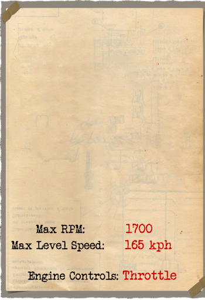
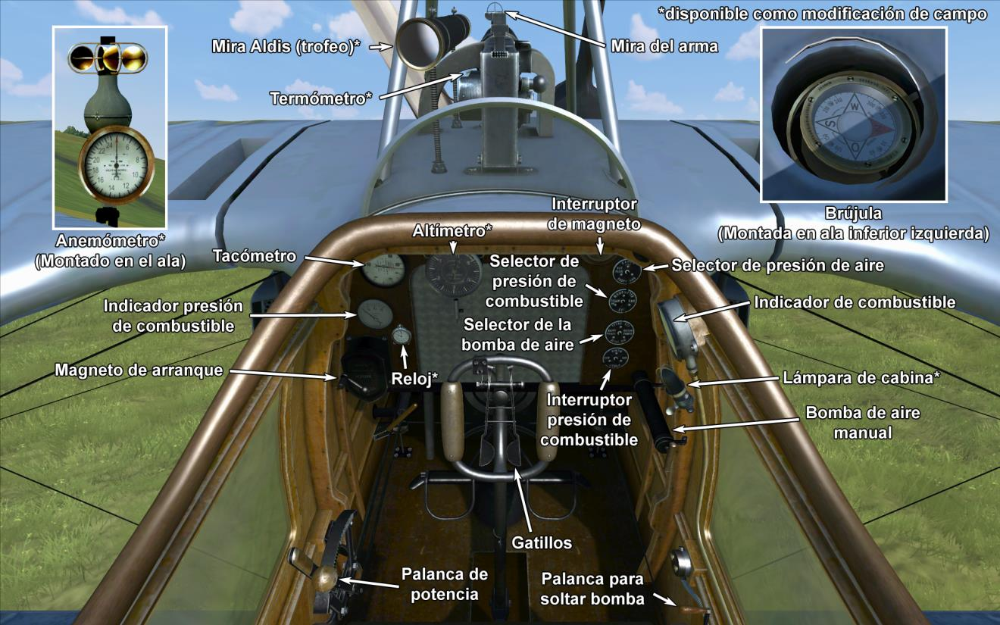

# Roland C.IIa  

<table><tbody><tr><td style="text-align: center"></td><td style="text-align: center"></td></tr><tr><td style="text-align: center" colspan="2"></td></tr></tbody></table>  

## Descripción  

Una de las ideas más originales en el diseño de aeronaves durante 1915 quedó plasmada en el Roland C.II de la <i>Luft-Fahrzeug-Gesellschaft</i> (LFG), diseñado por el Dipl. Ing. Tantzen, que recientemente había entrado en la LFG como ingeniero de diseño. Trantzen presentó un ambicioso fuselaje, muy simplificado, eliminando en la medida de lo posible la resistencia al aire propia de los arriostramientos entre planos. El diseño aerodinámico del fuselaje y las finas alas del avión dotaron al aparato de un gran rendimiento para su época. Cuando se empezó a equipar a las unidades de primera línea, el C.II se convirtió en uno de los aviones más rápidos del frente, capaz de dejar atrás a cualquier avión enemigo. El ala superior estaba ubicada en el límite superior del fuselaje, lo que proporcionaba al piloto una gran visibilidad hacia delante y hacia arriba. Sin embargo, a causa de su gran fuselaje ovalado y la posición baja del asiento del piloto, resultó un avión muy complicado de aterrizar; se afirmaba que había muy pocos pilotos del C.II que no hubieran estrellado alguna vez el aparato al tomar tierra.  
  
Con el tiempo, se fueron realizando algunas modificaciones en el C.II, como la adición de una ametralladora fija encarada hacia delante para el piloto, cambios en la estructura interna de las alas, un estabilizador vertical más largo y el traslado de los alerones al ala superior. Esta última modificación introdujo varillas de control de empujar y tirar, que reemplazaron a los controles de los alerones mediante cables montados a través de las alas inferiores de las primeras unidades producidas. Como resultado de estos cambios, el avión pasó a denominarse C.IIa. El primer prototipo, propulsado por un motor Mercedes D.III, voló el 25-26 de octubre de 1915. La producción en masa comenzó el 23 de diciembre de ese mismo año, cuando se realizó el primer pedido de 50 unidades.  
  
A principios de 1916, el C.II comenzó a equipar las unidades del <i>Flieger Abteilung</i> para realizar labores de reconocimiento y tareas de escolta. Los aparatos de reconocimiento estaban, por lo general, solamente armados con una ametralladora Parabellum para el observador. Un transmisor de radio también formaba parte del equipamiento del observador. Más tarde se le añadió al armamento una ametralladora fija Spandau en el morro, y tiempo después fueron capaces de llevar bombas en un bastidor externo bajo el fuselaje. Los C.II fueron usados a menudo como aviones de reconocimiento estratégico, realizando profundas incursiones en territorio enemigo, aprovechando su alta velocidad. Cuando la Trilpe Entente introdujo aviones de combate más rápidos, los Roland fueron empleados para misiones de reconocimiento y de apoyo más cercanas. En junio de 1917 ya habían sido retirados de las unidades de primera línea y transferidos a escuelas de formación. El Roland C.II fue fabricado por la LFG Roland y Linke-Hofmann (mediante licencia). Suponiendo que todas los pedidos se completasen, LFG Roland construyó 139 C.II y, entre ambas empresas, 168 C.IIa.  
  
  
Motor:  
Mercedes D. III de 6 cilindros en línea, 162 CV  
  
Dimensiones:  
Altura: 2860 mm  
Longitud: 7700 mm  
Envergadura alar: 10300 mm  
Superficie de ala: 29 m²  
  
Pesos:  
Vacío: 714 kg  
Al despegue: 1226 kg  
Capacidad de combustible: 259 l  
Capacidad de aceite: 35 l  
  
Velocidad maxima (IAS, km/h):  
Nivel del mar - 165 km/h  
1000 m - 157 km/h  
2000 m - 149 km/h  
3000 m - 140 km/h  
4000 m - 131 km/h  
5000 m - 118 km/h  
  
Tasa de ascenso:  
1000 m -  5 min 58 s  
2000 m - 14 min 45 s  
3000 m - 29 min 32 s  
  
Techo de servicio: 5250 m  
  
Autonomía: 5 h 0 min  
  
Armamento:  
Disparo frontal: 1 LMG 08/15 Spandau 7,92 mm, 500 balas  
Artillero de cola: 1 LMG 14/17 Parabellum 7,92 mm, 4 cajas con 250 balas cada uno  
  
Variaciones en la carga de bombas:  
4 bombas de 12,5 kg (50 kg)  
1 bomba de 50 kg  
Peso máximo en bombas: 50 kg  
  
Referencias:  
1) Schlachtflieger, por Rick Duiven, Dan-San Abbott.  
2) Windsock Datafile 49 LFG Roland C.II, por P.M. Grosz.  

## Modificaciones  
### Aldis (Trofeo)  

Colimador reflectante Aldis  
Peso adicional: 2 kg  
  
### Cañón Becker de 20 mm en artillero  

Cañón automático Becker de 20 mm montado sobre anillo en posición de artillero.  
Munición: 60 balas de 20 mm (4 cargadores con 15 balas cada uno)  
Tipo de munición: HE/AP (balas explosivas y perforantes)  
Peso del proyectil: 120/130 g  
Velocidad de salida: 450/490 m/s  
Tasa de disparo: 300 bpm  
Peso del arma: 30 kg (sin cargador)  
Peso del soporte: 10 kg  
Peso de la munición: 25 kg  
Peso total: 65 kg  
Pérdida de velocidad estimada: 6 km/h  
  
### Bombas P.u.W.  

Hasta 4 bombas de propósito general de 12,5 kg P.u.W (Prünfanstalt und der Werft Fliegertruppe)  
Peso adicional: 62 kg  
Peso de munición: 50 kg  
Peso de los soportes: 12 kg  
Pérdida de velocidad estimada antes de soltar: 4 km/h  
Pérdida de velocidad estimada tras soltar: 2 km/h  
  
Hasta 1 bombas de propósito general de 50 kg P.u.W (Prünfanstalt und der Werft Fliegertruppe)  
Peso adicional: 62 kg  
Peso de munición: 50 kg  
Peso de los soportes: 12 kg  
Pérdida de velocidad estimada antes de soltar: 4 km/h  
Pérdida de velocidad estimada tras soltar: 2 km/h  
  
### Reloj  

Reloj Mecánico  
Peso adicional: 1 kg  
  
### Luz de cabina  

Lámpara para iluminar la cabina en las salidas nocturnas  
Peso adicional: 1 kg  
  
### Instrumentación adicional  

Anemómetro Wilhelm Morell (45-250 km/h)  
  
Altímetro de Wilhelm Morell (0-5000 m)  
  
Indicador de temperatura del refrigerante del motor de A.Schlegelmilch (0-100 °C)  
  
Peso adicional: 3 kg  
  
### Cámara de fotos  

Cámara para tomar fotografías aéreas  
Peso adicional: 10 kg  
  
### Radio  

Radiotransmisor  
Peso adicional: 10 kg  
  
### Doble Parabellum en artillero  

Dos ametralladoras Parabellum sincronizadas sobre anillo en la posición del artillero.  
Munición: 2000 balas de 7,92 mm (8 tambores con 250 balas cada uno)  
Peso del proyectil: 10 g  
Velocidad de salida: 825 m/s  
Tasa de disparo: 700 bpm  
Peso de las armas: 19 kg (sin cargador)  
Peso de los soportes: 5 kg  
Peso de la munición: 40 kg  
Peso total: 64 kg  
