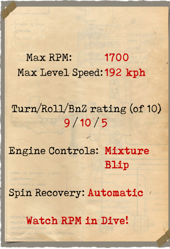

# SSW D.IV  

<table><tbody><tr><td style="text-align: center"></td><td style="text-align: center"></tr></td></tr></tbody></table>  

SSW D.IV came very late to the Great War, too late to change Germany’s fortunes, but what machines did make it to front-line squadrons acquitted themselves well. This airplane was the end result of a robust line of Siemens-Schuckert aircraft that saw service in the war and it came with a unique feature. The 207-hp Siemens-Halske Sh.IIIa rotary engine had a crankshaft that rotated opposite of the engine and the propeller\s rotation in an attempt to reduce the torque. The four-bladed propeller gave it a fast rate of climb and a high speed. The SSW D.IV was even faster than Germany’s mainstay front-line fighter, the very successful Fokker D.VII. It was also very maneuverable, but reportedly had sudden stall without warning when pushed too far. It was armed with two 7.92 mm machine guns.  
  
  
发动机：Sh.IIIa counter rotary 11 cyl., 207 h.p.  
  
尺寸  
高度：2630 mm  
长度：5580 mm  
翼展：8350 mm  
机翼面积：15.12 m².  
  
重量  
空载重量：552 kg  
最大起飞重量：735 kg  
燃油容量：80 L  
滑油容量：20 L  
  
最大空速(指示空速)  
海平面——192 km/h  
1000 m——183 km/h  
2000 m——173 km/h  
3000 m——164 km/h  
4000 m——155 km/h  
5000 m——145 km/h  
6000 m——136 km/h  
7000 m——126 km/h  
8000 m——115 km/h  
  
爬升率  
1000 m——1min 54sec  
2000 m——4min 10sec  
3000 m——6min 44sec  
4000 m——9min 43sec  
5000 m——13min 15sec  
6000 m——17min 35sec  
7000 m——23min 16sec  
8000 m——31min 47sec  
  
实用升限~8000 m  
  
1000m高度的续航时间  
标称动力（战斗）— 1h 12min  
最低消耗（巡航）— 2h  
  
武器：  
前射：2 х LMG 08/15 史宾道（Spandau） 7.92mm，500发每弹鼓.  
  
参考:  
1) Airplaines in horizontal curvilinear flight, Heinrich Kann, From Technische Berichte, Volume 3, №7.  
2) Flight and Aircraft Engineer, 13 March, 1919.  
3) Technische Berichte, Neuere Bestrebungen und Erfahrungen im Flugmotorenbau, Von Schwager.  
4) WW1 Aero №99, April 1984.  
5) Siemens-Schuckert Aircraft of WWI, Jack Herris.  
6) Windsock Datafile №29 SSW D.III-D.IV, P.M. Grosz.  

## 修改  
### 弹药计数器  

2挺机枪的威廉·莫雷尔（Wilhelm Morell）针式刻度弹药计数器  
增加质量：1 kg  

### 测斜仪  

D.R.G.M液体测斜仪（地面指示坡度，飞行中指示侧滑）  
增加质量：1 kg  

### 驾驶舱照明  

用于夜间飞行的驾驶舱照明灯  
增加质量：1 kg  

### 瞄准具（昼）  

奥吉（Oigee）反射型准直瞄准具（安装了昼间灯）  
增加质量：2 kg  

### 瞄准具（夜）  

奥吉（Oigee）反射型准直瞄准具（移除了昼间灯）  
增加质量：2 kg  

### 风速仪  

威廉·莫雷尔(Wilhelm Morell)风速仪(45-250 km/h)  
增加质量：1 kg  
