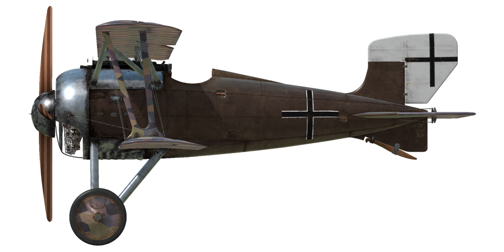

# SSW D.IV

## Описание

SSW D.IV поступил на вооружение Германской империи слишком поздно, чтобы оказать какое-то влияние на ход войны, но успевшие поступить на вооружение фронтовых эскадрилий аэропланы зарекомендовали себя хорошо. D.IV стал последней моделью в линейке этого производителя и обладал уникальной особенностью: коленвал ротативного двигателя Siemens Halske Sh.IIIa мощностью 207 л.с. вращался в противоположном от блока цилиндров и пропеллера направлении в попытке уменьшить реактивный момент. Четырёхлопастный пропеллер обеспечил высокую скорость и скороподъёмность - «Сименс-Шукерт» получился даже более быстрым, чем очень успешный «Фоккер» D.VII, и очень манёвренным, хотя, по сохранившимся сведениям, он неожиданно уходил в сваливание без предупрежджающей тряски при попытке слишком резкого манёвра. Вооружение истребителя состояло из двух пулемётов калибра 7,92 мм.
 

Двигатель
Sh.IIIa контр-ротативный 11-цилиндровый, 207 л.с.

Размеры
Высота: 2630 мм
Длина: 5580 мм
Размах крыла: 8350 мм
Площадь крыла: 15,12 кв.м.

Вес
Пустой: 552 кг
Взлётный: 735 кг
Объем топлива: 80 л
Объем масла: 20 л

Максимальная скорость (приборная)
у земли — 192 км/ч
1000 m — 183 км/ч
2000 m — 173 км/ч
3000 m — 164 км/ч
4000 m — 155 км/ч
5000 m — 145 км/ч
6000 m — 136 км/ч
7000 m — 126 км/ч
8000 m — 115 км/ч

Скороподъемность
1000 м — 1 мин. 54 сек.
2000 м — 4 мин. 10 сек.
3000 м — 6 мин. 44 сек.
4000 м — 9 мин. 43 сек.
5000 м — 13 мин. 15 сек.
6000 м — 17 мин. 35 сек.
7000 м — 23 мин. 16 сек.
8000 м — 31 мин. 47 сек.

Примечание 1: данные указаны для условий международной стандартной атмосферы.
Примечание 2: максимальные скорости и скороподъемности даны для стандартной массы самолёта.
Примечание 3: скороподъемности даны на предельно возможном работы двигателя, максимальные скорости - при 1800 об/мин.

Практический потолок ~8000 м

Продолжительность полёта на 1000 м
номинальная мощность (боевой режим) - 1 ч. 12 мин.
минимальный расход (крейсерский режим) - 2 ч.

Вооружение:
Курсовое: 2хLMG 08/15 Spandau 7,92mm, 500 патронов на ствол.

Использованные источники:
1) Airplaines in horizontal curvilinear flight, Heinrich Kann, From Technische Berichte, Volume 3, №7.
2) Flight and Aircraft Engineer, 13 March, 1919.
3) Technische Berichte, Neuere Bestrebungen und Erfahrungen im Flugmotorenbau, Von Schwager.
4) WW1 Aero №99, April 1984.
5) Siemens-Schuckert Aircraft of WWI, Jack Herris.
6) Windsock Datafile №29 SSW D.III-D.IV, P.M. Grosz.

## Модификации

### Счётчики патронов

Счётчики патронов стрелочные Wilhelm Morell для двух пулемётов
Дополнительная масса: 1 кг

### Указатель наклона

Жидкостный указатель наклона D.R.G.M (отображает крен на земле и скольжение в полёте)
Дополнительная масса: 1 кг

### Освещение кабины

Лампа ночного освещения кабины самолёта
Дополнительная масса: 1 кг

### Коллиматор дневной

Коллиматорный прицел Oigee рефлекторного типа (с установленным затемняющим фильтром)
Дополнительная масса: 2 кг

### Коллиматор ночной

Коллиматорный прицел Oigee рефлекторного типа (со снятым затемняющим фильтром)
Дополнительная масса: 2 кг

### Анемометр

Анемометр Wilhelm Morell (45-250 км/ч)
Дополнительная масса: 1 кг
