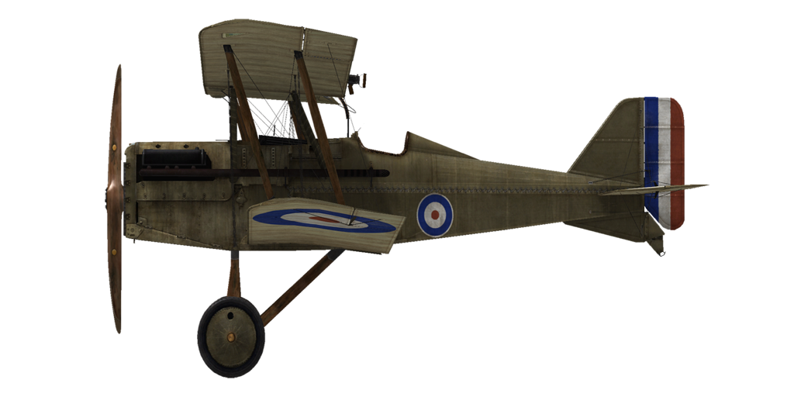

# S.E.5a  

<table><tbody><tr><td style="text-align: center"></td><td style="text-align: center"></td></tr><tr><td style="text-align: center" colspan="2"></td></tr></tbody></table>  

## Description  

L\avion a été conçu par la société britannique R.A.F. (Royal Aircraft Factory). S.E. — Patrouilleur expérimental (chasseurs monoplaces). L\objectif était de construire un chasseur autur d\un moteur Hispano—Suiza de 200 hp, qui serait rapide avec une haute vitesse de montée. Pour atteindre ces objectifs, les ingénieurs ont du trouver un compromis. En faisant des profils d\ailes minces, ils en ont augmenté la surface. Ce design comportait des ailes supérieures et inférieures. 5269 avions ont été construits à la fin de la guerre.  
  
Le premier vol d\essai a été réalisé en janvier 1917. L\avion a été vu pour la première fois au combat en juin1917 dans l\escadron anglais N 56. Il était utilisé contre les chasseurs et ballons ennemis, l\escorte de bombardiers, très rarement contre des cibles au sol sur la ligne de front. Les discussions des pilotes mentionnaient la durabilité de la structure, une maniabilité suffisante, une stabilité en plongée et pendant les tirs de mitrailleuses, de prise en main fine, et d\une bonne sensibilité de contrôle à basse vitesse. Lors d\atterrissage à haute vitesse l\avion ne pouvait pas toucher le sol à cause d\une forte portance de l\aile. Il est intéressant que la plupart des as britanniques ont volé sur ce type d\avion. Son surnom était même "faiseur d\as".  
  
Pendant le service la pauvre fiabilité des moteus Hispani—Suiza est devenue claire, c\est pour ça que l\avion était également équipé de moteurs Wolseley Viper plus fiables (licence britannique construit par les usines Hispano—Suiza). Des freinages fréquents lors des atterrissages ont amené à renforcer la structure, par la suite la forme a été modifiée (tubes de métal soudés et ramplacés par des cadres en bois). L\avion a participé à des combats en Europe, sur le front de l\ouest, en Macédoine, Mésopotamie et Palestine.  
  
  
Moteur V8 Wolseley Vipe 200 HP  
  
Tailles  
Hauteur: 2743 mm  
Longueur: 6300 mm  
Envergure: 8000 mm  
Surface d\aile: 23,7 sq.m  
  
Poids  
Poids à vide: 635 kg  
Poids au décollage: 886 kg  
Capacité des réservoirs carburant: 148 l  
Capacité du réservoir d\huile: 16 l  
  
Vitesse maximale (IAS)  
au Sol — 223 km/h  
1000 m — 209 km/h  
2000 m — 194 km/h  
3000 m — 180 km/h  
4000 m — 165 km/h  
5000 m — 150 km/h  
6000 m — 133 km/h  
  
Tauc de montée  
1000 m —  2 min. 52 sec.  
2000 m —  6 min. 15 sec.  
3000 m — 10 min. 41 sec.  
4000 m — 17 min. 03 sec.  
5000 m — 28 min. 01 sec.  
  
Plafond opérationnel 5500 m  
  
Autonomie à 1000 m  
puissance nominale (en combat) — 2 h. 10 min.  
consommation minimale (en croisière) — 6 h. 10 min.  
  
Armes fixées: Vickers 7,69mm, 400 cartouches par baril.  
Armes fixées (monté sur l\aile): Lewis 7,69 mm, 4 caisses avec 97 cartouches chacunes.  
Bombes:  36 kg bomb.  
  
References  
1) The Royal Aircraft Factory, by Paul R Hare.  
2) S.E. 5a in action. Squadron/signal publications, Aircraft Number 69.  
3) RAF S.E.5 and S.E.5a Specification.  
4) Profile Publications, The S.E. 5A Number 1.  

## Modifications  
### Aldis  

Collimateur à réfraction Aldis  
Masse supplémentaire : 2 kg  
  
### Cooper bombes  

4 x bombes d’emploi général 24 lb Cooper (11 kg)  
Masse supplémentaire : 56 kg  
Masse des munitions : 44 kg  
Masse des pylones : 12 kg  
Perte estimée de vitesse avant le largage : 2 km/h  
Perte estimée de vitesse après le largage : 1 km/h  
  
### Lumière de cockpit  

Lumière à ampoule pour les sorties de nuit  
Masse supplémentaire : 1 kg  
  
### Jauge d\essence,  

Jauge de niveau de carburant à aiguille (0-30 Gallons)  
Masse supplémentaire : 1 kg  
