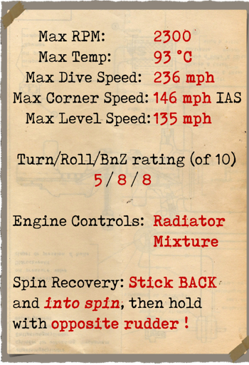

# S.E.5a  

| Image | Notes  
|:---|:---  
|  |   

## Descripción  

El avión monoplaza S.E.5a (Scout Experimental 5a) fue diseñado por la compañía británica R.A.F. (Royal Aircraft Factory). El propósito era construir un caza con un motor Hispano-Suiza de 200 CV, que le proporcionaría velocidad y una alta tasa de ascenso. Con el fin de alcanzar este fin, los ingenieros tuvieron que establecer un compromiso. Al crear un perfil de ala delgado, debieron aumentar su superficie alar. Este diseño también incluyó alerones en el ala superior e inferior. Al final de la guerra un total de 5269 aeroplanos habían sido construidos.  
  
El primer vuelo de prueba se llevó a cabo en enero de 1917, y su primera entrada en combate en Junio de 1917 con el escuadrón británico No. 56. Se utilizó para interceptar cazas y globos enemigos y escoltar bombarderos; en raras ocasiones fue empleado para atacar objetivos de tierra cerca de la línea del frente. Evaluando el avión, los pilotos destacaron su durabilidad estructural, suficiente maniobrabilidad, estabilidad en picados y al disparar las ametralladoras, manejo preciso y buena sensibilidad de los controles a bajas velocidades. En los aterrizajes a alta velocidad el avión no podía tocar el suelo a causa de la alta sustentación generada por las alas. Es interesante mencionar que la mayoría de los Ases ingleses volaron este modelo, por lo que se ganó el apodo de «Creador de Ases».  
  
Durante su servicio, la escasa fiabilidad del motor Hispano-Suiza se hizo evidente, y como resultado, el avión también fue equipado con el más fiable motor de Wolseley Viper (construido bajo licencia en las fábricas Hispano-Suiza británicas). La estructura del tren de aterrizaje tuvo que ser rediseñada tras los frecuentes informes que alertaban de su rotura al aterrizar. Esto supuso cambiar su forma (los tubos metálicos soldados fueron reemplazados por una estructura de madera). El aeroplano fue desplegado en el Frente Occidental y también en Macedonia, Mesopotamia y Palestina.   
  
  
Motor:  
V8 Wolseley Viper 200 CV  
  
Dimensiones:  
Altura: 2743 mm  
Longitud: 6300 mm  
Envergadura alar: 8000 mm  
Superficie de ala: 23,7 m²  
  
Peso:  
Vacío: 635 kg  
Al despegue: 886 kg  
Capacidad de combustible: 148 l  
Capacidad de aceite: 16 l  
  
Velocidad máxima (IAS):  
Nivel del mar — 223 km/h  
1000 m — 209 km/h  
2000 m — 194 km/h  
3000 m — 180 km/h  
4000 m — 165 km/h  
5000 m — 150 km/h  
6000 m — 133 km/h  
  
Tasa de ascenso:  
1000 m —  2 min 52 s  
2000 m —  6 min 15 s  
3000 m — 10 min 41 s  
4000 m — 17 min 03 s  
5000 m — 28 min 01 s  
  
Techo de servicio: 5500 m  
  
Autonomía a 1000 m  
Potencia nominal (combate) — 2 h 10 min  
Consumo mínimo (crucero) — 6 h 10 min  
  
Armamento:  
Disparo frontal: 1 Vickers 7,69 mm, 400 balas por arma  
Disparo frontal (sobre el ala): 1 Lewis 7,69 mm, 4 cajas con 97 balas cada una  
Carga de bombas: 36 kg  
  
Referencias:  
1) The Royal Aircraft Factory, por Paul R Hare.  
2) S.E. 5a in action. Squadron/signal publications, Aircraft Number 69.  
3) RAF S.E.5 and S.E.5a Specification.  
4) Profile Publications, The S.E. 5A Number 1.  

## Modificaciones  
### Aldis  

Colimador reflectante Aldis  
Peso adicional: 2 kg  
  
### Bombas Cooper  

Hasta 4 bombas de propósito general de 24 lb (11 kg) Cooper  
Peso adicional: 56 kg  
Peso de munición: 44 kg  
Peso de los soportes: 12 kg  
Pérdida de velocidad estimada antes de soltar: 2 km/h  
Pérdida de velocidad estimada tras soltar: 1 km/h  
  
### Luz de cabina  

Lámpara para iluminar la cabina en las salidas nocturnas  
Peso adicional: 1 kg  
  
### Indicador nivel de combustible  

Indicador analógico del nivel de combustible (0-30 Galones)  
Peso adicional: 1 kg  
