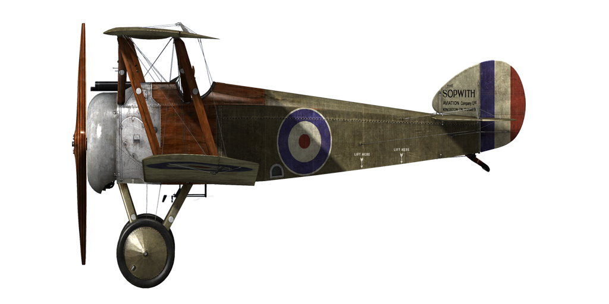

# Sopwith Camel

## 描述

索普维斯“骆驼”（Sopwith Camel）的结构基于其前身索普维斯“幼犬”（Sopwith Pup）的构造。索普维斯的首席设计师赫伯特·史密斯（Herbert Smith）决定略微改变幼犬的设计，因为必须安装更新、更大、更重的发动机。起落架支柱做了一些改动，机翼和安定面的间距增加，机身延伸到驾驶舱的后缘，看起来有点像骆驼的驼峰。那个“驼峰”就是飞机的名字——索普维斯“骆驼”。 

飞机结构的一个显著细节是它的紧凑性：飞行员的座椅、油箱、机枪和发动机都安装得非常紧密。除了主要的索普维斯工厂之外，该飞机也由其他一些公司组装，如拉斯顿普罗克特公司（Ruston Proctor Co）、波特霍尔姆机场有限公司（Portholme Aerodrome Ltd）、博尔顿&保罗有限公司（Boulton & Paul Ltd）、英国高登有限公司（British Caudron Co. Ltd）、克莱顿&沙特尔沃思有限公司（Clayton & Shuttleworth Ltd）、胡珀有限公司（Hooper & Co. Ltd）等。总共建造了约5490架骆驼。1917年3月，英国第60中队进行了骆驼的首次飞行试验，随后对飞机的结构进行了一系列小的改进。量产飞机于1917年5月首次交付给战斗机中队。它主要用于摧毁敌机和空中气球，同时还不时的用于对地攻击行动。英国记者称这架飞机为“小巧灵活的野兽”。 

“骆驼”飞行员提到了飞机平衡的飞行操纵，良好的向上视野，以及高巡航速度。由于飞机的独特的平衡性，飞机几乎可以立即改变航向，这使得“骆驼”成为一个危险的对手。“骆驼”飞行员的典型战斗场景是中低空的格斗，“骆驼”在急转弯时占优势。老兵们常说：“一旦你成为“骆驼”飞行员，你将永远驾驶它。”除了装备英国部队外，这架飞机还由美国航空队四个中队和一些比利时飞行员驾驶。 

发动机：旋转九缸体克莱格特（Clerget）9B 130 HP

尺寸
高度：2590 mm
长度：5490 mm
翼展：8530 mm
机翼面积：21.46 m².

重量
空载重量：431 kg
最大起飞重量：700 kg
燃油容量：168 L
滑油容量：20 L

最大空速(指示空速)
海平面——195 km/h
1000 m——183 km/h
2000 m——170 km/h
3000 m——158 km/h
4000 m——145 km/h
5000 m——132 km/h
6000 m——117 km/h

爬升率
1000 m — 2min 37s
2000 m — 5min 46s
3000 m — 9min 40s
4000 m — 14min 45s
5000 m — 21min 41s
6000 m — 32min 17s

实用升限6700 m

1000m高度的续航时间
标称动力（战斗）— 2h 50min
最低消耗（巡航）— 5h

武器：
前射：2 х 维克斯（Vickers） Mk.I 7.69，500发每弹鼓.
炸弹装载：36 kg

参考:
1) Sopwith Aircraft Blueprint s，WWI Aero Magazine.
2) The Sopwith Camel. Profile publications Number 31.
3) Sopwith Camel. JM Bruce Windsock Datafile 26.
4) Sopwith Camel Aces of Wold War I. Norman Frank s，Osprey №52.
5) Flying the Camel in 1918. FLIGHT International，2 May 1968.
6) A History of No.10 Sq. RNAS in WWI. Mike Westrop，Schiffer Military History.
7) Sopwith Camel Specification.

## 修改

### 阿尔迪斯（Alidas）瞄准具

阿尔迪斯（Alidas）折射型直筒瞄准具
增加质量：2 kg

### 库珀（Cooper）炸弹

最多4 x 11 kg（24 lb）库珀（Cooper）通用炸弹
增加质量：56 kg
弹药质量：44 kg
挂架质量：12 kg
投弹前预期速度损失：2 km/h
投弹后预期速度损失：1 km/h

### 驾驶舱照明

用于夜间飞行的驾驶舱照明灯
增加质量：1 kg

### 增大天窗

增大上层机翼的缺口以改进视野。
预期速度损失：2 km/h
