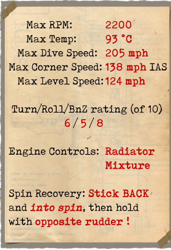
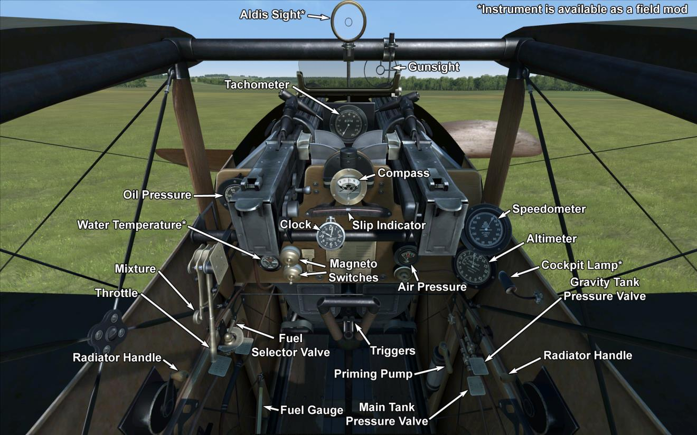

# Sopwith Dolphin  

<table><tbody><tr><td style="text-align: center"></td><td style="text-align: center"></td></tr><tr><td style="text-align: center" colspan="2"></td></tr></tbody></table>  

## Описание  

Самолёт создан британской компанией Sopwith Aviation Co. Приняв во внимание недостатки модели Sopwith Camel - плохой обзор вперед и вверх, трудность пилотирования самолёта с ротативным двигателем, - конструкторам поставили задачу создать истребитель с рядным двигателем. Из особенностей конструкции можно выделить компактное размещение пилота, топливных баков, вооружения и двигателя. Радиаторы пришлось разместить по обе стороны фюзеляжа позади кабины пилота, голова пилота была в проеме центральной секции верхнего крыла. Первый испытательный полёт был совершен в мае 1917 года. Одновременно с головным предприятием сборкой самолёта занимались компании Darracq, Hooper, SACA. До конца боевых действий было построено около 1532 самолётов.  
  
Первые армейские испытания прошли в английской эскадрилье №56 13 июня 1917 года, за этим последовал ряд незначительных доработок конструкции. Первое поступление самолёта в боевую эскадрилью №19 датируется январем 1918 года. Dolphin применялся для истребления самолётов и аэростатов противника, особенно на больших высотах, где он имел преимущество над Sopwith Camel. Применялся также для нанесения ударов по наземным объектам противника с использованием бомбового и пулемётного вооружения.  
  
Пилоты отмечали хорошую сбалансированность рулей управления, отличный обзор вверх и вперед, но нижняя полусфера скрывалась за нижними крыльями и капотом. Обладая маневренностью, близкой Sopwith Camel, а скоростью и набором высоты - равной S.E. 5a, самолёт был грозным противником. Частыми нареканиями пилотов были жалобы на излишнюю тесноту в кабине пилота и опасность опрокидывания самолёта при жестких посадках. На этих самолётах летали и некоторые французские и американские пилоты.  
  
  
Двигатель V8 Hispano-Suiza 8Ba 200 л.с.  
  
Размеры  
Высота: 2600 мм  
Длина: 6700 мм  
Размах крыла: 10000 мм  
Площадь крыла: 24,5 кв.м.  
  
Вес  
Пустой: 660 кг  
Взлётный: 893 кг  
Объем топлива: 123 л  
Объем масла: 18 л  
  
Максимальная скорость (приборная)  
у земли — 203 км/ч  
1000 м — 192 км/ч  
2000 м — 182 км/ч  
3000 м — 171 км/ч  
4000 м — 160 км/ч  
5000 м — 148 км/ч  
6000 м — 134 км/ч  
7000 м — 116 км/ч  
  
Скороподъёмность  
1000 м —  2 мин. 44 сек.  
2000 м —  5 мин. 48 сек.  
3000 м —  9 мин. 32 сек.  
4000 м — 14 мин. 14 сек.  
5000 м — 20 мин. 30 сек.  
6000 м — 29 мин. 42 сек.  
7000 м — 47 мин. 04 сек.  
  
Практический потолок 7100 м  
  
Продолжительность полёта на 1000 м  
номинальная мощность (боевой режим) - 1 ч. 40 мин.  
минимальный расход (крейсерский режим) - 3 ч. 20 мин.  
  
Вооружение  
Курсовое: 2 х Vickers 7.69mm, по 500 патронов на ствол.  
Бомбовая нагрузка: 36 кг. бомб  
  
Использованные источники  
1) The Sopwith Dolphin. Profile publications Number 169.  
2) Sopwith Dolphin.  J M Bruce Windsock Datafile 054.  
3) Dolphin and Snipe Aces of Wold War I.  Norman Franks,  Osprey №48.  
4) Sopwith Dolphin Specification.  

## Модификации  
### Aldis  

Коллиматорный прицел Aldis рефракторного типа  
Дополнительная масса: 2 кг  
  
### Бомбы Купера  

До 4 осколочно-фугасных 24-фунтовых авиабомб Купера (11 кг)  
Дополнительная масса: 56 кг  
Масса вооружения: 44 кг  
Масса держателей: 12 кг  
Ориентировочная потеря скорости до сброса: 2 км/ч  
Ориентировочная потеря скорости после сброса: 1 км/ч  
  
### Освещение кабины  

Лампа ночного освещения кабины самолёта  
Дополнительная масса: 1 кг  
  
### Два пулемёта Льюис над верхним крылом  

Установленные над верхним крылом спаренные пулемёты Lewis с изменяемым углом установки.  
Боезапас: 388 патронов 7.69мм (4 магазина по 97 патронов в каждом)  
Переднее положение: 25°  
Верхнее положение: 45°  
Масса пули: 11 г  
Дульная скорость: 745 м/с  
Скорострельность: 550 выстр/мин  
Масса оружия: 15 кг (без магазина)  
Масса установок: 2 кг  
Масса боезапаса: 16 кг  
Общая масса: 33 кг  
Примерная потеря скорости: 7-18 км/ч  
  
### Два пулемёта Льюис на нижнем крыле  

Установленные на нижнем крыле два пулемёта Lewis.  
Боезапас: 194 патронов 7.69мм (2 магазина по 97 патронов в каждом)  
Масса пули: 11 г  
Дульная скорость: 745 м/с  
Скорострельность: 550 выстр/мин  
Масса оружия: 15 кг (без магазина)  
Масса установок: 2 кг  
Масса боезапаса: 8 кг  
Общая масса: 25 кг  
Примерная потеря скорости: 3 км/ч  
  
### Термометр  

Указатель температуры охлаждающей жидкости двигателя O.S.I.C (30-100 °C)  
Дополнительная масса: 1 кг  
