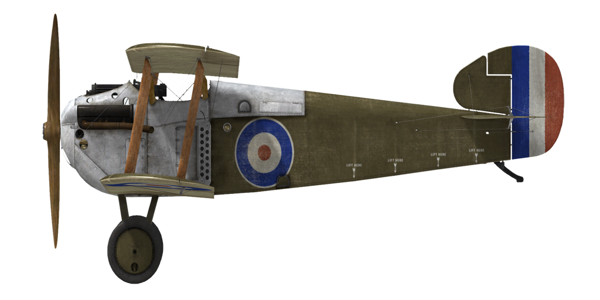

# Sopwith Dolphin  
  
  
  
## Descripción  
  
El Sopwith Dolphin fue diseñado por la British Sopwith Aviation Co. Para el diseño del avión se tuvieron en cuenta los defectos del Sopwith Camel, entre los que se incluían una mala visibilidad hacia adelante y hacia arriba y las dificultades de manejar un avión con motor rotativo. Para solventar este último problema, los ingenieros decidieron construir el nuevo avión con un motor lineal. El diseño incluyó una disposición compacta de la cabina, tanques de combustible, ametralladoras y motor. En consecuencia, la cabeza del piloto se situó al nivel de la abertura del ala superior y los radiadores se movieron a los lados del fuselaje, por detrás de la cabina. Los primeros vuelos de prueba se hicieron en mayo de 1917. Además de la Sopwith Aviation Company, otras empresas fabricaron el avión: Darracq, Hooper y SACA. Al final de la guerra, un total de 1532 aeroplanos de este tipo habían sido construidos.  
  
La evaluación del comportamiento del Dolphin comenzó con el escuadrón británico n.º 56 el 13 de junio de 1917, a la que seguirían varias mejoras en el diseño. En enero de 1918, el escuadrón n.º 19 se convirtió en la primera unidad operativa en recibir los modelos de producción del Dolphin. Fue utilizado contra cazas y globos enemigos, especialmente a gran altura, donde era superior al Sopwith Camel. También fue utilizado en el ataque a objetivos en tierra.  
  
Los pilotos destacaron el buen balance de los controles, perfecta visibilidad hacia arriba y adelante, pero la visibilidad hacia abajo se vio disminuida por las alas inferiores y la cubierta de los radiadores. El avión fue un oponente formidable, ya que poseía la capacidad de maniobra del Sopwith Camel y una velocidad y tasa de ascenso igual a la del SE5a. Los pilotos se quejaron bastante de la debilidad de la cabina y la tendencia del avión a dar con el morro en el suelo y volcar en aterrizajes bruscos. Los pilotos franceses y americanos emplearon este avión durante un corto período de tiempo.   
  
  
Motor:  
V8 Hispano—Suiza 8Ba, 200 CV  
  
Dimensiones:  
Altura: 2600 mm  
Longitud: 6700 mm  
Envergadura alar: 10000 mm  
Superficie de ala: 24,5 m²  
  
Peso:  
Vacío: 660 kg  
Al despegue: 893 kg  
Capacidad de combustible: 123 l  
Capacidad de aceite: 18 l  
  
Velocidad máxima (IAS):  
Nivel del mar — 203 km/h  
1000 m — 192 km/h  
2000 m — 182 km/h  
3000 m — 171 km/h  
4000 m — 160 km/h  
5000 m — 148 km/h  
6000 m — 134 km/h  
7000 m — 116 km/h  
  
Tasa de ascenso:  
1000 m —  2 min 44 s  
2000 m —  5 min 48 s  
3000 m —  9 min 32 s  
4000 m — 14 min 14 s  
5000 m — 20 min 30 s  
6000 m — 29 min 42 s  
7000 m — 47 min 04 s  
  
Techo de servicio: 7100 m  
  
Autonomía a 1000 m:  
Potencia nominal (combate) — 1 h 40 min  
Consumo mínimo (crucero) — 3 h 20 min  
  
Armamento:  
Disparo frontal: 2 Vickers Mk.I de 7,69 mm, 500 balas por arma  
Carga de bombas: 36 kg  
  
Referencias:  
1) The Sopwith Dolphin. Profile publications número 169.  
2) Sopwith Dolphin. J M Bruce Windsock Datafile 054.  
3) Dolphin and Snipe Aces of Wold War I. Norman Franks, Osprey n.º48.  
4) Sopwith Dolphin Specification.  
  
## Modificaciones  
### Aldis  
  
Colimador reflectante Aldis  
Peso adicional: 2 kg  
  
### Bombas Cooper  
  
Hasta 4 bombas de propósito general de 24 lb (11 kg) Cooper  
Peso adicional: 56 kg  
Peso de munición: 44 kg  
Peso de los soportes: 12 kg  
Pérdida de velocidad estimada antes de soltar: 2 km/h  
Pérdida de velocidad estimada tras soltar: 1 km/h  
  
### Luz de cabina  
  
Lámpara para iluminar la cabina en las salidas nocturnas  
Peso adicional: 1 kg  
  
### Doble Lewis sobre ala superior  
  
Dos ametralladoras Lewis sincronizadas adicionales de posición variable montadas sobre al ala superior.  
Munición: 388 balas de 7,69 mm (4 tambores con 97 balas cada uno)  
Posición hacia delante: 25º  
Posición hacia arriba: 45º  
Peso del proyectil: 11 g  
Velocidad de salida: 745 m/s  
Tasa de disparo: 550 bpm  
Peso de las armas: 15 kg (sin cargador)  
Peso de los soportes: 2 kg  
Peso de la munición: 16 kg  
Peso total: 33 kg  
Pérdida de velocidad estimada: 7-18 km/h  
  
### Dos Lewis sobre alas inferiores  
  
Dos ametralladoras Lewis sincronizadas adicionales de posición fija montadas sobre las alas inferiores.  
Munición: 194 balas de 7,69 mm (2 tambores con 97 balas cada uno)  
Peso del proyectil: 11 g  
Velocidad de salida: 745 m/s  
Tasa de disparo: 550 bpm  
Peso de las armas: 15 kg (sin cargador)  
Peso de los soportes: 2 kg  
Peso de la munición: 8 kg  
Peso total: 25 kg  
Pérdida de velocidad estimada: 3 km/h  
  
### Termómetro  
  
Indicador de temperatura del refrigerante del motor O.S.I.C (30..100 °C)  
Peso adicional: 1 kg  
