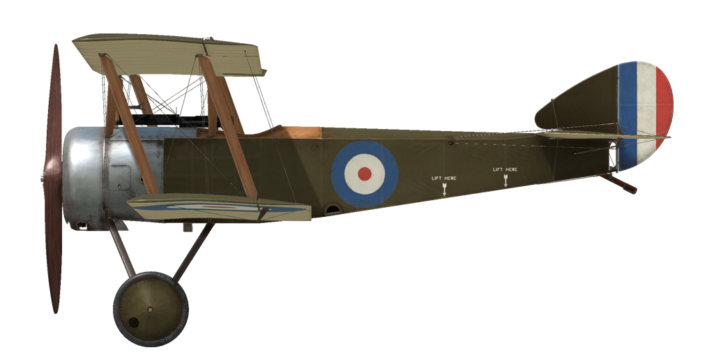
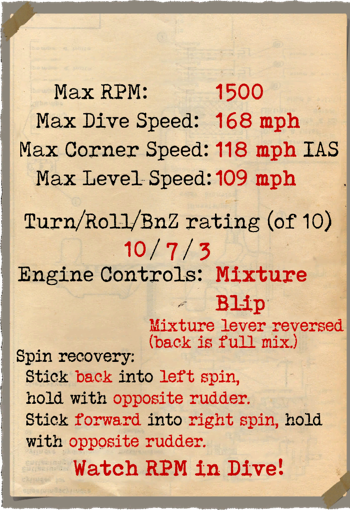
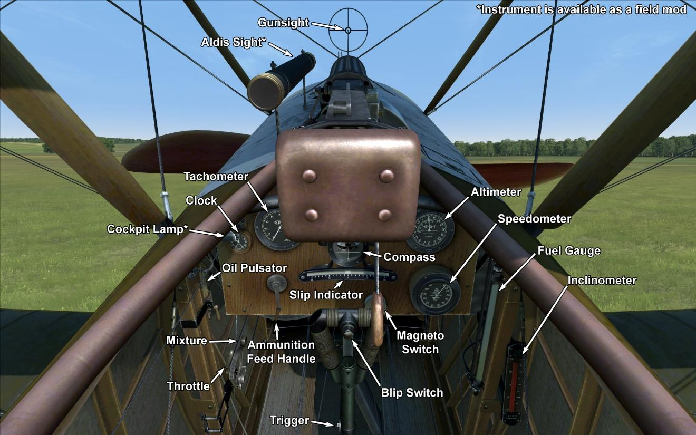

# Sopwith Pup  

<table><tbody><tr><td style="text-align: center"></td><td style="text-align: center"></td></tr><tr><td style="text-align: center" colspan="2"></td></tr></tbody></table>  

Entworfen vom talentierten Ingenieur Herbert Smith von der Sopwith Aviation Company ist die Sopwith Pup ein Jagdeinsitzer. Mit ihren guten Flugeigenschaften und Manövrierfähigkeit fand sie sehr schnell Gefallen bei ihren Piloten. Der erste Prototyp flog im Februar 1916. Nach einer Anzahl von Verbesserungen am Prototyp kam es zu den ersten Fronteinsätzen der Pup beim Royal Naval Air Service (RNAS), den britischen Marinefliegern. Der offizielle Name des Flugzeuges lautete “Sopwith Scout”, jedoch erlangte es bald den Spitznamen “Pup” (Welpe) aufgrund der Ähnlichkeit zur Sopwith “1½ Strutter”, die Pup verfügte jedoch über kleinere Proportionen und wirkte daher wie ein Welpe. Obwohl der Spitznamen "Pup" niemals offiziell anerkannt wurde, läutete sie die Tradition ein, nachfolgende Sopwithflugzeuge nach einem Vogel oder Tier zu benennen.  
  
Die ersten Serienmodelle der Sopwith Pup gelangten im Oktober 1916 an die Front. Die guten Flugeigenschaften ermöglichten es ihr, sich erfolgreich mit dem Gegner zu messen. Bis zum Ende des Jahres 1916 errang die 8. Staffel des RNAS während der Schlacht an der Somme über 20 Luftsiege. “Wir bemerkten sofort, dass diese Maschine den Unseren überlegen war” - Manfred von Richthofen. Die gelungene Mischung von niedrigem Gewicht und großer Flügelfläche erlaubte es britischen Piloten den Gegner im Kurvenkampf zu übertreffen. Das britische Ass James McCudden sagte folgendes über die Pup: “Die Pup kurvt zwei Mal so schnell wie die Albatros im Kurvenkampf [...] darüber hinaus ist sie perfekt für alle Arten der Fliegerei. Die Kombination von Gewicht und Flügelfläche ist so erfolgeich, dass man nach ein wenig Übung auf einem Tennisplatz landen kann”. Aufgrund dieses Merkmals war die Pup das erste Flugzeug, dass auf dem Deck eines fahrenden Schiffes landete, der HMS Furious.  
  
Die Einsatzdauer der Pup war kurz. Schon im Frühling 1917 hatte die Gegenseite neue Flugzeuge erhalten, die der Pup in vielen Aspekten überlegen waren. Eine Sopwith Scout nach der anderen wurde nach und nach von der Front an Flugschulen übergeben, wo sie noch lange Zeit als Schulflugzeug Verwendung fand. Insgesamt wurden 1770 Pups hergestellt.  
  
  
Triebwerk   
Le Rhône 9C rotary, 80 PS  
  
Abmessung  
Höhe: 2870 mm  
Länge: 5890 mm  
Spannweite: 8080 mm  
Flügelfläche: 23,6 qm  
  
Gewicht  
Leer: 356 kg  
Startgewicht: 556 kg  
Treibstoffkapazität: 82 l  
Ölkapazität: 21 l  
  
Max. Geschwindigkeit (IAS: km/h)  
Meeresspiegel — 173 km/h  
1000 m — 164 km/h  
2000 m — 154 km/h  
3000 m — 143 km/h  
4000 m — 129 km/h  
  
Steigrate  
1000 m —  3 Min. 24 Sek.  
2000 m —  7 Min. 53 Sek.  
3000 m — 13 Min. 50 Sek.  
4000 m — 22 Min. 30 Sek.  
  
Dienstgipfelhöhe 5500 m  
  
Reichweit bei 1000 m  
Nennleistung (im Kampf) — 2 Std. 30 Min.  
Minimaler Verbrauch (Rundflug) — 3 Std. 30 Min.  
  
Bewaffnung  
Starre Bewaffnung nach vorne: 1 х Vickers 7.69mm, 500 Schuss.  
  
References:  
1) Sopwith Pup. Windsock Datafile 2.  
2) Sopwith Pup. Windsock Datafile Special.  
3) Sopwith Pup Aces of World War I. Osprey Aircraft of the Aces 67.  
4) The Sopwith Pup. Profile publications Number 13.  

## Änderungen  
### Aldis  

Aldis Teleskopvisier  
Zusätzliches Gewicht: 2 kg  
  
### Instrumentenlicht  

Glühlampe zum Beleuchten des Instrumentenbrettes bei Nachteinsätzen  
Zusätzliches Gewicht: 9 kg  
  
### LePrieur rockets  

8 x strut-mounted "Le Prieur" anti-balloon rockets of incendary action, with pointed triangular blade attached to nose cone to asssit penetration of balloon envelope or with high explosive grenade.  
Zusätzliches Gewicht: 36 kg  
Gewicht der Munition: 16 kg  
Gewicht der Abwurfwaffenroste: 20 kg  
Geschwindigkeitsverlust vor Abwurf: 8 km/h  
Geschwindigkeitsverlust nach Abwurf: 6 km/h  
