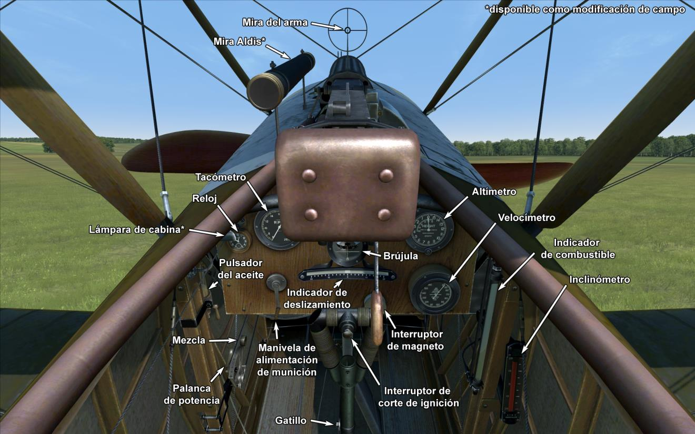

# Sopwith Pup  

<table><tbody><tr><td style="text-align: center"></td><td style="text-align: center"></tr><tr><td style="text-align: center" colspan="2"></td></tr></tbody></table>  

El Sopwith Pup fue un caza monoplaza diseñado por el talentoso ingeniero Herbert Smith de la Sopwith Aviation Company. El primer vuelo del prototipo se realizó en febrero de 1916. El aeroplano se ganó rápidamente el favor de sus pilotos gracias a sus buenas características de vuelo y maniobrabilidad. En marzo de 1916, después de una serie de mejoras, el aeroplano fue transferido a unidades del Royal Naval Service (RNAS) para ser probado en servicio operativo. El avión fue llamado oficialmente «Sopwith Scout», pero los pilotos lo apodaron «Pup»(cachorro) por la similitud con el Sopwith 1½ Strutter, aunque de menores proporciones. Aunque el apodo «Pup» nunca fue reconocido oficialmente, así empezó la costumbre de la Sopwith de poner nombres de aves o animales a los aviones posteriores.  
  
Las primeras unidades del Sopwith Pup fueron transferidas al frente en octubre de 1916. Sus buenas características de vuelo le permitieron combatir con éxito a la oposición enemiga. Durante la batalla del Somme, alrededor de 20 victorias fueron atribuidas al 8.º Escuadrón de RNAS, que contaba con biplano. Tras encontrarse con el Pup en combate, Manfred von Richthofen anotó: «Vimos al instante que los aeroplanos enemigos eran superior a los nuestros».  
  
La excelente mezcla entre el peso ligero del Pup y su enorme superficie alar permitió a los pilotos británicos superar al enemigo en el combate aéreo. El as británico James McCudden comentó: «<i>El Sopwith [Pup] giraría dos veces más que un Albatros [..] Era una máquina perfecta para el vuelo en general. La combinación de peso y superficie alar eran tan buena, que con un poco de práctica uno podría incluso aterrizar en una pista de tenis</i>». Gracias a estas características, el Pup se convirtió en el primer avión en aterrizar en un buque en movimiento, el HMS Furious, el 2 de agosto de 1917.  
  
La vida operativa del Pup fue corta. En la primavera de 1917 el bando oponente había conseguido un avión con características superiores al Pup en muchos aspectos. Uno a uno, los Sopwith Scout fueron transferidos desde el frente a las escuelas de vuelo donde fueron usados para el entrenamiento durante algún tiempo. En total, fueron fabricados un total de 1770 Pup.  
  
  
Motor:  
Le Rhône 9C rotativo, 80 CV  
  
Dimensiones:  
Altura: 2870 mm  
Longitud: 5890 mm  
Envergadura alar: 8080 mm  
Superficie de ala: 23,6 m²  
  
Peso:  
Vacío: 356 kg  
Al despegue: 556 kg  
Capacidad de combustible: 82 l  
Capacidad de aceite: 21 l  
  
Velocidad máxima (IAS):  
Nivel del mar — 173 km/h  
1000 m — 164 km/h  
2000 m — 154 km/h  
3000 m — 143 km/h  
4000 m — 129 km/h  
  
Tasa de ascenso:  
1000 m —  3 min 24 s  
2000 m —  7 min 53 s  
3000 m — 13 min 50 s  
4000 m — 22 min 30 s  
  
Techo de servicio: 5500 m  
  
Autonomía a 1000 m:  
Potencia nominal (combate) — 2 h 30 min  
Consumo mínimo (crucero) — 3 h 30 min  
  
Armamento:  
Disparo frontal: 1 Vickers Mk.I de 7,69 mm, 500 balas  
  
Referencias:  
1) Sopwith Pup. Windsock Datafile 2.  
2) Sopwith Pup. Windsock Datafile Special.  
3) Sopwith Pup Aces of World War I. Osprey Aircraft of the Aces 67.  
4) The Sopwith Pup. Profile publications Número 13.  

## Modificaciones  
### Aldis  

Colimador reflectante Aldis  
Peso adicional: 2 kg  
  
### Luz de cabina  

Lámpara para iluminar la cabina en las salidas nocturnas  
Peso adicional: 9 kg  
  
### Cohetes Le Prieur  

8 cohetes antiglobo Le Prieur montados en los soportes verticales de las alas, con una cuchilla triangular en la punta para ayudar a la perforación de la envoltura del globo o con una granada altamente explosiva.  
Peso adicional: 36 kg  
Peso de munición: 16 kg  
Peso de los soportes: 20 kg  
Pérdida de velocidad estimada antes de soltar: 8 km/h  
Pérdida de velocidad estimada tras soltar: 6 km/h  
