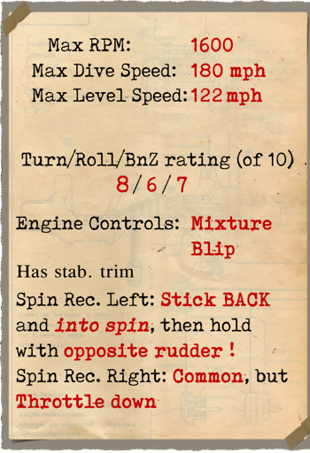

# Sopwith Snipe  

<table><tbody><tr><td style="text-align: center"></td><td style="text-align: center"></tr></td></tr></tbody></table>  

Sopwith Snipe был создан для замены своего предшественника Camel в ответ на появление у противника новых истребителей. На стадии проектирования предполагалась установка как двигателей от Camel (например, Clerget 9B или Bentley B.R.1), так и нового, более мощного Bentley B.R.2. Успешные испытания последнего, подтвердившие выдающуюся мощность (234 л.с.), окончательно сократили выбор до единственного двигателя. Ранний прототип самолёта был похож на своего предшественника как формой фюзеляжа, так и структурой бипланной коробки крыльев (по одной паре стоек на сторону). Но в дальнейшем сформировался окончательный образ самолёта: прямоугольная ферма фюзеляжа обрела скруглённый внешний каркас, коробка крыльев усилена дополнительной парой стоек (на сторону), вертикальное оперение получило руль направления с увеличенной за счёт компенсатора площадью.  
  
Семь контрактов на изготовление первых 1700 самолётов были распределены между компаниями: Sopwith, Boulton & Paul, Coventry Ordnance Works, Napier, Nieuport & General, Portholme Aerodrome и Ruston Proctor. Поставки начались летом 1918 года, но темпы производства сильно отставали от планов: так, из 200 запланированных к концу августа 1918 года было изготовлено только 77 самолётов. Суммарное количество изготовленных самолётов не определено, известно как минимум о 1567 поставленных Sopwith Snipe. В ходе производства был сделан ряд улучшений в конструкции, например, дальнейшее увеличение площади вертикального оперения и элеронов верхнего крыла. Также на части самолётов устанавливался более мощный (320 л.с.) радиальный двигатель Dragonfly, самолёты с таким двигателем после некоторых изменений в конструкции стали родоначальниками нового Sopwith Dragon.  
  
После полюбившегося Camel пилоты встретили Snipe несколько прохладно. Хотя новый самолёт и был быстрым и манёвренным, но из-за значительно большей массы он не обладал той знаменитой молниеносной реакцией на действия пилота, как его предшественник. Несмотря на это Snipe в руках опытных пилотов был очень грозным оружием. Так, 27 октября 1918 года, спустя всего несколько недель после дебюта самолёта на фронте, майор W.G. Barker, в одиночку вступив в бой с 15 самолётами противника и получив ранения в руку и обе ноги, сбил 4 из них. За этот бой майор был удостоен креста Виктории, а фюзеляж его Sopwith Snipe был сохранён и перевезён в Канаду, где выставляется в Канадском Военном музее в Оттаве.  
  
Подразделениями, которые успели перевооружится на Sopwith Snipe и применить его в боевых действиях на Западном фронте, были No.43 Squadron RAF, No.4 Squadron AFC и No.208 Squadron RAF.  
Первое боевое применение на Западном фронте: 26 сентября 1918 года.  
  
  
Двигатель  
Bentley B.R.2, ротативный 9-цилиндровый, 234 л.с.  
  
Размеры  
Высота: 2900 мм  
Длина: 5870 мм  
Размах крыла: 9144 мм  
Площадь крыла: 25,455 кв.м.  
  
Вес  
Пустой: 608 кг  
Взлётный: 905 кг  
Объем топлива: 176 л  
Объем масла: 33 л  
  
Максимальная скорость (приборная)  
у земли — 197 км/ч  
1000 м — 188 км/ч  
2000 м — 178 км/ч  
3000 м — 167 км/ч  
4000 м — 156 км/ч  
5000 м — 143 км/ч  
6000 м — 116 км/ч  
  
Скороподъемность  
1000 м — 2 мин. 31 sec  
2000 м — 5 мин. 24 сек.  
3000 м — 8 мин. 49 сек.  
4000 м — 13 мин. 00 сек.  
5000 м — 18 мин. 31 сек.  
6000 м — 28 мин. 23 сек.  
  
Практический потолок 6100 м  
  
Продолжительность полёта на 1000 м  
номинальная мощность (боевой режим) - 2 ч. 5 мин.  
минимальный расход (крейсерский режим) - 4 ч. 20 мин.  
  
Вооружение:  
Курсовое: 2 х Vickers Mk.I 7.69, 500 патронов на ствол.  
Бомбовая нагрузка: до 51 кг бомб.  
  
Использованные источники:  
1) Sopwith Aircraft 1912-1920, by H.F. King; Putnam, 1980.  
2) The Sopwith 7F.I Snipe. Profile publications Number 50.  
3) Sopwith Snipe. J.M. Bruce Windsock Datafile 46.  
4) Dolphin and Snipe Aces of Wold War I.  Norman Franks, Osprey №48.  

## Модификации  
### Aldis  

Коллиматорный прицел Aldis рефракторного типа  
Дополнительная масса: 2 кг  
  
### Бомба H.E.R.L.  

Осколочно-фугасная 112-фунтовая авиабомба H.E.R.L. (51 кг)  
Дополнительная масса: 57 кг  
Масса вооружения: 51 кг  
Масса держателей: 6 кг  
Ориентировочная потеря скорости до сброса: 2 км/ч  
Ориентировочная потеря скорости после сброса: 1 км/ч  
  
### Бомбы Купера  

До 4 осколочно-фугасных 24-фунтовых авиабомб Купера (11 кг)  
Дополнительная масса: 56 кг  
Масса вооружения: 44 кг  
Масса держателей: 12 кг  
Ориентировочная потеря скорости до сброса: 2 км/ч  
Ориентировочная потеря скорости после сброса: 1 км/ч  
  
### Увеличенные боковые вырезы в кабине  

Увеличенные боковые вырезы в кабине для улучшения обзора передней полусферы (модификация Баркера)  
  
### Освещение кабины  

Лампа ночного освещения кабины самолёта  
Дополнительная масса: 9 кг  
