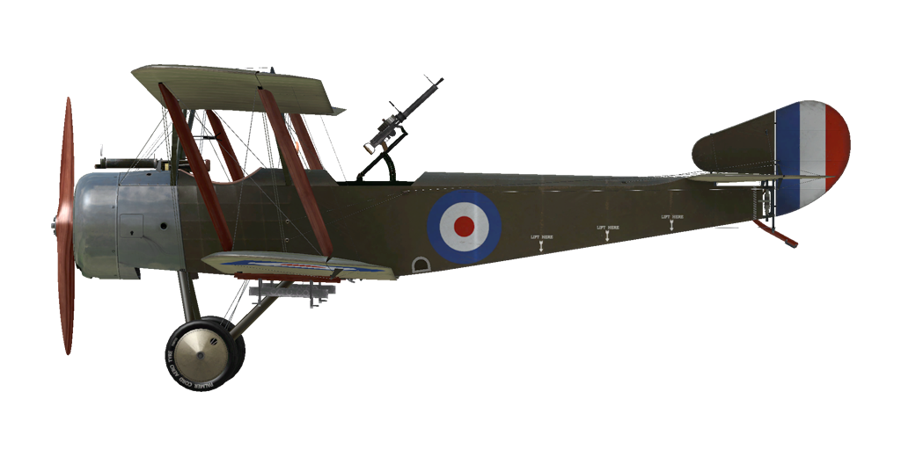

# Sopwith 1½ Strutter

## 描述

Designed and built for the British Admiralty, the Sopwith 1½ Strutter (which took its name from the arrangement of the upper wing center section - "one-and-a-half" (long and short) pairs of cabane struts supporting the top wing) was the first true two-seat fighter to enter service and actually the first British airplane armed with synchronised machine gun. Powered by a 110 hp or 130 hp Clerget rotary engine, the aircraft was armed with a fixed synchronized forward firing Vickers .303 machine gun and a single (sometimes double) Lewis .303 machine gun in the rear cockpit. The 1½ Strutter entered service with both the RNAS and the Royal Flying Corps.

The prototype two-seater flew in December 1915. Deliveries of the "Strutter" into frontline units began around may of 1916, with the first machines delivered having no fixed forward gun. It is believed that these aircraft were delivered without the forward gun due to a shortage of Vickers .303 machine guns because of Army demand for these weapons. Some early production aircraft had the observer\s .303 Lewis gun mounted on a cranked pillar mounting; these were later replaced by the "Eteve" mounting and eventually by the standard Scarff No.2 ring mount.

A small number were used for Home Defense, with the rear cockpits faired over. These aircraft were armed with twin Lewis guns on Foster mountings above the upper wing center section. A few others were converted in the field to be flown from the observer\s cockpit.

The RNAS operated 1½ Strutters from ships as reconnaissance and spotter aircraft. The United States Army Air Service assigned 1½ Strutters to the 88th, 90th and 99th Aero Squadrons between May and July of 1918 and others were flown by the American Expeditionary Force as trainers.

British manufacturers built 1282 in total. French construction totaled some 4,500 aircraft and continued until April of 1918: there were different variants including two seat fighter-reconnaissance aircraft, single seat bomber and two seat bomber.

Engine
Clerget 9B 130 hp

Dimensions
Height: 3120 mm
Length: 7700 mm
Wing span: 10210 mm
Wing surface: 32.16 sq.m

Weight
Empty: 592 kg
Takeoff: 971 kg
Fuel capacity: 182 l
Oil capacity: 19 l

Maximum airspeed (IAS)
sea level — 160 km/h
1000 m — 154 km/h
2000 m — 147 km/h
3000 m — 137 km/h
4000 m — 119 km/h

Climb rate
1000 m —  4 min. 16 sec.
2000 m —  9 min. 36 sec.
4000 m — 27 min. 59 sec.

Service ceiling 4500 m

Endurance at 1000 m
nominal power (combat) — 3 h. 45 min.

Armament
Forward firing: 1 х Vickers Mk.I 7.69mm, 500 rounds (2 x Vickers Mk.I modification)
Turret: 1 x Lewis 7,69mm, 6 drums with 97 rounds each
Bomb load: up to 72 kg.

References
1) Windsock Datafile 34 - Sopwith Strutter, by J.M. Bruce.
2) WWI Aeroplanes by J.M. Bruce.

## 修改

### 阿尔迪斯（Alidas）瞄准具

阿尔迪斯（Alidas）折射型直筒瞄准具
增加质量：2 kg

### 库珀（Cooper）/H.E.R.L. 炸弹

最多8 x 9 kg（20 lb）通用炸弹
增加质量：96 kg
弹药质量：72 kg
挂架质量：24 kg
投弹前预期速度损失：7 km/h
投弹后预期速度损失：3 km/h

最多2 x 29 kg（65 lb）H.E.R.L. 通用炸弹
增加质量：82 kg
弹药质量：58 kg
挂架质量：24 kg
投弹前预期速度损失：8 km/h
投弹后预期速度损失：4 km/h

### 驾驶舱照明

用于夜间飞行的驾驶舱照明灯
增加质量：1 kg

### 相机

可拍摄航空照片的相机
增加质量：10 kg

### 无线电

无线电发射机
增加质量：10 kg

### 双刘易斯（Lewis）机枪炮塔

双刘易斯（Lewis）机枪的斯卡夫（Scarff）旋转炮塔
弹药：776发7.69mm弹药（8个弹鼓，每个97发）
弹丸重量：11 g
膛口速度：745 m/s
射速：550 rpm
枪炮重量：15 kg（无弹鼓）
基座重量：12 kg
弹药重量：32 kg
总重：59 kg
预期速度损失：2 km/h

### 增大天窗

增大上层机翼的缺口以改进视野。
