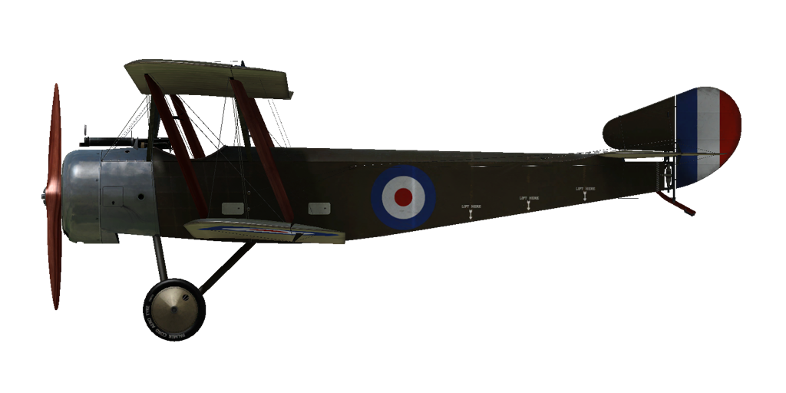

# Sopwith 1½ Strutter  
  
  
  
## Beschreibung  
  
Designed and built for the British Admiralty, the Sopwith 1½ Strutter (which took its name from the arrangement of the upper wing center section - "one-and-a-half" (long and short) pairs of cabane struts supporting the top wing) was the first true two-seat fighter to enter service and actually the first British airplane armed with synchronised machine gun. Powered by a 110 hp or 130 hp Clerget rotary engine, the aircraft was armed with a fixed synchronized forward firing Vickers .303 machine gun and a single (sometimes double) Lewis .303 machine gun in the rear cockpit. The 1½ Strutter entered service with both the RNAS and the Royal Flying Corps.  
  
The prototype two-seater flew in December 1915. Deliveries of the "Strutter" into frontline units began around may of 1916, with the first machines delivered having no fixed forward gun. It is believed that these aircraft were delivered without the forward gun due to a shortage of Vickers .303 machine guns because of Army demand for these weapons. Some early production aircraft had the observer\s .303 Lewis gun mounted on a cranked pillar mounting; these were later replaced by the "Eteve" mounting and eventually by the standard Scarff No.2 ring mount.  
  
A small number were used for Home Defense, with the rear cockpits faired over. These aircraft were armed with twin Lewis guns on Foster mountings above the upper wing center section. A few others were converted in the field to be flown from the observer\s cockpit.  
  
The RNAS operated 1½ Strutters from ships as reconnaissance and spotter aircraft. The United States Army Air Service assigned 1½ Strutters to the 88th, 90th and 99th Aero Squadrons between May and July of 1918 and others were flown by the American Expeditionary Force as trainers.  
  
British manufacturers built 1282 in total. French construction totaled some 4,500 aircraft and continued until April of 1918: there were different variants including two seat fighter-reconnaissance aircraft, single seat bomber and two seat bomber.  
  
  
Triebwerk: Clerget 9B  
Leistung: 130 hp  
  
Dimensionen:  
Hohe: 3120 mm  
Lange: 7700 mm  
Spannweite: 10210 mm  
Flugelflache: 32,16 m²  
  
Gewicht:  
Leer: 592 kg  
Startgewicht: 849 kg  
Treibstoffkapazität: 182 l  
Ölkapazität: 19 l  
  
Fluggeschwindigkeit (IAS):  
Meeresspiegel - 160 km/h  
1000 m — 154 km/h  
2000 m — 147 km/h  
3000 m — 137 km/h  
4000 m — 119 km/h  
  
Steigzeit:  
1000 m:  4 Min. 16 Sek.  
2000 m:  9 Min. 36 Sek.  
4000 m: 27 Min. 59 Sek.  
  
Dienstgipfelhöhe: 4500 m  
  
Reichweite: 3 H. 45 Min. (combat)  
  
Bewaffnung:  
Starre Bewaffnung nach vorne: 1 х Vickers Mk.I 7,69 mm, 300 Schuss  
Bombenlast: 116 kg.  
  
Referenzen:  
1) Windsock Datafile 34 - Sopwith Strutter, by J.M. Bruce.  
2) WWI Aeroplanes by J.M. Bruce.  
  
## Änderungen  
  
  
### Aldis  
  
Aldis Teleskopvisier  
Zusätzliches Gewicht: 2 kg  
  
  
### H.E.R.L. Bomben  
  
4 x 65 lb H.E.R.L. Bomben (29 kg)  
Zusätzliches Gewicht: 164 kg  
Gewicht der Munition: 116 kg  
Gewicht der Abwurfwaffenroste: 48 kg  
  
### Instrumentenlicht  
  
Glühlampe zum Beleuchten des Instrumentenbrettes bei Nachteinsätzen  
Zusätzliches Gewicht: 1 kg  
  
  
### Vergrößertes Fenster  
  
Vergrößerter Ausschnitt im oberen Flügel für ein verbessertes Sichtfeld.  
