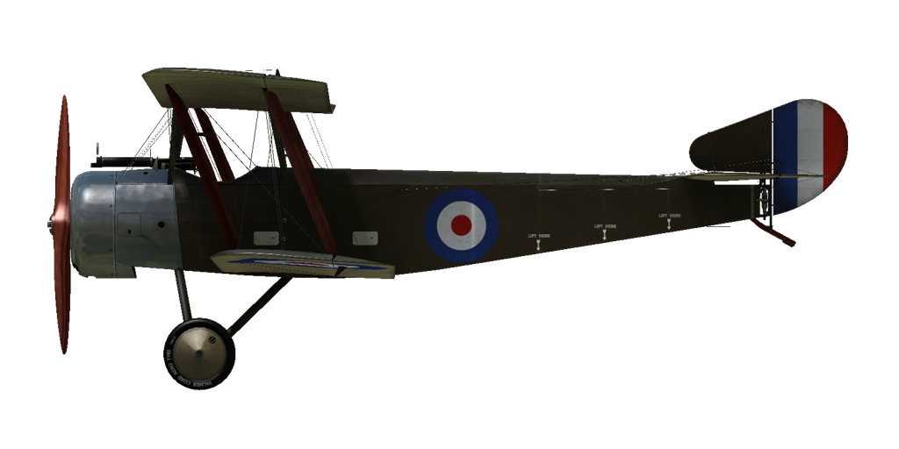

# Sopwith 1½ Strutter B  

<table><tbody><tr><td style="text-align: center"></td><td style="text-align: center"></td></tr><tr><td style="text-align: center" colspan="2"></td></tr></tbody></table>  

## Descripción  

Diseñado y construido por el Almirantazgo británico, el Sopwith 1½ Strutter (tomó su nombre de la sujección de la sección central del ala superior: parejas de arriostramientos largos y cortos, «uno y medio», que soportaban el ala superior) fue el primer caza biplaza en entrar en servicio y, de hecho, el primer aeroplano británico armado con una ametralladora sincronizada. Propulsado por un motor rotativo Clerget de 110 o 130 CV, esta variante de bombardero monoplaza prescindía del puesto de artillero para poder cargar más combustible y estaba equipada con una ametralladora fija Vickers de .303 pulgadas (7,69 mm) de disparo frontal sincronizado, pudiendo llevar 4 bombas de 65 lb (29 kg) en su bodega interna. La variante de bombardero monoplaza del 1½ Strutter entró en servicio con el <i>Royal Naval Air Service</i> (RNAS).  
  
El prototipo biplaza voló en diciembre de 1915. La llegada del Strutter a las unidades del frente comenzó en torno a mayo de 1916, pero las primeras entregas carecían de la ametralladora delantera fija. Al parecer, estos aviones se entregaron sin el arma debido a la escasez de Vickers de .303 a causa de las demandas de armamento del ejército.  
  
El RNAS utilizó los 1½ Strutter desde barcos como aviones de reconocimiento y direccionamiento, así como desde bases en tierra como bombarderos. Los franceses también operaron con un número importante de estos bombarderos monoplaza.  
  
Los fabricantes británicos construyeron un total de 1282 Strutter. El Strutter también fue fabricado en Francia en diferentes variantes, incluyendo el biplaza de caza y reconocimiento, el bombardero monoplaza y el bombardero biplaza. Los franceses construyeron alrededor de 4500 aviones hasta abril de 1918.  
  
  
Motor:  
Clerget 9B, 130 CV  
  
Dimensiones:  
Altura: 3120 mm  
Longitud: 7700 mm  
Envergadura alar: 10210 mm  
Superficie de ala: 32,16 m²  
  
Peso:  
Vacío: 592 kg  
Al despegue: 849 kg  
Capacidad de combustible: 182 l  
Capacidad de aceite: 19 l  
  
Velocidad máxima (IAS):  
Nivel del mar - 160 km/h  
1000 m — 154 km/h  
2000 m — 147 km/h  
3000 m — 137 km/h  
4000 m — 119 km/h  
  
Tasa de ascenso:  
1000 m —  4 min 16 s  
2000 m —  9 min 36 s  
4000 m — 27 min 59 s  
  
Techo de servicio: 4500 m  
  
Autonomía a 1000 m:  
Potencia nominal (combate) — 3 h 45 min  
  
Armamento:  
Disparo frontal: 1 Vickers Mk.I 7,69 mm, 300 balas  
  
Carga de Bombas:  
4 bombas de 65 lb (260 lb / 116 kg)  
  
Referencias:  
1) Windsock Datafile 34 - Sopwith Strutter, por J.M. Bruce.  
2) WWI Aeroplanes por J.M. Bruce.  

## Modificaciones  
### Aldis  

Colimador reflectante Aldis  
Peso adicional: 2 kg  
  
### Bombas H.E.R.L.  

 4 bombas de propósito general de 65 lb (29 kg) H.E.R.L.  
Peso adicional: 164 kg  
Peso de munición: 116 kg  
Peso de los soportes: 48 kg  
  
### Luz de cabina  

Lámpara para iluminar la cabina en las salidas nocturnas  
Peso adicional: 1 kg  
  
### Abertura más ancha en el ala superior  

Recorte ampliado en el ala superior para mejorar la visibilidad.  
