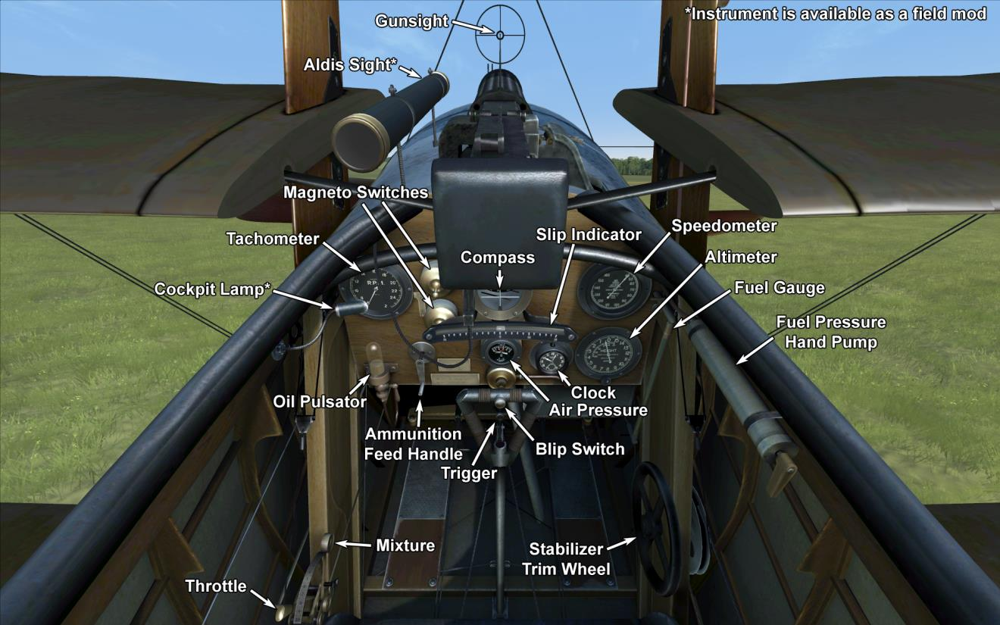

# Sopwith Triplane  

<table><tbody><tr><td style="text-align: center"></td><td style="text-align: center"></td></tr><tr><td style="text-align: center" colspan="2"></td></tr></tbody></table>  

## 描述  

Sopwith engineer Herbert Smith, in designing the Triplane, elected to rectify the lack of manoeuvrability and visibility in previous aircraft designs with the well-known triplane scheme. The three narrow-chord wings provided an increase in airspeed and improved the field of view from the cockpit. Furthermore, the three wings provided an outstanding climb rate and allowed for the compact placement of pilot, fuel tanks, armament, and engine.  
  
The first test flight was performed on May 26, 1916. In addition to Sopwith, aircraft were also manufactured by Clayton & Shuttleworth Ltd. and Lincoln Oakley Ltd. However, a contract with France was soon agreed to that would supply British squadrons with SPAD VII fighters, thus ending the demand for Triplanes. About 180 Sopwith Triplanes in all were manufactured.  
  
The first field tests were conducted by No. 1 (Naval) Squadron in June 1916, which were followed by minor design improvements. Full rearmament of RNAS squadrons was completed by the end of 1916. Until the middle of 1917, Triplanes were armed with only one Vickers machine gun. British pilots noted that the Germans preferred to avoid combat and turned away when spotting the unique image of the Sopwith Triplane. The Triplane was successfully employed against balloons and fighters, in addition to the escort role.  
  
Pilots reported that the plane exhibited an outstanding climb rate, high speed and fair manoeuvrability. They noted that the controls were light and effective, and the rudder was well-balanced. During the summer of 1917, No. 10 (Naval) Squadron’s “Black Flight” claimed 87 German aircraft destroyed for the loss of just one Triplane. These aircraft were also employed by the French Navy, and in 1917, one was transferred to Russia for evaluation. The Sopwith Triplane was deployed to the Western Front and Macedonia.  
  
  
发动机: Clerget 9B  
功率: 130 hp  
  
尺寸:  
高度: 3200 mm  
长度: 5730 mm  
翼展: 8070 mm  
机翼面积: 21.46 m²  
  
重量:  
空载重量: 500 kg  
不挂炸弹起飞: 699 kg  
燃油容量: 87 l  
滑油容量: 18 l  
  
速度（IAS），不挂炸弹：  
海平面——181 km/h  
1000——170 km/h  
2000——160 km/h  
3000——149 km/h  
4000——138 km/h  
5000——125 km/h  
6000——106 km/h  
  
爬升率，燃油装载，无炸弹：  
1000 m—— 3min 5 s   
2000 m—— 6min 46 s  
3000 m—— 11min 12 s  
4000 m—— 17min 6 s  
5000 m—— 25min 46 s  
  
实用升限：6300 m  
  
实用升限：2 h. 50 min.  
  
武器:  
前射: 1 х Vickers Mk.I 7.7mm，500发每弹鼓 (2 x Vickers Mk.I modification)  
  
参考  
1) Sopwith Triplane. Windsock Datafile 22.  
2) The Sopwith Triplane. Profile publications Number 73.  
3) Sopwith Triplane Aces of World War I. Osprey Aircraft of the Aces 62.  

## 修改  
### 阿尔迪斯（Alidas）瞄准具  

阿尔迪斯（Alidas）折射型直筒瞄准具  
增加质量：2 kg  
  
### 驾驶舱照明  

用于夜间飞行的驾驶舱照明灯  
增加质量：1 kg  
  
### 加装两挺前射维克斯机枪  

加装两挺前射维克斯机枪。  
Ammo: 1000 of 7.69mm rounds (500 rounds for each gun)  
弹丸重量：11 g  
膛口速度：745 m/s  
射速：750 rpm  
枪炮重量：13 kg（无弹鼓）  
基座重量：4 kg  
弹药重量：21 kg  
总重：38 kg  
