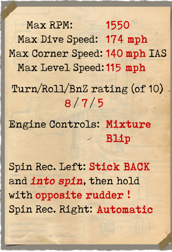
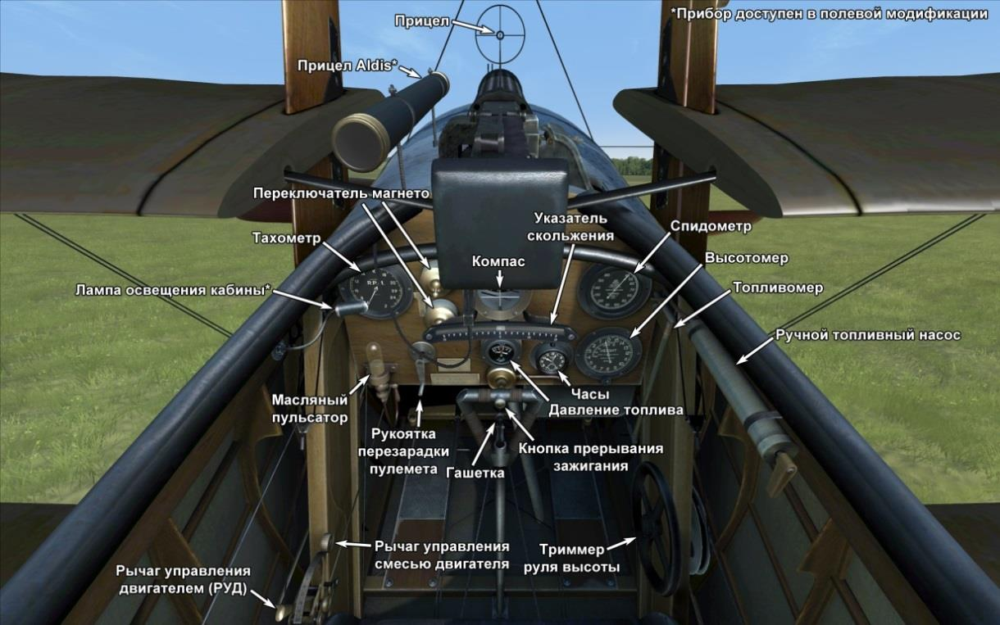

# Sopwith Triplane  

<table><tbody><tr><td style="text-align: center"></td><td style="text-align: center"></td></tr><tr><td style="text-align: center" colspan="2"></td></tr></tbody></table>  

## Описание  

Принимая во внимание недостаточную маневренность и обзор из кабины на прежних моделях истребителей, конструктор Герберт Смит (Herbert Smith) решил достичь требуемых показателей в хорошо известной ранее схеме - триплан. Тонкий профиль крыла позволил увеличить скорость и обзор из кабины, а три крыла в сумме обеспечили феноменальную для того времени скороподъемность. Из особенностей конструкции можно выделить компактное размещение пилота, топливных баков, вооружения и двигателя.  
  
Первый испытательный полёт был совершён 26 мая 1916 года. Одновременно с головным предприятием сборкой самолёта занимались компании Clayton & Shuttleworth Ltd и Lincoln Oakley Ltd. Вскоре по договору с Францией английские эскадрильи получили SPAD VII и острая необходимость в новых истребителях отпала. Всего было выпущено около 180 экземпляров.  
  
Первые армейские испытания прошли в 1-ой морской эскадрилье, в июне 1916 года, после чего последовал ряд незначительных доработок конструкции. Полное перевооружение эскадрилий морской авиации закончилось к концу 1916 года. С середины июля 1917 года аэропланы стали оборудоваться двумя пулемётами Виккерс. Английские пилоты уверяли, что их немецкие противники уходили в сторону и пытались избежать боя, лишь издали заметив характерный силуэт триплана. Истребитель применялся для уничтожения аэропланов и аэростатов противника, а также сопровождал двухместные разведчики и бомбардировщики.  
  
Пилоты отмечали феноменальную скорость набора высоты, приемлемую маневренность и высокую скорость полёта. Управление было лёгким и эффективным, рули управления сбалансированы. За два летних месяца 1917 года лишь одна морская эскадрилья уничтожила в воздушных боях 87 германских самолётов, потеряв при этом один! На этих истребителях летали пилоты и французской морской авиации, а в 1917 году небольшая партия этих машин поступила в Россию. Аэроплан принимал участие в боевых действиях на Западном фронте и в Македонии.  
  
  
Двигатель Clerget 9B 130 л.с.  
  
Размеры:  
Высота: 3200 мм  
Длина: 5730 мм  
Размах крыла: 8070 мм  
Площадь крыла: 21,46 кв.м  
  
Вес:  
Пустой: 500 кг   
Взлётный: 699 кг  
Объём топливных баков: 87 л  
Объём маслобакa: 18 л      
  
Скорость (приборная):  
на уровне моря - 181 км/ч  
1000 м - 170 км/ч  
2000 м - 160 км/ч  
3000 м - 149 км/ч  
4000 м - 138 км/ч  
5000 м - 125 км/ч  
6000 м - 106 км/ч  
  
Скороподъёмность, с полной заправкой, без бомб:  
1000 м - 3 мин. 5 сек.    
2000 м - 6 мин. 46 сек.   
3000 м - 11 мин. 12 сек.   
4000 м - 17 мин. 6 сек.  
5000 м - 25 мин. 46 сек.  
  
Практический потолок: 6300 м  
  
Продолжительность полёта: 2 ч. 50 мин. (минимальный расход), 1 ч. 40 мин. (боевой режим)  
  
Вооружение:  
Курсовое: 1 х Vickers Mk.I 7,69 мм, 500 патронов (2 х Vickers Mk.I как модификация)  
  
Использованные источники:  
1) Sopwith Triplane. Windsock Datafile 22.  
2) The Sopwith Triplane. Profile publications Number 73  
3) Sopwith Triplane Aces of World War I. Osprey Aircraft of the Aces 62.  

## Модификации  
### Aldis  

Коллиматорный прицел Aldis рефракторного типа  
Дополнительная масса: 2 кг  
  
### Освещение кабины  

Лампа ночного освещения кабины самолёта  
Дополнительная масса: 1 кг  
  
### Второй пулемёт Виккерс  

Второй курсовой пулемёт Виккерс.  
Боезапас: 500 патронов 7.69мм   
Масса пули: 11 г  
Дульная скорость: 745 м/с  
Скорострельность: 750 выстр/мин  
Масса оружия: 13 кг (без магазинов)  
Масса установок: 4 кг  
Масса боезапаса: 21 кг  
Общая масса: 38 кг  
