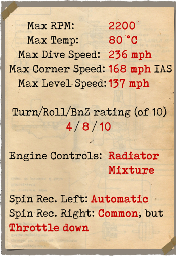
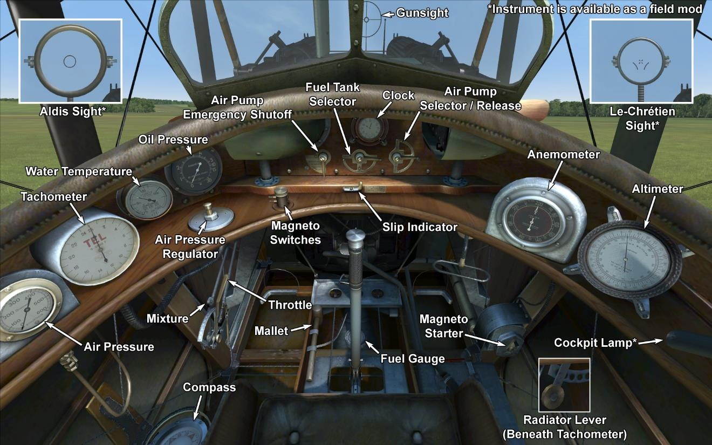

# SPAD 13.C1  

<table><tbody><tr><td style="text-align: center"></td><td style="text-align: center"></td></tr><tr><td style="text-align: center" colspan="2"></td></tr></tbody></table>  

## Description  

L\avion a été conçu comme une version améliorée du SPAD VII. Malgré l\extérieur semblable à son prédecesseur, c\était entièrement un nouvel avion. Une deuxième mitrailleuse et un moteur plus puissant ont été montés; ainsi qu\un réservoir de carburant auxiliaire a été placé dans la section centrale de la partie supérieure de l\aile, le réservoir de carburant principal avait des contours de la section inférieure du fuselage. A l\arrière gauche du cockpit il y\avait l\emplacement pour un appareil photo ou une charge de bombe. Le premier vol a été effectué le 4 avril 1917. L\avion a été fabriqué par: Bleriot, Levasseur, Bernard, Kellner, Safca, Borel, Nieuport. 8472 avions ont été construits au total.  
La première apparition sur le front est datée de l\été—automne 1917. L\avion a fourni les escadrons de chasse français. il a été utilisé principalement contre les avions ennemis, l\escorte de bombardiers, la cartographie aérienne et la reconnaissance, rarement pour des bombardements de séparations de cibles autour du front.  
Les pilotes français étaient impatients de recevoir cet avion. La deuxième mitrailleuse a augmenté la puissance de feu et le nouveau moteur l\a fait voler plus rapidement et grimper plus vite. Les contrôles demeuraient efficaces même à haute altitude. Les seuls inconvénients étaient la faible sensibilité des contrôles à basse vitesse, le profil d\aile a diminué la maniabilité à basse vitesse ce qui conduisait souvent à un décrochage. En plongée et en croisière le SPAD XIII était l\un des plus rapide, les pilotes disaient "plonge plus rapide que le vent". Il a participé à des batailles sur tous les fronts de la première guerre mondiale. Les Français, Britanniques, Américains et Italiens ont équipé leurs armées avec.  
  
  
Moteur  
V8 Hispano—Suiza 8Ba 220 hp  
  
Tailles  
Hauteur: 2600 mm  
Longueur: 6250 mm  
Envergure: 8080 mm  
Surface d\aile: 20,2 sq.m  
  
Poids  
Poids à vide: 565 kg  
Poids au décollage: 820 kg  
Capacité des réservoirs carburant: 113,5 l  
Capacité du réservoir d\huile: 17 l  
  
Vitesse maximale (IAS)  
au Sol — 219 km/h  
1000 m — 206 km/h  
2000 m — 193 km/h  
3000 m — 180 km/h  
4000 m — 166 km/h  
5000 m — 152 km/h  
6000 m — 137 km/h  
7000 m — 119 km/h  
  
Tauc de montée  
1000 m — 2 min. 32 sec.  
2000 m — 5 min. 10 sec.  
3000 m — 8 min. 24 sec.  
4000 m — 12 min. 30 sec.  
5000 m — 18 min. 01 sec.  
6000 m — 26 min. 24 sec.  
7000 m — 44 min. 24 sec.  
  
Plafond opérationnel 7000 m  
  
Autonomie à 1000m  
puissance nominale (en combat) — 1 h. 30 min.  
consommation minimale (en croisière) — 3 h.  
  
Armes  
Armes fixées: 2 х Vickers 7.69mm, 400 cartouches par baril.  
Bombes: 18 kg.  
  
References  
1) SPAD XIII C.I, J M Bruce Windsock Datafile 32.  
2) Profile Publications. The SPAD XIII. C.I  
3) Performance of American Corp. SPAD XIII AIRFRAME DATA.  
4) Performance (Report No.5). Aeronautiqe Militare  Ministre de la Guerre, 1917.  

## Modifications  
### Aldis  

Collimateur à réfraction Aldis (importé dAngleterre)  
Masse supplémentaire : 2 kg  
  
### Balloon guns  

Twin Vickers "Balloon" guns  
Ammo: 400 of 11.43mm rounds  
Projectile weight: 17,5 g  
Muzzle velocity: 610 m/s  
Guns weight: 26 kg  
Ammo weight: 32 kg  
Rate of fire: 600 rpm  
Total additional weight of weapon modification: 58 kg  
  
### Cooper bombes  

2 x bombes d’emploi général 24 lb Cooper (11 kg)  
Masse supplémentaire : 22 kg  
Masse des munitions : 22 kg  
Masse des pylones : 0 kg  
Perte estimée de vitesse avant le largage : 0 km/h  
Perte estimée de vitesse après le largage : 0 km/h  
  
### Lumière de cockpit  

Lumière à ampoule pour les sorties de nuit  
Masse supplémentaire : 1 kg  
  
### Le-Chretien  

Collimateur à réfraction Le-Chrétien  
Masse supplémentaire : 1 kg  
  
### Camera  

Camera for taking aerial photographs  
Additional mass: 10 kg  
