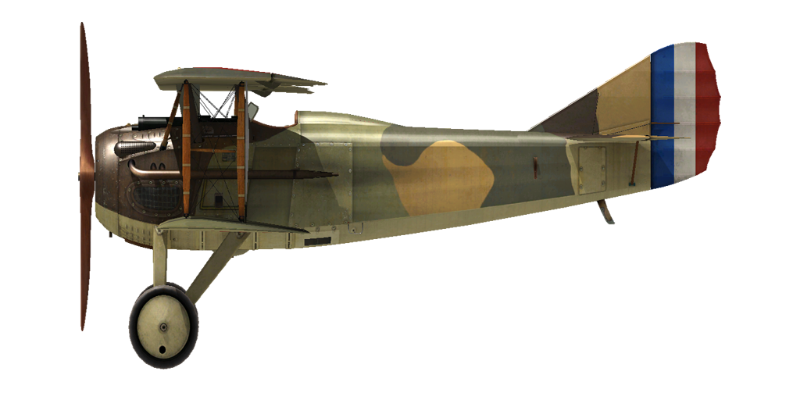

# SPAD 13.C1
  

  

  

  
## Beschreibung
  

  
Das Flugzeug wurde als eine verbesserte Version der SPAD VII entwickelt. Trotz fast gleichen Aussehens, war es ein komplett neues Flugzeug. Ein zweites Maschinengewehr und ein neues Triebwerk wurden eingebaut; zudem wurde ein Zusatztank in der Mitte der oberen Tragfläche angebracht. Der Haupttank wurde im unteren Rumpf eingelassen. Links vom Cockpit und auch dahinter war Platz für einen Kamera oder sogar für eine Bombe. Der Erstflug fand am 4. April 1917 statt. Das Flugzeug wurde gebaut von: Bleriot, Levasseur, Bernard, Kellner, Safca, Borel, Nieuport. Insgesamt wurden 8.472 Flugzeuge gebaut.
  
An der Front wurde das Flugzeug erstmals im Sommer/Herbst 1917 gesichtet. Das Flugzeug wurde an französische Schwadrone ausgeliefert und hauptsächlich für den Kampf gegen feindliche Flugzeuge sowie als Eskorte eingesetzt. In seltenen Fällen auch für Bombeneinsätze von verschiedenen Bodenzielen.
  
Französische Piloten konnten nicht erwarten, dieses Flugzeug zu fliegen. Das zweite Maschinengewehr erhöhte die Feuerkraft und das neue Triebwerk ließ die SPAD schneller steigen. Die Steuerung war sehr effektiv, auch in großen Höhen. Der einzige negative Aspekt war die schwierige Kontrolle beim Langsamflug. Im Sturzflug war die SPAD XIII eine der schnellsten Flugzeuge. So behaupteten die Piloten: "Fällt schneller als der Wind". Dieser Flugzeugtyp wurde an allen Fronten des 1. Weltkrieges eingesetzt. Franzosen, Briten, Amerikaner und Italiener  wurden mit diesem Flugzeug ausgerüstet.
  

  

  
Triebwerk
  
V8 Hispano—Suiza 8Ba 220 PS
  

  
Abmessung
  
Höhe: 2600 mm
  
Länge: 6250 mm
  
Spannweite: 8080 mm
  
Flügelfläche: 20,2 qm
  

  
Gewicht
  
Leergewicht: 565 kg
  
Startgewicht: 820 kg
  
Treibstoffkapazität: 113,5 l
  
Ölkapazität: 17 l
  

  
Max. Geschwindigkeit (IAS)
  
Meeresspiegel — 219 km/h
  
1000 m — 206 km/h
  
2000 m — 193 km/h
  
3000 m — 180 km/h
  
4000 m — 166 km/h
  
5000 m — 152 km/h
  
6000 m — 137 km/h
  
7000 m — 119 km/h
  

  
Steigrate
  
1000 m — 2 Min. 32 Sek.
  
2000 m — 5 Min. 10 Sek.
  
3000 m — 8 Min. 24 Sek.
  
4000 m — 12 Min. 30 Sek.
  
5000 m — 18 Min. 01 Sek.
  
6000 m — 26 Min. 24 Sek.
  
7000 m — 44 Min. 24 Sek.
  

  
Dienstgipfelhöhe 7000 m
  

  
Reichweite at 1000 m
  
Nennleistung (im Kampf)        — 1 Std. 30 Min.
  
Minimaler Verbrauch (Rundflug) — 3 Std.
  

  
Bewaffnung
  
Starre Bewaffnung nach vorne::  2х Vickers 7.69mm,  400 Schuss pro Magazin.
  
Bombenlast:  18 kg.
  

  
Referenzen
  
1) SPAD XIII C.I, J M Bruce Windsock Datafile 32.
  
2) Profile Publications. The SPAD XIII. C.I
  
3) Performance of American Corp. SPAD XIII AIRFRAME DATA.
  
4) Performance (Report No.5). Aeronautiqe Militare  Ministre de la Guerre, 1917.
  

  
## Änderungen
  

  
  
### Aldis
  

  
Aldis Teleskopvisier (aus England importiert)
  
Zusätzliches Gewicht: 2 kg
  

  
  
### Ballon Maschinengewehre
  

  
Vickers "Ballon" Zwillings-Maschinengewehr
  
Munition: 400 11,43mm Patronen
  
Geschossgewicht: 17,5 g
  
Mündungsgeschwindigkeit: 610 m/s
  
Gewicht der Waffe: 26 kg
  
Gewicht der Munition: 32 kg
  
Feuerrate: 600 Schuss/min
  
Zusätzliches Gewicht: 58 kg
  

  
  
### Cooper Bomben
  

  
Zwei 24 lb Cooper Bomben (11kg)
  
Zusätzliches Gewicht: 22 kg
  
Gewicht der Munition: 22 kg
  
Gewicht der Abwurfwaffenroste: 0 kg
  
Geschwindigkeitsverlust vor Abwurf: 0 km/h
  
Geschwindigkeitsverlust nach Abwurf: 0 km/h
  

  
  
### Instrumentenlicht
  

  
Glühlampe zum Beleuchten des Instrumentenbrettes bei Nachteinsätzen
  
Zusätzliches Gewicht: 1 kg
  

  
  
### Le-Chretien
  

  
Le-Chretien Teleskopvisier
  
Zusätzliches Gewicht: 1 kg
  

  
  
### Kamera
  

  
Kamera zum Aufnehmen von Luftbildern
  
Zusätzliches Gewicht: 10 kg  