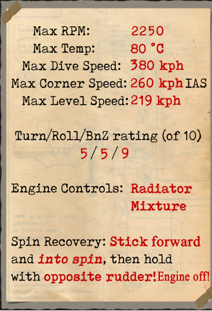
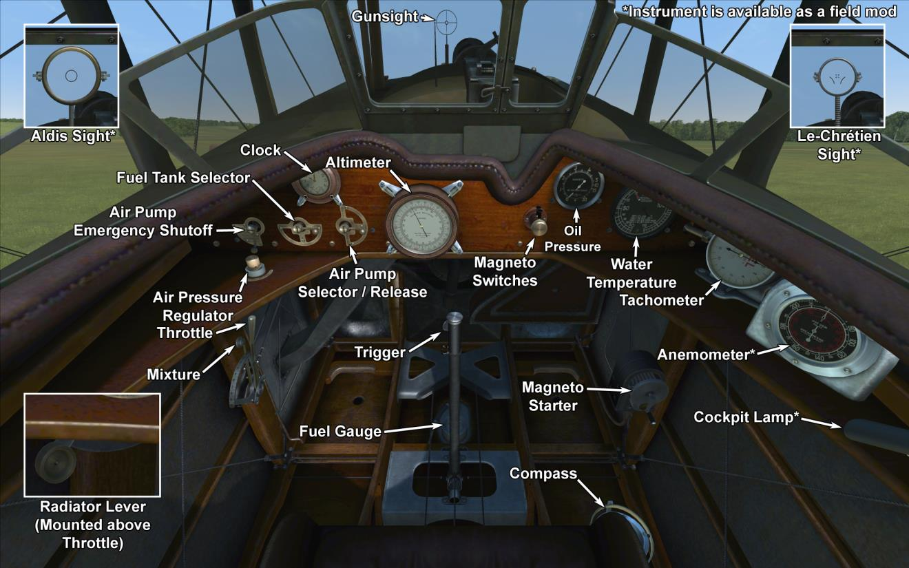

# SPAD 7.C1 180 л.с.  

<table><tbody><tr><td style="text-align: center"></td><td style="text-align: center"></tr><tr><td style="text-align: center" colspan="2"></td></tr></tbody></table>  

SPAD S.VII - одноместный истребитель, разработанный Луи Бешеро в начале 1916 года. Большая часть конструкции самолёта была взята из разработок ротативного SPAD типа А. Первоначальный двигатель для SPAD C.VII, 150-ти сильный Hispano-Suiza 8A, был разработан швейцарским инженером Марком Биркигтом в феврале 1915 г.  
  
Прототип самолёта, получивший название SPAD V, впервые поднялся в воздух в апреле 1916 года. Этот самолёт первоначально обладал большим коком винта с центральным отверстием, который был совмещен с кольцевым радиатором и капотом. Хотя от кока винта, в конце концов, отказались, кольцевой радиатор и капот остались отличительными признаками данного типа. Лётные испытания показали, что самолёт обладает отличной скоростью и прекрасной скороподъёмностью. Кроме того, конструкция корпуса летательного аппарата наделила его отличными лётными характеристиками для пикирования, превосходящими ранее построенные Ньюпоры, известные тем, что теряли свои нижние крылья в крутых пике. С этими многообещающими характеристиками самолёт пошёл в серию 10 мая 1916 года под обозначением SPAD S.VII.  
  
Первоначальные поставки SPAD S.VII были медленными из-за трудностей с производством радиаторов. Производство постепенно увеличилось, когда контракты были переданы другим французским производителям (Gremont, Janoir, Kellner, de Marcay, Regy, Societe d\Etudes Aeronautiques, и Sommer). Самолёт также производился в России на заводе Duks и в Великобритании на заводах Bleriot and Spad Aircraft Works и Mann, Egerton and Company. В начале 1917 года начали устанавливать 180-сильный двигатель Hispano-Suiza 8Ab, и к апрелю 1917 года все новые машины оснащались именно им В общей сложности было произведено около 3500 SPAD S.VII всех типов.  
  
В конечном итоге более 50 французских эскадрилий, а также различные бельгийские, итальянские, русские и американские  подразделения были оснащены SPAD S.VII. Благодаря прочности и репутации настоящего истребителя, а также механическим проблемам SPAD S.XIII, SPAD S.VII использовался вплоть до конца войны. Он остался на вооружении многих стран, а во Франции был стандартной машиной для обучения курсантов до 1928 года.  
  
  
Двигатель:  
V8 Hispano-Suiza 8Ab, мощность 180 л.с. (1540 об/мин)  
  
Размеры  
Высота: 3200 мм  
Длина:  6080 мм  
Размах крыла:  7822 мм  
Площадь крыла:  17,85 кв.м.  
  
Вес  
Пустой: 500 кг  
Взлётный: 705 кг  
Объём топлива: 105 л  
Объём масла: 11 л  
  
Максимальная скорость (приборная)  
у земли — 219 км/ч  
1000 м — 206 км/ч  
2000 м — 191 км/ч  
3000 м — 177 км/ч  
4000 м — 162 км/ч  
5000 м — 145 км/ч  
  
Скороподъёмность  
1000 м — 2 мин. 16 сек.  
2000 m — 4 мин. 48 сек.  
3000 м — 8 мин. 1 сек.  
4000 м — 12 мин. 28 сек.  
  
Практический потолок 6553 м  
  
Продолжительность полёта - 1 ч. 30 мин.  
  
Вооружение  
Курсовое:  Vickers 7,69 мм, 350 патронов.  
  
Использованные источники:  
1) Aviatik Vintage Aircraft No.1 -  Spad 7.C1  
2) Windsock Datafile 008 - Spad 7.C1  
3) SPAD 150 HP armamento, dec.1917  
4) French \Hispano Suiza\ engines tech data.  

## Модификации  
### Aldis  

Коллиматорный прицел Aldis рефракторного типа (импорт из Великобритании)  
Дополнительная масса: 2 кг  
  
### Освещение кабины  

Лампа ночного освещения кабины самолёта  
Дополнительная масса: 1 кг  
  
### Le-Chretien  

Коллиматорный прицел Le-Chretien (Ле-Кретьен) рефракторного типа  
Дополнительная масса: 1 кг  
  
### Пулемёт Льюис над верхним крылом  

Установленный над верхним крылом пулемёт Lewis с изменяемым углом установки.  
Боезапас: 291 патронов 7.69мм (3 магазина по 97 патронов в каждом)  
Переднее положение: 25°  
Верхнее положение: 45°  
Масса пули: 11 г  
Дульная скорость: 745 м/с  
Скорострельность: 550 выстр/мин  
Масса оружия: 7.5 кг (без магазина)  
Масса установок: 0.8 кг  
Масса боезапаса: 12 кг  
Общая масса: 20.3 кг  
Примерная потеря скорости: 7-18 км/ч  
  
### Ракеты "Le Prieur"  

Установленные на крыльевых стойках 6 ракет "Le Prieur" бронебойно-зажигательного или фугасного действия, предназначенные для борьбы с аэростатами.  
Дополнительная масса: 36 кг  
Масса вооружения: 12 кг  
Масса держателей: 24 кг  
Ориентировочная потеря скорости до пуска: 8 км/ч  
Ориентировочная потеря скорости после пуска: 6 км/ч  
  
### Анемометр  

Анемометр E.Badin (0..230 км/ч на 0 м и 0..240 км/ч на 2000 м)  
Дополнительная масса: 1 кг  
