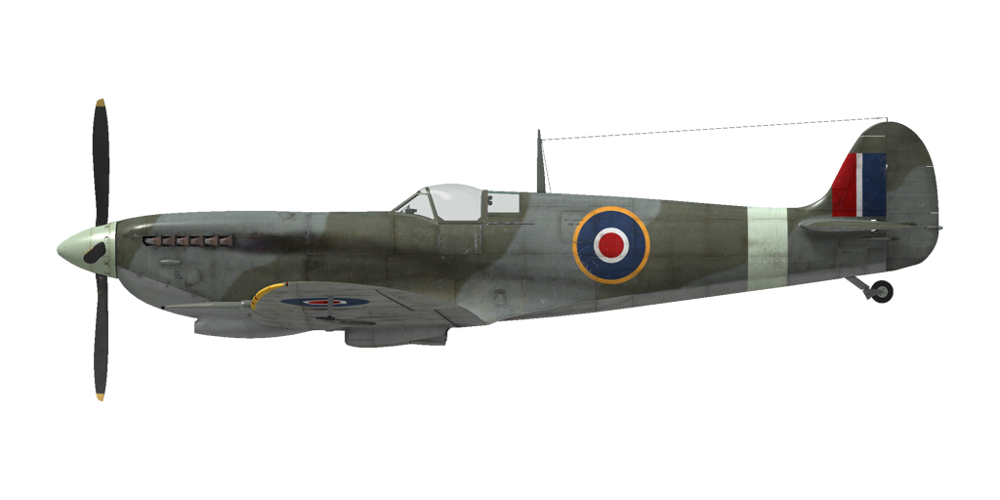

# Spitfire Mk.IXc  

<table><tbody><tr><td style="text-align: center"></td><td style="text-align: center"></td></tr><tr><td style="text-align: center" colspan="2"></td></tr></tbody></table>  

## 描述  

飞行构型的失速指示空速：143~163 km/h(89~101 mph)  
起降构型的失速指示空速：135~154 km/h(84~96 mph)  
  
俯冲极速：725 km/h(451 mph)  
最大过载：12.5 G  
飞行构型失速迎角：18.8 °  
着陆构型失速迎角：16.0 °  
  
  
Merlin 66发动机：  
  
最大真空速，高度海平面，3000 RPM，增压 +18：542 km/h(337 mph)  
最大真空速，高度3350m(10991 feet)，3000 RPM，增压 +18：610 km/h(379 mph)  
最大真空速，高度6850m(22474 feet)，3000 RPM，增压 +18：664 km/h(413 mph)  
  
实用升限：12500 m(41011 feet)  
海平面爬升率：21.5 m/s(4232 feet/min)  
3000m(9843 feet)时爬升率：18.6 m/s(3661 feet/min)  
6000m(19685 feet)时爬升率：15.5 m/s(3051 feet/min)  
  
海平面最大性能盘旋时间：17.7 s，指示空速 270 km/h(168 mph)。  
3000m(9843 feet)时最大性能盘旋时间：20.5 s，指示空速 260 km/h(162 mph)。  
  
  
Merlin 70发动机：  
  
最大真空速，高度海平面，3000 RPM，增压 +18：532 km/h(331 mph)  
最大真空速，高度4900m(16076 feet)，3000 RPM，增压 +18：634 km/h(394 mph)  
最大真空速，高度8500m(27887 feet)，3000 RPM，增压 +18：677 km/h(421 mph)  
  
实用升限：13000 m(42651 feet)  
海平面爬升率：18.5 m/s(3642 feet/min)  
3000m(9843 feet)时爬升率：17.5 m/s(3445 feet/min)  
6000m(19685 feet)时爬升率：14.1 m/s(2776 feet/min)  
  
海平面最大性能盘旋时间：17.8 s，指示空速 270 km/h(168 mph)。  
3000m(9843 feet)时最大性能盘旋时间：20.7 s，指示空速 260 km/h(162 mph)。  
  
3000m（9843 feet）时续航时间：1h 40min，指示空速 350 km/h(218 mph)。  
  
起飞速度：185~195 km/h(115~121 mph)   
进近速度：165~185 km/h(103~115 mph)  
着陆速度：150~155 km/h(93~96 mph)  
着陆迎角：12.5 °  
  
注1：所提供的数据适用于国际标准大气（ISA）。  
注2：飞行性能范围基于可能的飞机质量范围。  
注3：极速、爬升率和盘旋时间基于标准飞机质量。  
注4：爬升率基于2850 RPM和+12增压，盘旋时间基于3000 RPM和+18增压。  
  
发动机：  
型号：Merlin 66  
起飞模式下的最大功率(3000 RPM，增压 +12，低档位）海平面：1320 HP  
国际动力（最大可持续）模式下的最大功率(2850 RPM，增压 +12，低档位）9250 feet：1400 HP  
国际动力（最大可持续）模式下的最大功率(2850 RPM，增压 +12，高档位）19000 feet：1310 HP  
应急最大全出力模式下的最大功率(3000 RPM，增压 +18，低档位）5750 feet：1705 HP  
应急最大全出力模式下的最大功率(3000 RPM，增压 +18，高档位）16000 feet：1580 HP  
  
型号：Merlin 70  
起飞模式下的最大功率(3000 RPM，增压 +12，低档位）海平面：1250 HP  
国际动力（最大可持续）模式下的最大功率(2850 RPM，增压 +12，低档位）13500 feet：1375 HP  
国际动力（最大可持续）模式下的最大功率(2850 RPM，增压 +12，高档位）25250 feet：1255 HP  
应急最大全出力模式下的最大功率(3000 RPM，增压 +18，低档位）10000 feet：1655 HP  
应急最大全出力模式下的最大功率(3000 RPM，增压 +18，高档位）22250 feet：1475 HP  
  
发动机模式：  
最大巡航动力（无时间限制）：2650 RPM，增压 +7  
国际动力（最大可持续）(最多1h)：2850 RPM，增压 +12  
应急最大全出力动力（不超过5min）：3000 RPM，增压 +18  
  
发动机液冷出水口额定水温：105~115 °C  
发动机液冷出水口最高水温：135 °C  
发动机滑油进油口额定油温：90 °C  
发动机滑油进油口最高油温：105 °C  
  
机械增压器换挡高度：自动的，可以手动切换到低级增压  
  
空重：2532 kg(5582 lb)  
最小重量（无弹药、10%燃油）：2962 kg(6530 lb)  
标准重量：3310 kg(7297 lb)  
燃油载荷：274 kg(604 lb)/386 L(85 gal)  
最大有效载荷：1302 kg(2870 lb)  
  
前射武器 ("c-type" wing)：  
2 x 20mm“Hispano Mk.II”机炮，140发，650发/分，机翼安装  
4 x 7.7mm“Browning .303”机枪，350发，1150发/分，机翼安装  
  
前射武器 ("e-type" wing)：  
2 x 20mm“Hispano Mk.II”机炮，140发，650发/分，机翼安装  
2 x 12.7mm“Browning .50”机枪，250发，850发/分，机翼安装  
  
炸弹：  
2 x 250 lb 通用炸弹"250 lbG.P."  
500 lb 通用炸弹"500 lbG.P."  
  
火箭弹：  
2 x 25 lb穿甲火箭弹“RP-3 A.P. 25 lb. mk.II”  
2 x 60 lb半穿甲火箭弹“RP-3 S.A.P. 60 lb. mk.II”  
  
长度：9.65 m(31 7-59/64 feet)  
翼展：11.21 m(36 11/32 feet)  
机翼面积：22.48 m²(242 feet²)  
  
首次投入战斗：1942年6月  
  
操作特性：  
—发动机配备有进气压力自动调节器。该调节器在油门设置为1/3或以上行程时运行。  
—发动机具有二级机械增压器（无需手动控制）。可手动将该增压器切换至低挡。  
—发动机装有自动燃油混合比控制装置，其会保持最优混合比。  
—发动机带有一个自动调节器，通过控制螺旋桨桨距，以保持所需的转速。  
—水冷和滑油散热器风门是自动控制的，但是有特殊手动模式可以强制散热器风门完全打开。  
—飞机有中立的静平衡。升降舵效高，所以应小心操纵飞机，不要给太大的操纵杆输入。  
—飞机在着陆襟翼放下后变得不稳定。  
—飞机装备有升降舵和方向舵配平。  
—着陆襟翼由冷气驱动，所以仅可放下到最大位置。襟翼放下时限速160mph。  
—飞机尾轮自由旋转，没有锁。由于起落架主轮相对较近，在起飞和着陆时必须自信而准确地操作方向舵脚蹬。  
—飞机有共用一个控制杆的差动气压机轮刹车。这意味着捏住刹车踩舵，反向一侧的机轮刹车会逐渐释放，导致飞机转向踩舵一侧。  
—该型飞机装配有一个警报器，当油门位于低位而起落架却处于收起状态时，该装置会向飞行员发出警报。  
—由于强气流，高速时无法开闭座舱盖。座舱盖配有紧急抛弃系统，用于跳伞。  
—该机型配备底部编队灯。  
—标准瞄准具可调：目标距离和目标翼展都可以设置。  
—陀螺瞄准具在对目标开火时自动计算需要的偏转角。它有4个模式：固定环、固定和陀螺活动环、陀螺活动环、目标距离固定在150码的陀螺活动环（夜间模式）。目标正确设置时才可获得正确的偏转角。要设置距离，首先使用独立的控制器调节目标基线（翼展），然后通过调节测距环的大小和目标大小一样来设定距离。  
—两个射击瞄准具都有滑动式的太阳滤光片。  
  
Basic data and recommended positions of the aircraft controls:  
1. Starting the engine:  
	- recommended position of the mixture control lever: auto mixture control  
	- recommended position of the oil/water radiator control handle: auto radiators control  
	- recommended position of the prop pitch control handle: light  
	- recommended position of the throttle lever: 5%  
  
2. Recommended mixture control lever positions for various flight modes: auto mixture control  
  
3. Recommended positions of the radiators control handle for various flight modes: auto radiators control  
  
4. Approximate fuel consumption at 2000 m altitude:  
	- Cruise engine mode: 6.3 l/min  
	- Combat engine mode: 10.2 l/min  

## 修改  
### 150号汽油  

允许+25 lb增压  
禁用增压器自动换挡。应在9000 feet高度手动换挡。  
预期海平面增速：29 km/h  

### 2 x 250 lb 通用炸弹  

2 x 250 lb 通用炸弹  
增加质量：247 kg  
弹药质量：227 kg  
挂架质量：20 kg  
投弹前预期速度损失：24 km/h  
投弹后预期速度损失：8 km/h  

### 500 lb 通用炸弹  

500 lb 通用炸弹  
增加质量：237 kg  
弹药质量：227 kg  
挂架质量：10 kg  
投弹前预期速度损失：13 km/h  
投弹后预期速度损失：7 km/h  

### E型机翼  

使用2挺12.7mm"勃朗宁 .50"机枪替换原先的4挺7.7mm"勃朗宁 .303"机枪。  
增加质量: 48 kg  
弹药质量: 70 kg  
枪炮质量: 72 kg  
预期速度增加: 5 km/h  

### 陀螺瞄准具  

MkII陀螺射击瞄准具  
增加质量：5.2 kg  
预期速度损失：0 km/h  

### 梅林70发动机  

梅林70发动机。  
增加质量：0 kg  
预期速度损失：0 km/h  

### 后视镜  

后视镜  
增加质量：1 kg  
预期速度损失：1 km/h  
  
### 2 х RP-3 高爆/穿甲 火箭弹  

2 х 3-inch RP-3无制导高爆/穿甲火箭弹  
  
RP-3 SAP/HE:  
增加质量：106 kg  
弹药质量：86 kg  
挂架质量：20 kg  
发射前预期速度损失：23 km/h  
发射后预期速度损失：17 km/h  
  
RP-3 AP:  
增加质量：75 kg  
弹药质量：55 kg  
挂架质量：20 kg  
发射前预期速度损失：21 km/h  
发射后预期速度损失：17 km/h  

### 裁剪翼  

裁剪翼  
减少质量：4 kg  
预期速度损失：0 km/h  
